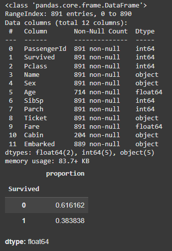
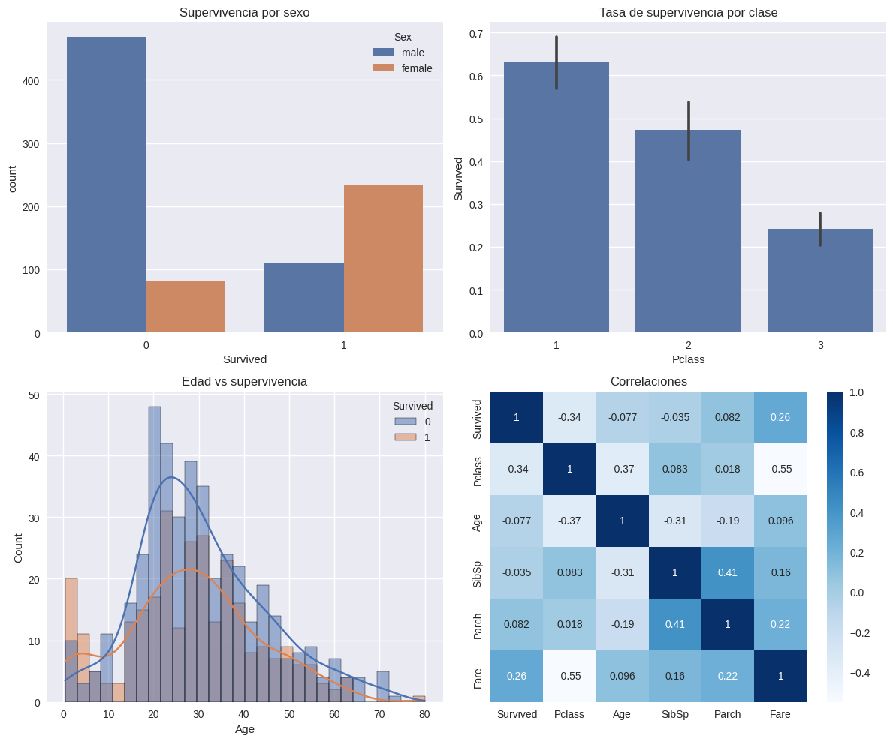

# Práctica 1

## Contexto
Práctica número 1 de la primer unidad del curso. Aquí se dan los primeros pasos del curso, trabajamos con dataset con información del accidente famoso "Titanic".

## Objetivos
- Aprender a usas Google Collab.
- Cargar primer dataset.
- Analizar datos de un dataset.
- Vizualizar datos y relaciones del dataset.

## Actividades (con tiempos estimados)
- SetUp (30min).
- Analisis de datos y preguntas (60min).
- Formato de la página (30min).

## Desarrollo
Primero vimos a grandes razgos el tipo de datos y los nulos que teniamos en el dataset del Titanic, de manera que se pueda entender lo que estamos modeloando. En base a eso hicimos una vizualización de datos, y en este analisis quesó en evidencia las relaciones entre los sobrevivientes y las características que los mismos poseían, ya que influían drásticamente en su tasa de supervivencia.

## Evidencias
- Se adjunta imagen "resultado-t1-parte1.png" en `docs/assets/`.
- Se adjunta imagen "resultado-t1-parte2.png" en `docs/assets/`.

## Reflexión
Analizando el dataset es posible predecir qué pasajeros tienen más probabilidad de sobrevivir, basandonos en las caracteristicas y visualizaciones realizadas.

---

# EDA del Titanic en Google Colab: solución

### Investiga: ¿De qué trata exactamente este dataset? ¿Cuál es el objetivo de la competencia de Kaggle?
La competencia de Kaggle “Titanic: Machine Learning from Disaster” brinda información sobre los pasajeros del Titanic y características de los mismos, como edad, sexo, clase, tarifa pagada, etc; la idea es predecir si cada pasajero sobrevivió al accidente.

El objetivo es entrenar un modelo usando los datos del train set (que incluye la columna Survived) y luego predecir la supervivencia de los pasajeros del test set.

### ¿Qué columnas/atributos contiene el dataset? ¿Qué representa cada una? ¿Cuál es la variable objetivo?

Según la documentación en Kaggle, en el Data Dictionary se incluyen las siguientes columnas:

Survived: variable objetivo; 1 si sobrevivió, 0 si no.
Pclass: clase del boleto (1st primera, 2nd segunda o 3rd tercera).
Sex: sexo del pasajero.
Age: edad del pasajero.
SibSp: número de hermanos/esposos a bordo.
Parch: número de padres/hijos a bordo.
Ticket: número del ticket.
Fare: tarifa pagada.
Cabin: número de camarote.
Embarked: puerto de embarque: C = Cherbourg, Q = Queenstown, S = Southampton.

### ¿Qué factores crees que más influyeron en la supervivencia?
Entre las caraterísticas claves que podria influir en la supervivencia analizo lo siguiente:
Sex: las mujeres tuvieron más posibilidades de sobrevivir, “mujeres y niños primero”.
Age: los niños tenían prioridad.
Pclass: los pasajeros de primera clase tuvieron acceso preferente a los botes salvavidas.
SibSp/Parch: esto influye en cómo actua cada pasajero respecto a la catastrofe ya que no es lo mismo salvarse sólo que tener familia a bordo.
Cabin: esto depende de dónde fue el primer impacto y si la unicación de la cabina en cuestión ayudó a evitar aglomeración para evacuar.

### ¿Qué desafíos de calidad de datos esperas encontrar?
En un dataser nos podemos encontrar muchos desafios en cuanto a los datos analizados, por ejemplo, edad y camarote podría tener valores nulos, Ticket y Cabin son cadenas variadas, alfanuméricas, lo que puede complicar el modelado. También se puede encontrar datos atipimos como tarifas altas o bajas, edades improbables y nombres/apellidos con carácteres especiales.

### ¿Qué variables podrían estar correlacionadas?
Las variables más tipicas a relacionarse son las siguientes.
Pclass y Fare: una tarifa elevada se asociada a clase alta.
SibSp y Parch: relaciones familiares a bordo.
Cabin y clase: primera clase tenían camarotes asignados con más probabilidad.
Age y Parch: los niños podrían tener padres/tutores a bordo.
Embarked, Fare y Pclass: es posible que algunas rutas estuvieran relacionadas a un puerto específico.

## Setup en colab: Código

```python
import pandas as pd
import numpy as np
import matplotlib.pyplot as plt
import seaborn as sns
import warnings
warnings.filterwarnings('ignore')

plt.style.use('seaborn-v0_8')
sns.set_palette('deep')

```
## Guardado en Google Drive

```python
from pathlib import Path
try:
    from google.colab import drive
    drive.mount('/content/drive')
    ROOT = Path('/content/drive/MyDrive/IA-UT1')
except Exception:
    ROOT = Path.cwd() / 'IA-UT1'

DATA_DIR = ROOT / 'data'
RESULTS_DIR = ROOT / 'results'
for d in (DATA_DIR, RESULTS_DIR):
    d.mkdir(parents=True, exist_ok=True)
print('Outputs →', ROOT)

```

## Carga de dataset desde Kaggle con la Api Key.

```python
!pip -q install kaggle
from google.colab import files
files.upload()  # Subí tu archivo kaggle.json descargado
!mkdir -p ~/.kaggle && cp kaggle.json ~/.kaggle/ && chmod 600 ~/.kaggle/kaggle.json
!kaggle competitions download -c titanic -p data
!unzip -o data/titanic.zip -d data

train = pd.read_csv('data/train.csv')
test = pd.read_csv('data/test.csv')
```

## Analizamos el dataset usando funciones especificas
```python
train.shape, train.columns
train.head(3)
train.info()
train.describe(include='all').T
train.isna().sum().sort_values(ascending=False)
train['Survived'].value_counts(normalize=True)

fig, axes = plt.subplots(2, 2, figsize=(12, 10))

# Supervivencia global por sexo
sns.countplot(data=train, x='Survived', hue='Sex', ax=axes[0,0])
axes[0,0].set_title('Supervivencia por sexo')

# Tasa de supervivencia por clase
sns.barplot(data=train, x='Pclass', y='Survived', estimator=np.mean, ax=axes[0,1])
axes[0,1].set_title('Tasa de supervivencia por clase')

# Distribución de edad por supervivencia
sns.histplot(data=train, x='Age', hue='Survived', kde=True, bins=30, ax=axes[1,0])
axes[1,0].set_title('Edad vs supervivencia')

# Correlaciones numéricas
numeric_cols = ['Survived', 'Pclass', 'Age', 'SibSp', 'Parch', 'Fare']
sns.heatmap(train[numeric_cols].corr(), annot=True, cmap='Blues', ax=axes[1,1])
axes[1,1].set_title('Correlaciones')

plt.tight_layout()
plt.show()
```
#### Datos del dataset


Aquí podemos ver todos los atributos del dataset, dentro de los que habiamos nombrados se suma PassengerId que es un identificador único para cada pasajero. Podemos ver el tipo de datos de cada atributo y la cantidad de nulos en cada uno de ellos. Por último, se puede ver en porcentaje la cantidad de pasajeros que sobrevivieron.

#### Visualización de datos


Aquí tenemos varias gráficas para analizar. Primero vemos que el sexo de la persona ingluyó mucho en la supervivencia ya que muchos del total de pasajeros, murieron 66% de hombres y solo un 12% de mujeres aproximadamente, también, vemos que la clase ayudó a la supervivencia ya que los de primera clase vive en un 63% mientras que tercera clase apenas supera el 20%. Finalmente, observamos que la edad influye ya que los menores sobrevivieron en más porcentaje, y terminamos con una tabla de correlaciones entre atributos, por ejemplo, los familiares tienden a sobrevivir más ya que tienden a ayudarse entre ellos.

## ❓ Preguntas para el equipo
#### ¿Qué variables parecen más relacionadas con Survived?
##### Claramente las variables como el sexo, edad y clase son las más criticas a la hora de sobrevivir (var. Survived).
#### ¿Dónde hay más valores faltantes? ¿Cómo los imputarías?
##### Faltan muchos datos en el atributo "Cabin", y se podría colocar algo como "Missing" para los vacios.
#### ¿Qué hipótesis probarías a continuación?
##### Hipótesis 1: Las mujeres tuvieron más probabilidad de sobrevivir que los hombres. Se prueba comparando proporciones en la tabla de Supervivencia por sexo.
##### Hipótesis 2: Los pasajeros de 1ra clase sobrevivieron más que los de 3ra. Se prueba analizando la tabla de Supervivencia por clase, Pclass vs Survived.
##### Hipótesis 3: Los niños tuvieron mayor tasa de supervivencia que los adultos. Agrupando edades en rangos se puede ver que lo más jovenes sobrevivian más.