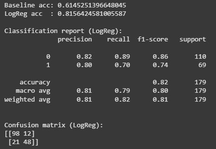

# Práctica 2  
## 📊 Feature Engineering, Modelo Base y Baseline

## Contexto
Práctica número 2 de la primer unidad del curso. En esta práctica buscamos aprender a usar la librería scikit-learn, ver los tipos de modelos que ofrece y crear nuevos parámetros a partir de los existentes.

## Objetivos
- Familiarizarse con scikit-learn y algunos de sus modelos más básicos.  
- Entender la importancia de un baseline antes de entrenar modelos más complejos.  
- Practicar feature engineering simple para mejorar la representación de los datos.  
- Evaluar el rendimiento de los modelos usando métricas y gráficas.

## Actividades (con tiempos estimados)
- **Preguntas teóricas:** 60 min  
- **Parte 1:** 20 min  
- **Parte 2:** 30 min  

## Desarrollo
En la práctica trabajamos con el dataset del Titanic, creando nuevas variables. También entrenamos un modelo base, uno Dummy y uno de Regresión Logística, y comprobamos que el de Logística supera el baseline. Esto muestra la importancia de factores como sexo, edad y compañía al viajar.

## Evidencias
- Se adjunta imagen **"resultado-t2-parte1.png"** en `docs/assets/`.

## Reflexión
Aprendí a ver la utilidad de crear nuevas variables y de comparar un modelo real contra un baseline. No sólo basta con entrenar: es clave medir, interpretar métricas y entender qué factores influyen más en las predicciones.

---

# Feature Engineering simple + Modelo base: solución

## Componentes de sckit-learn
### LogisticRegression:
#### ¿Qué tipo de problema resuelve?
##### Sirve para problemas de clasificación, para decidir entre categorías, enfermo o sano, spam o no spam.
#### ¿Qué parámetros importantes tiene?
##### penalty: le dice al modelo si queremos evitar que aprenda demasiado detalle.
##### C: controla cuánto “se aprieta” esa regularización.
##### solver: método matemático para entrenar.
##### max_iter: máximo de pasos que puede dar para aprender.
##### multi_class: cómo manejar si hay más de dos clases.
#### ¿Cuándo usar solver='liblinear' vs otros solvers?
##### Si tienes pocos datos y problema binario.
##### Otros solvers como saga, lbfgs, etc, son mejores para muchos datos o cuando hay más de dos clases.

### DummyClassifier:
#### ¿Para qué sirve exactamente?
##### Es un modelo muy básico que ignora los datos y predice de forma simple.
#### ¿Qué estrategias de baseline ofrece?
##### Por ejemplo, si el 80 % de los alumnos aprueban y el otro 20 % no, el Dummy con estrategia "most_frequent" siempre dirá aprobado. Si el modelo real no supera eso, no fue bien entrenado.
#### ¿Por qué es importante tener un baseline?
##### Para tener un piso mínimo de comparación.

### train_test_split:
#### ¿Qué hace el parámetro stratify?
##### Parte los datos en entrenamiento, para entrenar el modelo y test para probar qué tan bien fue entrenado.
#### ¿Por qué usar random_state?
##### Se utiliza para que la división se repita igual cada vez, es como guardar el mismo punto de partida para un dado trucado, siempre saldrá la misma secuencia de números.
#### ¿Qué porcentaje de test es recomendable?
##### 20% a 30% es lo más habitual en datasets medianos o grandes, 10% a 15% cuando tienes muchísimos datos y 30% o más cuando tienes pocos datos.

### Métricas de evaluación:
#### ¿Qué significa cada métrica en classification_report?
##### Precision: de todo lo que predije como “positivo”, cuánto estaba bien?
##### Recall: de todos los “positivos reales”, cuántos encontré?
##### F1-score: es el balance entre precision y recall.
##### Support: cuántos ejemplos reales había de esa clase.
#### ¿Cómo interpretar la matriz de confusión?
##### La diagonal de la matriz son aciertos y fuera de la diagonal son errores.
#### ¿Cuándo usar accuracy vs otras métricas?
##### Accuracy te da el porcentaje de aciertos sobre todo. Es recomendable usar sobre otras métricas si las clases están balanceadas.

## Parte 1: Descripción
Aquí analizamos un ejemplo de Feature Engineering que es básicamente crear variables nuevas a partir de otras existentes para mejorar el modelo.

## Parte 1: Código
```python
df = train.copy()

# 🚫 PASO 1: Manejar valores faltantes (imputación)
df['Embarked'] = df['Embarked'].fillna(df['Embarked'].mode()[0])  # Valor más común
df['Fare'] = df['Fare'].fillna(df['Fare'].median())              # Mediana
df['Age'] = df['Age'].fillna(df.groupby(['Sex','Pclass'])['Age'].transform('median'))

# 🆕 PASO 2: Crear nuevas features útiles
df['FamilySize'] = df['SibSp'] + df['Parch'] + 1
df['IsAlone'] = (df['FamilySize'] == 1).astype(int)

df['Title'] = df['Name'].str.extract(',\s*([^\.]+)\.')
rare_titles = df['Title'].value_counts()[df['Title'].value_counts() < 10].index
df['Title'] = df['Title'].replace(rare_titles, 'Rare')

# 🔄 PASO 3: Preparar datos para el modelo
features = ['Pclass','Sex','Age','Fare','Embarked','FamilySize','IsAlone','Title','SibSp','Parch']
X = pd.get_dummies(df[features], drop_first=True)
y = df['Survived']

X.shape, y.shape

```
Aqui por ejemplo generamos "FamilySize" sumando SibSp y Parch + 1 (la persona en cuestión y sus familiares).
También creamos flags para saber si es un individuo único, sin familia, y sacamos el "Title" con una expresión regular del parámetro "Name".
Finalmente, preparamos y modelamos.


## Parte 2: Descripción
En esta segunda parte de la práctica aparece el uso de "baseline" que es una referencia simple de que tan bien podemos hacer nuestro modelo, si no lo superamos algo no se modelo correctamente.

## Parte 2: Código
```python
from sklearn.model_selection import train_test_split
from sklearn.metrics import accuracy_score, classification_report, confusion_matrix
from sklearn.linear_model import LogisticRegression
from sklearn.dummy import DummyClassifier

X_train, X_test, y_train, y_test = train_test_split(
    X, y, test_size=0.2, random_state=42, stratify=y
)

dummy = DummyClassifier(strategy='most_frequent', random_state=42)
dummy.fit(X_train, y_train)
baseline_pred = dummy.predict(X_test)

lr = LogisticRegression(max_iter=1000, solver='liblinear', random_state=42)
lr.fit(X_train, y_train)
pred = lr.predict(X_test)

print('Baseline acc:', accuracy_score(y_test, baseline_pred))
print('LogReg acc  :', accuracy_score(y_test, pred))

print('\nClassification report (LogReg):')
print(classification_report(y_test, pred))

print('\nConfusion matrix (LogReg):')
print(confusion_matrix(y_test, pred))

```

#### Resultados


### ❓ Preguntas para el equipo
#### Matriz de confusión: ¿En qué casos se equivoca más el modelo: cuando predice que una persona sobrevivió y no lo hizo, o al revés?
##### El modelo se equivoca más cuando predice que una persona sobrevivió y en realidad no sobrevivió.
#### Clases atendidas: ¿El modelo acierta más con los que sobrevivieron o con los que no sobrevivieron?
##### El modelo acierta más con los que no sobrevivieron, porque son la mayoría de los datos.
#### Comparación con baseline: ¿La Regresión Logística obtiene más aciertos que el modelo que siempre predice la clase más común?
##### La Regresión Logística obtiene más aciertos que el DummyClassifier, lo que muestra que el modelo aprendió algo real y no solo adivinó la clase más común.
#### Errores más importantes: ¿Cuál de los dos tipos de error creés que es más grave para este problema?
##### Un error más grave en este contexto es predecir que alguien sobrevivió cuando en realidad no lo hizo, un falso positivo.
#### Observaciones generales: Mirando las gráficas y números, ¿qué patrones interesantes encontraste sobre la supervivencia?
##### Las mujeres y niños tuvieron mayor probabilidad de sobrevivir.
##### Viajar acompañado parece haber aumentado la supervivencia.
#### Mejoras simples: ¿Qué nueva columna (feature) se te ocurre que podría ayudar a que el modelo acierte más?
##### Crear una columna WomanOrChild, que indique si el pasajero era mujer o niño, sería fácil de capturar para el modelo, probablemente aumentando mucho su capacidad de clasificación.