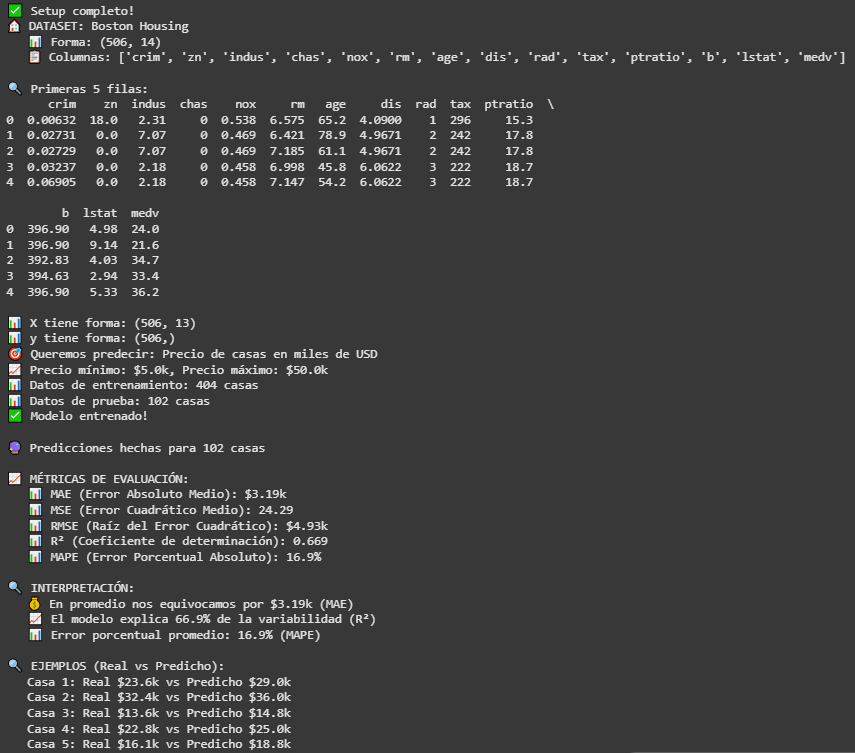
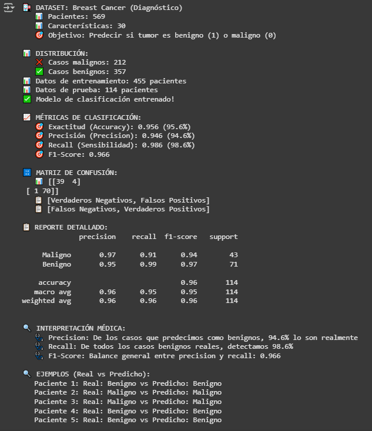

# Tarea 4

## Contexto
Tarea número 4 del curso, regresión líneal vs logística

## Objetivos
- Aprender a cargar y explorar datos
- Implementar regresión lineal paso a paso
- Implementar regresión logística paso a paso
- Interpretar resultados de forma simple

## Actividades (con tiempos estimados)
- Parte 1: regresión lineal (90min)
- Parte 2: regresión logística (50min)
- Teórico y formato del archivo (100min)

## Desarrollo
Se completó fragmentos de código con la finalidad de aprender a usar funciones específicas para predecir determinados casos reales. 
Se usaron funciones de regresión lineal y logística.
Se afianzaron conceptos teóricos de las nombradas regresiones.

## Evidencias
- Se adjunta imagen "tarea4_tabla.png" en `docs/assets/`
- Se adjunta imagen "resultado-t4-parte1.png" en `docs/assets/`
- Se adjunta imagen "resultado-t4-parte2.png" en `docs/assets/`

## Reflexión
Lo que más costó fueron identificar las funciones necesarias para completar el código y ententer lo que se estaba imprimiendo por pantalla.
Los conceptos en sí, fueron fáciles de aprender e identificar.

---

# Regresión Lineal - Regresión Logística: solución

## Parte 1: Descripción
En esta primer parte se analizaron las librerias pertinentes para completar el código siguiente. Se usó de apoyo las pistas brindadas por el docente.Por otro lado, se cargó el dataset de precios de una inmobiliaria de Boston Housing y se intentará predecir los valores de cada propiedad.A su vez, se evaluaran determinadas métricas para el calculo del valor de la propiedad, y por último, se haran comparativas de los valores actuales y los que se predijeron.

## Parte 1: Código
```python
# Importar librerías que vamos a usar
import pandas as pd
import numpy as np
import matplotlib.pyplot as plt

# Para los modelos de machine learning
from sklearn.linear_model import LinearRegression, LogisticRegression
from sklearn.model_selection import train_test_split
from sklearn.metrics import mean_squared_error, mean_absolute_error, r2_score, accuracy_score, classification_report, confusion_matrix, precision_score, recall_score, f1_score
from sklearn.datasets import load_breast_cancer

print("✅ Setup completo!")

# === CARGAR DATOS DE CASAS EN BOSTON ===

# 1. Cargar el dataset desde una URL
url = "https://raw.githubusercontent.com/selva86/datasets/master/BostonHousing.csv"
boston_data = pd.read_csv(url)

print("🏠 DATASET: Boston Housing")
print(f"   📊 Forma: {boston_data.shape}")
print(f"   📋 Columnas: {list(boston_data.columns)}")

# 2. Explorar los datos básicamente
print("\n🔍 Primeras 5 filas:")
print(boston_data.head(5))

# 3. Preparar X (variables independientes) e y (variable dependiente)
# La columna 'medv' es el precio de la casa que queremos predecir
X = boston_data.drop('medv', axis=1)  # Todas las columnas EXCEPTO la que queremos predecir
y = boston_data['medv']                # Solo la columna que queremos predecir

# Agregué estos prints para ver qué tiene X e y. Descomentar.
# print(f"   📋 Objeto X:\n {X}")
# print(f"   📋 Objeto y:\n {y}")

print(f"\n📊 X tiene forma: {X.shape}")
print(f"📊 y tiene forma: {y.shape}")
print(f"🎯 Queremos predecir: Precio de casas en miles de USD")
print(f"📈 Precio mínimo: ${y.min():.1f}k, Precio máximo: ${y.max():.1f}k")

# === ENTRENAR MODELO DE REGRESIÓN LINEAL ===

# 1. Dividir datos en entrenamiento y prueba
X_train, X_test, y_train, y_test = train_test_split(X, y, test_size=0.2, random_state=42)

print(f"📊 Datos de entrenamiento: {X_train.shape[0]} casas")
print(f"📊 Datos de prueba: {X_test.shape[0]} casas")

# 2. Crear y entrenar el modelo
modelo_regresion = LinearRegression()
modelo_regresion.fit(X_train, y_train)

print("✅ Modelo entrenado!")

# 3. Hacer predicciones
predicciones = modelo_regresion.predict(X_test)

print(f"\n🔮 Predicciones hechas para {len(predicciones)} casas")

# 4. Evaluar qué tan bueno es el modelo con MÚLTIPLES MÉTRICAS
mae = mean_absolute_error(y_test, predicciones)
mse = mean_squared_error(y_test, predicciones)
rmse = np.sqrt(mse)
r2 = r2_score(y_test, predicciones)

# Calcular MAPE manualmente
mape = np.mean(np.abs((y_test - predicciones) / y_test)) * 100

print(f"\n📈 MÉTRICAS DE EVALUACIÓN:")
print(f"   📊 MAE (Error Absoluto Medio): ${mae:.2f}k")
print(f"   📊 MSE (Error Cuadrático Medio): {mse:.2f}")
print(f"   📊 RMSE (Raíz del Error Cuadrático): ${rmse:.2f}k")
print(f"   📊 R² (Coeficiente de determinación): {r2:.3f}")
print(f"   📊 MAPE (Error Porcentual Absoluto): {mape:.1f}%")

print(f"\n🔍 INTERPRETACIÓN:")
print(f"   💰 En promedio nos equivocamos por ${mae:.2f}k (MAE)")
print(f"   📈 El modelo explica {r2*100:.1f}% de la variabilidad (R²)")
print(f"   📊 Error porcentual promedio: {mape:.1f}% (MAPE)")

# 5. Comparar algunas predicciones reales vs predichas
print(f"\n🔍 EJEMPLOS (Real vs Predicho):")
for i in range(5):
    real = y_test.iloc[i]
    predicho = predicciones[i]
    print(f"   Casa {i+1}: Real ${real:.1f}k vs Predicho ${predicho:.1f}k")
```

## Parte 1: Resultados
Imágen tabla comparativa de resultados

En la imágen podemos observar que el modelo entrenado con Regresion Lineal ha predicho los precios de las propiedades, 102 en este caso, con un error del 16% respecto al valor real, lo cual esta muy bien, y que en promedio la diferencia esta en un $3.19k. Se muestra en pantalla 5 ejemplos.

📚 BONUS: ¿Qué significan estas métricas?
Completa las definiciones:
#### MAE (Mean Absolute Error): ##### Promedio de los errores en valor absoluto, sin importar si son positivos o negativos.
#### MSE (Mean Squared Error): ##### Promedio de los errores al cuadrado, penaliza más los errores grandes.
#### RMSE: ##### Raíz cuadrada del MSE, vuelve a las unidades originales del problema.
#### R²: ##### Indica qué porcentaje de la variable dependiente es explicada por el modelo (0-1, donde 1 es perfecto).
#### MAPE: ##### Error porcentual promedio, útil para comparar modelos con diferentes escalas de datos.

## Parte 2: Descripción
En esta parte cargamos el dataset de Diagnísticos Médicos en el cual tendremos análisis de tests de cáncer de mama.
Nuestro objetivo es entrenar un modelo, analizar métricas y buscar una conclusión que respalde el análisis hecho por los médicos, ya sea afirmando el diagnóstico o rechazandolo.
Finalmente daremos un veredicto por paciente si el resultado del analisis es "Benigno" o "Maligno".

## Parte 2: Código
```python
# Importar librerías que vamos a usar
import pandas as pd
import numpy as np
import matplotlib.pyplot as plt

# Para los modelos de machine learning
from sklearn.linear_model import LinearRegression, LogisticRegression
from sklearn.model_selection import train_test_split
from sklearn.metrics import mean_squared_error, mean_absolute_error, r2_score, accuracy_score, classification_report, confusion_matrix, precision_score, recall_score, f1_score
from sklearn.datasets import load_breast_cancer

print("✅ Setup completo!")

# === CARGAR DATOS DE DIAGNÓSTICO DE CÁNCER ===

# 1. Cargar el dataset de cáncer de mama (que viene con sklearn)
cancer_data = load_breast_cancer()

# 2. Convertir a DataFrame para verlo mejor
X_cancer = pd.DataFrame(cancer_data.data, columns=cancer_data.feature_names)
y_cancer = cancer_data.target  # 0 = maligno, 1 = benigno

print("🏥 DATASET: Breast Cancer (Diagnóstico)")
print(f"   📊 Pacientes: {X_cancer.shape[0]}")
print(f"   📊 Características: {X_cancer.shape[1]}")
print(f"   🎯 Objetivo: Predecir si tumor es benigno (1) o maligno (0)")

# 3. Ver balance de clases
casos_malignos = (y_cancer == 0).sum()
casos_benignos = (y_cancer == 1).sum()

print(f"\n📊 DISTRIBUCIÓN:")
print(f"   ❌ Casos malignos: {casos_malignos}")
print(f"   ✅ Casos benignos: {casos_benignos}")

# === ENTRENAR MODELO DE CLASIFICACIÓN ===

# 1. Dividir datos en entrenamiento y prueba
X_train_cancer, X_test_cancer, y_train_cancer, y_test_cancer = train_test_split(
    X_cancer, y_cancer, test_size=0.2, random_state=42
)

print(f"📊 Datos de entrenamiento: {X_train_cancer.shape[0]} pacientes")
print(f"📊 Datos de prueba: {X_test_cancer.shape[0]} pacientes")

# 2. Crear y entrenar modelo de regresión logística
modelo_clasificacion = LogisticRegression(max_iter=5000, random_state=42)
modelo_clasificacion.fit(X_train_cancer, y_train_cancer)

print("✅ Modelo de clasificación entrenado!")

# 3. Hacer predicciones
predicciones_cancer = modelo_clasificacion.predict(X_test_cancer)

# 4. Evaluar con MÚLTIPLES MÉTRICAS de clasificación
exactitud = accuracy_score(y_test_cancer, predicciones_cancer)
precision = precision_score(y_test_cancer, predicciones_cancer)
recall = recall_score(y_test_cancer, predicciones_cancer)
f1 = f1_score(y_test_cancer, predicciones_cancer)

print(f"\n📈 MÉTRICAS DE CLASIFICACIÓN:")
print(f"   🎯 Exactitud (Accuracy): {exactitud:.3f} ({exactitud*100:.1f}%)")
print(f"   🎯 Precisión (Precision): {precision:.3f} ({precision*100:.1f}%)")
print(f"   🎯 Recall (Sensibilidad): {recall:.3f} ({recall*100:.1f}%)")
print(f"   🎯 F1-Score: {f1:.3f}")

# Mostrar matriz de confusión de forma simple
matriz_confusion = confusion_matrix(y_test_cancer, predicciones_cancer)
print(f"\n🔢 MATRIZ DE CONFUSIÓN:")
print(f"   📊 {matriz_confusion}")
print(f"   📋 [Verdaderos Negativos, Falsos Positivos]")
print(f"   📋 [Falsos Negativos, Verdaderos Positivos]")

# Reporte detallado
print(f"\n📋 REPORTE DETALLADO:")
print(classification_report(y_test_cancer, predicciones_cancer, target_names=['Maligno', 'Benigno']))

print(f"\n🔍 INTERPRETACIÓN MÉDICA:")
print(f"   🩺 Precision: De los casos que predecimos como benignos, {precision*100:.1f}% lo son realmente")
print(f"   🩺 Recall: De todos los casos benignos reales, detectamos {recall*100:.1f}%")
print(f"   🩺 F1-Score: Balance general entre precision y recall: {f1:.3f}")

# 5. Ver ejemplos específicos
print(f"\n🔍 EJEMPLOS (Real vs Predicho):")
for i in range(5):
    real = "Benigno" if y_test_cancer[i] == 1 else "Maligno"
    predicho = "Benigno" if predicciones_cancer[i] == 1 else "Maligno"
    print(f"   Paciente {i+1}: Real: {real} vs Predicho: {predicho}")
```

## Parte 2: Resultados
#### Imágen tabla comparativa de resultados

En la imágen podemos observar que al entrenar el modelo con Regresión Logística se obtuvo con un 94,6% de acierto los casos que fueron diagnosticados como Benignos, de los que realmente son casos Benignos se detecto un 98,6%. Existe una precisión del 96,6% en este caso.
Por otro lado, de los 114 pacientes de prueba sólo uno dio como falso negativo, es decir, que tiene cancer de mama Maligno y se lo diagnostico como Benigno, un error grave pero estadísticamente es menos de un 1%, y muestra la importancia de estos modelos de predicción para re-evaluar pacientes y diagnosticarlos correctamente.

📚 BONUS: ¿Qué significan las métricas de clasificación?
Completa las definiciones:
#### Accuracy: ##### Porcentaje de predicciones correctas sobre el total.
#### Precision: ##### De todas las predicciones positivas, ¿cuántas fueron realmente correctas?
#### Recall (Sensibilidad): ##### De todos los casos positivos reales, ¿cuántos detectamos?
#### F1-Score: ##### Promedio armónico entre precision y recall.
#### Matriz de Confusión: ##### Tabla que muestra prediccion vs valores reales.

🎯 Paso 6: Preguntas de Reflexión
Responde estas preguntas simples:
### ¿Cuál es la diferencia principal entre regresión lineal y logística?
#### 💡 PISTA: Piensa en qué tipo de valores produce cada una (números vs categorías)
##### La regresión lineal predice valores numéricos (ej: temperatura).
##### La regresión logística predice categorías, esto o aquello (ej: benigno/maligno).
### ¿Por qué dividimos los datos en entrenamiento y prueba?
#### 💡 PISTA: 🔗 Artículo sobre train/test split
##### Para evaluar el modelo en datos que no se ha visto antes.
##### Así comprobamos si realmente se generaliza bien, y no solo se “memoriza” el conjunto de entrenamiento.
### ¿Qué significa una exactitud del 95%?
#### 💡 PISTA: Si tienes 100 pacientes, ¿en cuántos acertaría el modelo?
##### Que el modelo acierta en 95 de cada 100 pacientes.
### ¿Cuál es más peligroso: predecir "benigno" cuando es "maligno", o al revés?
#### 💡 PISTA: 🩺 Piensa en las consecuencias médicas de cada error
##### Más peligroso es predecir benigno cuando en realidad es maligno (falso negativo), porque el paciente podría no recibir tratamiento a tiempo.

🔍 Paso 7: Comparación Simple
Completa esta tabla comparando ambos modelos:
#### Imágen tabla comparativa, regresión logística vs lineal
{ width="420" }

🎯 Paso 8: Reflexión Final
Responde con tus propias palabras:
### ¿Cuál modelo usarías para predecir el salario de un empleado?
#### 💡 PISTA: El salario, ¿es un número continuo o una categoría?
##### Usaría regresión lineal ya que el salario es un número continuo.
### ¿Cuál modelo usarías para predecir si un email es spam?
#### 💡 PISTA: 📧 ¿Cuántas opciones hay? (spam/no spam)
##### Regresión logística porque estaríamos clasificando algo "binario", 0 o 1, spam o no spam.
### ¿Por qué es importante separar datos de entrenamiento y prueba?
#### 💡 PISTA: 🔗 Conceptos de validación en ML
##### Porque queremos medir el rendimiento real del modelo con datos nuevos.
##### Si usamos los mismos datos para entrenar y después evaluar, el modelo va a parecer muy bueno, pero puede fallar con datos desconocidos, lo que se conoce como overfitting.