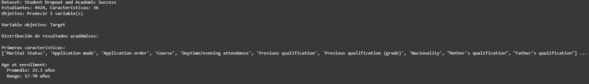
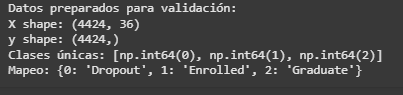
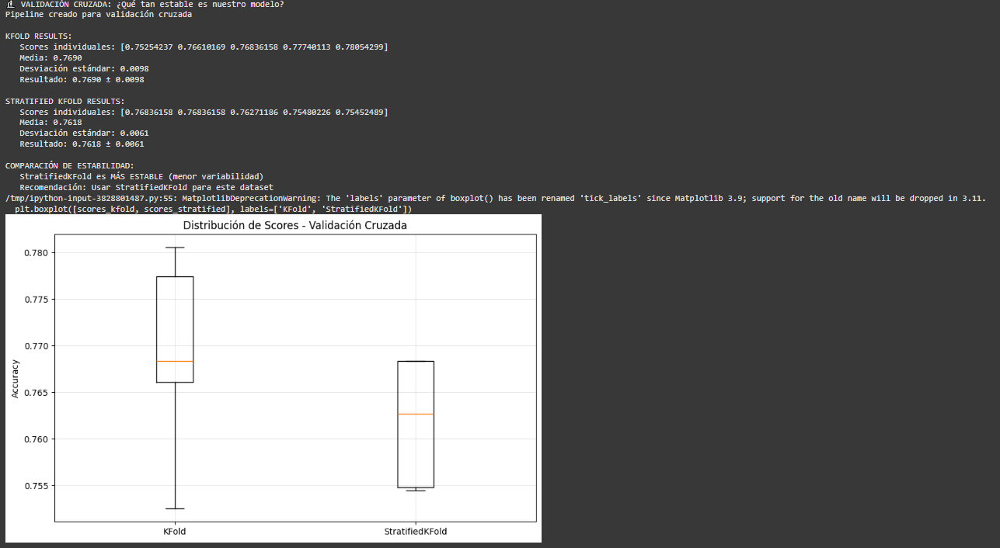

# Tarea 5

## Contexto
Tarea número 5 del curso.

## Objetivos
- Aprender a prevenir data leakage usando pipelines
- Implementar validación cruzada (cross-validation) robusta
- Comparar múltiples modelos de forma sistemática
- Interpretar métricas de estabilidad y selección de modelos

## Actividades (con tiempos estimados)
- Parte 1 (40min)
- Parte 2 (50min)
- Parte 3 (60min)
- Formato de la page (90min)

## Desarrollo


## Evidencias
- Se adjunta imagen "resultado-t5-parte1.1.png" en `docs/assets/`
- Se adjunta imagen "resultado-t5-parte1.2.png" en `docs/assets/`
- Se adjunta imagen "resultado-t5-parte2.png" en `docs/assets/`

## Reflexión


---

# Machine Learning Clásico: solución

## Setup inicial: Código

```python
# Instalar
!pip install ucimlrepo

# Importar librerías que vamos a usar
import pandas as pd
import numpy as np
import matplotlib.pyplot as plt

# Para validación y selección de modelos
from sklearn.linear_model import LogisticRegression, RidgeClassifier
from sklearn.ensemble import RandomForestClassifier
from sklearn.model_selection import train_test_split, cross_val_score, KFold, StratifiedKFold
from sklearn.preprocessing import StandardScaler
from sklearn.pipeline import Pipeline
# Para cargar datos desde UCI ML Repository
from ucimlrepo import fetch_ucirepo
from sklearn.metrics import accuracy_score, classification_report

print("Setup completo!")

```
## Parte 1: Descripción
En esta parte de la tarea descargamos y exploramos un dataset de estudiantes del repositorio UCI, revisando características claves, como su tamaño, la variable objetivo y la distribución de las clases, además de convertir los datos a un formato numérico para que puedan ser procesados por sklearn.

## Parte 1: Código - Cargamos dataset de estudiantes

```python
# Cargar dataset de estudiantes desde UCI
student_data = fetch_ucirepo(id=697)

# Preparar datos
X = student_data.data.features
y = student_data.data.targets

print("Dataset: Student Dropout and Academic Success")
print(f"Estudiantes: {X.shape[0]}, Características: {X.shape[1]}")
print(f"Objetivo: Predecir {len(y.columns)} variable(s)")

# Explorar variable objetivo
target_col = y.columns[0]  # Primera columna objetivo
y_series = y[target_col]
print(f"\nVariable objetivo: {target_col}")

# Mapear valores para mejor interpretación
target_mapping = {0: 'Dropout', 1: 'Enrolled', 2: 'Graduate'}
y_mapped = y_series.map(target_mapping)

# Distribución de clases
print("\nDistribución de resultados académicos:")
value_counts = y_mapped.value_counts()
for outcome, count in value_counts.items():
    percentage = (count / len(y_mapped)) * 100
    print(f"  {outcome}: {count} estudiantes ({percentage:.1f}%)")

# Ver algunas características
print(f"\nPrimeras características:")
print(X.columns.tolist()[:10], "...")

# Estadísticas básicas
print(f"\nAge at enrollment:")
if 'Age at enrollment' in X.columns:
    age_col = X['Age at enrollment']
    print(f"  Promedio: {age_col.mean():.1f} años")
    print(f"  Rango: {age_col.min():.0f}-{age_col.max():.0f} años")

```
#### Resultados dataset


## Parte 1: Código - Mappeo para sklearn

```python
# Preparar variable objetivo como serie simple
# Convertir strings a números para sklearn
target_mapping = {0: 'Dropout', 1: 'Enrolled', 2: 'Graduate'}
reverse_mapping = {'Dropout': 0, 'Enrolled': 1, 'Graduate': 2}

# Si y_series contiene strings, convertir a números
if y_series.dtype == 'object':
    y_target = y_series.map(reverse_mapping)
else:
    y_target = y_series

X_features = X       # Features del dataset

print("Datos preparados para validación:")
print(f"X shape: {X_features.shape}")
print(f"y shape: {y_target.shape}")
print(f"Clases únicas: {sorted(y_target.unique())}")
print(f"Mapeo: {target_mapping}")
```
#### Resultados mappeo


## Parte 2: Descripción
Aquí se aplica validación cruzada (con KFold y StratifiedKFold) para evaluar qué tan estable y confiable es el modelo de regresión logística, para esto comparamos los resultados de ambos enfoques y visualizamos la variabilidad de los scores.

## Parte 2: Código

```python

# === VALIDACIÓN CRUZADA PARA ESTABILIDAD ===

print("🔬 VALIDACIÓN CRUZADA: ¿Qué tan estable es nuestro modelo?")

# 1. Crear pipeline robusto para usar en CV
pipeline_robust = Pipeline([
    ('scaler', StandardScaler()),
    ('classifier', LogisticRegression(max_iter=1000, random_state=42))
])

print("Pipeline creado para validación cruzada")

# 2. Crear KFold básico
kfold = KFold(n_splits=5, shuffle=True, random_state=42)

# 3. Evaluar con KFold usando cross_val_score
scores_kfold = cross_val_score(
    pipeline_robust, X_features, y_target, cv=kfold, scoring='accuracy'
)

print(f"\nKFOLD RESULTS:")
print(f"   Scores individuales: {scores_kfold}")
print(f"   Media: {scores_kfold.mean():.4f}")
print(f"   Desviación estándar: {scores_kfold.std():.4f}")
print(f"   Resultado: {scores_kfold.mean():.4f} ± {scores_kfold.std():.4f}")

# 4. Crear StratifiedKFold (mantiene proporción de clases)
stratified_kfold = StratifiedKFold(n_splits=5, shuffle=True, random_state=42)

# 5. Evaluar con StratifiedKFold
scores_stratified = cross_val_score(
    pipeline_robust, X_features, y_target, cv=stratified_kfold, scoring='accuracy'
)

print(f"\nSTRATIFIED KFOLD RESULTS:")
print(f"   Scores individuales: {scores_stratified}")
print(f"   Media: {scores_stratified.mean():.4f}")
print(f"   Desviación estándar: {scores_stratified.std():.4f}")
print(f"   Resultado: {scores_stratified.mean():.4f} ± {scores_stratified.std():.4f}")

# 6. Comparar estabilidad (menor desviación = más estable)
print(f"\nCOMPARACIÓN DE ESTABILIDAD:")
if scores_stratified.std() < scores_kfold.std():
    print("   StratifiedKFold es MÁS ESTABLE (menor variabilidad)")
    mejor_cv = "StratifiedKFold"
else:
    print("   KFold es MÁS ESTABLE (menor variabilidad)")
    mejor_cv = "KFold"

print(f"   Recomendación: Usar {mejor_cv} para este dataset")

# 7. Visualizar la distribución de scores
import matplotlib.pyplot as plt
plt.figure(figsize=(10, 6))
plt.boxplot([scores_kfold, scores_stratified], labels=['KFold', 'StratifiedKFold'])
plt.title('Distribución de Scores - Validación Cruzada')
plt.ylabel('Accuracy')
plt.grid(True, alpha=0.3)
plt.show()

```
#### Resultados validación cruzada


En la imágen se puede apreciar que el StratifiedKFold es más estable pero con un media menor al Kfold normal, el cual tiene una desviación más grande y posee extremos más pronunciados como se puede ver que va desde 0,780 hasta 0,750 aproximadamente.
En conclusión, si buscamos estabilidad el StratifiedKFold es nuestra mejor opción.

## Parte 3: Descripción
En esta parte de la tarea se comparan tres modelos de clasificación (Regresión Logística, Ridge Classifier y Random Forest) usando validación cruzada. 
También calcularemos el accuracy promedio y la desviación estándar para medir rendimiento y estabilidad, y por ultimo, se identificá el mejor modelo, visualizando los resultados con gráficos comparativos.

## Parte 3: Código

```python
# === COMPETENCIA DE MODELOS ===

print("🏆 TORNEO: ¿Cuál modelo funciona mejor para diagnóstico médico?")

# 1. Definir candidatos (diferentes algoritmos)
models = {
    'Logistic Regression': Pipeline([
        ('scaler', StandardScaler()),
        ('classifier', LogisticRegression(max_iter=1000, random_state=42))
    ]),

    # 2. Ridge Classifier (regresión logística con regularización L2)
    'Ridge Classifier': Pipeline([
        ('scaler', StandardScaler()),
        ('classifier', RidgeClassifier(alpha=1.0, random_state=42))
    ]),

    # 3. Random Forest (ensemble, no necesita escalado)
    'Random Forest': Pipeline([
        ('classifier', RandomForestClassifier(n_estimators=100, random_state=42))
    ])
}

print(f"Modelos en competencia: {list(models.keys())}")

# 4. Evaluar cada modelo con validación cruzada
print(f"\nEVALUANDO MODELOS CON 5-FOLD CV...")

results = {}
for name, model in models.items():
    print(f"   Evaluando {name}...")

    # Usar StratifiedKFold para mantener balance de clases
    scores = cross_val_score(
        model, X_features, y_target, 
        cv=StratifiedKFold(n_splits=5, shuffle=True, random_state=42),
        scoring='accuracy'
    )

    results[name] = scores

    print(f"   {name}: {scores.mean():.4f} ± {scores.std():.4f}")
    print(f"      Scores: {[f'{s:.3f}' for s in scores]}")

# 5. Encontrar el mejor modelo
print(f"\nRESULTADOS FINALES:")

# Encontrar modelo con mayor accuracy promedio
best_mean_score = 0
best_model_name = ""

for name, scores in results.items():
    if scores.mean() > best_mean_score:
        best_mean_score = scores.mean()
        best_model_name = name

print(f"GANADOR: {best_model_name}")
print(f"Score: {best_mean_score:.4f}")

# 6. Análisis detallado de estabilidad
print(f"\nANÁLISIS DE ESTABILIDAD:")
for name, scores in results.items():
    stability = scores.std()

    if stability < 0.02:
        status = "MUY ESTABLE"
    elif stability < 0.05:
        status = "ESTABLE"
    else:
        status = "INESTABLE"

    print(f"   {name}: {status} (std: {stability:.4f})")

# 7. Visualización comparativa
plt.figure(figsize=(12, 6))

# Boxplot de distribución de scores
plt.subplot(1, 2, 1)
plt.boxplot([results[name] for name in models.keys()], 
           labels=[name.split()[0] for name in models.keys()])
plt.title('Distribución de Accuracy por Modelo')
plt.ylabel('Accuracy')
plt.grid(True, alpha=0.3)

# Barplot de medias con error bars
plt.subplot(1, 2, 2)
names = list(models.keys())
means = [results[name].mean() for name in names]
stds = [results[name].std() for name in names]

plt.bar(range(len(names)), means, yerr=stds, capsize=5)
plt.xticks(range(len(names)), [name.split()[0] for name in names])
plt.title('Accuracy Promedio ± Desviación Estándar')
plt.ylabel('Accuracy')
plt.grid(True, alpha=0.3)

plt.tight_layout()
plt.show()
```

#### Resultados validación cruzada


Podemos observar que varias cosas en los modelos, primero se descarta Ridge como ópcion ya que tiene una media muy baja comparada con los otros dos modelo.
Después, dependiendo de lo que busquemos en nuestro modelo podemos optar por Logistic, si queremos estabilidad y una buena media, y por otro lado, Random Forest que nos da una media mejor pero es menos estable ya que varía entre extremos desde 0,775 hasta 0,757 aproximadamente, que aún así es mejor que el más bajo del Logistic.
En definitiva, como comparamos medias, Random Forest sería nuestra mejor opción.


📚 BONUS: ¿Qué significan las métricas de validación?
Completa las definiciones:
### Cross-Validation: 
#### Técnica que divide los datos en k partes para entrenar y evaluar múltiples veces.
### Accuracy promedio: 
#### La medida de rendimiento esperado en datos nuevos.
### Desviación estándar: 
#### Indica qué tan consistente es el modelo entre diferentes divisiones de datos.
### StratifiedKFold: 
#### Mantiene la proporción de clases en cada fold, especialmente importante en datasets desbalanceados.

---
🚀 BONUS: Optimización de Hiperparámetros
## GridSearchCV vs RandomizedSearchCV

```python


```
