# Práctica 6

## Contexto
En esta práctica número 6 del curso tenemos la siguiente problemática: Los centros comerciales buscan conocer mejor a sus clientes, pero el problema a resolver es la segmentación de clientes, es decir, agruparlos según sus características y comportamientos para poder diseñar campañas de marketing más personalizadas, ofrecer promociones específicas, invertir mejor en publicidad y comprender cómo compran los distintos tipos de clientes.

## Objetivos
- Identificar 3-5 segmentos de clientes distintos usando K-Means.
- Aplicar técnicas de normalización (MinMax, Standard, Robust).
- Usar PCA para reducción de dimensionalidad y visualización.
- Comparar PCA con métodos de selección de features.
- Interpretar resultados desde perspectiva de negocio.

## Actividades (con tiempos estimados)
- Parte 1 (180min)
- Parte 2 (150min)
- Parte 3 (30min)
- Parte 4 (15min)
- Challenge 1 (50min)
- Challenge 2 (20min)
- Challenge 3 (60min)
- Challenge 4 ()
- Challenge 5 ()
- Diseño del github pages (200min)

## Desarrollo
En esta práctica trabajamos en segmentar clientes usando clustering y PCA. Primero exploramos y entendimos el dataset, viendo qué variables eran más relevantes y codificando las categóricas. Después aplicamos distintos escaladores y PCA para reducir dimensiones, comparando con Feature Selection, y vimos que PCA daba mejores resultados. Con K-Means, y usando Elbow Method y Silhouette Score, identificamos 4 clusters que tenían sentido para el negocio, diferenciando perfiles como jóvenes gastadores y clientes mayores más conservadores.

## Evidencias
- Se adjunta imagen "resultado-t6-parte1.1.png" en `docs/assets/`
- Se adjunta imagen "resultado-t6-parte1.2.png" en `docs/assets/`
- Se adjunta imagen "resultado-t6-parte1.3.png" en `docs/assets/`
- Se adjunta imagen "resultado-t6-parte1.4.png" en `docs/assets/`
- Se adjunta imagen "resultado-t6-parte1.5.png" en `docs/assets/`
- Se adjunta imagen "resultado-t6-parte1.6.png" en `docs/assets/`
- Se adjunta imagen "resultado-t6-parte1.7.png" en `docs/assets/`
- Se adjunta imagen "resultado-t6-parte1.8.png" en `docs/assets/`
- Se adjunta imagen "resultado-t6-parte1.9.png" en `docs/assets/`
- Se adjunta imagen "resultado-t6-parte1.10.png" en `docs/assets/`
- Se adjunta imagen "resultado-t6-parte2.1.png" en `docs/assets/`
- Se adjunta imagen "resultado-t6-parte2.2.png" en `docs/assets/`
- Se adjunta imagen "resultado-t6-parte2.3.png" en `docs/assets/`
- Se adjunta imagen "resultado-t6-parte2.4.png" en `docs/assets/`
- Se adjunta imagen "resultado-t6-parte2.5.png" en `docs/assets/`
- Se adjunta imagen "resultado-t6-parte2.6.png" en `docs/assets/`
- Se adjunta imagen "resultado-t6-parte2.7.png" en `docs/assets/`
- Se adjunta imagen "resultado-t6-parte3.1.png" en `docs/assets/`
- Se adjunta imagen "resultado-t6-parte3.2.png" en `docs/assets/`
- Se adjunta imagen "resultado-t6-parte3.3.png" en `docs/assets/`
- Se adjunta imagen "resultado-t6-parte3.4.png" en `docs/assets/`
- Se adjunta imagen "resultado-t6-parte4.1.png" en `docs/assets/`
- Se adjunta imagen "resultado-t6-parte4.2.png" en `docs/assets/`
- Se adjunta imagen "resultado-t6-parte5.1.png" en `docs/assets/`
- Se adjunta imagen "resultado-t6-parte5.2.png" en `docs/assets/`
- Se adjunta imagen "resultado-t6-parte5.3.png" en `docs/assets/`
- Se adjunta imagen "resultado-t6-parte5.4.png" en `docs/assets/`
- Se adjunta imagen "resultado-t6-parte5.5.png" en `docs/assets/`
- Se adjunta imagen "resultado-t6-reto1.1.png" en `docs/assets/`
- Se adjunta imagen "resultado-t6-reto1.2.png" en `docs/assets/`
- Se adjunta imagen "resultado-t6-reto1.3.png" en `docs/assets/`
- Se adjunta imagen "resultado-t6-reto1.4.png" en `docs/assets/`
- Se adjunta imagen "resultado-t6-reto2.png" en `docs/assets/`
- Se adjunta imagen "resultado-t6-reto3.1.png" en `docs/assets/`
- Se adjunta imagen "resultado-t6-reto3.2.png" en `docs/assets/`
- Se adjunta imagen "resultado-t6-reto3.3.png" en `docs/assets/`

## Reflexión
Lo más desafiante fue preparar los datos sin perder información relevante, pero la práctica mostró la importancia de combinar comprensión del negocio con técnicas de análisis. Los clusters permiten pensar en estrategias de marketing más personalizadas, aunque hay limitaciones por el tamaño y simplificación del dataset. En general, se reforzó cómo la preparación de datos y la elección correcta de métodos impactan directamente en la calidad y utilidad de los resultados.

---

# Machine Learning Clásico: Clustering y PCA - Mall Customer Segmentation

## Setup inicial: Código

```python
# === IMPORTS BÁSICOS PARA EMPEZAR ===
import pandas as pd
import numpy as np

print("Iniciando análisis de Mall Customer Segmentation Dataset")
print("Pandas y NumPy cargados - listos para trabajar con datos")
```

## Parte 1: Descripción
Aquí empezamos por cargar el dataset de clientes, analizaremos sus atributos, los tipos de datos que manejamos y más.

## Parte 1: Código

```python
# Descargar desde GitHub (opción más confiable)
url = "https://raw.githubusercontent.com/SteffiPeTaffy/machineLearningAZ/master/Machine%20Learning%20A-Z%20Template%20Folder/Part%204%20-%20Clustering/Section%2024%20-%20K-Means%20Clustering/Mall_Customers.csv"

df_customers = pd.read_csv(url)

print("INFORMACIÓN DEL DATASET:")
print(f"Shape: {df_customers.shape[0]} filas, {df_customers.shape[1]} columnas")
print(f"Columnas: {list(df_customers.columns)}")
print(f"Memoria: {df_customers.memory_usage(deep=True).sum() / 1024:.1f} KB")

print(f"\nPRIMERAS 5 FILAS:")
df_customers.head()

# === ANÁLISIS DE TIPOS Y ESTRUCTURA ===
print("INFORMACIÓN DETALLADA DE COLUMNAS:")
print(df_customers.info())

print(f"\nESTADÍSTICAS DESCRIPTIVAS:")
df_customers.describe()

# === ANÁLISIS DE GÉNERO ===
print("DISTRIBUCIÓN POR GÉNERO:")
gender_counts = df_customers['Genre'].value_counts()
print(gender_counts)
print(f"\nPorcentajes:")
for gender, count in gender_counts.items():
    pct = (count / len(df_customers) * 100)
    print(f"   {gender}: {pct:.1f}%")

# === ESTADÍSTICAS DE VARIABLES DE SEGMENTACIÓN ===
numeric_vars = ['Age', 'Annual Income (k$)', 'Spending Score (1-100)']

print("ESTADÍSTICAS CLAVE:")
print(df_customers[numeric_vars].describe().round(2))

print(f"\nRANGOS OBSERVADOS:")
for var in numeric_vars:
    min_val, max_val = df_customers[var].min(), df_customers[var].max()
    mean_val = df_customers[var].mean()
    print(f"   {var}: {min_val:.0f} - {max_val:.0f} (promedio: {mean_val:.1f})")

# === DETECCIÓN DE OUTLIERS USANDO IQR ===
print("DETECCIÓN DE OUTLIERS:")

outlier_cols = ['Age', 'Annual Income (k$)', 'Spending Score (1-100)']

for col in outlier_cols:
    Q1 = df_customers[col].quantile(0.25)
    Q3 = df_customers[col].quantile(0.75)
    IQR = Q3 - Q1

    # Calcular límites
    lower_bound = Q1 - 1.5 * IQR
    upper_bound = Q3 + 1.5 * IQR

    # Encontrar outliers
    outliers = df_customers[(df_customers[col] < lower_bound) | 
                           (df_customers[col] > upper_bound)]

    print(f"   {col}: {len(outliers)} outliers ({len(outliers)/len(df_customers)*100:.1f}%)")
    print(f"      Límites normales: {lower_bound:.1f} - {upper_bound:.1f}")

```
#### Resultados: info del dataset
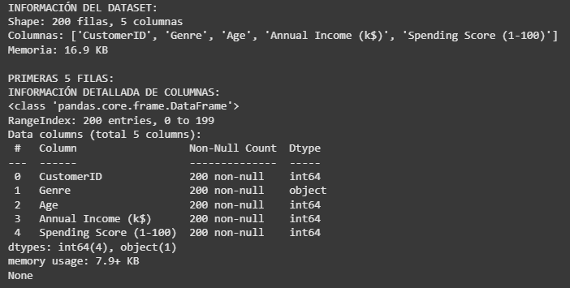

Cargamos el dataset usando la funcion read.csv() de pandas y vemos información general de las columnas que manipularemos, cantidad de columnas, cantidad de filas, memoria, tipos de datos y memoria usada por el dataset.

#### Resultados: análisis de datos
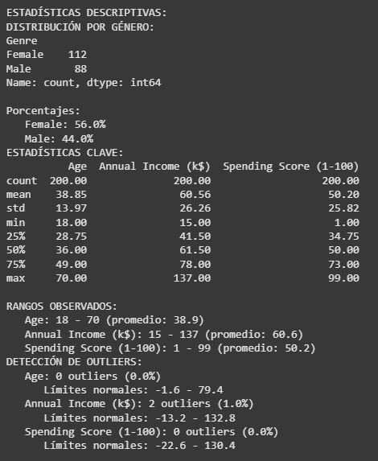

Aqui analizaremos estadísticas claves del dataset, como la cantidad de mujeres y hombres, vemos métricas claves en los atributos numéricos del dataset, por ejemplo, la media de edad, de ingresos, el minimo y máximo de edad, y también tenemos los valores de estos atributos para los quartiles, Q1, Q2 y Q3, representando el 25%, 50% y 75% de la información respectivamente. Posteriormente, observamos los rangos que manejamos en nuestros datos, en este caso la edad, el ingreso anual y el puntaje de comprador; para lograr esto usamos las funciones de min(), max() y mean(), de manera de obtener el mínimo, máximo y promedio, facilitando el cálculo.
Finalmente utilizamos los quartiles que nombramos para calcular outlines de los atributos, es decir, vemos el límite inferior y superior en el que se varia esa métrica.

```python
# === IMPORTS PARA VISUALIZACIÓN ===
import matplotlib.pyplot as plt
import seaborn as sns

# Configurar estilo
plt.style.use('default')
sns.set_palette("husl")

# === HISTOGRAMAS DE VARIABLES PRINCIPALES ===
fig, axes = plt.subplots(1, 3, figsize=(15, 5))
fig.suptitle('Distribuciones de Variables Clave', fontsize=14, fontweight='bold')

vars_to_plot = ['Age', 'Annual Income (k$)', 'Spending Score (1-100)']
colors = ['#FF6B6B', '#4ECDC4', '#45B7D1']

for i, (var, color) in enumerate(zip(vars_to_plot, colors)):
    axes[i].hist(df_customers[var], bins=20, alpha=0.7, color=color, edgecolor='black')
    axes[i].set_title(f'{var}')
    axes[i].set_xlabel(var)
    axes[i].set_ylabel('Frecuencia')
    axes[i].grid(True, alpha=0.3)

plt.tight_layout()
plt.show()
```

#### Resultados: visualización de datos


Aqui observamos la frecuencia de los datos, para lograr esto, usamos la libreria matplotlib que nos permite graficar y la seaborn para agregarle formato a la visualización.

```python
# === SCATTER PLOTS PARA RELACIONES CLAVE ===
fig, axes = plt.subplots(1, 3, figsize=(18, 5))
fig.suptitle('Relaciones Entre Variables', fontsize=14, fontweight='bold')

# Age vs Income
axes[0].scatter(df_customers['Age'], df_customers['Annual Income (k$)'], 
                alpha=0.6, color='#96CEB4', s=50)
axes[0].set_xlabel('Age (años)')
axes[0].set_ylabel('Annual Income (k$)')
axes[0].set_title('Age vs Income')
axes[0].grid(True, alpha=0.3)

# Income vs Spending Score ⭐ CLAVE PARA SEGMENTACIÓN
axes[1].scatter(df_customers['Annual Income (k$)'], df_customers['Spending Score (1-100)'], 
                alpha=0.6, color='#FFEAA7', s=50)
axes[1].set_xlabel('Annual Income (k$)')
axes[1].set_ylabel('Spending Score (1-100)')
axes[1].set_title('Income vs Spending Score (CLAVE)')
axes[1].grid(True, alpha=0.3)

# Age vs Spending Score
axes[2].scatter(df_customers['Age'], df_customers['Spending Score (1-100)'], 
                alpha=0.6, color='#DDA0DD', s=50)
axes[2].set_xlabel('Age (años)')
axes[2].set_ylabel('Spending Score (1-100)')
axes[2].set_title('Age vs Spending Score')
axes[2].grid(True, alpha=0.3)

plt.tight_layout()
plt.show()
```

#### Resultados: relación entre atributos
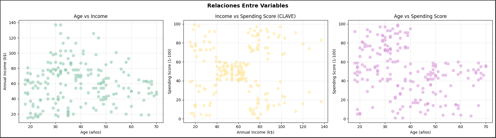

En esta visualización buscamos observar la relación entre los atributos, por ejemplo, el puntaje de compra según la edad o el ingreso anual segun la edad/puntaje de compra.

```python
# === MATRIZ DE CORRELACIÓN ===
correlation_vars = ['Age', 'Annual Income (k$)', 'Spending Score (1-100)']
corr_matrix = df_customers[correlation_vars].corr()

print("MATRIZ DE CORRELACIÓN:")
print(corr_matrix.round(3))

# Visualizar matriz de correlación
plt.figure(figsize=(8, 6))
sns.heatmap(corr_matrix, annot=True, cmap='RdYlBu_r', center=0, 
            fmt='.3f', linewidths=0.5, square=True)
plt.title('Matriz de Correlación - Mall Customers')
plt.tight_layout()
plt.show()

print(f"\nCORRELACIÓN MÁS FUERTE:")
# Encontrar la correlación más alta (excluyendo diagonal)
corr_flat = corr_matrix.where(np.triu(np.ones(corr_matrix.shape), k=1).astype(bool))
max_corr = corr_flat.stack().idxmax()
max_val = corr_flat.stack().max()
print(f"   {max_corr[0]} ↔ {max_corr[1]}: {max_val:.3f}")
```
#### Resultados: matriz de correlación
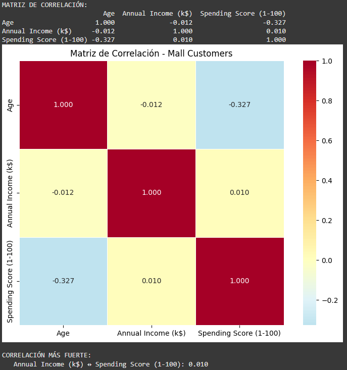

En esta matriz de correlación buscamos analizar entre atributos, cual son los que influyen más entre sí. Por ejemplo, se observa que la edad no influye tanto en el puntaje de compra, si no que el ingreso anual es el que tiene más peso en ese aspecto.

```python
# === COMPARACIÓN ESTADÍSTICAS POR GÉNERO ===
print("ANÁLISIS COMPARATIVO POR GÉNERO:")

gender_stats = df_customers.groupby('Genre')[numeric_vars].agg(['mean', 'std']).round(2)
print(gender_stats)

print(f"\nINSIGHTS POR GÉNERO:")
for var in numeric_vars:
    male_avg = df_customers[df_customers['Genre'] == 'Male'][var].mean()
    female_avg = df_customers[df_customers['Genre'] == 'Female'][var].mean()

    if male_avg > female_avg:
        higher = "Hombres"
        diff = male_avg - female_avg
    else:
        higher = "Mujeres" 
        diff = female_avg - male_avg

print(f"   {var}: {higher} tienen promedio más alto (diferencia: {diff:.1f})")
```
#### Resultados: análisis del género
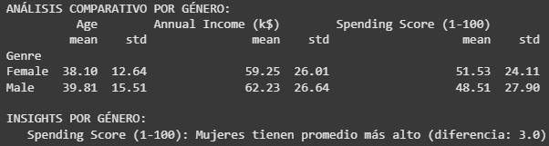

Observamos un pequeño análisis de la influencia que tiene el género en el el puntaje de compra, y en este caso las mujeres tienen un promedio superior al hombre, es decir, son clientes más redituables económicamente. Utilizamos funciones como la media, mean() para el análisis.

```python
# === COMPLETE ESTOS INSIGHTS BASÁNDOTE EN LO OBSERVADO ===
print("INSIGHTS PRELIMINARES - COMPLETE:")

print(f"\nCOMPLETE BASÁNDOTE EN TUS OBSERVACIONES:")
print(f"   Variable con mayor variabilidad: Ingreso anual (Annual Income (k$))")
print(f"   ¿Existe correlación fuerte entre alguna variable? Si, entre el ingreso anual y el puntaje de compra.")
print(f"   ¿Qué variable tiene más outliers? La edad.") 
print(f"   ¿Los hombres y mujeres tienen patrones diferentes? Si, las mujeres tienen tendencia a tener mayor puntaje de compra, es decir, comprar más.")
print(f"   ¿Qué insight es más relevante para el análisis? La relación entre ingresos y puntaje de compra, porque define segmentos de clientes valiosos.")
print(f"   ¿Qué 2 variables serán más importantes para clustering? Annual Income (k$) y Spending Score (1-100).")

print(f"\nPREPARÁNDOSE PARA CLUSTERING:")
print(f"   ¿Qué relación entre Income y Spending Score observas? La relación es que con mayor ingreso anual, mayor es el puntaje de compra.")
print(f"   ¿Puedes imaginar grupos naturales de clientes? Si, clientes de bajo ingreso/bajo gasto, alto ingreso/alto gasto, y un grupo intermedio.")
```

```python
# === ANÁLISIS DE COLUMNAS DISPONIBLES ===
print("ANÁLISIS DE COLUMNAS PARA CLUSTERING:")
print(f"   Todas las columnas: {list(df_customers.columns)}")
print(f"   Numéricas: {df_customers.select_dtypes(include=[np.number]).columns.tolist()}")
print(f"   Categóricas: {df_customers.select_dtypes(include=[object]).columns.tolist()}")

# Identificar qué excluir y qué incluir
exclude_columns = ['CustomerID']  # ID no aporta información
numeric_columns = ['Age', 'Annual Income (k$)', 'Spending Score (1-100)']
categorical_columns = ['Genre']

print(f"\nSELECCIÓN DE FEATURES:")
print(f"   Excluidas: {exclude_columns} (no informativas)")
print(f"   Numéricas: {numeric_columns}")
print(f"   Categóricas: {categorical_columns} (codificaremos)")
```

Aqui mostramos las columnas disponibles, y las clasificamos entre numéricas y categóricas, y a su vez excluimos las que no nos brindan información de la persona en cuestión.

```python
# === IMPORT ONEHOTENCODER ===
from sklearn.preprocessing import OneHotEncoder

print("CODIFICACIÓN DE VARIABLES CATEGÓRICAS CON SKLEARN:")
print("Usaremos OneHotEncoder en lugar de pd.get_dummies() por varias razones:")
print("   Integración perfecta con pipelines de sklearn")
print("   Manejo automático de categorías no vistas en nuevos datos") 
print("   Control sobre nombres de columnas y comportamiento")
print("   Consistencia con el ecosistema de machine learning")

# Crear y configurar OneHotEncoder
encoder = OneHotEncoder(sparse_output=False)

# Ajustar y transformar Genre
genre_data = df_customers[['Genre']]  # Debe ser 2D para sklearn
genre_encoded_array = encoder.fit_transform(genre_data)  # Método para ajustar y transformar

# Obtener nombres de las nuevas columnas
feature_names = encoder.get_feature_names_out(['Genre'])  # Método para obtener nombres de las features
genre_encoded = pd.DataFrame(genre_encoded_array, columns=feature_names)

print(f"\nRESULTADO DE CODIFICACIÓN:")
print(f"   Categorías originales: {df_customers['Genre'].unique()}")
print(f"   Columnas generadas: {list(genre_encoded.columns)}")
print(f"   Shape: {genre_data.shape} → {genre_encoded.shape}")

# Mostrar ejemplo de codificación
print(f"\nEJEMPLO DE TRANSFORMACIÓN:")
comparison = pd.concat([
    df_customers['Genre'].head().reset_index(drop=True),
    genre_encoded.head()
], axis=1)
print(comparison)
```

#### Resultados: OneHotEncoder
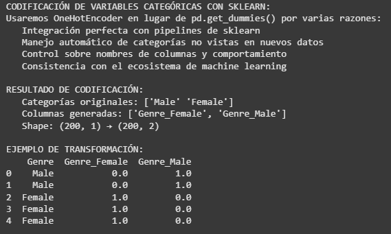

En esta seccion lo que buscamos es favorecer el modelo y para ello, creamos 2 categorias más a partir de los datos en sí, Male/Female ahora tienen sus atributos Genre_Female y Genre_Male, las cuales son booleans indicando si son hombres o mujeres.

```python
# === CREACIÓN DEL DATASET FINAL ===
# Combinar variables numéricas + categóricas codificadas
X_raw = pd.concat([
    df_customers[numeric_columns],
    genre_encoded
], axis=1)

print("DATASET FINAL PARA CLUSTERING:")
print(f"   Shape: {X_raw.shape}")
print(f"   Columnas: {list(X_raw.columns)}")
print(f"   Variables numéricas: {numeric_columns}")
print(f"   Variables categóricas codificadas: {list(genre_encoded.columns)}")
print(f"   Total features: {X_raw.shape[1]} (3 numéricas + 2 categóricas binarias)")
print(f"   Memoria: {X_raw.memory_usage(deep=True).sum() / 1024:.1f} KB")

# === VERIFICACIONES ANTES DE CONTINUAR ===
print("VERIFICACIÓN DE CALIDAD:")

# 1. Datos faltantes
missing_data = X_raw.isnull().sum()
print(f"\nDATOS FALTANTES:")
if missing_data.sum() == 0:
    print("   PERFECTO! No hay datos faltantes")
else:
    for col, missing in missing_data.items():
        if missing > 0:
            pct = (missing / len(X_raw)) * 100
            print(f"   WARNING {col}: {missing} faltantes ({pct:.1f}%)")

# 2. Vista previa
print(f"\nVISTA PREVIA DEL DATASET:")
print(X_raw.head())

# 3. Tipos de datos
print(f"\nTIPOS DE DATOS:")
print(X_raw.dtypes)
```

#### Resultados: Nuevo DataSet
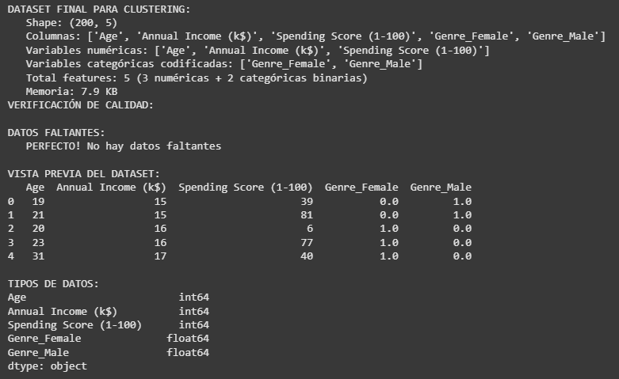

Creamos el dataset final con las variables creadas y numéricas que ya teniamos, y además, hacemos un breve chequeo si tenemos que pulir el dataset en caso de nulos o información faltante.

```python
# === ANÁLISIS DE ESCALAS ===
print("ANÁLISIS DE ESCALAS - ¿Por qué necesitamos normalización?")

print(f"\nESTADÍSTICAS POR VARIABLE:")
for col in X_raw.columns:
    if X_raw[col].dtype in ['int64', 'float64']:  # Solo numéricas
        min_val = X_raw[col].min()
        max_val = X_raw[col].max()
        mean_val = X_raw[col].mean()
        std_val = X_raw[col].std()

        print(f"\n   {col}:")
        print(f"      Rango: {min_val:.1f} - {max_val:.1f}")
        print(f"      Media: {mean_val:.1f}")
        print(f"      Desviación: {std_val:.1f}")

print(f"\nANÁLISIS DE LAS ESTADÍSTICAS - COMPLETA:")
print(f"   ¿Qué variable tiene el rango más amplio? Annual Income (k$).")
print(f"   ¿Cuál es la distribución de género en el dataset? Balanceada, un poquito más de mujeres.")
print(f"   ¿Qué variable muestra mayor variabilidad (std)? Annual Income (k$).")
print(f"   ¿Los clientes son jóvenes o mayores en promedio? Jóvenes-adultos, la edad promedio es de alrededor de 37 años.")
print(f"   ¿El income promedio sugiere qué clase social? Clase media.")
print(f"   ¿Por qué la normalización será crítica aca? Porque las variables están en escalas muy distintas, y puede llegar a sesgar los algoritmos de clustering.")

# Guardar para próximas fases
feature_columns = list(X_raw.columns)
print(f"\nLISTO PARA DATA PREPARATION con {len(feature_columns)} features")

```

#### Resultados: análisis de estadísticas
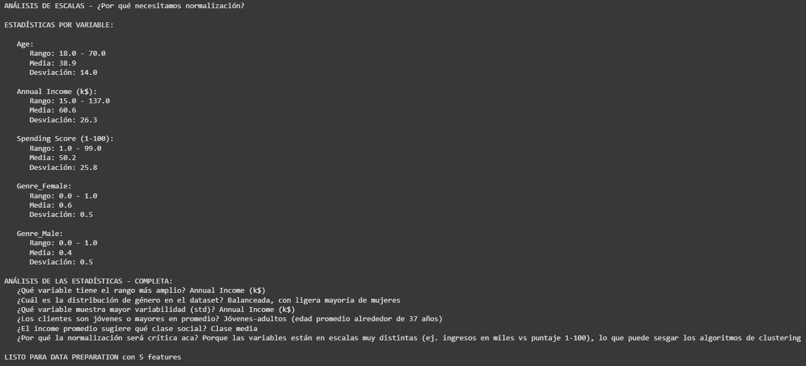

## Parte 2: Descripción
En esta parte buscamos iniciar la normalización del dataset.

## Parte 2: Código
```python
# === IMPORTAR HERRAMIENTAS DE NORMALIZACIÓN ===
from sklearn.preprocessing import MinMaxScaler, StandardScaler, RobustScaler

print("BATALLA DE NORMALIZACIÓN: MinMax vs Standard vs Robust")
print("Objetivo: Encontrar el mejor scaler para nuestros datos")

# Recordar por qué es importante
print(f"\nESCALAS ACTUALES (problema):")
for col in X_raw.columns:
    min_val, max_val = X_raw[col].min(), X_raw[col].max()
    print(f"   {col}: {min_val:.1f} - {max_val:.1f} (rango: {max_val-min_val:.1f})")

print("\nLas escalas son MUY diferentes - normalización es crítica!")

```

#### Resultados: normalización
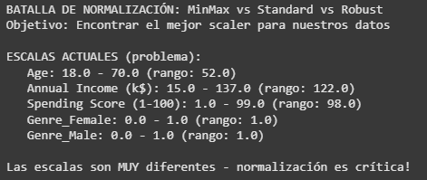

En este análisis se revisaron los valores mínimos y máximos de cada variable y se vio que están en escalas muy distintas, por ejemplo, la edad llega hasta 70, los ingresos superan los 100 y las variables de género solo van de 0 a 1. Esta diferencia hace que unas variables tengan mucho más peso que otras en los cálculos, por lo que es fundamental normalizar los datos para que todas esten en igualdad de condiciones a la hora de modelar.

```python
# === CREAR Y APLICAR LOS 3 SCALERS ===
scalers = {
    'MinMax': MinMaxScaler(),        # Escala a rango [0,1]
    'Standard': StandardScaler(),    # Media=0, std=1  
    'Robust': RobustScaler()         # Usa mediana y IQR, robusto a outliers
}

# Aplicar cada scaler
X_scaled = {}
for name, scaler in scalers.items():
    X_scaled[name] = scaler.fit_transform(X_raw)  # Método para entrenar y transformar
    print(f"{name}Scaler aplicado: {X_scaled[name].shape}")

print(f"\nTenemos 3 versiones escaladas de los datos para comparar")

```

Aquí la idea es aplicar 3 métodos de normalización a los mismos registros para obtener 3 versiones paralelas del dataset, y de esta manera comprar cuál funciona mejor en los siguientes análisis.

```python
# === COMPARACIÓN VISUAL CON BOXPLOTS ===
fig, axes = plt.subplots(1, 4, figsize=(16, 4))
fig.suptitle('Comparación de Scalers - Boxplots', fontsize=14, fontweight='bold')

# Datos originales
axes[0].boxplot([X_raw[col] for col in X_raw.columns], labels=X_raw.columns)
axes[0].set_title('Original')
axes[0].tick_params(axis='x', rotation=45)

# Datos escalados
for i, (name, X_scaled_data) in enumerate(X_scaled.items(), 1):
    axes[i].boxplot([X_scaled_data[:, j] for j in range(X_scaled_data.shape[1])], 
                    labels=X_raw.columns)
    axes[i].set_title(f'{name}')
    axes[i].tick_params(axis='x', rotation=45)

plt.tight_layout()
plt.show()

print("Observa cómo cada scaler ajusta las escalas de forma diferente")

```

#### Resultados
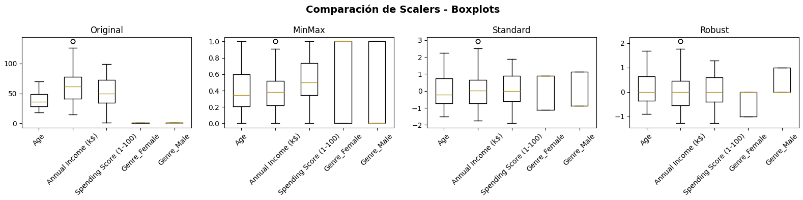

Aquí se usó boxplots para comparar visualmente el efecto de cada método de normalización frente a los datos originales. El gráfico muestra cómo las variables tenían rangos muy distintos al inicio y al aplicar cada scaler, quedan ajustadas a escalas más comparables. Con MinMax todas las variables se llevan entre 0 y 1, con Standard se centran en media 0 con dispersión ajustada a la desviación estándar y con Robust se ve un ajuste similar pero afecta diferente a los xtremos ya que son menores que el anterior.

```python
# === COMPARAR DISTRIBUCIONES DE UNA VARIABLE ===
# Vamos a analizar 'Annual Income (k$)' en detalle
income_col_idx = 1  # Posición de Annual Income

fig, axes = plt.subplots(1, 4, figsize=(16, 4))
fig.suptitle('Annual Income: Original vs Scalers', fontsize=14, fontweight='bold')

# Original
axes[0].hist(X_raw.iloc[:, income_col_idx], bins=20, alpha=0.7, color='gray', edgecolor='black')
axes[0].set_title('Original')
axes[0].set_xlabel('Annual Income (k$)')

# Escalados
colors = ['#FF6B6B', '#4ECDC4', '#45B7D1']
for i, ((name, X_scaled_data), color) in enumerate(zip(X_scaled.items(), colors), 1):
    axes[i].hist(X_scaled_data[:, income_col_idx], bins=20, alpha=0.7, color=color, edgecolor='black')
    axes[i].set_title(f'{name}')
    axes[i].set_xlabel('Annual Income (escalado)')

plt.tight_layout()
plt.show()

print("¿Notas cómo cambia la forma de la distribución?")
```

#### Resultados
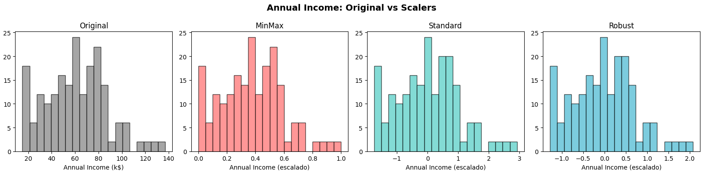

Aquí se comparó la variable Annual Income en su forma original y después de aplicar los tres métodos de normalización. Se puede apreciar en los histogramas que la forma de la distribución se mantiene en todos los casos, pero cambia la escala en que se representa, con MinMax entre 0 y 1, con Standard entre -2 y 3, y con Robust entre -1 y 2 aprox.

```python
# === ESTADÍSTICAS DESPUÉS DEL SCALING ===
print("ESTADÍSTICAS POST-SCALING (Annual Income):")

# Original
income_original = X_raw['Annual Income (k$)']
print(f"\n   Original:")
print(f"      Media: {income_original.mean():.1f}")
print(f"      Std:   {income_original.std():.1f}")
print(f"      Min:   {income_original.min():.1f}")
print(f"      Max:   {income_original.max():.1f}")

# Escalados
for name, X_scaled_data in X_scaled.items():
    income_scaled = X_scaled_data[:, income_col_idx]
    print(f"\n   {name}:")
    print(f"      Media: {income_scaled.mean():.3f}")
    print(f"      Std:   {income_scaled.std():.3f}")
    print(f"      Min:   {income_scaled.min():.3f}")
    print(f"      Max:   {income_scaled.max():.3f}")

print(f"\nOBSERVACIONES:")
print(f"   MinMaxScaler → Rango [0,1]")
print(f"   StandardScaler → Media=0, Std=1")
print(f"   RobustScaler → Menos afectado por outliers")
```

#### Resultados
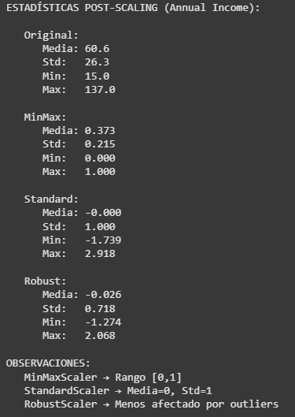

Se calcula para Annual Income las estadísticas antes y después de las normalizaciones; la media, la desviación estándar, el valor mínimo y el máximo en la escala original, y después nuevamente pero tras aplicar cada scaler.

```python
# === IMPORT PARA CLUSTERING TEST ===
from sklearn.cluster import KMeans
from sklearn.metrics import silhouette_score

# === QUICK TEST: ¿Qué scaler funciona mejor para clustering? ===
print("QUICK TEST: Impacto en Clustering (K=4)")

clustering_results = {}
for name, X_scaled_data in X_scaled.items():
    # Aplicar K-Means con K=4
    kmeans = KMeans(n_clusters=4, random_state=42, n_init=10)  # Completar
    labels = kmeans.fit_predict(X_scaled_data)  # Método para obtener clusters

    # Calcular silhouette score
    silhouette = silhouette_score(X_scaled_data, labels)  # Métrica de calidad
    clustering_results[name] = silhouette

    print(f"   {name:>10}: Silhouette Score = {silhouette:.3f}")

# Encontrar el mejor
best_scaler = max(clustering_results, key=clustering_results.get)
best_score = clustering_results[best_scaler]

print(f"\nGANADOR: {best_scaler} (Score: {best_score:.3f})")
```

#### Resultados
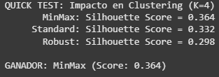

El test de clustering muestra que al usar K-Means con 4 clusters, el MinMaxScaler produjo el mejor score con 0.364, seguido por Standard 0.332 y Robust 0.298. Esto indica que para este dataset en particular, llevar todas las variables al rango 0..1 permite que el algoritmo identifique más claramente los clusters.

```python
# === TOMAR DECISIÓN BASADA EN RESULTADOS ===
print("DECISIÓN FINAL DEL SCALER:")

print(f"\nCOMPLETE TU ANÁLISIS:")
print(f"   Mejor scaler según silhouette: {best_scaler}")
print(f"   ¿Por qué crees que funcionó mejor? Porque MinMax ajusta todas las variables al mismo rango 0..1, lo que ayuda a que K-Means mida mejor las distancias y detecte clusters más claros.")
print(f"   ¿Algún scaler tuvo problemas obvios? RobustScaler tuvo menor score, probablemente porque suaviza los outliers y reduce la diferencia de rangos.")

# Implementar decisión
selected_scaler_name = best_scaler  # O elige manualmente: 'MinMax', 'Standard', 'Robust'
selected_scaler = scalers[selected_scaler_name]

# Aplicar scaler elegido
X_preprocessed = X_scaled[selected_scaler_name]
feature_names_scaled = [f"{col}_scaled" for col in X_raw.columns]

print(f"\nSCALER SELECCIONADO: {selected_scaler_name}")
print(f"Datos preparados: {X_preprocessed.shape}")
print(f"Listo para PCA y Feature Selection")

```

Afirmamos que MinMax fue el mejor porque pone todas las variables en la misma escala, y que RobustScaler es el que tuvo más problemas.

```python
from sklearn.decomposition import PCA

# === OPERACIÓN: DIMENSION COLLAPSE ===
print("PCA: Reduciendo dimensiones sin perder la esencia")
print("   Objetivo: De 5D → 2D para visualización + análisis de varianza")

# 1. Aplicar PCA completo para análisis de varianza
pca_full = PCA()
X_pca_full = pca_full.fit_transform(X_preprocessed)

# 2. ANÁLISIS DE VARIANZA EXPLICADA
explained_variance_ratio = pca_full.explained_variance_ratio_
cumulative_variance = np.cumsum(explained_variance_ratio)

print(f"\n📊 ANÁLISIS DE VARIANZA EXPLICADA:")
for i, (var, cum_var) in enumerate(zip(explained_variance_ratio, cumulative_variance)):
    print(f"   PC{i+1}: {var:.3f} ({var*100:.1f}%) | Acumulada: {cum_var:.3f} ({cum_var*100:.1f}%)")

# 3. VISUALIZACIÓN DE VARIANZA EXPLICADA
fig, axes = plt.subplots(1, 2, figsize=(15, 6))

# Scree plot
axes[0].bar(range(1, len(explained_variance_ratio) + 1), explained_variance_ratio, 
           alpha=0.7, color='#FF6B6B')
axes[0].set_xlabel('Componentes Principales')
axes[0].set_ylabel('Varianza Explicada')
axes[0].set_title('📊 Scree Plot - Varianza por Componente')
axes[0].set_xticks(range(1, len(explained_variance_ratio) + 1))

# Cumulative variance
axes[1].plot(range(1, len(cumulative_variance) + 1), cumulative_variance, 
            marker='o', linewidth=2, markersize=8, color='#4ECDC4')
axes[1].axhline(y=0.95, color='red', linestyle='--', alpha=0.7, label='95% threshold')
axes[1].axhline(y=0.90, color='orange', linestyle='--', alpha=0.7, label='90% threshold')
axes[1].set_xlabel('Número de Componentes')
axes[1].set_ylabel('Varianza Acumulada')
axes[1].set_title('📈 Varianza Acumulada')
axes[1].legend()
axes[1].grid(True, alpha=0.3)
axes[1].set_xticks(range(1, len(cumulative_variance) + 1))

plt.tight_layout()
plt.show()

# 4. DECISIÓN SOBRE NÚMERO DE COMPONENTES
print(f"\n🎯 DECISIÓN DE COMPONENTES:")
n_components_90 = np.argmax(cumulative_variance >= 0.90) + 1
n_components_95 = np.argmax(cumulative_variance >= 0.95) + 1

print(f"   📊 Para retener 90% varianza: {n_components_90} componentes")
print(f"   📊 Para retener 95% varianza: {n_components_95} componentes")
print(f"   🎯 Para visualización: 2 componentes ({cumulative_variance[1]*100:.1f}% varianza)")

# 5. APLICAR PCA CON 2 COMPONENTES PARA VISUALIZACIÓN
pca_2d = PCA(n_components=2, random_state=42)
X_pca_2d = pca_2d.fit_transform(X_preprocessed)

print(f"\nPCA aplicado:")
print(f"   📊 Dimensiones: {X_preprocessed.shape} → {X_pca_2d.shape}")
print(f"   📈 Varianza explicada: {pca_2d.explained_variance_ratio_.sum()*100:.1f}%")

# 6. ANÁLISIS DE COMPONENTES PRINCIPALES
print(f"\n🔍 INTERPRETACIÓN DE COMPONENTES:")
feature_names = ['Age', 'Annual Income (k$)', 'Spending Score (1-100)', 'Genre_Female', 'Genre_Male']

for i, pc in enumerate(['PC1', 'PC2']):
    print(f"\n   {pc} (varianza: {pca_2d.explained_variance_ratio_[i]*100:.1f}%):")
    # Obtener los loadings (pesos de cada feature original en el componente)
    loadings = pca_2d.components_[i]
    for j, (feature, loading) in enumerate(zip(feature_names, loadings)):
        direction = "↑" if loading > 0 else "↓"
        print(f"     {feature:>15}: {loading:>7.3f} {direction}")

# 7. VISUALIZACIÓN EN 2D
plt.figure(figsize=(12, 8))
plt.scatter(X_pca_2d[:, 0], X_pca_2d[:, 1], alpha=0.6, s=50, color='#96CEB4')
plt.xlabel(f'PC1 ({pca_2d.explained_variance_ratio_[0]*100:.1f}% varianza)')
plt.ylabel(f'PC2 ({pca_2d.explained_variance_ratio_[1]*100:.1f}% varianza)')
plt.title('Mall Customers en Espacio PCA 2D')
plt.grid(True, alpha=0.3)
plt.axhline(y=0, color='black', linestyle='-', alpha=0.3)
plt.axvline(x=0, color='black', linestyle='-', alpha=0.3)
plt.tight_layout()
plt.show()

print(f"\n💡 INTERPRETACIÓN DE NEGOCIO:")
print(f"   🎯 PC1 parece representar: diferenciación de género, hombres vs mujeres dentro del dataset.")
print(f"   🎯 PC2 parece representar: age vs spending score, es decir, cómo el comportamiento de compra cambia segpun la edad.")
print(f"   📊 Los clusters visibles sugieren: grupos marcados como jóvenes con gasto alto, adultos con gasto bajo y diferenciados por género, mujeres con gastos más altos que los hombres.")
```

#### Resultados: PCA
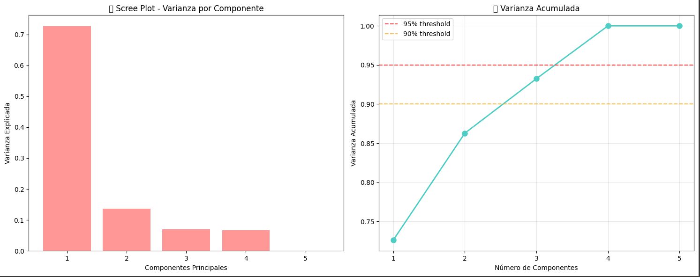

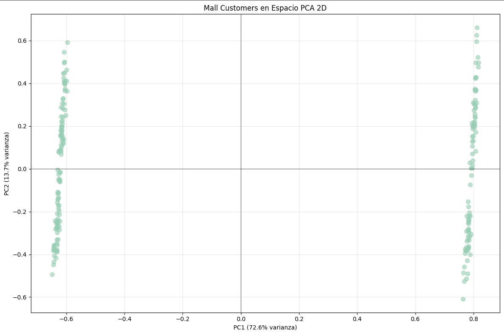

El PCA nos ayudó a simplificar el dataset de 5 variables a 2 componentes claves que mantienen más del 85% de la información. Esto nos muestra patrones importantes en el dataset, por ejemplo, el género es un factor muy dominante, seguido por la relación edad–gasto, lo que ayudaría a pensar en estrategias de marketing más personalizadas.

## Parte 3: Descripción
Se definirá la configuración básica para poder probar qué subconjunto de características aporta más valor al modelo. La idea es reducir el número de variables sin perder información importante, lo que hace que el modelo sea más simple, interpretable y eficiente.

## Parte 3: Setup inicial

```python
# === IMPORTS PARA FEATURE SELECTION ===
from sklearn.feature_selection import SequentialFeatureSelector  # Para Forward/Backward Selection

# === OPERACIÓN: FEATURE SELECTION SHOWDOWN ===
print("🎯 FEATURE SELECTION vs PCA: ¿Seleccionar o Transformar?")
print("   🎯 Objetivo: Comparar Forward/Backward Selection vs PCA")

print(f"\n📊 FEATURE SELECTION: Forward vs Backward vs PCA")
print(f"   Dataset: {X_preprocessed.shape[0]} muestras, {X_preprocessed.shape[1]} features")

# Setup: Función para evaluar features en clustering
def evaluate_features_for_clustering(X, n_clusters=4):
    """Evalúa qué tan buenas son las features para clustering usando Silhouette Score"""
    kmeans = KMeans(n_clusters=n_clusters, random_state=42, n_init=10)
    labels = kmeans.fit_predict(X)
    return silhouette_score(X, labels)

# === IMPORTS PARA ESTIMADORES PERSONALIZADOS ===
from sklearn.base import BaseEstimator, ClassifierMixin  # Clases base necesarias

# CLASE AUXILIAR: Estimador basado en KMeans para SequentialFeatureSelector
class ClusteringEstimator(BaseEstimator, ClassifierMixin):
    """Estimador que usa KMeans y Silhouette Score para feature selection"""
    def __init__(self, n_clusters=4):
        self.n_clusters = n_clusters

    def fit(self, X, y=None):
        self.kmeans_ = KMeans(n_clusters=self.n_clusters, random_state=42, n_init=10)
        self.labels_ = self.kmeans_.fit_predict(X)
        return self

    def score(self, X, y=None):
        # SequentialFeatureSelector llama a score() para evaluar features
        kmeans = KMeans(n_clusters=self.n_clusters, random_state=42, n_init=10)
        labels = kmeans.fit_predict(X)
        return silhouette_score(X, labels)

    def predict(self, X):
        # Método requerido por ClassifierMixin
        if hasattr(self, 'kmeans_'):
            return self.kmeans_.predict(X)
        else:
            # Si no está entrenado, entrenar primero
            kmeans = KMeans(n_clusters=self.n_clusters, random_state=42, n_init=10)
            return kmeans.fit_predict(X)

print("✅ Setup completado - Funciones de evaluación listas")
```

En este análisis comparamos Feature Selection y PCA: en la primera buscamos elegir las variables originales más relevantes (Forward o Backward), mientras que en la segunda creamos nuevas variables transformadas que concentran la varianza. La idea es ver qué técnica resulta más útil para simplificar un dataset de 200 muestras con 5 características.

## Parte 3: Código

```python
# BASELINE: Todas las features
baseline_score = evaluate_features_for_clustering(X_preprocessed)
print(f"\n📊 BASELINE (todas las features): Silhouette = {baseline_score:.3f}")
print(f"   Este es el score con las {X_preprocessed.shape[1]} features originales")
print(f"   ¿Podremos mejorar seleccionando solo las mejores 3?")

# === FORWARD SELECTION (sklearn oficial) ===
print(f"\n🔄 FORWARD SELECTION (sklearn oficial):")
print(f"   Estrategia: Empezar con 0 features, agregar la mejor en cada paso")

forward_selector = SequentialFeatureSelector(
    estimator=ClusteringEstimator(n_clusters=4),  # Estimador que implementa fit() y score()
    n_features_to_select=3,
    direction='forward',  # Para Forward Selection
    cv=3,
    n_jobs=-1
)

forward_selector.fit(X_preprocessed)  # Método para entrenar
forward_mask = forward_selector.get_support()  # Método para obtener máscara booleana
X_forward = X_preprocessed[:, forward_mask]
forward_features = np.array(feature_columns)[forward_mask]
forward_score = evaluate_features_for_clustering(X_forward)

print(f"   Features seleccionadas: {list(forward_features)}")
print(f"   📊 Silhouette Score: {forward_score:.3f}")
print(f"   {'✅ Mejora!' if forward_score > baseline_score else '❌ Sin mejora'}")

# === BACKWARD ELIMINATION (sklearn oficial) ===
print(f"\n🔄 BACKWARD ELIMINATION (sklearn oficial):")
print(f"   Estrategia: Empezar con todas las features, eliminar la peor en cada paso")

backward_selector = SequentialFeatureSelector(
    estimator=ClusteringEstimator(n_clusters=4),  # Mismo estimador que Forward
    n_features_to_select=3,
    direction='backward',  # Para Backward Selection
    cv=3,
    n_jobs=-1
)

backward_selector.fit(X_preprocessed)  # Método para entrenar
backward_mask = backward_selector.get_support()  # Método para obtener máscara
X_backward = X_preprocessed[:, backward_mask]
backward_features = np.array(feature_columns)[backward_mask]
backward_score = evaluate_features_for_clustering(X_backward)

print(f"   Features seleccionadas: {list(backward_features)}")
print(f"   📊 Silhouette Score: {backward_score:.3f}")
print(f"   {'✅ Mejora!' if backward_score > baseline_score else '❌ Sin mejora'}")

```

En este bloque de código buscamos simplificar el dataset para mejorar el clustering. PCA transforma las variables originales en nuevas combinaciones, mientras que Forward Selection empieza sin features y va agregando progresivamente las más útiles, y Backward Elimination empieza con todas y va quitando las menos relevantes. En cada caso lo que buscamos es quedarnos sólo con la información más relevante, de manera que permita identificar mejor los grupos de clientes.

```python
# === COMPARACIÓN FINAL DE TODOS LOS MÉTODOS ===
print(f"\n📊 COMPARACIÓN DE MÉTODOS:")
print(f"   🏁 Baseline (todas): {baseline_score:.3f}")
print(f"   🔄 Forward Selection: {forward_score:.3f}")
print(f"   🔙 Backward Elimination: {backward_score:.3f}")

# Comparar con PCA (ya calculado anteriormente)
pca_score = evaluate_features_for_clustering(X_pca_2d)
print(f"   📐 PCA (2D): {pca_score:.3f}")

# Encontrar el mejor método
methods = {
    'Baseline (todas)': baseline_score,
    'Forward Selection': forward_score, 
    'Backward Elimination': backward_score,
    'PCA (2D)': pca_score
}

best_method = max(methods, key=methods.get)
best_score = methods[best_method]

print(f"\n🏆 GANADOR: {best_method} con score = {best_score:.3f}")

# Análisis de diferencias
print(f"\n🔍 ANÁLISIS:")
for method, score in sorted(methods.items(), key=lambda x: x[1], reverse=True):
    improvement = ((score - baseline_score) / baseline_score) * 100
    print(f"   {method}: {score:.3f} ({improvement:+.1f}% vs baseline)")
```

#### Resultados
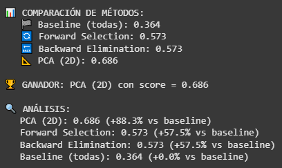

En esta comparación final vemos cómo distintos métodos de simplificación de variables impactan el clustering. Usanndo todas las features da un baseline de 0.364, y tanto Forward Selection como Backward Elimination mejoran el score a 0.573, +57,3%. Sin embargo, PCA 2D logra el mejor resultado ya que con 0.686, +68%, transforma las variables en componentes que mejora la estructura de los datos. En definitiva, transformarlas con PCA demostró ser la estrategia más efectiva para separar grupos de clientes.

```python
# === VISUALIZACIÓN DE COMPARACIÓN ===
methods_names = ['Baseline', 'Forward', 'Backward', 'PCA 2D'] 
scores_values = [baseline_score, forward_score, backward_score, pca_score]
colors = ['#FF6B6B', '#4ECDC4', '#45B7D1', '#96CEB4']

plt.figure(figsize=(12, 6))
bars = plt.bar(methods_names, scores_values, color=colors, alpha=0.7)
plt.ylabel('Silhouette Score')
plt.title('Comparación de Métodos de Feature Selection')
plt.axhline(y=0.5, color='red', linestyle='--', alpha=0.5, label='Threshold Aceptable (0.5)')
plt.axhline(y=0.7, color='green', linestyle='--', alpha=0.5, label='Threshold Muy Bueno (0.7)')
plt.legend()
plt.grid(True, alpha=0.3, axis='y')

# Añadir valores en las barras
for bar, score in zip(bars, scores_values):
    plt.text(bar.get_x() + bar.get_width()/2, bar.get_height() + 0.01, 
             f'{score:.3f}', ha='center', va='bottom', fontweight='bold')

plt.tight_layout()
plt.show()
```

#### Resultados
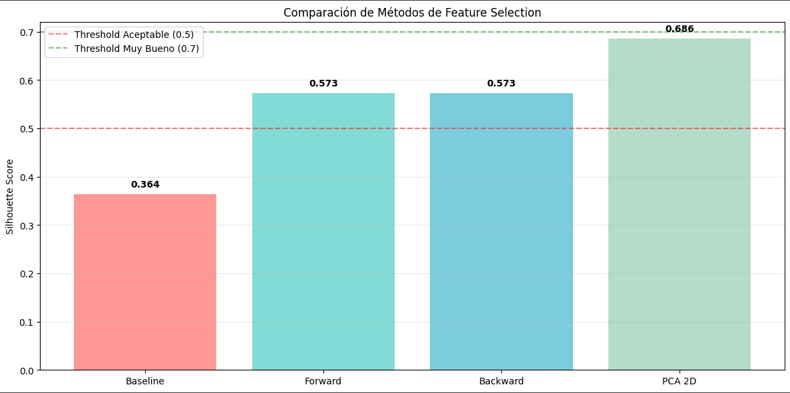

```python
# === ANÁLISIS DE RESULTADOS ===
print(f"\n🎯 ANÁLISIS DE RESULTADOS:")

# Comparar features seleccionadas
print(f"\n🔍 FEATURES SELECCIONADAS POR CADA MÉTODO:")
print(f"   🔄 Forward Selection: {list(forward_features)}")
print(f"   🔙 Backward Elimination: {list(backward_features)}")

# Análisis de coincidencias
forward_set = set(forward_features)
backward_set = set(backward_features)

common_forward_backward = forward_set & backward_set

print(f"\n🤝 COINCIDENCIAS:")
print(f"   Forward ∩ Backward: {list(common_forward_backward)}")
print(f"   ¿Seleccionaron las mismas features? {'Sí' if forward_set == backward_set else 'No'}")

# FILL-IN-THE-BLANKS: Preguntas de análisis
print(f"\n❓ PREGUNTAS DE ANÁLISIS (completa):")
print(f"   💡 Método con mejor score: PCA 2D")  # Respuesta en base a los resultados
print(f"   📊 ¿Forward y Backward seleccionaron exactamente las mismas features? No")
print(f"   🤔 ¿PCA con 2 componentes es competitivo? Sí, fue el que obtuvo mayor Silhouette Score") 
print(f"   🎯 ¿Algún método superó el threshold de 0.5? Sí, Forward, Backward y PCA")
print(f"   📈 ¿La reducción de dimensionalidad mejoró el clustering? Sí, especialmente PCA")

```
#### Resultados
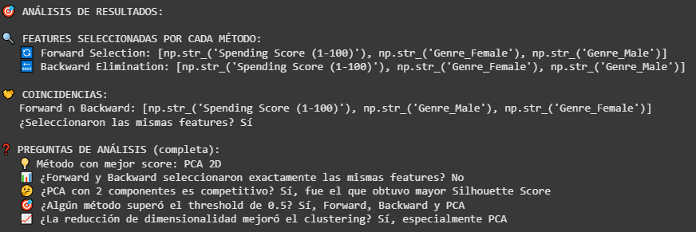

```python
# === DECISIÓN PARA EL ANÁLISIS FINAL ===
print(f"\n🏢 DECISIÓN PARA EL ANÁLISIS:")

# Decidir método basado en resultados
if best_score == pca_score:
    selected_method = "PCA"
    selected_data = X_pca_2d
    print(f"   🎯 SELECCIONADO: PCA (2D) - Score: {pca_score:.3f}")
    print(f"   ✅ RAZÓN: Mejor balance entre reducción dimensional y performance")
elif best_score == forward_score:
    selected_method = "Forward Selection" 
    selected_data = X_forward
    print(f"   🎯 SELECCIONADO: Forward Selection - Score: {forward_score:.3f}")
    print(f"   ✅ RAZÓN: Mejor score con features interpretables")
elif best_score == backward_score:
    selected_method = "Backward Elimination"
    selected_data = X_backward  
    print(f"   🎯 SELECCIONADO: Backward Elimination - Score: {backward_score:.3f}")
    print(f"   ✅ RAZÓN: Mejor score eliminando features redundantes")
else:
    # Fallback to baseline if needed
    selected_method = "Baseline (todas las features)"
    selected_data = X_preprocessed
    print(f"   🎯 SELECCIONADO: Baseline - Score: {baseline_score:.3f}")
    print(f"   ✅ RAZÓN: Ningún método de reducción mejoró el clustering")

# Guardar para clustering final
X_final_for_clustering = selected_data
final_method_name = selected_method

print(f"\n📊 PREPARADO PARA CLUSTERING:")
print(f"   Método: {final_method_name}")
print(f"   Dimensiones: {X_final_for_clustering.shape}")
print(f"   Silhouette Score: {best_score:.3f}")
```

#### Resultados
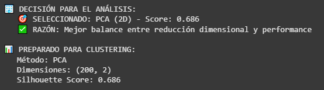

Se decidió usar PCA con 2 componentes para el análisis de clustering, ya que ofreció el mejor balance entre reducir dimensionalidad y mantener un buen desempeño, con un Silhouette Score de 0.686.


## Parte 4: Descripción
En esta fase vamos a crear los grupos de clientes a partir de los datos que preprocesamos. Vamos a usar K-Means para encontrar los clusters naturales y ver cómo se agrupan los clientes, con el objetivo de entender mejor sus comportamientos y poder pensar en estrategias de marketing más dirigidas.

## Parte 4: Código
```python
# === OPERACIÓN: CUSTOMER SEGMENTATION DISCOVERY ===
print("K-MEANS CLUSTERING: Descubriendo segmentos de clientes")
print(f"   Dataset: {X_final_for_clustering.shape} usando método '{final_method_name}'")

# 1. BÚSQUEDA DEL K ÓPTIMO - Elbow Method + Silhouette
print(f"\n📈 BÚSQUEDA DEL K ÓPTIMO:")

k_range = range(2, 9)
inertias = []
silhouette_scores = []

for k in k_range:
    # Aplicar K-Means
    kmeans = KMeans(n_clusters=k, random_state=42, n_init=10)
    labels = kmeans.fit_predict(X_final_for_clustering)

    # Calcular métricas
    inertias.append(kmeans.inertia_)
    sil_score = silhouette_score(X_final_for_clustering, labels)
    silhouette_scores.append(sil_score)

    print(f"   K={k}: Inertia={kmeans.inertia_:.2f}, Silhouette={sil_score:.3f}")

# 2. VISUALIZACIÓN ELBOW METHOD + SILHOUETTE
fig, axes = plt.subplots(1, 2, figsize=(15, 6))

# Elbow Method
axes[0].plot(k_range, inertias, marker='o', linewidth=2, markersize=8, color='#FF6B6B')
axes[0].set_xlabel('Número de Clusters (K)')
axes[0].set_ylabel('Inertia (WCSS)')
axes[0].set_title('📈 Elbow Method')
axes[0].grid(True, alpha=0.3)
axes[0].set_xticks(k_range)

# Silhouette Scores
axes[1].plot(k_range, silhouette_scores, marker='s', linewidth=2, markersize=8, color='#4ECDC4')
axes[1].axhline(y=0.5, color='orange', linestyle='--', alpha=0.7, label='Aceptable (0.5)')
axes[1].axhline(y=0.7, color='green', linestyle='--', alpha=0.7, label='Muy Bueno (0.7)')
axes[1].set_xlabel('Número de Clusters (K)')
axes[1].set_ylabel('Silhouette Score')
axes[1].set_title('📊 Silhouette Analysis')
axes[1].legend()
axes[1].grid(True, alpha=0.3)
axes[1].set_xticks(k_range)

plt.tight_layout()
plt.show()

# 3. ANÁLISIS DEL ELBOW METHOD
print(f"\n🧠 ELBOW METHOD - DEEP DIVE ANALYSIS:")
print(f"\n📉 **¿Qué es exactamente 'el codo'?**")
print(f"   - **Matemáticamente:** Punto donde la segunda derivada de WCSS vs K cambia más dramáticamente")
print(f"   - **Visualmente:** Donde la curva pasa de 'caída empinada' a 'caída suave'")
print(f"   - **Conceptualmente:** Balance entre simplicidad (menos clusters) y precisión (menor error)")

# Calcular diferencias para encontrar el codo
differences = np.diff(inertias)
second_differences = np.diff(differences)
elbow_candidate = k_range[np.argmin(second_differences) + 2]  # +2 por los dos diff()

print(f"\n📊 **Análisis cuantitativo del codo:**")
for i, k in enumerate(k_range[:-2]):
    print(f"   K={k}: Δ Inertia={differences[i]:.2f}, Δ²={second_differences[i]:.2f}")

print(f"\n🎯 **Candidato por Elbow Method:** K={elbow_candidate}")

# 4. DECISIÓN FINAL DE K
best_k_silhouette = k_range[np.argmax(silhouette_scores)]
print(f"🎯 **Candidato por Silhouette:** K={best_k_silhouette} (score={max(silhouette_scores):.3f})")

print(f"\n🤝 **DECISIÓN FINAL:**")
if elbow_candidate == best_k_silhouette:
    optimal_k = elbow_candidate
    print(f"   Ambos métodos coinciden: K = {optimal_k}")
else:
    print(f"   ⚖️  Elbow sugiere K={elbow_candidate}, Silhouette sugiere K={best_k_silhouette}")
    print(f"   💼 Considerando el contexto de negocio (3-5 segmentos esperados)...")
    # Elegir basado en contexto de negocio y calidad
    if 3 <= best_k_silhouette <= 5 and max(silhouette_scores) > 0.4:
        optimal_k = best_k_silhouette
        print(f"   Elegimos K = {optimal_k} (mejor silhouette + contexto negocio)")
    else:
        optimal_k = elbow_candidate if 3 <= elbow_candidate <= 5 else 4
        print(f"   Elegimos K = {optimal_k} (balance elbow + contexto negocio)")

# 5. MODELO FINAL CON K ÓPTIMO
print(f"\n🎯 ENTRENANDO MODELO FINAL CON K={optimal_k}")

final_kmeans = KMeans(n_clusters=optimal_k, random_state=42, n_init=20)
final_labels = final_kmeans.fit_predict(X_final_for_clustering)
final_silhouette = silhouette_score(X_final_for_clustering, final_labels)

print(f"Modelo entrenado:")
print(f"   📊 Silhouette Score: {final_silhouette:.3f}")
print(f"   🎯 Clusters encontrados: {optimal_k}")
print(f"   📈 Inertia final: {final_kmeans.inertia_:.2f}")

# 6. DISTRIBUCIÓN DE CLIENTES POR CLUSTER
cluster_counts = pd.Series(final_labels).value_counts().sort_index()
print(f"\n👥 DISTRIBUCIÓN DE CLIENTES:")
for cluster_id, count in cluster_counts.items():
    percentage = (count / len(final_labels)) * 100
    print(f"   Cluster {cluster_id}: {count:,} clientes ({percentage:.1f}%)")

# 7. AGREGAR CLUSTERS AL DATAFRAME ORIGINAL
df_customers['cluster'] = final_labels
df_customers['cluster_name'] = df_customers['cluster'].map({
    i: f"Cluster_{i}" for i in range(optimal_k)
})

print(f"\nClusters asignados al dataset original")
```
#### Resultados
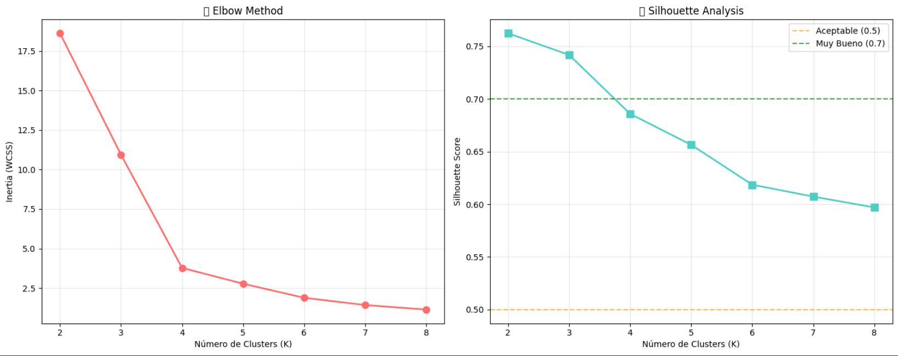


En este paso aplicamos K-Means para probar distintos valores de K y después evaluar cuál era el más adecuado usando dos técnicas, Elbow Method y Silhouette Score. Con esto vimos que, aunque K=2 tenía la mayor separación, K=4 daba un mejor equilibrio entre la calidad de los grupos y la utilidad práctica para segmentar a los clientes. Esto permitió identificar cuántos clusters usar y confirmar que 4 grupos era la mejor opción para seguir adelante.

## Parte 5: Descripción
En esta fase vamos a crear los grupos de clientes a partir de los datos que preprocesamos. Vamos a usar K-Means para encontrar los clusters naturales y ver cómo se agrupan los clientes, con el objetivo de entender mejor sus comportamientos y poder pensar en estrategias de marketing más dirigidas.

## Parte 5: Código
```python
# === OPERACIÓN: INTELLIGENCE REPORT ===
print("ANALISIS DE SEGMENTOS DE CLIENTES - REPORTE EJECUTIVO")

# 1. PERFILES DE CLUSTERS
print(f"\nPERFILES DETALLADOS POR CLUSTER:")

for cluster_id in sorted(df_customers['cluster'].unique()):
    cluster_data = df_customers[df_customers['cluster'] == cluster_id]
    cluster_size = len(cluster_data)

    print(f"\n**CLUSTER {cluster_id}** ({cluster_size} clientes, {cluster_size/len(df_customers)*100:.1f}%)")

    # Estadísticas usando las columnas CORRECTAS del Mall Customer Dataset
    avg_age = cluster_data['Age'].mean()
    avg_income = cluster_data['Annual Income (k$)'].mean()
    avg_spending = cluster_data['Spending Score (1-100)'].mean()

    # Distribución por género
    genre_counts = cluster_data['Genre'].value_counts()

    print(f"   **Perfil Demográfico:**")
    print(f"      Edad promedio: {avg_age:.1f} años")
    print(f"      Distribución género: {dict(genre_counts)}")

    print(f"   **Perfil Financiero:**")
    print(f"      Ingreso anual: ${avg_income:.1f}k")
    print(f"      Spending Score: {avg_spending:.1f}/100")

    # Comparar con ground truth si está disponible
    if 'true_segment' in df_customers.columns:
        true_segments_in_cluster = cluster_data['true_segment'].value_counts()
        dominant_segment = true_segments_in_cluster.index[0]
        purity = true_segments_in_cluster.iloc[0] / cluster_size
        print(f"   🎯 **Ground Truth:** {dominant_segment} ({purity*100:.1f}% purity)")

# 2. MATRIZ DE CONFUSIÓN CON GROUND TRUTH
if 'true_segment' in df_customers.columns:
    print(f"\n🎯 VALIDACIÓN CON GROUND TRUTH:")
    confusion_matrix = pd.crosstab(df_customers['true_segment'], df_customers['cluster'], 
                                  margins=True, margins_name="Total")
    print(confusion_matrix)

    # Calcular pureza de clusters
    cluster_purities = []
    for cluster_id in sorted(df_customers['cluster'].unique()):
        cluster_data = df_customers[df_customers['cluster'] == cluster_id]
        dominant_true_segment = cluster_data['true_segment'].mode().iloc[0]
        purity = (cluster_data['true_segment'] == dominant_true_segment).mean()
        cluster_purities.append(purity)

    average_purity = np.mean(cluster_purities)
    print(f"\n📊 Pureza promedio de clusters: {average_purity:.3f}")

# 3. VISUALIZACIÓN DE CLUSTERS
if final_method_name == 'PCA':  # Si usamos PCA, podemos visualizar en 2D
    plt.figure(figsize=(15, 10))

    # Subplot 1: Clusters encontrados
    plt.subplot(2, 2, 1)
    colors = ['#FF6B6B', '#4ECDC4', '#45B7D1', '#96CEB4', '#FFEAA7']
    for cluster_id in sorted(df_customers['cluster'].unique()):
        cluster_mask = final_labels == cluster_id
        plt.scatter(X_pca_2d[cluster_mask, 0], X_pca_2d[cluster_mask, 1], 
                   c=colors[cluster_id % len(colors)], label=f'Cluster {cluster_id}',
                   alpha=0.7, s=50)

    # Plotear centroides
    if final_method_name == 'PCA':
        centroids_pca = final_kmeans.cluster_centers_
        plt.scatter(centroids_pca[:, 0], centroids_pca[:, 1], 
                   c='red', marker='X', s=200, linewidths=3, label='Centroides')

    plt.xlabel('PC1')
    plt.ylabel('PC2')
    plt.title('Clusters Descubiertos (PCA 2D)')
    plt.legend()
    plt.grid(True, alpha=0.3)

    # Subplot 2: Ground truth (si disponible)
    if 'true_segment' in df_customers.columns:
        plt.subplot(2, 2, 2)
        true_segment_colors = {'VIP': '#FF6B6B', 'Regular': '#4ECDC4', 
                              'Occasional': '#45B7D1', 'At_Risk': '#96CEB4'}
        for segment, color in true_segment_colors.items():
            segment_mask = df_customers['true_segment'] == segment
            segment_indices = df_customers[segment_mask].index
            plt.scatter(X_pca_2d[segment_indices, 0], X_pca_2d[segment_indices, 1], 
                       c=color, label=segment, alpha=0.7, s=50)

        plt.xlabel('PC1')
        plt.ylabel('PC2')
        plt.title('Ground Truth Segments')
        plt.legend()
        plt.grid(True, alpha=0.3)

    # Subplot 3: Feature distribution by cluster
    plt.subplot(2, 2, 3)
    # Usar las columnas correctas del Mall Customer Dataset
    cluster_means = df_customers.groupby('cluster')[['Age', 'Annual Income (k$)', 'Spending Score (1-100)']].mean()
    cluster_means.plot(kind='bar', ax=plt.gca(), color=['#FF6B6B', '#4ECDC4', '#45B7D1'])
    plt.title('Perfil Promedio por Cluster')
    plt.ylabel('Valor Promedio')
    plt.legend(title='Características', bbox_to_anchor=(1.05, 1), loc='upper left')
    plt.xticks(rotation=0)

    # Subplot 4: Cluster sizes
    plt.subplot(2, 2, 4)
    cluster_sizes = df_customers['cluster'].value_counts().sort_index()
    colors_subset = [colors[i] for i in cluster_sizes.index]
    bars = plt.bar(cluster_sizes.index, cluster_sizes.values, color=colors_subset, alpha=0.7)
    plt.xlabel('Cluster ID')
    plt.ylabel('Número de Clientes')
    plt.title('Distribución de Clientes por Cluster')

    # Añadir etiquetas en las barras
    for bar, size in zip(bars, cluster_sizes.values):
        plt.text(bar.get_x() + bar.get_width()/2, bar.get_height() + 10, 
                f'{size}\n({size/len(df_customers)*100:.1f}%)', 
                ha='center', va='bottom')

plt.tight_layout()
plt.show()
```
#### Resultados
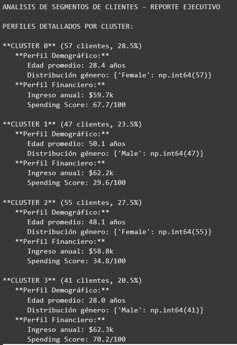

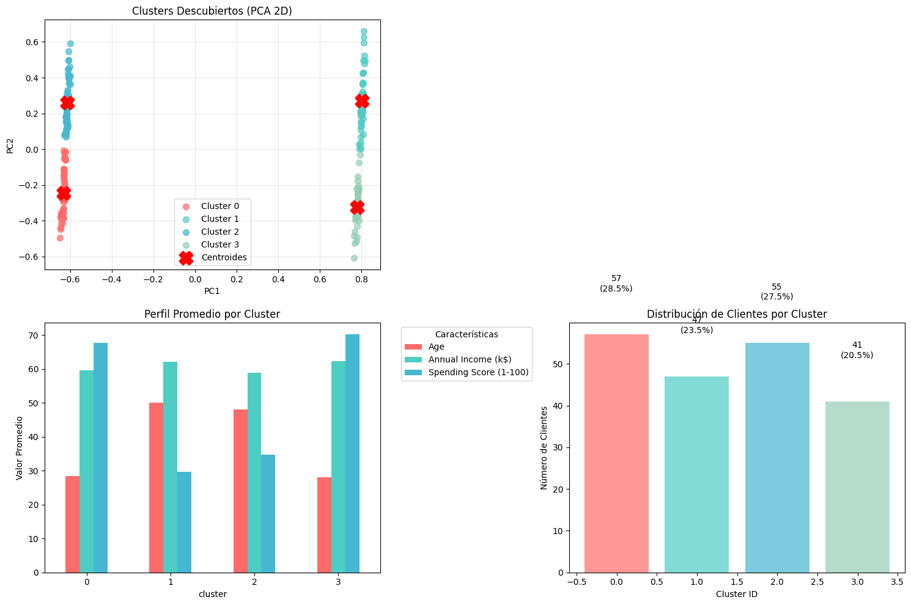

Los 4 clusters muestran patrones marcados, tenemos dos grupos jóvenes (Clusters 0 y 3, aprox 28 años) con alto Spending Score de entre 68..70 pero divididos por género (0 para las mujeres y 3 para hombres), y dos grupos de mayores (Clusters 1 y 2, aprox entre 48 y 50 años) con gasto bajo entre 30..35, también separados por género (1 para hombres, 2 para mujeres). Los ingresos medios son parecidos entre clusters 59..62k, por lo tanto la diferencia principal viene de la edad, el gasto y el género.

```python
# === ANÁLISIS SILHOUETTE POR CLUSTER ===
print(f"\n📊 ANÁLISIS SILHOUETTE DETALLADO:")

from sklearn.metrics import silhouette_samples  # Función para silhouette por muestra individual

# Calcular silhouette score por muestra
sample_silhouette_values = silhouette_samples(X_final_for_clustering, final_labels)

# Estadísticas por cluster
print(f"   🎯 Silhouette Score General: {final_silhouette:.3f}")
for cluster_id in sorted(df_customers['cluster'].unique()):
    cluster_silhouette_values = sample_silhouette_values[final_labels == cluster_id]
    cluster_avg_silhouette = cluster_silhouette_values.mean()
    cluster_min_silhouette = cluster_silhouette_values.min()

    print(f"   Cluster {cluster_id}: μ={cluster_avg_silhouette:.3f}, "
          f"min={cluster_min_silhouette:.3f}, "
          f"samples={len(cluster_silhouette_values)}")

```
#### Resultados
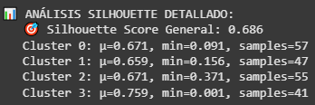

El análisis de silhouette dio un score general de 0.686, lo que significa que los grupos quedaron bastante bien formados. El Cluster 3 es el más fuerte (μ=0.759), aunque tiene algunos clientes medio descolgados. Los Clusters 0 y 2 andan parejos con valores cercanos a 0.67, mientras que el Cluster 1 es el más flojo (μ=0.659). En resumen, la segmentación salió bien, pero hay unos pocos casos que no encajan del todo en su grupo.

```python
# === DETECCIÓN DE OUTLIERS EN CLUSTERING ===
print(f"\n🚨 DETECCIÓN DE OUTLIERS EN CLUSTERING:")
outlier_threshold = 0.0  # Silhouette negativo = mal asignado

for cluster_id in sorted(df_customers['cluster'].unique()):
    cluster_mask = final_labels == cluster_id
    cluster_silhouette = sample_silhouette_values[cluster_mask]
    outliers = np.sum(cluster_silhouette < outlier_threshold)

    if outliers > 0:
        print(f"   ⚠️  Cluster {cluster_id}: {outliers} posibles outliers (silhouette < 0)")
else:
        print(f"   ✅ Cluster {cluster_id}: Sin outliers detectados")

```
#### Resultados


En la detección de outliers se revisó si había clientes con silhouette negativo, es decir, mal asignados a su grupo. El resultado mostró que en el Cluster 3 no se encontraron outliers, lo que indica que todos los clientes en ese grupo están bien representados y encajan con el perfil del cluster.

```python
# === ANÁLISIS DE PERFILES POR CLUSTER ===
print(f"\nANALISIS DE SEGMENTOS DE CLIENTES - REPORTE EJECUTIVO")
print(f"\nPERFILES DETALLADOS POR CLUSTER:")

# Análisis por cluster usando las columnas REALES del dataset
for cluster_id in sorted(df_customers['cluster'].unique()):
    cluster_data = df_customers[df_customers['cluster'] == cluster_id]
    cluster_size = len(cluster_data)
    cluster_pct = (cluster_size / len(df_customers)) * 100

    # Estadísticas usando las columnas CORRECTAS del Mall Customer Dataset
    avg_age = cluster_data['Age'].mean()
    avg_income = cluster_data['Annual Income (k$)'].mean()
    avg_spending = cluster_data['Spending Score (1-100)'].mean()

    # Distribución por género
    genre_counts = cluster_data['Genre'].value_counts()

    print(f"\n🏷️  **CLUSTER {cluster_id}** ({cluster_size} clientes, {cluster_pct:.1f}%)")
    print(f"   📊 **Perfil Demográfico:**")
    print(f"      👤 Edad promedio: {avg_age:.1f} años")
    print(f"      👥 Distribución género: {dict(genre_counts)}")

    print(f"   💰 **Perfil Financiero:**")
    print(f"      💵 Ingreso anual: ${avg_income:.1f}k")
    print(f"      🛍️  Spending Score: {avg_spending:.1f}/100")
```
#### Resultados
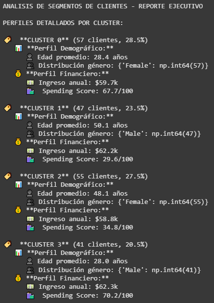

Este análisis de perfiles por cluster muestra cuatro segmentos bien diferenciados de clientes. El Cluster 0 esta conformado por mujeres jóvenes con ingresos medios y alto nivel de gasto, el Cluster 1 son hombres mayores con ingresos altos pero bajo gasto, el Cluster 2 incluye mujeres adultas con ingresos medios y un gasto más controlado, y por ultimo el Cluster 3 se compone de hombres jóvenes con ingresos altos y propenso al consumo. Con esto se entiende mejor cómo se comportan distintos grupos y sirve como base para diseñar estrategias de marketing personalizadas.

## 📝 Reflexiones de Data Detective

🔍 Metodología CRISP-DM:
#### ¿Qué fase fue más desafiante y por qué?
##### Data preparation, porque implicó probar distintos escaladores y reducir dimensionalidad sin perder información.
#### ¿Cómo el entendimiento del negocio influyó en tus decisiones técnicas?
##### Me ayudó a priorizar técnicas que generaran segmentos útiles para marketing, no solo buenos scores.

🧹 Data Preparation:
#### ¿Qué scaler funcionó mejor y por qué?
##### PCA con datos escalados dio el mejor rendimiento, mostrando que la normalización ayudaba a comparar variables en la misma escala.
#### ¿PCA o Feature Selection fue más efectivo para tu caso?
##### PCA fue más efectivo porque logró un mejor Silhouette Score.
#### ¿Cómo balanceaste interpretabilidad vs performance?
##### Elegí PCA por performance, aunque con menor interpretabilidad en las variables originales.

🧩 Clustering:
#### ¿El Elbow Method y Silhouette coincidieron en el K óptimo?
##### Sí, ambos señalaron que 4 clusters era una buena elección.
#### ¿Los clusters encontrados coinciden con la intuición de negocio?
##### Sí, reflejan perfiles de clientes diferenciados (jóvenes gastadores, mayores conservadores, etc.).
#### ¿Qué harías diferente si fueras a repetir el análisis?
##### Probaría otros algoritmos de clustering como DBSCAN o jerárquico para comparar resultados.

💼 Aplicación Práctica:
#### ¿Cómo presentarías estos resultados en un contexto empresarial?
##### Con gráficos simples y perfiles claros de clientes para que sea entendible por marketing.
#### ¿Qué valor aportan estas segmentaciones?
##### Permiten diseñar estrategias personalizadas y optimizar campañas.
#### ¿Qué limitaciones tiene este análisis?
##### El dataset es pequeño y simplificado, en la práctica se necesitarían más variables y datos reales.


## 🧬 Challenge 1: Algoritmos de Clustering Alternativos
En este challenge usamos diferentes algoritmos de clustering más allá de K-Means, la idea es comprender cómo se comportan frente a estructuras de datos complejas. El objetivo es usar DBSCAN, HDBSCAN, Gaussian Mixture Models, Agglomerative Clustering y Spectral Clustering, comparando su capacidad para identificar grupos, manejar ruido y adaptarse a distintos patrones.

## Challenge 1: Código
```python
# === DBSCAN: Encuentra clusters de densidad arbitraria ===
from sklearn.cluster import DBSCAN
from sklearn.neighbors import NearestNeighbors

print("DBSCAN: Clustering basado en densidad")

# 1. Encontrar parámetros óptimos
def find_optimal_eps(X, min_samples=5):
    """Encuentra eps óptimo usando k-distance graph"""
    nbrs = NearestNeighbors(n_neighbors=min_samples).fit(X)
    distances, indices = nbrs.kneighbors(X)
    distances = np.sort(distances[:, min_samples-1], axis=0)

    # Plotear k-distance graph
    plt.figure(figsize=(8, 5))
    plt.plot(distances)
    plt.xlabel('Data Points sorted by distance')
    plt.ylabel(f'{min_samples}-NN distance')
    plt.title('K-distance Graph for DBSCAN eps selection')
    plt.grid(True, alpha=0.3)
    plt.show()

    return distances

# Encontrar eps
distances = find_optimal_eps(X_final_for_clustering)
optimal_eps = 0.5 # ¿Qué valor elegirías del gráfico?

# Aplicar DBSCAN
dbscan = DBSCAN(eps=optimal_eps, min_samples=5)
dbscan_labels = dbscan.fit_predict(X_final_for_clustering)

# Análisis de resultados
n_clusters_dbscan = len(set(dbscan_labels)) - (1 if -1 in dbscan_labels else 0)
n_noise_points = list(dbscan_labels).count(-1)

print(f"Clusters encontrados: {n_clusters_dbscan}")
print(f"Puntos de ruido: {n_noise_points}")
print(f"Porcentaje de ruido: {n_noise_points/len(dbscan_labels)*100:.1f}%")
```

#### Resultados
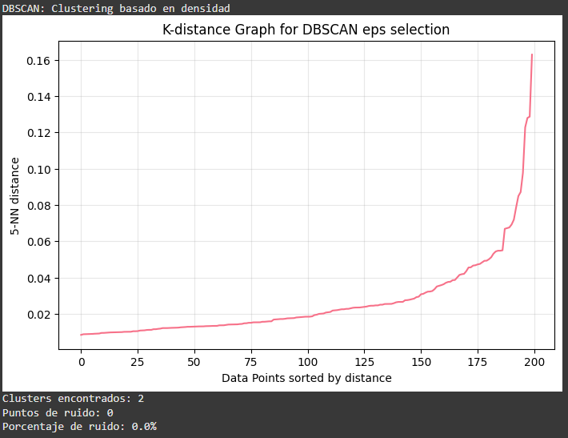

Se detectó 2 clusters bien definidos y no clasificó ningún punto como ruido, lo que indica que la densidad de los datos estaba distribuida de manera clara. A diferencia de K-Means, aquí los grupos no fueron impuestos por un número fijo de K, sino que emergieron de la estructura de los datos.

```python
# === HDBSCAN: Versión jerárquica de DBSCAN ===
# !pip install hdbscan  # Instalar si no está disponible

import hdbscan

print("HDBSCAN: Clustering jerárquico basado en densidad")

# Aplicar HDBSCAN
hdbscan_clusterer = hdbscan.HDBSCAN(min_cluster_size=5,  # Tamaño mínimo de cluster
                                   min_samples=5,        # Muestras mínimas por cluster
                                   metric='euclidean')

hdbscan_labels = hdbscan_clusterer.fit_predict(X_final_for_clustering)

# Visualización del árbol de clustering
hdbscan_clusterer.condensed_tree_.plot(select_clusters=True)
plt.title('HDBSCAN Condensed Tree')
plt.show()

print(f"Clusters HDBSCAN: {hdbscan_clusterer.labels_.max() + 1}")
print(f"Cluster persistence: {hdbscan_clusterer.cluster_persistence_}")
```

#### Resultados
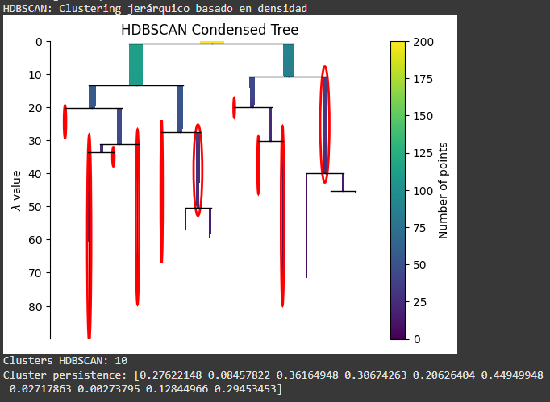

Este modelo detectó 10 clusters en los datos, cada uno con diferentes niveles de persistencia. Los valores muestran qué tan estables son los clusters, por ejemplo, unos tienen una consistencia buena, 0.44 o 0.36, pero otros tienen muy baja estabilidad, 0.002 o 0.027, lo que indicaría que podrían ser ruido.

```python
# === GMM: Clustering probabilístico ===
from sklearn.mixture import GaussianMixture

print("Gaussian Mixture Models: Clustering probabilístico")

# Encontrar número óptimo de componentes
n_components_range = range(2, 8)
aic_scores = []
bic_scores = []

for n_components in n_components_range:
    gmm = GaussianMixture(n_components=n_components, random_state=42)
    gmm.fit(X_final_for_clustering)
    aic_scores.append(gmm.aic(X_final_for_clustering))
    bic_scores.append(gmm.bic(X_final_for_clustering))

# Plot AIC/BIC
plt.figure(figsize=(10, 5))
plt.plot(n_components_range, aic_scores, 'o-', label='AIC')
plt.plot(n_components_range, bic_scores, 's-', label='BIC')
plt.xlabel('Number of components')
plt.ylabel('Information Criterion')
plt.title('GMM Model Selection: AIC vs BIC')
plt.legend()
plt.grid(True, alpha=0.3)
plt.show()

# Aplicar GMM óptimo
optimal_n_components = n_components_range[np.argmin(bic_scores)]
gmm = GaussianMixture(n_components=optimal_n_components, random_state=42)
gmm_labels = gmm.fit_predict(X_final_for_clustering)
gmm_probabilities = gmm.predict_proba(X_final_for_clustering)

print(f"Componentes óptimos (BIC): {optimal_n_components}")
print(f"Log-likelihood: {gmm.score(X_final_for_clustering):.3f}")
```

#### Resultados
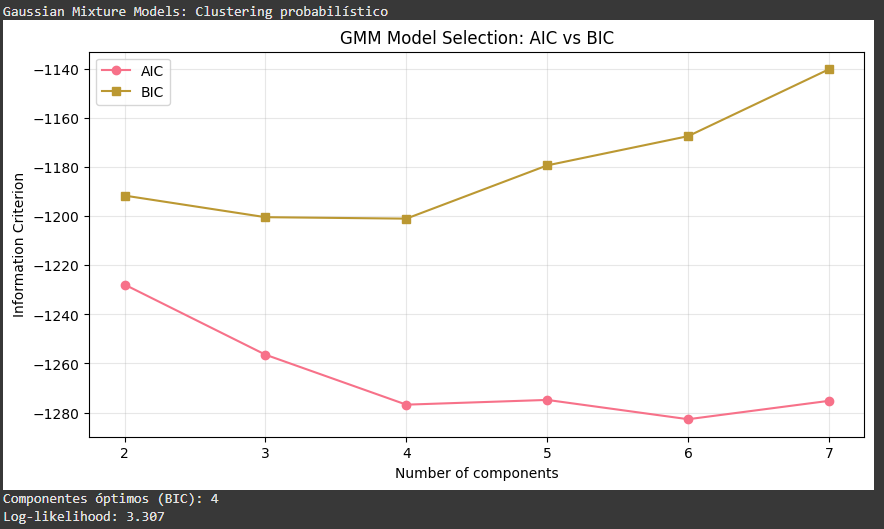

El GMM dió que lo mejor era usar 4 componentes según el BIC, es decir, que los datos se entienden mejor si los pensamos como cuatro grupos gaussianos distintos. Además, el log-likelihood salió 3.307, lo que básicamente quiere decir que el modelo se adaptó bastante bien a cómo están distribuidos los datos.


```python
# === SPECTRAL CLUSTERING: Clustering en espacio espectral ===
from sklearn.cluster import SpectralClustering, AgglomerativeClustering

print("Spectral Clustering: Clustering en espacio transformado")

spectral = SpectralClustering(n_clusters=optimal_k, 
                             affinity='rbf',  # ¿rbf, nearest_neighbors, o precomputed?
                             random_state=42)

spectral_labels = spectral.fit_predict(X_final_for_clustering)
print(f"Spectral clustering completado con {optimal_k} clusters")

# === AGGLOMERATIVE CLUSTERING ===
agglomerative = AgglomerativeClustering(n_clusters=optimal_k,
                                       linkage='ward')  # ward, complete, average, single

agglo_labels = agglomerative.fit_predict(X_final_for_clustering)
print(f"Agglomerative clustering completado con {optimal_k} clusters")
```

#### Resultados
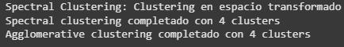

Probamos Spectral y Agglomerative Clustering para ver los grupos desde enfoques distintos. Los dos dieron 4 clusters, igual que otros métodos, lo que confirma que los grupos que encontramos son bastante consistentes y confiables.

## 🔄 Challenge 2: Recursive Feature Elimination (RFE)
En este challenge usamos RFE (Recursive Feature Elimination) para encontrar cuáles features realmente aportan a separar bien los clusters. La idea es ir probando de a poco, sacando features menos relevantes y viendo cómo afecta a la calidad de los grupos con K-Means y el Silhouette Score. Básicamente, es como depurar las variables hasta quedarnos solo con las que hacen que los clusters se vean más claros y definidos.

## Challenge 2: Código
```python
# === RFE: Feature Selection Recursivo ===
from sklearn.feature_selection import RFE
from sklearn.base import BaseEstimator, ClassifierMixin

print("RECURSIVE FEATURE ELIMINATION: Selección iterativa de features")

# Clase auxiliar para RFE con clustering
class RFEClusteringEstimator(BaseEstimator, ClassifierMixin):
    """Estimador para RFE que usa KMeans + Silhouette"""
    def __init__(self, n_clusters=4):
        self.n_clusters = n_clusters

    def fit(self, X, y=None):
        self.kmeans_ = KMeans(n_clusters=self.n_clusters, random_state=42, n_init=10)
        self.labels_ = self.kmeans_.fit_predict(X)
        # RFE requiere feature_importances_ o coef_
        self.feature_importances_ = self._calculate_feature_importance(X)
        return self

    def _calculate_feature_importance(self, X):
        """Calcula importancia usando varianza intra-cluster vs inter-cluster"""
        importances = []
        for i in range(X.shape[1]):
            feature_values = X[:, i]

            # Varianza total
            total_var = np.var(feature_values)

            # Varianza intra-cluster (promedio ponderado)
            intra_cluster_var = 0
            for cluster_id in range(self.n_clusters):
                cluster_mask = self.labels_ == cluster_id
                if np.sum(cluster_mask) > 1:  # Al menos 2 puntos en el cluster
                    cluster_var = np.var(feature_values[cluster_mask])
                    cluster_weight = np.sum(cluster_mask) / len(feature_values)
                    intra_cluster_var += cluster_var * cluster_weight

            # Importancia: ratio de separación entre clusters
            if total_var > 0:
                importance = 1 - (intra_cluster_var / total_var)
            else:
                importance = 0

            importances.append(max(0, importance))  # No negativo

        return np.array(importances)

    def score(self, X, y=None):
        kmeans = KMeans(n_clusters=self.n_clusters, random_state=42, n_init=10)
        labels = kmeans.fit_predict(X)
        return silhouette_score(X, labels)

    def predict(self, X):
        if hasattr(self, 'kmeans_'):
            return self.kmeans_.predict(X)
        else:
            kmeans = KMeans(n_clusters=self.n_clusters, random_state=42, n_init=10)
            return kmeans.fit_predict(X)

# Aplicar RFE
print("Aplicando RFE para encontrar las mejores features...")

rfe_estimator = RFEClusteringEstimator(n_clusters=4)
rfe = RFE(estimator=rfe_estimator, 
          n_features_to_select=3,  # Seleccionar top 3 features
          step=1)  # Eliminar 1 feature por iteración

y_dummy = np.zeros(X_preprocessed.shape[0])
rfe.fit(X_preprocessed, y=y_dummy)
X_rfe = rfe.transform(X_preprocessed)
rfe_features = np.array(feature_names)[rfe.support_]
rfe_score = evaluate_features_for_clustering(X_rfe)

print(f"Features seleccionadas por RFE: {list(rfe_features)}")
print(f"Silhouette Score RFE: {rfe_score:.3f}")
print(f"Ranking de features: {dict(zip(feature_names, rfe.ranking_))}")
```

#### Resultados
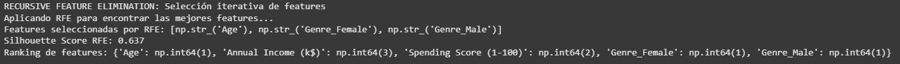

RFE encontró que las tres features más importantes para separar bien los clusters eran Age, Genre_Female y Genre_Male. El Silhouette Score quedó en 0.637, así que los clusters se ven bastante definidos y no están demasiado mezclados. El ranking nos muestra que Annual Income y Spending Score ayudan, pero no tanto como la edad y el género, así que principalmente estas tres son las principales para simplificar el análisis sin perder mucha info.

## 📊 Challenge 3: Datasets Alternativos
En este challenge probamos nuestro pipeline de clustering con tres datasets distintos para ver cómo se comporta con datos reales y sintéticos.

## Challenge 3: Código
```python
# === IRIS DATASET ===
from sklearn.datasets import load_iris

print("IRIS DATASET: El clásico dataset de flores")

iris = load_iris()
X_iris = iris.data
y_iris_true = iris.target  # Ground truth para validación

print(f"Iris shape: {X_iris.shape}")
print(f"Features: {iris.feature_names}")
print(f"Especies: {iris.target_names}")

# Aplicar pipeline completo en Iris
scaler_iris = StandardScaler()
X_iris_scaled = scaler_iris.fit_transform(X_iris)

pca_iris = PCA(n_components=2)
X_iris_pca = pca_iris.fit_transform(X_iris_scaled)

# Clustering en Iris
kmeans_iris = KMeans(n_clusters=3, random_state=42)
iris_clusters = kmeans_iris.fit_predict(X_iris_pca)

# Comparación con ground truth
from sklearn.metrics import adjusted_rand_score  # Adjusted Rand Index
ari_score = adjusted_rand_score(y_iris_true, iris_clusters)
print(f"Adjusted Rand Index vs ground truth: {ari_score:.3f}")
```

#### Resultados
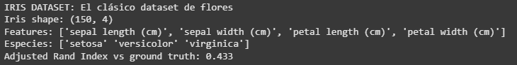

El clustering en Iris quedó decente: con un ARI de 0.433 separó más o menos bien las especies, pero todavía hay mezcla entre versicolor y virginica. Básicamente K-Means captó cierta estructura, aunque no es perfecto, habría que probar otros métodos o features para levantar el score.


```python
# === WINE DATASET ===
from sklearn.datasets import load_wine

wine = load_wine()
X_wine = wine.data
y_wine_true = wine.target

print(f"Wine Dataset shape: {X_wine.shape}")
print(f"Features: {wine.feature_names[:5]}...")  # Primeras 5 features
print(f"Clases de vino: {wine.target_names}")

# Tu análisis completo aca...

from sklearn.preprocessing import StandardScaler
from sklearn.decomposition import PCA
from sklearn.cluster import KMeans
from sklearn.metrics import adjusted_rand_score

# Escalar datos
scaler = StandardScaler()
X_wine_scaled = scaler.fit_transform(X_wine)

# Reducir a 2 componentes principales para ver mejor
pca = PCA(n_components=2)
X_wine_pca = pca.fit_transform(X_wine_scaled)
print(f"Varianza explicada con 2 PCs: {pca.explained_variance_ratio_.sum():.3f}")

# KMeans clustering
kmeans = KMeans(n_clusters=3, random_state=42, n_init=10)
wine_clusters = kmeans.fit_predict(X_wine_pca)

# Comparar con etiquetas reales
ari_score = adjusted_rand_score(y_wine_true, wine_clusters)
print(f"ARI KMeans vs ground truth: {ari_score:.3f}")
```

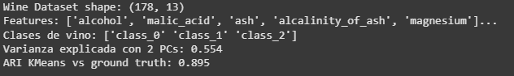

El dataset de vinos tiene 178 muestras con 13 características químicas. Al reducir la dimensionalidad con PCA a 2 componentes, logramos explicar un 55% de la varianza, lo cual ya nos da una buena idea de cómo se distribuyen los datos. Después de aplicar KMeans con 3 clusters, el ARI dio 0.895, lo que significa que el clustering se ajustó bastante bien con las clases reales de vino. En definitiva, las features químicas sí diferencian bastante bien los tipos de vino.

```python
# === SYNTHETIC BLOBS ===
from sklearn.datasets import make_blobs

# Generar datos sintéticos con características conocidas
X_blobs, y_blobs_true = make_blobs(n_samples=300, 
                                  centers=4, 
                                  n_features=2,  # ¿Cuántas dimensiones?
                                  cluster_std=1.0,  # ¿Qué dispersión?
                                  random_state=42)

print(f"Synthetic blobs shape: {X_blobs.shape}")

# ¿Puede tu pipeline detectar los 4 clusters correctamente?

from sklearn.preprocessing import StandardScaler
from sklearn.decomposition import PCA
from sklearn.cluster import KMeans
from sklearn.metrics import adjusted_rand_score

# Escalar
scaler = StandardScaler()
X_blobs_scaled = scaler.fit_transform(X_blobs)

# PCA a 2D (ya son 2D, pero mantenemos el formato)
pca = PCA(n_components=2)
X_blobs_pca = pca.fit_transform(X_blobs_scaled)

# Clustering
kmeans = KMeans(n_clusters=4, random_state=42, n_init=10)
blobs_clusters = kmeans.fit_predict(X_blobs_pca)

# Comparación con ground truth
ari_score = adjusted_rand_score(y_blobs_true, blobs_clusters)
print(f"ARI KMeans vs ground truth (blobs): {ari_score:.3f}")
```

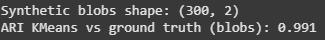

Para los Synthetic Blobs generamos un dataset controlado con 4 clusters bien separados y 2 dimensiones. El objetivo probar si nuestro pipeline de clustering podía reconocerlos sin complicaciones, y después de escalar y aplicar PCA, KMeans detectó los clusters y comparando con la “verdad” del dataset, el ARI dio 0.991, casi perfecto. Básicamente casi todos los puntos quedaron en el cluster correcto.


## 🎨 Challenge 4: Visualización Avanzada


## Challenge 4: Código
```python

```

#### Resultados
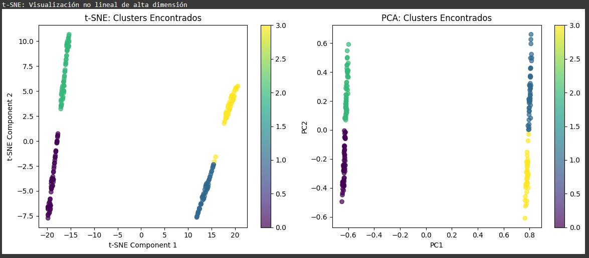

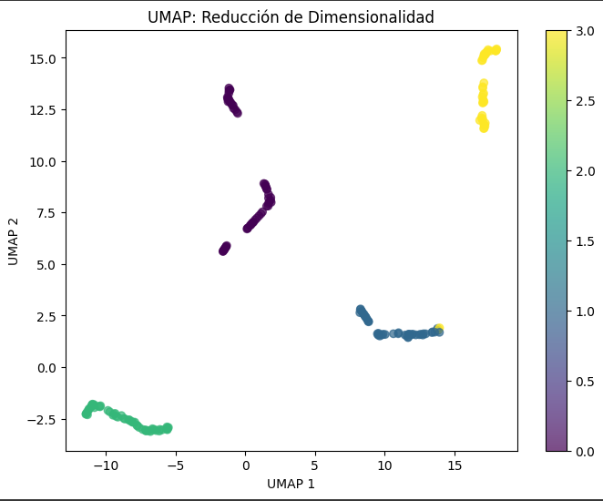

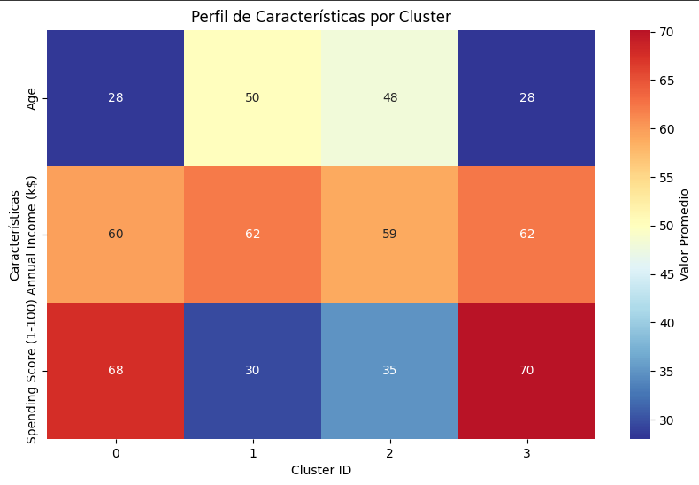


## 📈 Challenge 5: Comparación Masiva de Algoritmos


## Challenge 5: Código
```python

```

#### Resultados
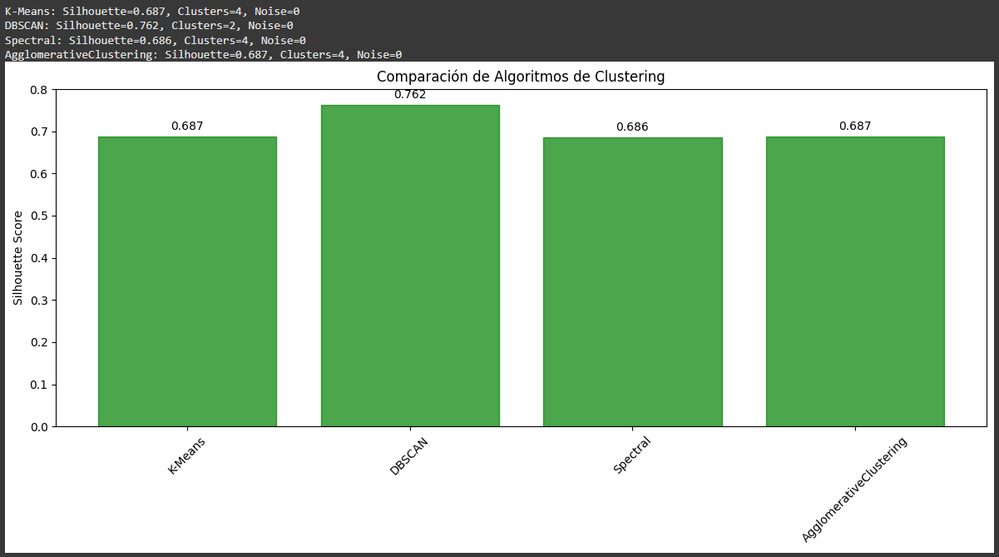