# Práctica 7

## Contexto
En esta práctica número 7 del curso, empezamos con los principios de Deep Learning.

## Objetivos
- Descubrir las limitaciones del perceptrón simple (problema XOR).
- Resolver problemas reales con redes multicapa (sklearn MLP).
- Implementar redes neuronales profesionales (TensorFlow/PyTorch Lightning).
- Entender cuándo usar cada herramienta.

## Actividades (con tiempos estimados)
- Parte 1 (60min)
- Parte 2 (45min)
- Actividad 2 (45min)

## Desarrollo


## Evidencias
- Se adjunta imagen "resultado-t7-parte1.1.png" en `docs/assets/`
- Se adjunta imagen "resultado-t7-parte1.2.png" en `docs/assets/`
- Se adjunta imagen "resultado-t7-parte1.3.png" en `docs/assets/`
- Se adjunta imagen "resultado-t7-parte1.4.png" en `docs/assets/`
- Se adjunta imagen "resultado-t7-parte1.5.png" en `docs/assets/`
- Se adjunta imagen "resultado-t7-parte2.1.png" en `docs/assets/`
- Se adjunta imagen "resultado-t7-parte2.2.png" en `docs/assets/`
- Se adjunta imagen "resultado-t7-parte2.3.png" en `docs/assets/`
- Se adjunta imagen "resultado-t7-parte2.4.png" en `docs/assets/`
- Se adjunta imagen "resultado-t7-act2.1.png" en `docs/assets/`
- Se adjunta imagen "resultado-t7-act2.2.png" en `docs/assets/`

## Reflexión

---

# Deep Learning: Redes Neuronales

## Setup inicial: Código

```python
import numpy as np
import matplotlib.pyplot as plt

# Función perceptrón básica
def perceptron(x1, x2, w1, w2, bias):
    return 1 if (w1*x1 + w2*x2 + bias) >= 0 else 0

# Función para visualizar el perceptrón
def graficar_perceptron(w1, w2, bias, datos, resultados_esperados, titulo):
    plt.figure(figsize=(8, 6))

    # Graficar puntos
    for i, (x1, x2) in enumerate(datos):
        color = 'red' if resultados_esperados[i] == 0 else 'blue'
        marker = 'o' if resultados_esperados[i] == 0 else 's'
        plt.scatter(x1, x2, c=color, s=200, marker=marker, 
                   edgecolor='black', linewidth=2)
        plt.text(x1+0.05, x2+0.05, f'({x1},{x2})', fontsize=12)

    # Graficar línea de separación: w1*x1 + w2*x2 + bias = 0
    if w2 != 0:  # Para evitar división por cero
        x_line = np.linspace(-0.5, 1.5, 100)
        y_line = -(w1*x_line + bias) / w2
        plt.plot(x_line, y_line, 'green', linewidth=3, alpha=0.8, 
                label=f'Línea: {w1:.1f}x₁ + {w2:.1f}x₂ + {bias:.1f} = 0')

    plt.xlim(-0.3, 1.3)
    plt.ylim(-0.3, 1.3)
    plt.xlabel('x1', fontsize=14)
    plt.ylabel('x2', fontsize=14)
    plt.title(titulo, fontsize=16)
    plt.legend()
    plt.grid(True, alpha=0.3)
    plt.show()

    print(f"🔍 Interpretación: Los puntos ROJOS (○) son clase 0, los AZULES (■) son clase 1")
    print(f"   La línea VERDE separa las clases. ¿Lo logra perfectamente?")
    print(f"💡 Recordá: Un perceptrón es la ecuación de una línea: y = w₁x₁ + w₂x₂ + b")

# Datos para lógica booleana
datos = np.array([[0,0], [0,1], [1,0], [1,1]])
print("🧠 Vamos a entrenar un perceptrón para lógica booleana")
print("   (¡Y ver cómo funciona visualmente!)")
```

En este setup inicial, definimos una función de perceptrón simple y una función para graficar los resultados. También preparamos los datos de entrada para las operaciones lógicas AND, OR y XOR.

## Parte 1: Descripción
En esta primer parte de la práctica, resolveremos los argoritmos de lógica booleana AND, OR y XOR usando un perceptrón simple, para ellos usaremos la función "perceptron" y "graficar_perceptron" definidas en el setup inicial.
Modificaremos los pesos y bias para cada caso.

## Parte 1: Código

```python
# === LÓGICA AND ===
print("\n1️⃣ PROBLEMA AND: Solo verdadero cuando AMBAS entradas son 1")
print("x1 | x2 | AND esperado")
print(" 0 |  0 |      0")
print(" 0 |  1 |      0")
print(" 1 |  0 |      0") 
print(" 1 |  1 |      1")  # estudiantes completan

# Encontremos pesos que funcionen para AND
w1, w2, bias = 0.5, 0.5, 0.7  # pesos iguales, ¿qué bias?

print(f"\nProbando AND con pesos: w1={w1}, w2={w2}, bias={bias}")
resultados_and = [0, 0, 0, 1]

for i, (x1, x2) in enumerate(datos):
    prediccion = perceptron(x1, x2, w1, w2, bias)
    esperado = resultados_and[i]
    ok = "✅" if prediccion == esperado else "❌"
    print(f"  {x1},{x2} → {prediccion} (esperado {esperado}) {ok}")

# 📊 VISUALIZACIÓN AND
graficar_perceptron(w1, w2, bias, datos, resultados_and, "Perceptrón AND")
```
#### Resultados: solución AND
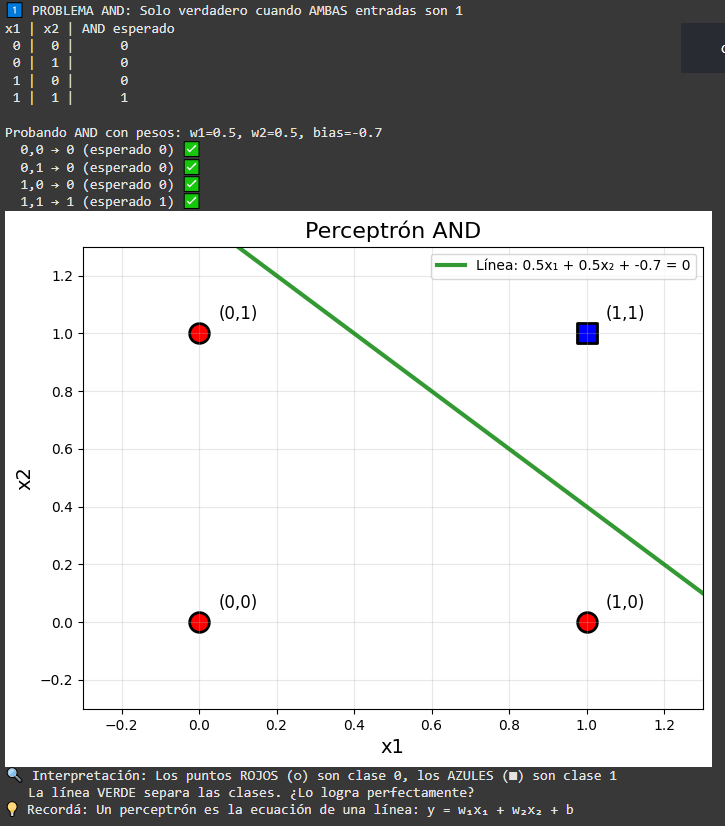

Con estos pesos y bias, el perceptrón resolvió el AND sin falla.
La línea verde quedó perfecta, solo deja pasar al combo (1,1), también todos los demás casos quedaron del lado rojo.
En definitiva, ajustamos bien el bias y ahora el perceptrón aprendió a decidir que el resultado es un 1 solo si tenes las dos entradas encendidas.

```python
# === LÓGICA OR ===
print("\n2️⃣ PROBLEMA OR: Verdadero cuando AL MENOS UNA entrada es 1")
print("x1 | x2 | OR esperado")
print(" 0 |  0 |      0")
print(" 0 |  1 |      1")
print(" 1 |  0 |      1")
print(" 1 |  1 |      1")

# Para OR necesitamos ser más permisivos
w1, w2, bias = 0.5, 0.5, -0.2  # ¿qué bias permite que una sola entrada active?

print(f"\nProbando OR con pesos: w1={w1}, w2={w2}, bias={bias}")
resultados_or = [0, 1, 1, 1]

for i, (x1, x2) in enumerate(datos):
    prediccion = perceptron(x1, x2, w1, w2, bias)
    esperado = resultados_or[i]
    ok = "✅" if prediccion == esperado else "❌"
    print(f"  {x1},{x2} → {prediccion} (esperado {esperado}) {ok}")

# 📊 VISUALIZACIÓN OR
graficar_perceptron(w1, w2, bias, datos, resultados_or, "Perceptrón OR")
```
#### Resultados: solución OR
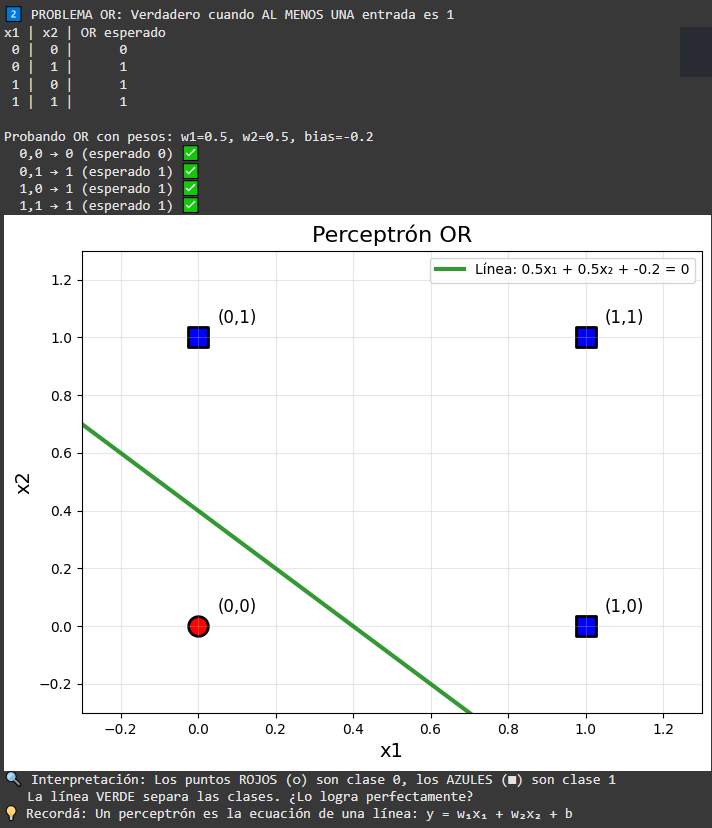

El perceptrón con esos pesos y bias resolvió el OR perfecto, solo (0,0) quedó en 0 y cualquier otra entrada encendió la salida en 1.

```python
# === LÓGICA NOT (1 entrada) ===
print("\n3️⃣ PROBLEMA NOT: Inversor simple")
datos_not = np.array([[0], [1]])
print("x | NOT esperado")
print("0 |      1")
print("1 |      0")

# Para NOT: cuando x=0 → salida=1, cuando x=1 → salida=0
w1, bias = -1, 0.5  # peso negativo + bias positivo

print(f"\nProbando NOT con peso: w1={w1}, bias={bias}")
resultados_not = [1, 0]

for i, x in enumerate([0, 1]):
    prediccion = 1 if (w1*x + bias) >= 0 else 0
    esperado = resultados_not[i]
    ok = "✅" if prediccion == esperado else "❌"
    print(f"  {x} → {prediccion} (esperado {esperado}) {ok}")

print("🎉 ¡NOT también funciona! El perceptrón es genial...")

# 📊 VISUALIZACIÓN NOT (1D)
def graficar_not(w1, bias):
    plt.figure(figsize=(8, 4))

    # Puntos NOT
    puntos_x = [0, 1]
    puntos_y = [1, 0]  # NOT: 0→1, 1→0
    colores = ['blue', 'red']  # 1→azul, 0→rojo

    plt.scatter(puntos_x, [0, 0], c=colores, s=300, edgecolor='black', linewidth=2)
    for i, (x, y) in enumerate(zip(puntos_x, puntos_y)):
        plt.text(x, 0.05, f'x={x}\nNOT={y}', ha='center', fontsize=12)

    # Línea de decisión: w1*x + bias = 0 → x = -bias/w1
    umbral = -bias/w1 if w1 != 0 else 0
    plt.axvline(x=umbral, color='green', linewidth=3, alpha=0.8,
               label=f'Umbral: x = {umbral:.2f}')
    plt.text(umbral+0.1, 0.15, f'Línea de\nseparación', fontsize=10)

    plt.xlim(-0.5, 1.5)
    plt.ylim(-0.1, 0.2)
    plt.xlabel('Entrada x', fontsize=14)
    plt.title(f'Perceptrón NOT: {w1:.1f}x + {bias:.1f} = 0', fontsize=16)
    plt.legend()
    plt.grid(True, alpha=0.3)
    plt.show()

    print(f"🔍 El umbral está en x = {umbral:.2f}")
    print(f"   Si x < {umbral:.2f} → salida 1 (azul)")
    print(f"   Si x > {umbral:.2f} → salida 0 (rojo)")

graficar_not(w1, bias)
```
#### Resultados: solución NOT
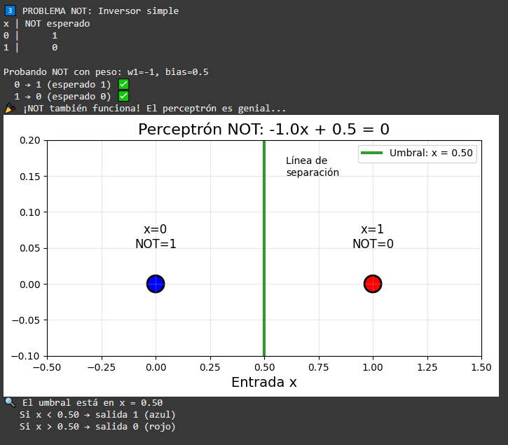

El perceptrón con w1=-1 y bias=0.5 resolvió el NOT sin errores, a la entrada 0 le devuelve 1 y a la entrada 1 le devuelve 0.
La línea de corte queda en x=0.5, así que todo lo menor a ese valor se prende en azul (1) y lo mayor se apaga en rojo (0).
En otras palabras, aprendió a ser un inversor, es decir, si entra apagado, sale encendido y si entra encendido, se apaga.

```python
# === EL PROBLEMA XOR ===
print("\n4️⃣ PROBLEMA XOR: Verdadero solo cuando las entradas son DIFERENTES")
print("x1 | x2 | XOR esperado")
print(" 0 |  0 |      0")
print(" 0 |  1 |      1")
print(" 1 |  0 |      1")
print(" 1 |  1 |      0")

resultados_xor = [0, 1, 1, 0]

# Intentemos varios pesos para XOR
print("\n🤔 Intentemos resolver XOR...")
intentos = [
    (1, 1, -0.5),   # Similar a AND
    (1, 1, -1.5),   # AND más estricto
    (0.5, 0.5, -0.1),  # Similar a OR
    (1, -1, 0.5),   # Pesos diferentes
]

mejor_intento = 0
mejor_aciertos = 0

for j, (w1, w2, bias) in enumerate(intentos):
    print(f"\n  Intento {j+1}: w1={w1}, w2={w2}, bias={bias}")
    aciertos = 0
    for i, (x1, x2) in enumerate(datos):
        prediccion = perceptron(x1, x2, w1, w2, bias)
        esperado = resultados_xor[i]
        if prediccion == esperado:
            aciertos += 1
        ok = "✅" if prediccion == esperado else "❌"
        print(f"    {x1},{x2} → {prediccion} (esperado {esperado}) {ok}")

    print(f"    Aciertos: {aciertos}/4 ({aciertos/4:.0%})")
    if aciertos > mejor_aciertos:
        mejor_aciertos = aciertos
        mejor_intento = j+1

print(f"\n💥 RESULTADO: ¡Ningún perceptrón simple puede resolver XOR!")
print(f"   Mejor intento: {mejor_aciertos}/4 = {mejor_aciertos/4:.0%}")
print(f"   🤯 ¡Necesitamos algo más poderoso!")

# 📊 VISUALIZACIÓN XOR - ¡El Problema!
def graficar_xor_imposible():
    fig, axes = plt.subplots(2, 2, figsize=(12, 10))
    fig.suptitle('XOR: ¡IMPOSIBLE con una línea recta!', fontsize=20)

    resultados_xor = [0, 1, 1, 0]
    intentos = [
        (1, 1, -0.5, "Intento 1: Similar a AND"),
        (1, 1, -1.5, "Intento 2: AND estricto"),
        (0.5, 0.5, -0.1, "Intento 3: Similar a OR"),
        (1, -1, 0.5, "Intento 4: Pesos diferentes")
    ]

    for idx, (w1, w2, bias, titulo) in enumerate(intentos):
        ax = axes[idx//2, idx%2]

        # Puntos XOR
        for i, (x1, x2) in enumerate(datos):
            color = 'red' if resultados_xor[i] == 0 else 'blue'
            marker = 'o' if resultados_xor[i] == 0 else 's'
            ax.scatter(x1, x2, c=color, s=200, marker=marker,
                      edgecolor='black', linewidth=2)

        # Línea de separación
        if w2 != 0:
            x_line = np.linspace(-0.5, 1.5, 100)
            y_line = -(w1*x_line + bias) / w2
            ax.plot(x_line, y_line, 'green', linewidth=3, alpha=0.8)

        # Verificar predicciones
        aciertos = 0
        for i, (x1, x2) in enumerate(datos):
            pred = perceptron(x1, x2, w1, w2, bias)
            if pred == resultados_xor[i]:
                aciertos += 1

        ax.set_xlim(-0.3, 1.3)
        ax.set_ylim(-0.3, 1.3)
        ax.set_title(f'{titulo}\nAciertos: {aciertos}/4')
        ax.grid(True, alpha=0.3)

    plt.tight_layout()
    plt.show()

    print("🔍 ANÁLISIS VISUAL:")
    print("   🔵■ Puntos azules (cuadrados) deben estar de UN lado de la línea")
    print("   🔴○ Puntos rojos (círculos) deben estar del OTRO lado")
    print("   💥 ¡Es IMPOSIBLE dibujar una línea recta que los separe perfectamente!")
    print("   🧠 Por eso necesitamos REDES MULTICAPA (más de una línea)")

graficar_xor_imposible()
```
#### Resultados: solución XOR
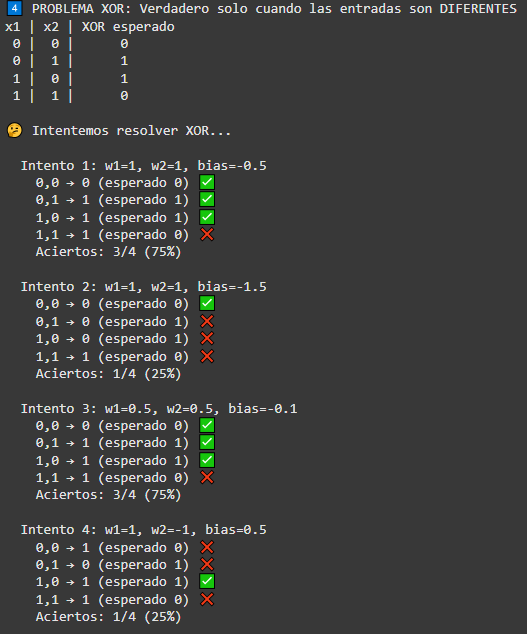

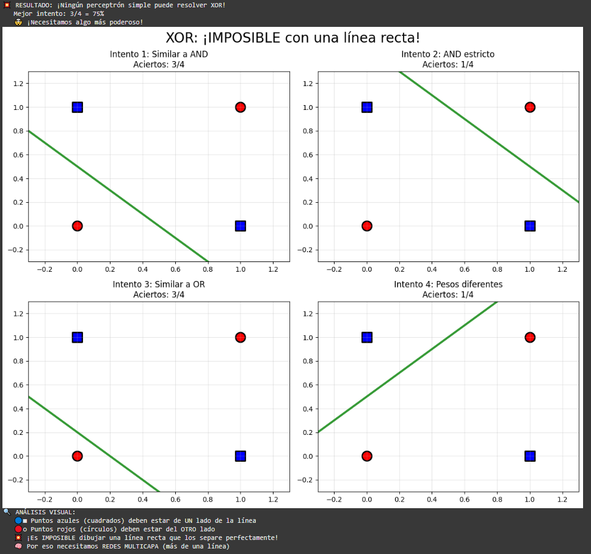

En el caso de XOR se observa que por más que cambiemos pesos y bias, el perceptrón simple nunca acierta totalmente, como mucho llega a 3 aciertos de 4.
El problema es que los puntos azules y rojos están mezclados en diagonal, y con una sola línea recta no se pueden separar perfecto.
En conclusión, el XOR se hace imposible a un perceptrón, y ahí es donde entran las redes multicapa, que combinan varias líneas y logran dibujar fronteras más complejas.

## Parte 2: Descripción
En esta parte vamos a pasar de los perceptrones simples a redes neuronales multicapa (MLP) para resolver problemas que antes eran imposibles, como XOR. Se mostrará cómo crear la red, entrenarla y verificar que aprende correctamente, y también cómo visualizar su arquitectura y conexiones.

## Parte 2: Código

```python
# === SETUP COMPLETO ===
from sklearn.neural_network import MLPClassifier

# Primero: resolver XOR que era imposible con perceptrón
X_xor = np.array([[0,0], [0,1], [1,0], [1,1]])
y_xor = np.array([0, 1, 1, 0])


hidden_sizes = (6,) # ¿cuántas neuronas ocultas?
# Crear MLP
mlp_xor = MLPClassifier(
    hidden_layer_sizes=hidden_sizes,
    activation='relu',           # relu, logistic, tanh
    solver='adam',
    random_state=42,
    max_iter=2000
)

# Entrenar y evaluar
mlp_xor.fit(X_xor, y_xor)
y_pred_xor = mlp_xor.predict(X_xor)

print("🎯 MLP resuelve XOR:")
print("x1 | x2 | esperado | predicción | ✓")
for i in range(len(X_xor)):
    ok = "✓" if y_pred_xor[i] == y_xor[i] else "✗"
    print(f" {X_xor[i][0]} |  {X_xor[i][1]} |    {y_xor[i]}     |     {y_pred_xor[i]}      | {ok}")

print(f"Accuracy: {(y_pred_xor == y_xor).mean():.1%}")
print("💡 ¡La red multicapa SÍ puede resolver XOR!")
```
#### Resultados: solución MLP XOR
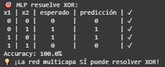

La MLP consigió resolver el XOR, todas las predicciones coinciden con lo esperado, 100% de aciertos. Esto muestra que, a diferencia del perceptrón simple, una red multicapa puede manejar resultados no lineales, combinando varias neuronas ocultas.

```python
# === VISUALIZACIÓN DE LA ARQUITECTURA ===
import matplotlib.patches as patches
from matplotlib.patches import FancyBboxPatch, ConnectionPatch

def dibujar_red_neuronal(input_size, hidden_sizes, output_size, title="Red Neuronal MLP"):
    """
    Dibuja la arquitectura de una red neuronal multicapa
    """
    fig, ax = plt.subplots(1, 1, figsize=(14, 8))

    # Configurar capas
    capas = [input_size] + list(hidden_sizes) + [output_size]
    nombres_capas = ['Entrada'] + [f'Oculta {i+1}' for i in range(len(hidden_sizes))] + ['Salida']
    colores_capas = ['lightblue', 'lightgreen', 'lightcoral', 'lightyellow']

    # Espaciado
    x_positions = np.linspace(0, 10, len(capas))
    max_neurons = max(capas)

    # Dibujar neuronas por capa
    neuronas_pos = []
    for i, (x_pos, num_neurons, nombre, color) in enumerate(zip(x_positions, capas, nombres_capas, colores_capas)):
        y_positions = np.linspace(1, 7, num_neurons)
        capa_pos = []

        for j, y_pos in enumerate(y_positions):
            # Dibujar neurona
            circle = plt.Circle((x_pos, y_pos), 0.3, color=color,
                              edgecolor='black', linewidth=2, zorder=3)
            ax.add_patch(circle)

            # Etiquetas para entrada y salida
            if i == 0:  # Capa de entrada
                ax.text(x_pos-0.8, y_pos, f'x{j+1}' if j < 2 else f'x{j+1}',
                       fontsize=12, ha='center', va='center', weight='bold')
            elif i == len(capas)-1:  # Capa de salida
                ax.text(x_pos+0.8, y_pos, 'XOR', fontsize=12, ha='center', va='center', weight='bold')

            capa_pos.append((x_pos, y_pos))

        # Título de la capa
        ax.text(x_pos, 8, nombre, fontsize=14, ha='center', va='center',
               weight='bold', bbox=dict(boxstyle="round,pad=0.3", facecolor=color, alpha=0.7))

        neuronas_pos.append(capa_pos)

    # Dibujar conexiones entre capas
    for i in range(len(neuronas_pos)-1):
        for pos1 in neuronas_pos[i]:
            for pos2 in neuronas_pos[i+1]:
                ax.plot([pos1[0], pos2[0]], [pos1[1], pos2[1]],
                       'gray', alpha=0.3, linewidth=1, zorder=1)

    # Agregar información sobre pesos
    ax.text(5, 0.2, '💡 Cada línea = conexión con peso ajustable',
           fontsize=12, ha='center', style='italic',
           bbox=dict(boxstyle="round,pad=0.3", facecolor='lightyellow', alpha=0.8))

    ax.set_xlim(-1.5, 11.5)
    ax.set_ylim(-0.5, 9)
    ax.set_title(title, fontsize=16, weight='bold', pad=20)
    ax.axis('off')

    plt.tight_layout()
    plt.show()

    # Información adicional
    total_params = 0
    for i in range(len(capas)-1):
        params_capa = (capas[i] + 1) * capas[i+1]  # +1 por bias
        total_params += params_capa
        print(f"📊 Capa {i+1}: {capas[i]} → {capas[i+1]} = {params_capa:,} parámetros")

    print(f"🎯 Total de parámetros: {total_params:,}")
    print(f"🧠 ¿Por qué tantos parámetros? Cada conexión tiene un peso + bias por neurona")

# Visualizar la red MLP para XOR (asumiendo hidden_layer_sizes=(4,))
print("🎨 Visualizando arquitectura MLP para XOR:")
dibujar_red_neuronal(input_size=2, hidden_sizes=hidden_sizes, output_size=1,
                    title="MLP para XOR: 2 → 4 → 1")
```
#### Resultados: solución

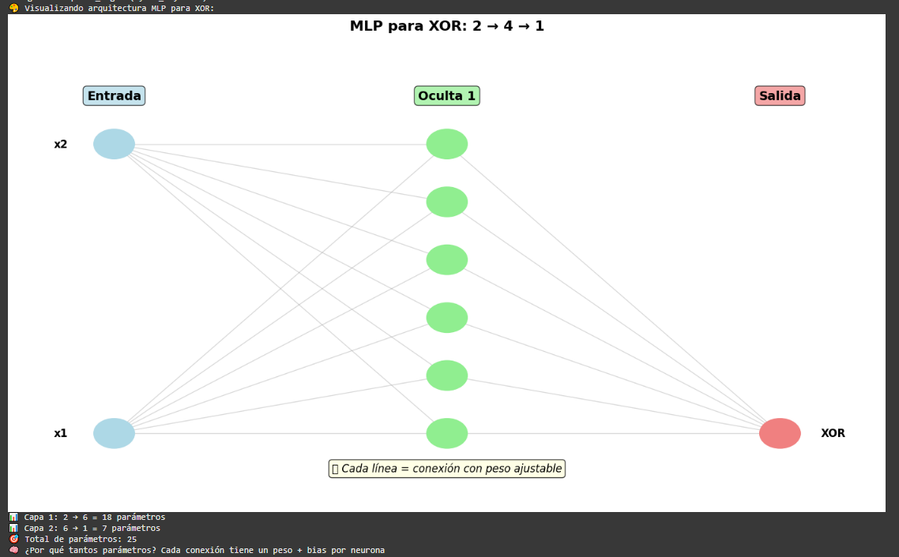

La visualización muestra que la red tiene 2 entradas, 1 capa oculta con 6 neuronas y 1 salida, y que cada línea tiene un peso que la red puede ajustar.
Por eso tenemos 25 parámetros en total, cada neurona de la capa oculta tiene su propio peso por entrada + bias, y la neurona de salida también suma sus pesos y bias. La red aprende muchas conexiones internas que juntas permiten resolver el XOR, algo imposible con un solo perceptrón.

```python
# === SUPERFICIE DE DECISIÓN MLP vs PERCEPTRÓN ===
def comparar_superficies_decision(mlp_xor):
    """
    Compara cómo separa datos un perceptrón vs MLP
    """
    fig, axes = plt.subplots(1, 2, figsize=(15, 6))

    # Crear grid para superficie de decisión
    h = 0.01  # resolución del grid
    x_min, x_max = -0.5, 1.5
    y_min, y_max = -0.5, 1.5
    xx, yy = np.meshgrid(np.arange(x_min, x_max, h),
                         np.arange(y_min, y_max, h))

    # === Subplot 1: Perceptrón (línea recta) ===
    ax1 = axes[0]

    # Intentar perceptrón para XOR (sabemos que fallará)
    def perceptron_xor(x1, x2):
        w1, w2, bias = 1, 1, -1.5  # Mejor intento
        return 1 if (w1*x1 + w2*x2 + bias) >= 0 else 0

    # Aplicar perceptrón al grid
    Z_perceptron = np.array([perceptron_xor(x1, x2) for x1, x2 in
                            zip(xx.ravel(), yy.ravel())])
    Z_perceptron = Z_perceptron.reshape(xx.shape)

    # Graficar superficie de decisión
    ax1.contourf(xx, yy, Z_perceptron, levels=1, alpha=0.8,
                colors=['lightcoral', 'lightblue'])

    # Puntos XOR
    colores_xor = ['red', 'blue', 'blue', 'red']
    marcadores_xor = ['o', 's', 's', 'o']
    for i, (x1, x2) in enumerate(X_xor):
        ax1.scatter(x1, x2, c=colores_xor[i], s=200, marker=marcadores_xor[i],
                   edgecolor='black', linewidth=3, zorder=5)
        ax1.text(x1+0.05, x2+0.05, f'({x1},{x2})', fontsize=10, weight='bold')

    ax1.set_title('Perceptrón: Línea Recta\n❌ No puede separar XOR',
                 fontsize=14, weight='bold')
    ax1.set_xlabel('x1')
    ax1.set_ylabel('x2')
    ax1.grid(True, alpha=0.3)

    # === Subplot 2: MLP (superficie curva) ===
    ax2 = axes[1]

    # Aplicar MLP al grid
    grid_points = np.c_[xx.ravel(), yy.ravel()]
    Z_mlp = mlp_xor.predict(grid_points)
    Z_mlp = Z_mlp.reshape(xx.shape)

    # Graficar superficie de decisión
    ax2.contourf(xx, yy, Z_mlp, levels=1, alpha=0.8,
                colors=['lightcoral', 'lightblue'])

    # Puntos XOR
    for i, (x1, x2) in enumerate(X_xor):
        ax2.scatter(x1, x2, c=colores_xor[i], s=200, marker=marcadores_xor[i],
                   edgecolor='black', linewidth=3, zorder=5)
        ax2.text(x1+0.05, x2+0.05, f'({x1},{x2})', fontsize=10, weight='bold')

    ax2.set_title('MLP: Superficie Curva\n✅ ¡Puede separar XOR!',
                 fontsize=14, weight='bold')
    ax2.set_xlabel('x1')
    ax2.set_ylabel('x2')
    ax2.grid(True, alpha=0.3)

    plt.tight_layout()
    plt.show()

    print("🔍 ANÁLISIS VISUAL:")
    print("   🔴 Zonas ROJAS = predicción 0 (clase 0)")
    print("   🔵 Zonas AZULES = predicción 1 (clase 1)")
    print("   📏 Perceptrón: Solo puede crear línea recta → falla en XOR")
    print("   🌊 MLP: Puede crear superficie curva → ¡resuelve XOR!")

# Ejecutar comparación
comparar_superficies_decision(mlp_xor)
```
#### Resultados: solución

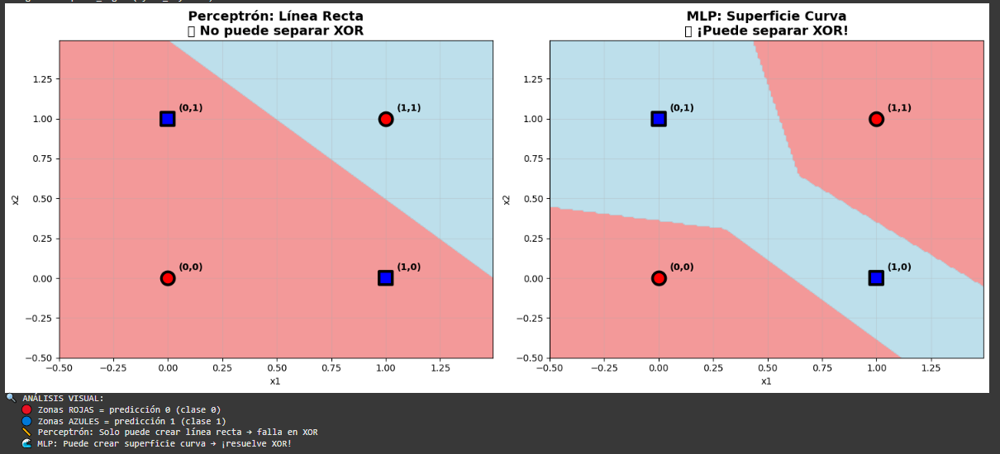

Con el perceptrón simple solo se puede dibujar una línea recta, así que nunca se podrá separar los casos de XOR y falla. En cambio, La MLP, combina varias neuronas y líneas internas, formando una superficie curva que separa perfectamente las zonas rojas (0) de las azules (1). Osea, la red multicapa puede “doblar” la frontera y manejar problemas que un perceptrón solo no puede.

```python
# === PROBLEMA REALISTA ===
from sklearn.datasets import make_classification
from sklearn.model_selection import train_test_split
from sklearn.metrics import classification_report

# Dataset más complejo
X_real, y_real = make_classification(
    n_samples=1000,
    n_features=20,
    n_informative=15,
    n_classes=2,
    random_state=42
)

# Dividir datos
X_train, X_test, y_train, y_test = train_test_split(
    X_real, y_real, test_size=0.3, random_state=42
)

# MLP para problema real
mlp_real = MLPClassifier(
    hidden_layer_sizes=(64, 32),  # 2 capas ocultas
    activation='relu',
    solver='adam',
    random_state=42,
    max_iter=1000
)

# Entrenar
mlp_real.fit(X_train, y_train)

# Evaluar
train_acc = mlp_real.score(X_train, y_train)
test_acc = mlp_real.score(X_test, y_test)

print(f"📊 Resultados MLP en dataset real:")
print(f"  Training Accuracy: {train_acc:.1%}")
print(f"  Test Accuracy: {test_acc:.1%}")
print(f"  Arquitectura: {X_real.shape[1]} → {mlp_real.hidden_layer_sizes} → 2")
```
#### Resultados: solución dataser real con MLP

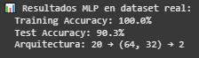

La MLP entrenó perfecto en los datos de entrenamiento, 100% de acierto, pero en el test baja un poco a 90%, está aprendiendo bien pero ya empieza a memorizar algo del entrenamiento. Por otro lado, la arquitectura es de 20 entradas, con una capa oculta de 64 neuronas, otra capa oculta de 32 neuronas, y 2 salidas, así que tiene suficiente capacidad para capturar patrones complejos del dataset real y generalizar bastante bien.


## Actividad 2, TensorFlow - Red Profesional: Descripción
En esta actividad veremos cómo construir una red neuronal profesional con TensorFlow/Keras, usando el mismo dataset que con sklearn para poder comparar resultados.

## Actividad 2: Código
```python
# === RED NEURONAL PROFESIONAL ===
import tensorflow as tf
from tensorflow import keras
from tensorflow.keras import layers

# Usar mismo dataset que sklearn para comparar
print(f"Dataset: {X_train.shape[0]} samples, {X_train.shape[1]} features")

# Crear modelo Sequential
model = keras.Sequential([
    layers.Dense(64, activation='relu', input_shape=(X_train.shape[1],)),
    layers.Dense(32, activation='relu'),
    layers.Dense(1, activation='sigmoid')  # salida binaria
])

# Compilar modelo
model.compile(
    optimizer='adam',              # adam, sgd, rmsprop
    loss='binary_crossentropy',                   # binary_crossentropy
    metrics=['accuracy']
)

# Entrenar
print("Entrenando red neuronal...")
history = model.fit(
    X_train, y_train,
    epochs=50,                   # número de épocas
    batch_size=32,               # tamaño de batch
    validation_data=(X_test, y_test),
    verbose=1
)

# Evaluar
train_loss, train_acc = model.evaluate(X_train, y_train, verbose=0)
test_loss, test_acc = model.evaluate(X_test, y_test, verbose=0)

print(f"\n🎯 Resultados TensorFlow:")
print(f"  Training Accuracy: {train_acc:.1%}")
print(f"  Test Accuracy: {test_acc:.1%}")
print(f"  Parámetros totales: {model.count_params():,}")
```

#### Resultados: solución 

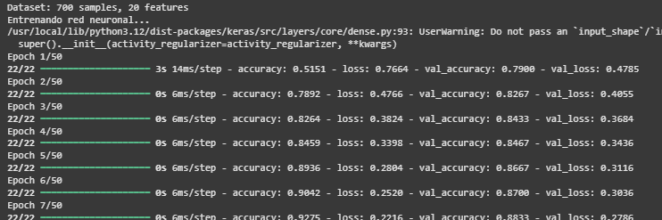

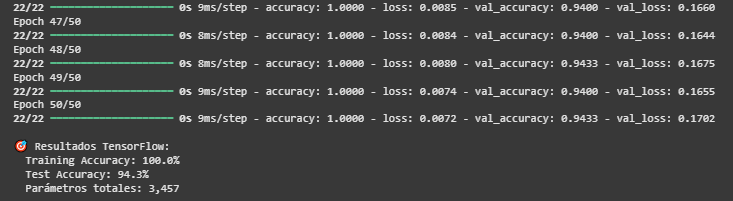

La red con TensorFlow entrenó perfecto en los datos de entrenamiento, al 100% y logró un 94.3% en test, así que generaliza bastante bien al dataset real. Esto muestra que con varias capas y neuronas, la red puede capturar patrones complejos que un MLP más chico quizá no alcanza. Los 3457 parámetros incluyen todos los pesos y biases de cada conexión entre neuronas, que la red va ajustando para aprender la relación entrada y salida.
En resumen, una red profesional aprende más rápido, maneja más complejidad y generaliza mejor, en comparación con sklearn MLP.

