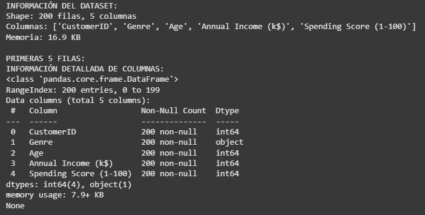

# Práctica 7

## Contexto
En esta práctica número 7 del curso, empezamos con los principios de Deep Learning.

## Objetivos
- Descubrir las limitaciones del perceptrón simple (problema XOR).
- Resolver problemas reales con redes multicapa (sklearn MLP).
- Implementar redes neuronales profesionales (TensorFlow/PyTorch Lightning).
- Entender cuándo usar cada herramienta.

## Actividades (con tiempos estimados)
- Parte 1 (40min)

## Desarrollo


## Evidencias
- Se adjunta imagen "resultado-t7-parte1.png" en `docs/assets/`

## Reflexión

---

# Deep Learning: Redes Neuronales

## Setup inicial: Código

```python
```

## Parte 1: Descripción

## Parte 1: Código

```python

```
#### Resultados: info del dataset


