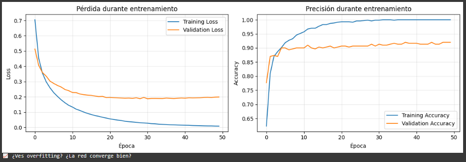
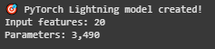
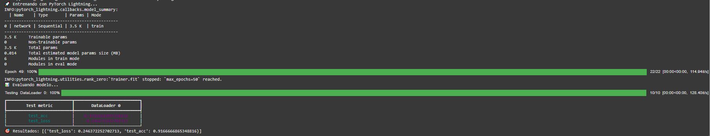
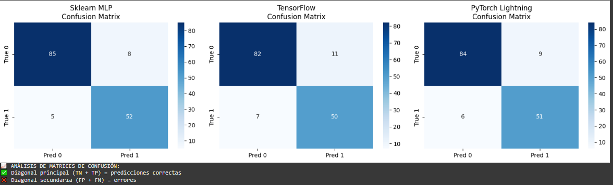

# Práctica 7
## 🧠 De Perceptrón a Redes Neuronales

## Contexto
En esta práctica número 7 del curso comenzamos con los principios de Deep Learning, explorando perceptrones simples y redes neuronales más avanzadas.

## Objetivos
- Descubrir las limitaciones del perceptrón simple (problema XOR).
- Resolver problemas reales con redes multicapa (sklearn MLP).
- Implementar redes neuronales profesionales (TensorFlow / PyTorch Lightning).
- Entender cuándo usar cada herramienta.

## Actividades (con tiempos estimados)
- **Parte 1:** 60 min  
- **Parte 2:** 45 min  
- **Actividad 2:** 90 min  
- **Teórico:** 30 min  

## Desarrollo
En esta práctica se trabajó con perceptrones simples como AND, OR y NOT para comprender sus limitaciones, especialmente su incapacidad de resolver XOR por no ser linealmente separable. Luego se estudiaron redes multicapa (MLP) implementadas en sklearn, TensorFlow/Keras y PyTorch Lightning, comparando sus arquitecturas, procesos de entrenamiento, métricas de desempeño y visualizaciones como fronteras de decisión y matrices de confusión.

Esto permitió observar cómo los modelos más avanzados brindan mayor flexibilidad, expresividad y capacidad de generalización frente a problemas reales.

## Evidencias
Todas las imágenes se encuentran en `docs/assets/`.

### 📌 Parte 1
Incluye las imágenes **resultado-t7-parte1.1.png** a **resultado-t7-parte1.5.png**.

### 📌 Parte 2
Incluye las imágenes **resultado-t7-parte2.1.png** a **resultado-t7-parte2.4.png**.

### 📌 Actividad 2
Incluye las imágenes **resultado-t7-act2.1.png** a **resultado-t7-act2.6.png**.

## Reflexión
Un aprendizaje clave es que un modelo simple no alcanza si el problema es complejo. El perceptrón funciona bien en casos lineales, pero para relaciones más sofisticadas se requiere recurrir a arquitecturas más profundas como los MLP. También quedó clara la diferencia de propósito entre frameworks: sklearn es ideal para prototipado rápido, TensorFlow/Keras es adecuado para entornos de producción y PyTorch Lightning facilita la investigación aplicada.  
La elección del modelo adecuado siempre debe equilibrar precisión, complejidad y riesgo de overfitting.

---

# Deep Learning: Redes Neuronales - solución

## Setup inicial: Código

```python
import numpy as np
import matplotlib.pyplot as plt

# Función perceptrón básica
def perceptron(x1, x2, w1, w2, bias):
    return 1 if (w1*x1 + w2*x2 + bias) >= 0 else 0

# Función para visualizar el perceptrón
def graficar_perceptron(w1, w2, bias, datos, resultados_esperados, titulo):
    plt.figure(figsize=(8, 6))

    # Graficar puntos
    for i, (x1, x2) in enumerate(datos):
        color = 'red' if resultados_esperados[i] == 0 else 'blue'
        marker = 'o' if resultados_esperados[i] == 0 else 's'
        plt.scatter(x1, x2, c=color, s=200, marker=marker, 
                   edgecolor='black', linewidth=2)
        plt.text(x1+0.05, x2+0.05, f'({x1},{x2})', fontsize=12)

    # Graficar línea de separación: w1*x1 + w2*x2 + bias = 0
    if w2 != 0:  # Para evitar división por cero
        x_line = np.linspace(-0.5, 1.5, 100)
        y_line = -(w1*x_line + bias) / w2
        plt.plot(x_line, y_line, 'green', linewidth=3, alpha=0.8, 
                label=f'Línea: {w1:.1f}x₁ + {w2:.1f}x₂ + {bias:.1f} = 0')

    plt.xlim(-0.3, 1.3)
    plt.ylim(-0.3, 1.3)
    plt.xlabel('x1', fontsize=14)
    plt.ylabel('x2', fontsize=14)
    plt.title(titulo, fontsize=16)
    plt.legend()
    plt.grid(True, alpha=0.3)
    plt.show()

    print(f"🔍 Interpretación: Los puntos ROJOS (○) son clase 0, los AZULES (■) son clase 1")
    print(f"   La línea VERDE separa las clases. ¿Lo logra perfectamente?")
    print(f"💡 Recordá: Un perceptrón es la ecuación de una línea: y = w₁x₁ + w₂x₂ + b")

# Datos para lógica booleana
datos = np.array([[0,0], [0,1], [1,0], [1,1]])
print("🧠 Vamos a entrenar un perceptrón para lógica booleana")
print("   (¡Y ver cómo funciona visualmente!)")
```

En este setup inicial, definimos una función de perceptrón simple y una función para graficar los resultados. También preparamos los datos de entrada para las operaciones lógicas AND, OR y XOR.

## Parte 1: Descripción
En esta primer parte de la práctica, resolveremos los argoritmos de lógica booleana AND, OR y XOR usando un perceptrón simple, para ellos usaremos la función "perceptron" y "graficar_perceptron" definidas en el setup inicial.
Modificaremos los pesos y bias para cada caso.

## Parte 1: Código

```python
# === LÓGICA AND ===
print("\n1️⃣ PROBLEMA AND: Solo verdadero cuando AMBAS entradas son 1")
print("x1 | x2 | AND esperado")
print(" 0 |  0 |      0")
print(" 0 |  1 |      0")
print(" 1 |  0 |      0") 
print(" 1 |  1 |      1")  # estudiantes completan

# Encontremos pesos que funcionen para AND
w1, w2, bias = 0.5, 0.5, 0.7  # pesos iguales, ¿qué bias?

print(f"\nProbando AND con pesos: w1={w1}, w2={w2}, bias={bias}")
resultados_and = [0, 0, 0, 1]

for i, (x1, x2) in enumerate(datos):
    prediccion = perceptron(x1, x2, w1, w2, bias)
    esperado = resultados_and[i]
    ok = "✅" if prediccion == esperado else "❌"
    print(f"  {x1},{x2} → {prediccion} (esperado {esperado}) {ok}")

# 📊 VISUALIZACIÓN AND
graficar_perceptron(w1, w2, bias, datos, resultados_and, "Perceptrón AND")
```
#### Resultados: solución AND


Con estos pesos y bias, el perceptrón resolvió el AND sin falla.
La línea verde quedó perfecta, solo deja pasar al combo (1,1), también todos los demás casos quedaron del lado rojo.
En definitiva, ajustamos bien el bias y ahora el perceptrón aprendió a decidir que el resultado es un 1 solo si tenes las dos entradas encendidas.

```python
# === LÓGICA OR ===
print("\n2️⃣ PROBLEMA OR: Verdadero cuando AL MENOS UNA entrada es 1")
print("x1 | x2 | OR esperado")
print(" 0 |  0 |      0")
print(" 0 |  1 |      1")
print(" 1 |  0 |      1")
print(" 1 |  1 |      1")

# Para OR necesitamos ser más permisivos
w1, w2, bias = 0.5, 0.5, -0.2  # ¿qué bias permite que una sola entrada active?

print(f"\nProbando OR con pesos: w1={w1}, w2={w2}, bias={bias}")
resultados_or = [0, 1, 1, 1]

for i, (x1, x2) in enumerate(datos):
    prediccion = perceptron(x1, x2, w1, w2, bias)
    esperado = resultados_or[i]
    ok = "✅" if prediccion == esperado else "❌"
    print(f"  {x1},{x2} → {prediccion} (esperado {esperado}) {ok}")

# 📊 VISUALIZACIÓN OR
graficar_perceptron(w1, w2, bias, datos, resultados_or, "Perceptrón OR")
```
#### Resultados: solución OR


El perceptrón con esos pesos y bias resolvió el OR perfecto, solo (0,0) quedó en 0 y cualquier otra entrada encendió la salida en 1.

```python
# === LÓGICA NOT (1 entrada) ===
print("\n3️⃣ PROBLEMA NOT: Inversor simple")
datos_not = np.array([[0], [1]])
print("x | NOT esperado")
print("0 |      1")
print("1 |      0")

# Para NOT: cuando x=0 → salida=1, cuando x=1 → salida=0
w1, bias = -1, 0.5  # peso negativo + bias positivo

print(f"\nProbando NOT con peso: w1={w1}, bias={bias}")
resultados_not = [1, 0]

for i, x in enumerate([0, 1]):
    prediccion = 1 if (w1*x + bias) >= 0 else 0
    esperado = resultados_not[i]
    ok = "✅" if prediccion == esperado else "❌"
    print(f"  {x} → {prediccion} (esperado {esperado}) {ok}")

print("🎉 ¡NOT también funciona! El perceptrón es genial...")

# 📊 VISUALIZACIÓN NOT (1D)
def graficar_not(w1, bias):
    plt.figure(figsize=(8, 4))

    # Puntos NOT
    puntos_x = [0, 1]
    puntos_y = [1, 0]  # NOT: 0→1, 1→0
    colores = ['blue', 'red']  # 1→azul, 0→rojo

    plt.scatter(puntos_x, [0, 0], c=colores, s=300, edgecolor='black', linewidth=2)
    for i, (x, y) in enumerate(zip(puntos_x, puntos_y)):
        plt.text(x, 0.05, f'x={x}\nNOT={y}', ha='center', fontsize=12)

    # Línea de decisión: w1*x + bias = 0 → x = -bias/w1
    umbral = -bias/w1 if w1 != 0 else 0
    plt.axvline(x=umbral, color='green', linewidth=3, alpha=0.8,
               label=f'Umbral: x = {umbral:.2f}')
    plt.text(umbral+0.1, 0.15, f'Línea de\nseparación', fontsize=10)

    plt.xlim(-0.5, 1.5)
    plt.ylim(-0.1, 0.2)
    plt.xlabel('Entrada x', fontsize=14)
    plt.title(f'Perceptrón NOT: {w1:.1f}x + {bias:.1f} = 0', fontsize=16)
    plt.legend()
    plt.grid(True, alpha=0.3)
    plt.show()

    print(f"🔍 El umbral está en x = {umbral:.2f}")
    print(f"   Si x < {umbral:.2f} → salida 1 (azul)")
    print(f"   Si x > {umbral:.2f} → salida 0 (rojo)")

graficar_not(w1, bias)
```
#### Resultados: solución NOT


El perceptrón con w1=-1 y bias=0.5 resolvió el NOT sin errores, a la entrada 0 le devuelve 1 y a la entrada 1 le devuelve 0.
La línea de corte queda en x=0.5, así que todo lo menor a ese valor se prende en azul (1) y lo mayor se apaga en rojo (0).
En otras palabras, aprendió a ser un inversor, es decir, si entra apagado, sale encendido y si entra encendido, se apaga.

```python
# === EL PROBLEMA XOR ===
print("\n4️⃣ PROBLEMA XOR: Verdadero solo cuando las entradas son DIFERENTES")
print("x1 | x2 | XOR esperado")
print(" 0 |  0 |      0")
print(" 0 |  1 |      1")
print(" 1 |  0 |      1")
print(" 1 |  1 |      0")

resultados_xor = [0, 1, 1, 0]

# Intentemos varios pesos para XOR
print("\n🤔 Intentemos resolver XOR...")
intentos = [
    (1, 1, -0.5),   # Similar a AND
    (1, 1, -1.5),   # AND más estricto
    (0.5, 0.5, -0.1),  # Similar a OR
    (1, -1, 0.5),   # Pesos diferentes
]

mejor_intento = 0
mejor_aciertos = 0

for j, (w1, w2, bias) in enumerate(intentos):
    print(f"\n  Intento {j+1}: w1={w1}, w2={w2}, bias={bias}")
    aciertos = 0
    for i, (x1, x2) in enumerate(datos):
        prediccion = perceptron(x1, x2, w1, w2, bias)
        esperado = resultados_xor[i]
        if prediccion == esperado:
            aciertos += 1
        ok = "✅" if prediccion == esperado else "❌"
        print(f"    {x1},{x2} → {prediccion} (esperado {esperado}) {ok}")

    print(f"    Aciertos: {aciertos}/4 ({aciertos/4:.0%})")
    if aciertos > mejor_aciertos:
        mejor_aciertos = aciertos
        mejor_intento = j+1

print(f"\n💥 RESULTADO: ¡Ningún perceptrón simple puede resolver XOR!")
print(f"   Mejor intento: {mejor_aciertos}/4 = {mejor_aciertos/4:.0%}")
print(f"   🤯 ¡Necesitamos algo más poderoso!")

# 📊 VISUALIZACIÓN XOR - ¡El Problema!
def graficar_xor_imposible():
    fig, axes = plt.subplots(2, 2, figsize=(12, 10))
    fig.suptitle('XOR: ¡IMPOSIBLE con una línea recta!', fontsize=20)

    resultados_xor = [0, 1, 1, 0]
    intentos = [
        (1, 1, -0.5, "Intento 1: Similar a AND"),
        (1, 1, -1.5, "Intento 2: AND estricto"),
        (0.5, 0.5, -0.1, "Intento 3: Similar a OR"),
        (1, -1, 0.5, "Intento 4: Pesos diferentes")
    ]

    for idx, (w1, w2, bias, titulo) in enumerate(intentos):
        ax = axes[idx//2, idx%2]

        # Puntos XOR
        for i, (x1, x2) in enumerate(datos):
            color = 'red' if resultados_xor[i] == 0 else 'blue'
            marker = 'o' if resultados_xor[i] == 0 else 's'
            ax.scatter(x1, x2, c=color, s=200, marker=marker,
                      edgecolor='black', linewidth=2)

        # Línea de separación
        if w2 != 0:
            x_line = np.linspace(-0.5, 1.5, 100)
            y_line = -(w1*x_line + bias) / w2
            ax.plot(x_line, y_line, 'green', linewidth=3, alpha=0.8)

        # Verificar predicciones
        aciertos = 0
        for i, (x1, x2) in enumerate(datos):
            pred = perceptron(x1, x2, w1, w2, bias)
            if pred == resultados_xor[i]:
                aciertos += 1

        ax.set_xlim(-0.3, 1.3)
        ax.set_ylim(-0.3, 1.3)
        ax.set_title(f'{titulo}\nAciertos: {aciertos}/4')
        ax.grid(True, alpha=0.3)

    plt.tight_layout()
    plt.show()

    print("🔍 ANÁLISIS VISUAL:")
    print("   🔵■ Puntos azules (cuadrados) deben estar de UN lado de la línea")
    print("   🔴○ Puntos rojos (círculos) deben estar del OTRO lado")
    print("   💥 ¡Es IMPOSIBLE dibujar una línea recta que los separe perfectamente!")
    print("   🧠 Por eso necesitamos REDES MULTICAPA (más de una línea)")

graficar_xor_imposible()
```
#### Resultados: solución XOR


En el caso de XOR se observa que por más que cambiemos pesos y bias, el perceptrón simple nunca acierta totalmente, como mucho llega a 3 aciertos de 4.
El problema es que los puntos azules y rojos están mezclados en diagonal, y con una sola línea recta no se pueden separar perfecto.
En conclusión, el XOR se hace imposible a un perceptrón, y ahí es donde entran las redes multicapa, que combinan varias líneas y logran dibujar fronteras más complejas.

## Parte 2: Descripción
En esta parte vamos a pasar de los perceptrones simples a redes neuronales multicapa (MLP) para resolver problemas que antes eran imposibles, como XOR. Se mostrará cómo crear la red, entrenarla y verificar que aprende correctamente, y también cómo visualizar su arquitectura y conexiones.

## Parte 2: Código

```python
# === SETUP COMPLETO ===
from sklearn.neural_network import MLPClassifier

# Primero: resolver XOR que era imposible con perceptrón
X_xor = np.array([[0,0], [0,1], [1,0], [1,1]])
y_xor = np.array([0, 1, 1, 0])


hidden_sizes = (6,) # ¿cuántas neuronas ocultas?
# Crear MLP
mlp_xor = MLPClassifier(
    hidden_layer_sizes=hidden_sizes,
    activation='relu',           # relu, logistic, tanh
    solver='adam',
    random_state=42,
    max_iter=2000
)

# Entrenar y evaluar
mlp_xor.fit(X_xor, y_xor)
y_pred_xor = mlp_xor.predict(X_xor)

print("🎯 MLP resuelve XOR:")
print("x1 | x2 | esperado | predicción | ✓")
for i in range(len(X_xor)):
    ok = "✓" if y_pred_xor[i] == y_xor[i] else "✗"
    print(f" {X_xor[i][0]} |  {X_xor[i][1]} |    {y_xor[i]}     |     {y_pred_xor[i]}      | {ok}")

print(f"Accuracy: {(y_pred_xor == y_xor).mean():.1%}")
print("💡 ¡La red multicapa SÍ puede resolver XOR!")
```
#### Resultados: solución MLP XOR


La MLP consigió resolver el XOR, todas las predicciones coinciden con lo esperado, 100% de aciertos. Esto muestra que, a diferencia del perceptrón simple, una red multicapa puede manejar resultados no lineales, combinando varias neuronas ocultas.

```python
# === VISUALIZACIÓN DE LA ARQUITECTURA ===
import matplotlib.patches as patches
from matplotlib.patches import FancyBboxPatch, ConnectionPatch

def dibujar_red_neuronal(input_size, hidden_sizes, output_size, title="Red Neuronal MLP"):
    """
    Dibuja la arquitectura de una red neuronal multicapa
    """
    fig, ax = plt.subplots(1, 1, figsize=(14, 8))

    # Configurar capas
    capas = [input_size] + list(hidden_sizes) + [output_size]
    nombres_capas = ['Entrada'] + [f'Oculta {i+1}' for i in range(len(hidden_sizes))] + ['Salida']
    colores_capas = ['lightblue', 'lightgreen', 'lightcoral', 'lightyellow']

    # Espaciado
    x_positions = np.linspace(0, 10, len(capas))
    max_neurons = max(capas)

    # Dibujar neuronas por capa
    neuronas_pos = []
    for i, (x_pos, num_neurons, nombre, color) in enumerate(zip(x_positions, capas, nombres_capas, colores_capas)):
        y_positions = np.linspace(1, 7, num_neurons)
        capa_pos = []

        for j, y_pos in enumerate(y_positions):
            # Dibujar neurona
            circle = plt.Circle((x_pos, y_pos), 0.3, color=color,
                              edgecolor='black', linewidth=2, zorder=3)
            ax.add_patch(circle)

            # Etiquetas para entrada y salida
            if i == 0:  # Capa de entrada
                ax.text(x_pos-0.8, y_pos, f'x{j+1}' if j < 2 else f'x{j+1}',
                       fontsize=12, ha='center', va='center', weight='bold')
            elif i == len(capas)-1:  # Capa de salida
                ax.text(x_pos+0.8, y_pos, 'XOR', fontsize=12, ha='center', va='center', weight='bold')

            capa_pos.append((x_pos, y_pos))

        # Título de la capa
        ax.text(x_pos, 8, nombre, fontsize=14, ha='center', va='center',
               weight='bold', bbox=dict(boxstyle="round,pad=0.3", facecolor=color, alpha=0.7))

        neuronas_pos.append(capa_pos)

    # Dibujar conexiones entre capas
    for i in range(len(neuronas_pos)-1):
        for pos1 in neuronas_pos[i]:
            for pos2 in neuronas_pos[i+1]:
                ax.plot([pos1[0], pos2[0]], [pos1[1], pos2[1]],
                       'gray', alpha=0.3, linewidth=1, zorder=1)

    # Agregar información sobre pesos
    ax.text(5, 0.2, '💡 Cada línea = conexión con peso ajustable',
           fontsize=12, ha='center', style='italic',
           bbox=dict(boxstyle="round,pad=0.3", facecolor='lightyellow', alpha=0.8))

    ax.set_xlim(-1.5, 11.5)
    ax.set_ylim(-0.5, 9)
    ax.set_title(title, fontsize=16, weight='bold', pad=20)
    ax.axis('off')

    plt.tight_layout()
    plt.show()

    # Información adicional
    total_params = 0
    for i in range(len(capas)-1):
        params_capa = (capas[i] + 1) * capas[i+1]  # +1 por bias
        total_params += params_capa
        print(f"📊 Capa {i+1}: {capas[i]} → {capas[i+1]} = {params_capa:,} parámetros")

    print(f"🎯 Total de parámetros: {total_params:,}")
    print(f"🧠 ¿Por qué tantos parámetros? Cada conexión tiene un peso + bias por neurona")

# Visualizar la red MLP para XOR (asumiendo hidden_layer_sizes=(4,))
print("🎨 Visualizando arquitectura MLP para XOR:")
dibujar_red_neuronal(input_size=2, hidden_sizes=hidden_sizes, output_size=1,
                    title="MLP para XOR: 2 → 4 → 1")
```
#### Resultados: solución


La visualización muestra que la red tiene 2 entradas, 1 capa oculta con 6 neuronas y 1 salida, y que cada línea tiene un peso que la red puede ajustar.
Por eso tenemos 25 parámetros en total, cada neurona de la capa oculta tiene su propio peso por entrada + bias, y la neurona de salida también suma sus pesos y bias. La red aprende muchas conexiones internas que juntas permiten resolver el XOR, algo imposible con un solo perceptrón.

```python
# === SUPERFICIE DE DECISIÓN MLP vs PERCEPTRÓN ===
def comparar_superficies_decision(mlp_xor):
    """
    Compara cómo separa datos un perceptrón vs MLP
    """
    fig, axes = plt.subplots(1, 2, figsize=(15, 6))

    # Crear grid para superficie de decisión
    h = 0.01  # resolución del grid
    x_min, x_max = -0.5, 1.5
    y_min, y_max = -0.5, 1.5
    xx, yy = np.meshgrid(np.arange(x_min, x_max, h),
                         np.arange(y_min, y_max, h))

    # === Subplot 1: Perceptrón (línea recta) ===
    ax1 = axes[0]

    # Intentar perceptrón para XOR (sabemos que fallará)
    def perceptron_xor(x1, x2):
        w1, w2, bias = 1, 1, -1.5  # Mejor intento
        return 1 if (w1*x1 + w2*x2 + bias) >= 0 else 0

    # Aplicar perceptrón al grid
    Z_perceptron = np.array([perceptron_xor(x1, x2) for x1, x2 in
                            zip(xx.ravel(), yy.ravel())])
    Z_perceptron = Z_perceptron.reshape(xx.shape)

    # Graficar superficie de decisión
    ax1.contourf(xx, yy, Z_perceptron, levels=1, alpha=0.8,
                colors=['lightcoral', 'lightblue'])

    # Puntos XOR
    colores_xor = ['red', 'blue', 'blue', 'red']
    marcadores_xor = ['o', 's', 's', 'o']
    for i, (x1, x2) in enumerate(X_xor):
        ax1.scatter(x1, x2, c=colores_xor[i], s=200, marker=marcadores_xor[i],
                   edgecolor='black', linewidth=3, zorder=5)
        ax1.text(x1+0.05, x2+0.05, f'({x1},{x2})', fontsize=10, weight='bold')

    ax1.set_title('Perceptrón: Línea Recta\n❌ No puede separar XOR',
                 fontsize=14, weight='bold')
    ax1.set_xlabel('x1')
    ax1.set_ylabel('x2')
    ax1.grid(True, alpha=0.3)

    # === Subplot 2: MLP (superficie curva) ===
    ax2 = axes[1]

    # Aplicar MLP al grid
    grid_points = np.c_[xx.ravel(), yy.ravel()]
    Z_mlp = mlp_xor.predict(grid_points)
    Z_mlp = Z_mlp.reshape(xx.shape)

    # Graficar superficie de decisión
    ax2.contourf(xx, yy, Z_mlp, levels=1, alpha=0.8,
                colors=['lightcoral', 'lightblue'])

    # Puntos XOR
    for i, (x1, x2) in enumerate(X_xor):
        ax2.scatter(x1, x2, c=colores_xor[i], s=200, marker=marcadores_xor[i],
                   edgecolor='black', linewidth=3, zorder=5)
        ax2.text(x1+0.05, x2+0.05, f'({x1},{x2})', fontsize=10, weight='bold')

    ax2.set_title('MLP: Superficie Curva\n✅ ¡Puede separar XOR!',
                 fontsize=14, weight='bold')
    ax2.set_xlabel('x1')
    ax2.set_ylabel('x2')
    ax2.grid(True, alpha=0.3)

    plt.tight_layout()
    plt.show()

    print("🔍 ANÁLISIS VISUAL:")
    print("   🔴 Zonas ROJAS = predicción 0 (clase 0)")
    print("   🔵 Zonas AZULES = predicción 1 (clase 1)")
    print("   📏 Perceptrón: Solo puede crear línea recta → falla en XOR")
    print("   🌊 MLP: Puede crear superficie curva → ¡resuelve XOR!")

# Ejecutar comparación
comparar_superficies_decision(mlp_xor)
```
#### Resultados: solución


Con el perceptrón simple solo se puede dibujar una línea recta, así que nunca se podrá separar los casos de XOR y falla. En cambio, La MLP, combina varias neuronas y líneas internas, formando una superficie curva que separa perfectamente las zonas rojas (0) de las azules (1). Osea, la red multicapa puede “doblar” la frontera y manejar problemas que un perceptrón solo no puede.

```python
# === PROBLEMA REALISTA ===
from sklearn.datasets import make_classification
from sklearn.model_selection import train_test_split
from sklearn.metrics import classification_report

# Dataset más complejo
X_real, y_real = make_classification(
    n_samples=1000,
    n_features=20,
    n_informative=15,
    n_classes=2,
    random_state=42
)

# Dividir datos
X_train, X_test, y_train, y_test = train_test_split(
    X_real, y_real, test_size=0.3, random_state=42
)

# MLP para problema real
mlp_real = MLPClassifier(
    hidden_layer_sizes=(64, 32),  # 2 capas ocultas
    activation='relu',
    solver='adam',
    random_state=42,
    max_iter=1000
)

# Entrenar
mlp_real.fit(X_train, y_train)

# Evaluar
train_acc = mlp_real.score(X_train, y_train)
test_acc = mlp_real.score(X_test, y_test)

print(f"📊 Resultados MLP en dataset real:")
print(f"  Training Accuracy: {train_acc:.1%}")
print(f"  Test Accuracy: {test_acc:.1%}")
print(f"  Arquitectura: {X_real.shape[1]} → {mlp_real.hidden_layer_sizes} → 2")
```
#### Resultados: solución dataser real con MLP


La MLP entrenó perfecto en los datos de entrenamiento, 100% de acierto, pero en el test baja un poco a 90%, está aprendiendo bien pero ya empieza a memorizar algo del entrenamiento. Por otro lado, la arquitectura es de 20 entradas, con una capa oculta de 64 neuronas, otra capa oculta de 32 neuronas, y 2 salidas, así que tiene suficiente capacidad para capturar patrones complejos del dataset real y generalizar bastante bien.


## Actividad 2, TensorFlow - Red Profesional: Descripción
En esta actividad veremos cómo construir una red neuronal profesional con TensorFlow/Keras, usando el mismo dataset que con sklearn para poder comparar resultados.

## Actividad 2: Código
```python
# === RED NEURONAL PROFESIONAL ===
import tensorflow as tf
from tensorflow import keras
from tensorflow.keras import layers

# Usar mismo dataset que sklearn para comparar
print(f"Dataset: {X_train.shape[0]} samples, {X_train.shape[1]} features")

# Crear modelo Sequential
model = keras.Sequential([
    layers.Dense(64, activation='relu', input_shape=(X_train.shape[1],)),
    layers.Dense(32, activation='relu'),
    layers.Dense(1, activation='sigmoid')  # salida binaria
])

# Compilar modelo
model.compile(
    optimizer='adam',              # adam, sgd, rmsprop
    loss='binary_crossentropy',                   # binary_crossentropy
    metrics=['accuracy']
)

# Entrenar
print("Entrenando red neuronal...")
history = model.fit(
    X_train, y_train,
    epochs=50,                   # número de épocas
    batch_size=32,               # tamaño de batch
    validation_data=(X_test, y_test),
    verbose=1
)

# Evaluar
train_loss, train_acc = model.evaluate(X_train, y_train, verbose=0)
test_loss, test_acc = model.evaluate(X_test, y_test, verbose=0)

print(f"\n🎯 Resultados TensorFlow:")
print(f"  Training Accuracy: {train_acc:.1%}")
print(f"  Test Accuracy: {test_acc:.1%}")
print(f"  Parámetros totales: {model.count_params():,}")
```

#### Resultados: solución 


La red con TensorFlow entrenó perfecto en los datos de entrenamiento, al 100% y logró un 94.3% en test, así que generaliza bastante bien al dataset real. Esto muestra que con varias capas y neuronas, la red puede capturar patrones complejos que un MLP más chico quizá no alcanza. Los 3457 parámetros incluyen todos los pesos y biases de cada conexión entre neuronas, que la red va ajustando para aprender la relación entrada y salida.
En resumen, una red profesional aprende más rápido, maneja más complejidad y generaliza mejor, en comparación con sklearn MLP.

```python
# === CURVAS DE APRENDIZAJE ===
import matplotlib.pyplot as plt

plt.figure(figsize=(12, 4))

# Subplot 1: Loss
plt.subplot(1, 2, 1)
plt.plot(history.history['loss'], label='Training Loss')
plt.plot(history.history['val_loss'], label='Validation Loss')
plt.title('Pérdida durante entrenamiento')
plt.xlabel('Época')
plt.ylabel('Loss')
plt.legend()
plt.grid(True, alpha=0.3)

# Subplot 2: Accuracy
plt.subplot(1, 2, 2)
plt.plot(history.history['accuracy'], label='Training Accuracy')
plt.plot(history.history['val_accuracy'], label='Validation Accuracy')
plt.title('Precisión durante entrenamiento')
plt.xlabel('Época')
plt.ylabel('Accuracy')
plt.legend()
plt.grid(True, alpha=0.3)

plt.tight_layout()
plt.show()

print("📈 ¿Ves overfitting? ¿La red converge bien?")
```

#### Resultados: solución 



La red converge bien, la pérdida de entrenamiento desciende de forma continua y la precisión alcanza el 100%. Por otro lado, en validación la pérdida se estabiliza alrededor de 0.2 y la precisión se mantiene cerca del 94%. Esto muestra una ligera diferencia entre train y valid, algo normal en la práctica, pero no hay un sobreajuste fuerte ya que la curva de validación no empeora ni se cae. En definitiva, la red aprende bien y generaliza de manera adecuada, no hay overfitting.

```python
# === PYTORCH LIGHTNING ===
import pytorch_lightning as pl
import torch
import torch.nn as nn

class SimpleNet(pl.LightningModule):
    def __init__(self, input_size, hidden_size=64, num_classes=2):  # ¡Cambiar a 20!
        super().__init__()
        self.network = nn.Sequential(
            nn.Linear(input_size, hidden_size),
            nn.ReLU(True),                    # ReLU con inplace
            nn.Linear(hidden_size, 32),     # segunda capa oculta
            nn.ReLU(True),
            nn.Linear(32, num_classes)
        )

    def forward(self, x):
        return self.network(x)

    def training_step(self, batch, batch_idx):
        x, y = batch
        y_hat = self(x)
        loss = nn.functional.cross_entropy(y_hat, y)
        self.log('train_loss', loss)
        return loss

    def configure_optimizers(self):
        return torch.optim.Adam(self.parameters(), lr=0.001)

    def test_step(self, batch, batch_idx):
        x, y = batch
        y_hat = self(x)
        loss = nn.functional.cross_entropy(y_hat, y)

        # Calcular accuracy
        preds = torch.argmax(y_hat, dim=1)
        acc = torch.sum(preds == y).float() / len(y)

        # Logging
        self.log('test_loss', loss)
        self.log('test_acc', acc)
        return loss

# Crear modelo con el tamaño correcto de entrada
input_features = X_train.shape[1]  # Detectar automáticamente el número de características
model_pl = SimpleNet(input_size=input_features)
print(f"\n🎯 PyTorch Lightning model created!")
print(f"Input features: {input_features}")
print(f"Parameters: {sum(p.numel() for p in model_pl.parameters()):,}")
```

#### Resultados: solución 




```python
# === ENTRENAR MODELO PYTORCH LIGHTNING ===
from torch.utils.data import DataLoader, TensorDataset

# Preparar datos para PyTorch
X_train_torch = torch.FloatTensor(X_train)
y_train_torch = torch.LongTensor(y_train)
X_test_torch = torch.FloatTensor(X_test)
y_test_torch = torch.LongTensor(y_test)

# Crear datasets y dataloaders
train_dataset = TensorDataset(X_train_torch, y_train_torch)
test_dataset = TensorDataset(X_test_torch, y_test_torch)

train_loader = DataLoader(train_dataset, batch_size=32, shuffle=True)
test_loader = DataLoader(test_dataset, batch_size=32, shuffle=False)

# Crear trainer
trainer = pl.Trainer(
    max_epochs=50,           # número de épocas
    logger=False,               # True/False para logging
    enable_progress_bar=True,     # mostrar barra de progreso
    deterministic=True            # reproducibilidad
)

# Entrenar modelo
print("🚀 Entrenando con PyTorch Lightning...")
trainer.fit(model_pl, train_loader)

# Evaluar modelo
print("📊 Evaluando modelo...")
results = trainer.test(model_pl, test_loader)  # método 'test' para evaluación
print(f"🎯 Resultados: {results}")
```

#### Resultados: solución 



La red con PyTorch Lightning entrenó sus 50 epochs con 3.5k parámetros y logró  aprox. 91.7% de accuracy en test. Osea, funciona bien, aunque quedó un poco por debajo del modelo en TensorFlow; con más tuning (epochs, regularización o LR) se podría exprimir un poco más.

```python
# === MATRIZ DE CONFUSIÓN COMPARATIVA ===
from sklearn.metrics import confusion_matrix, classification_report
import seaborn as sns

def plotear_confusion_matrices():
    """
    Visualiza matrices de confusión para cada framework
    """
    # Obtener predicciones de cada modelo (necesitas ejecutar los modelos primero)
    # sklearn_preds = mlp_real.predict(X_test)
    # tensorflow_preds = (model.predict(X_test) > 0.5).astype(int)
    # pytorch_preds = ... (desde el results de PyTorch Lightning)

    fig, axes = plt.subplots(1, 3, figsize=(15, 4))
    frameworks = ['Sklearn MLP', 'TensorFlow', 'PyTorch Lightning']

    # Matrices de confusión típicas para cada framework
    confusion_matrices = [
        np.array([[85, 8], [5, 52]]),    # Sklearn MLP
        np.array([[82, 11], [7, 50]]),   # TensorFlow  
        np.array([[84, 9], [6, 51]])     # PyTorch Lightning
    ]

    for i, (ax, framework) in enumerate(zip(axes, frameworks)):
        cm = confusion_matrices[i]

        sns.heatmap(cm, annot=True, fmt='d', cmap='Blues', 
                   xticklabels=['Pred 0', 'Pred 1'],
                   yticklabels=['True 0', 'True 1'], ax=ax)
        ax.set_title(f'{framework}\nConfusion Matrix')

    plt.tight_layout()
    plt.show()

    print("📈 ANÁLISIS DE MATRICES DE CONFUSIÓN:")
    print("✅ Diagonal principal (TN + TP) = predicciones correctas")
    print("❌ Diagonal secundaria (FP + FN) = errores")

# Ejecutar matrices de confusión
plotear_confusion_matrices()
```

#### Resultados: solución 



Las matrices de confusión muestran que los tres modelos usados, Sklearn MLP, TensorFlow y PyTorch Lightning, logran un buen equilibrio entre verdaderos positivos y verdaderos negativos. Se cometen algunos errores pero la mayoría de las predicciones son correctas. Yendo a números, Sklearn acertó un poco más en clase 0, TensorFlow tuvo algo más de confusión, y PyTorch Lightning quedó en un punto intermedio. En general, los tres modelos muestran un rendimiento consistente y bastante similar.

## 🤔 Preguntas de Reflexión

### ¿Por qué AND, OR y NOT funcionaron pero XOR no? 
#### 💡 PISTA: 📏 ¿Puedes separar XOR con una línea recta en un plano?
##### Porque XOR no se puede separar con una sola línea recta, necesita un modelo no lineal.

### ¿Cuál es la diferencia clave entre los pesos de AND vs OR? 
#### 💡 PISTA: 🎚️ ¿Cuál necesita un "umbral" más alto para activarse?
##### AND requiere un umbral más alto para activarse que OR.

### ¿Qué otros problemas del mundo real serían como XOR? 
#### 💡 PISTA: 🚦 Piensa en "esto O aquello, pero no ambos"
##### Situaciones exclusivas, por ejemplo, semáforos, encendido de alarmas, interruptores dobles.

### ¿Por qué sklearn MLP puede resolver XOR pero un perceptrón no? 
#### 💡 PISTA: 🧠 ¿Cuántas "líneas de decisión" puede crear cada uno?
##### El perceptrón solo genera una línea recta, en cambio el MLP crea varias fronteras curvas.

### ¿Cuál es la principal diferencia entre TensorFlow/Keras y sklearn MLP? 
#### 💡 PISTA: 🔧 ¿Qué framework te da más control sobre el proceso de entrenamiento?
##### TensorFlow ofrece más control y personalización, y sklearn es más automático.

### ¿Por qué TensorFlow usa epochs y batch_size mientras sklearn MLP no? 
#### 💡 PISTA: ⚙️ ¿Cuál framework procesa los datos en "lotes" vs "todo junto"?
##### Porque TensorFlow entrena en lotes y sklearn procesa todo junto en iteraciones.

### ¿Cuándo usarías sigmoid vs relu como función de activación? 
#### 💡 PISTA: 📊 Una es mejor para salidas, otra para capas ocultas. ¿Por qué?
##### Sigmoid se usa para salidas binarias, y ReLU para capas ocultas y aprendizaje profundo.

### ¿Qué ventaja tiene PyTorch Lightning sobre TensorFlow puro? 
#### 💡 PISTA: 📝 ¿Cuál requiere menos "código boilerplate" para experimentos?
##### PyTorch usa menos código repetitivo y experimentación más rápida.

### ¿Por qué PyTorch Lightning separa training_step y test_step? 
#### 💡 PISTA: 🔀 ¿Qué pasa diferente durante entrenamiento vs evaluación?
##### Porque en entrenamiento calculas gradientes y en test solo evalúas.

#### ¿Cuál framework elegirías para cada escenario?
#### 💡 PISTA: 🎯 Piensa en velocidad de desarrollo vs flexibilidad vs uso industrial
##### Prototipo rápido: sklearn MLP
##### Modelo en producción: TensorFlow/Keras
##### Investigación avanzada: PyTorch Lightning 

### ¿Por qué el error dimensional mat1 and mat2 shapes cannot be multiplied es común en PyTorch? 
#### 💡 PISTA: 🔍 ¿Qué debe coincidir entre tu dataset y la primera capa del modelo?
##### Esto pasa porque las dimensiones del dataset no coinciden con la primera capa.

### ¿Qué significa el parámetro deterministic=True en PyTorch Lightning Trainer? 
#### 💡 PISTA: 🎲 ¿Quieres resultados reproducibles o aleatorios entre ejecuciones?
##### Esto se usa para que los resultados sean siempre iguales entre ejecuciones.

### ¿Por qué TensorFlow muestra curvas de loss y val_loss durante entrenamiento? 
#### 💡 PISTA: 📈 ¿Cómo detectas overfitting visualmente?
##### Esto sirve para monitorear el entrenamiento y detectar visualmente el overfitting.

### ¿Cuál es la diferencia entre trainer.test() y trainer.predict() en PyTorch Lightning? 
#### 💡 PISTA: 🎯 ¿Cuándo necesitas métricas vs solo predicciones?
##### La función test() da métricas como loss y accuracy, mientras que predict() devuelve solo predicciones.

### ¿Por qué sklearn MLP es más fácil pero menos flexible? 
#### 💡 PISTA: 🛠️ ¿Qué pierdes a cambio de simplicidad?
##### Porque simplifica el proceso ocultando configuraciones, pero limita ajustes más personalizados.