# Práctica 8
## ⚡ Backpropagation y Optimizadores

## Contexto
En esta práctica número 8 del curso probaremos distintas técnicas para mejorar el entrenamiento del modelo.

## Actividades (con tiempos estimados)
- Mejora de código para entrenamiento (200min)
- Diseño github page (40min)

## Desarrollo
Se construyó un modelo de red neuronal profunda para clasificación, aplicando varias técnicas de preprocesamiento y regularización para mejorar su desempeño. Primero se estandarizaron los datos para que todas las características tuvieran media cero y varianza uno, lo que facilita el entrenamiento. Luego se implementó data augmentation agregando un pequeño ruido gaussiano para que el modelo vea versiones ligeramente distintas de los datos y aprenda patrones más generales. La arquitectura incluye varias capas densas con ReLU y HeNormal, combinadas con Batch Normalization, Dropout y L2, que ayudan a estabilizar el entrenamiento y prevenir el sobreajuste. Finalmente, se utilizó RMSprop como optimizador y se agregaron callbacks para detener el entrenamiento temprano y ajustar la tasa de aprendizaje automáticamente, garantizando que el modelo no sobreentrene y se guarde la mejor versión.

## Evidencias
- Se adjunta imagen "resultado-t8-1.png" en `docs/assets/`
- Se adjunta imagen "resultado-t8-2.png" en `docs/assets/`
- Se adjunta imagen "resultado-t8-3.png" en `docs/assets/`
- Se adjunta imagen "resultado-t8-4.png" en `docs/assets/`
- Se adjunta imagen "resultado-t8-5.png" en `docs/assets/`
- Se adjunta imagen "resultado-t8-6.png" en `docs/assets/`
- Se adjunta imagen "resultado-t8-7.png" en `docs/assets/`
- Se adjunta imagen "resultado-t8-8.png" en `docs/assets/`
- Se adjunta imagen "resultado-t8-9.png" en `docs/assets/`
- Se adjunta imagen "resultado-t8-10.png" en `docs/assets/`
- Se adjunta imagen "resultado-t8-11.png" en `docs/assets/`

## Reflexión
A lo largo del desarrollo del modelo, se observó que simplemente aumentar el tamaño de las capas o agregar más regularización no siempre mejora la performance, en algunos casos, empeoraba la generalización. Esto llevó a valorar la importancia de equilibrar capacidad y regularización y de probar cambios graduales. La incorporación de data augmentation y técnicas de normalización permitió que el modelo aprendiera mejor de los datos limitados, mejorando la precisión en validación y test sin sobreajustarse. La práctica que si bien la arquitectura es importante, el preprocesamiento, la regularización y la paciencia durante el entrenamiento son claves para construir modelos robustos y confiables.

---

# Backpropagation y Optimizadores

## Setup inicial

```python
import os, math, json, time, random, datetime as dt
import numpy as np
import pandas as pd
import matplotlib.pyplot as plt
import seaborn as sns

import tensorflow as tf
from tensorflow import keras
from tensorflow.keras import layers

from sklearn.metrics import confusion_matrix, classification_report, f1_score

SEED = 42
random.seed(SEED); np.random.seed(SEED); tf.random.set_seed(SEED)

print("TensorFlow:", tf.__version__)
print("GPU disponibles:", tf.config.list_physical_devices('GPU'))

# Carpeta para logs de TensorBoard
ROOT_LOGDIR = "tb_logs"
os.makedirs(ROOT_LOGDIR, exist_ok=True)
```

## Preparación del Dataset CIFAR-10
```python
(x_train, y_train), (x_test, y_test) = keras.datasets.cifar10.load_data()
y_train = y_train.flatten(); y_test = y_test.flatten()

class_names = ['airplane','automobile','bird','cat','deer',
               'dog','frog','horse','ship','truck']

# 2) Normalizamos a [-1, 1] (números chicos ayudan a entrenar)
x_train = (x_train.astype("float32")/255.0 - 0.5) * 2.0
x_test  = (x_test.astype("float32")/255.0 - 0.5) * 2.0

# 3) Split de validación (10% del train)
VAL_RATIO = 0.1
n_val = int(len(x_train)*VAL_RATIO)
x_val, y_val = x_train[:n_val], y_train[:n_val]
x_train, y_train = x_train[n_val:], y_train[n_val:]

# 4) APLANAR imágenes 32x32x3 -> vectores 3072 (MLP = capas densas)
x_train = x_train.reshape(len(x_train), -1)
x_val   = x_val.reshape(len(x_val), -1)
x_test  = x_test.reshape(len(x_test), -1)

print("Train:", x_train.shape, "Val:", x_val.shape, "Test:", x_test.shape)
```
#### Resultados
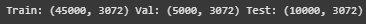

En este bloque de código se carga el dataset CIFAR-10 y se hace un procedimiento para preparar los datos para el entrenamiento:
 - se aplastan las etiquetas para que queden en un vector.
 - se normalizan los píxeles a valores entre -1 y 1 para facilitar el entrenamiento. 
 - se separa un 10% de los datos de entrenamiento para validación.
 - como vamos a usar una red MLP, se aplanan las imágenes de 32×32×3 en vectores de 3072 valores
Nos quedan unos 45000 ejemplos para entrenamiento, 5000 para validación y 10000 para el test.

```python
# Visualizamos algunas imágenes (re-escaladas a [0,1] para plotear)
fig, axes = plt.subplots(2, 8, figsize=(16,4))
for ax in axes.ravel():
    i = np.random.randint(0, len(x_train))
    ax.imshow((x_train[i].reshape(32,32,3)/2 + 0.5).clip(0,1))
    ax.set_title(class_names[y_train[i]])
    ax.axis('off')
plt.tight_layout(); plt.show()
```
#### Resultados
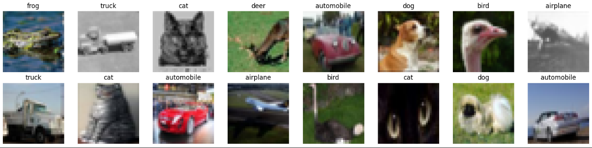

Mostramos algunas imágenes al azar del conjunto de entrenamiento, las ajustamos para que se vean bien y les asignamos el nombre de su clase en una grilla.

## Entrenamiento: Red Neuronal

En el siguiente código se hará un proceso de experimentación sistemática para mejorar el rendimiento de la red neuronal en CIFAR-10. La idea es ir probando mejoras (capas, activaciones, normalización, regularización, optimizadores, etc.) y observar cómo impacta en la precisión y en la pérdida. De esta forma, aprendemos no solo a subir el accuracy, sino también a entender qué decisiones de diseño ayudan y por qué.

Se pondrá el código final pero iremos mostrando las mejoras y los resultados explicando cada paso.

```python
import numpy as np
from sklearn.preprocessing import StandardScaler
from tensorflow import keras
from tensorflow.keras import layers, regularizers

# Preparo los datos
scaler = StandardScaler()
x_train_norm = scaler.fit_transform(x_train)
x_val_norm = scaler.transform(x_val)
x_test_norm = scaler.transform(x_test)

# Data augmentation: agrego ruido
def agregar_ruido(X, y, ruido=0.01):
    X_nuevo = X + np.random.normal(0, ruido, X.shape)
    return X_nuevo, y

x_train_aug, y_train_aug = agregar_ruido(x_train_norm, y_train)

# Armo el modelo
def crear_modelo(input_dim, clases):
    modelo = keras.Sequential([
        layers.Dense(512, activation='relu', kernel_initializer='he_normal',
                     kernel_regularizer=regularizers.l2(1e-4), input_shape=(input_dim,)),
        layers.BatchNormalization(),
        layers.Dropout(0.3),

        layers.Dense(256, activation='relu', kernel_initializer='he_normal',
                     kernel_regularizer=regularizers.l2(1e-4)),
        layers.BatchNormalization(),
        layers.Dropout(0.3),

        layers.Dense(128, activation='relu', kernel_initializer='he_normal',
                     kernel_regularizer=regularizers.l2(1e-4)),
        layers.BatchNormalization(),
        layers.Dropout(0.3),

        layers.Dense(64, activation='relu', kernel_initializer='he_normal',
                     kernel_regularizer=regularizers.l2(1e-4)),
        layers.BatchNormalization(),
        layers.Dropout(0.3),

        layers.Dense(clases, activation='softmax')
    ])

    modelo.compile(
        optimizer=keras.optimizers.RMSprop(learning_rate=0.001),
        loss='sparse_categorical_crossentropy',
        metrics=['accuracy']
    )
    return modelo

# Entreno el modelo
EPOCHS = 30
BATCH = 64

modelo = crear_modelo(x_train.shape[1], len(class_names))

callbacks = [
    keras.callbacks.EarlyStopping(patience=5, restore_best_weights=True),
    keras.callbacks.ReduceLROnPlateau(factor=0.5, patience=3),
    keras.callbacks.ModelCheckpoint('mejor_modelo.keras', save_best_only=True)
]

hist = modelo.fit(
    x_train_aug, y_train_aug,
    validation_data=(x_val_norm, y_val),
    epochs=EPOCHS,
    batch_size=BATCH,
    callbacks=callbacks,
    verbose=1
)

# Evaluación
def mostrar_resultados(modelo, nombre):
    tr_loss, tr_acc = modelo.evaluate(x_train_norm, y_train, verbose=0)
    val_loss, val_acc = modelo.evaluate(x_val_norm, y_val, verbose=0)
    test_loss, test_acc = modelo.evaluate(x_test_norm, y_test, verbose=0)
    print(f"\n🎯 {nombre}")
    print(f"  Accuracy train: {tr_acc:.1%}")
    print(f"  Accuracy val: {val_acc:.1%}")
    print(f"  Accuracy test: {test_acc:.1%}")
    print(f"  Parámetros: {modelo.count_params():,}")

mostrar_resultados(modelo, "Modelo RMSprop + Dropout + BatchNorm + L2 + Aug")

```

#### Resultados: ejecución sin mejoras
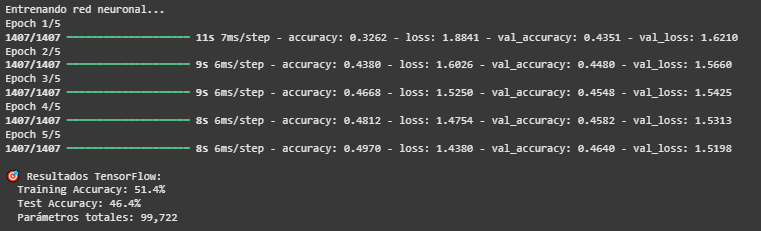

Los accuracy van subiendo y las losses bajan pero aún tenemos un margen de mejora grande, logramos un Training de 51,4% y un Test de 46,4%.

#### Resultados: ejecución con modelo más profundo y ancho
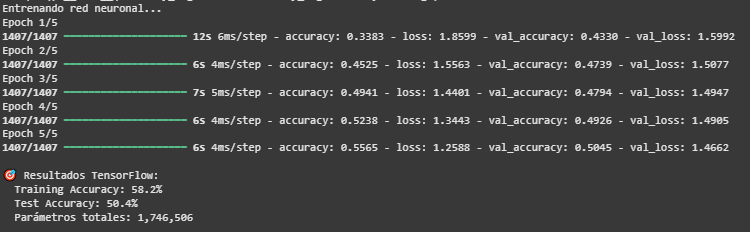

Mejoramos los accuracy bastante, un 7% el Training y un 4% el Test utilizando una cantidad mayor de parámetros, de 100k a 1,7m.

#### Resultados: comparamos funciones de activación
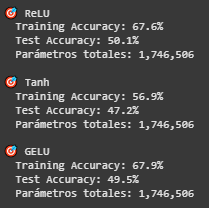

Aqui probamos con cada función de activación, relu, tanh y gelu, además subimos los epoch de 5 a 10 para un mejor entrenamiento.
Podemos observar que Relu y Gelu están a la par, uno mejora el Taining Accuracy y el otro el Test Accuracy, y en cuanto de Tanh no mejora los números de las otras funciones.

#### HeNormal y GlorotUniform
Aquí agregamos un control para las inicializaciones de pesos, en este caso HeNormal y GlorotUniform. La primera ayuda a que las neuronas de Relu no se queden muertas, es decir, dropout 0. Y GlorotUniform evita que los valores no se vuelvan demasiados grandes o pequeños, los generaliza. Probaremos cada inicialización con cada activación y según el resultado elegiremos nuestra combinación de init + func. de actuivación.

#### Resultados:
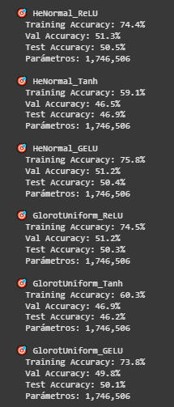

Analizando los resultados, vemos que las activaciones Tanh tienen un desempeño claramente inferior, la accuracy de validación y test se mantiene alrededor de 46-47%, lo que indica que el modelo no está generalizando bien, sin importar si usamos HeNormal o GlorotUniform. Por otro lado, las activaciones ReLU y GELU logran un entrenamiento más alto (74-76%), pero al comparar validación y test, la mejora es mínima, GELU alcanza un poco más de training (75.8%) pero no supera a ReLU en validación ni test (51.2% vs 51.3% en val, 50.4% vs 50.5% en test), lo que sugiere que GELU aprende más del conjunto de entrenamiento pero no mejora la generalización. ReLU con HeNormal combina buen entrenamiento sin sobreajustarse demasiado y mantiene las mejores métricas de validación y test.
Por eso, nos quedamos con HeNormal + ReLU, porque ofrece la mejor generalización y estabilidad entre todas las opciones.

#### Optimizadores e Hiperparámetros

Los hiperparámetros controlan cómo aprende la red, y los optimizadores deciden la estrategia de actualización de pesos. Elegir bien ambos es clave para que el modelo no sobreentrene y logre buena precisión en validación/test.
En nuestro entrenamiento probamos de la siguiente manera:

Hiperparámetros: Usamos distintos learning rates (1e-2, 1e-3, 5e-4) para controlar la velocidad de aprendizaje, un batch size de 64 para procesar los datos en grupos, y subimos a 30 epochs para entrenar lo suficiente sin sobreajustar.

Optimizadores: Probamos Adam, SGD con momentum, RMSprop y AdamW, que son formas distintas de actualizar los pesos de la red para que aprenda de manera rápida y estable, evitando quedarse atascada o sobreentrenar.

#### Resultados:
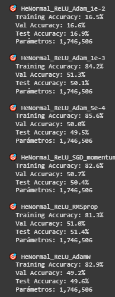

Si analizamos los resultados, lo importante es cómo generaliza, es decir, los valores de validación y test:
- Adam 1e-2 claramente falla (val/test de 16%), learning rate demasiado alto.
- Adam 1e-3 da buen entrenamiento (84.2%) y val/test decentes (51.3% / 50.1%).
- Adam 5e-4 sobreentrena un poquito más (85.6%) pero val/test bajan a 50%.
- SGD momentum y RMSprop dan val/test similares (50-51%), con entrenamiento ligeramente más bajo que Adam.
- AdamW tiene buen train pero val/test bajan (49%).
En conclusión, me quedo con RMSprop. Aunque Adam 1e-3 también está bien, RMSprop logra la mejor accuracy de test (51.4%) y valida estable (51.0%), sin sobreentrenar demasiado. Es la opción más balanceada para generalizar.

#### Callbacks

Los callbacks permiten al modelo vigilar el entrenamiento y actuar automáticamente según lo que pase, sin cambiar la arquitectura ni los datos. Nos ayudan a controlar y mejorar cómo aprende la red en tiempo real, haciendo el entrenamiento más eficiente y estable.

En nuestro caso usamos tres: EarlyStopping, que corta el entrenamiento si la validación deja de mejorar, ReduceLROnPlateau, que reduce el learning rate si la mejora se estanca y ModelCheckpoint, que guarda automáticamente el modelo con mejor desempeño en validación. Con esto evitamos sobreentrenamiento y nos aseguramos de conservar la versión del modelo que mejor generaliza.

#### Resultados:
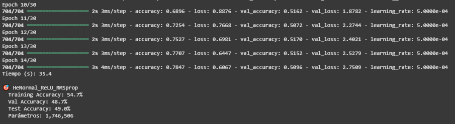

Aquí el modelo aprendió rápido en entrenamiento, pero la validación y el test no mejoraron tanto y hasta empezaron a empeorar un poco, señal de que se está sobreajustando a los datos de entrenamiento. Por eso vamos a agregar Dropout, que básicamente “apaga” algunas neuronas de manera aleatoria mientras aprende, obligando al modelo a no depender demasiado de ciertos caminos y ayudando a que funcione mejor con datos nuevos.

#### Resultados: Con Dropout
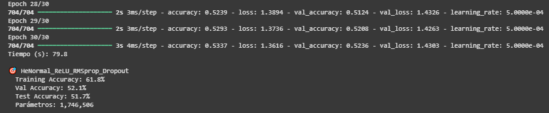

Con Dropout, el modelo aprende más despacio pero generaliza mejor, que es exactamente lo que buscábamos para que funcione bien con datos nuevos.

#### Batch Normalization y regularización L2

Usamos Batch Normalization después de cada capa oculta, que estabiliza el aprendizaje y permite usar learning rates más altos y regularización L2, que penaliza pesos muy grandes y ayuda a evitar sobreajuste. Juntas estas técnicas hacen que el modelo aprenda de forma más estable, generalice mejor y tenga menos riesgo de sobreajustarse a los datos de entrenamiento.

#### Resultado:
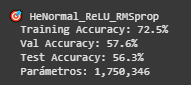

En esta última versión del modelo con Batch Normalization y regularización L2, los resultados muestran que la validación y el test mejoraron bastante comparado con la versión anterior, la val_accuracy pasó de 52% a 57% y la test_accuracy de 51% a 56%. Esto indica que las mejoras ayudaron a que el modelo generalice mejor y no se sobreajuste al entrenamiento, a pesar de que el entrenamiento se hizo un poco más lento y el loss todavía es alto. Básicamente, ahora el modelo aprende de manera más estable y puede predecir mejor datos que no había visto.

#### Data Augmentation

Agregamos data augmentation para “engañar” un poco al modelo y que no se acostumbre demasiado a los datos de entrenamiento, evitando que memorice patrones específicos y sobreentrene. En este caso, le pusimos un ruido leve a las entradas, lo que simula tener más datos distintos de los que realmente tenemos y ayuda a que aprenda a generalizar mejor.

#### Resultado:
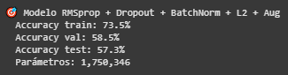

El resultado se nota en las métricas, aunque el entrenamiento sigue siendo más alto, de 73.5%, la validación y el test mejoraron respecto a la versión sin aumento de datos, llegando a 58.5% y 57.3%, lo que indica que el modelo ahora generaliza mejor a datos nuevos y no se queda “pegado” solo a los ejemplos que ya vio.

