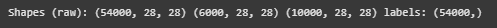
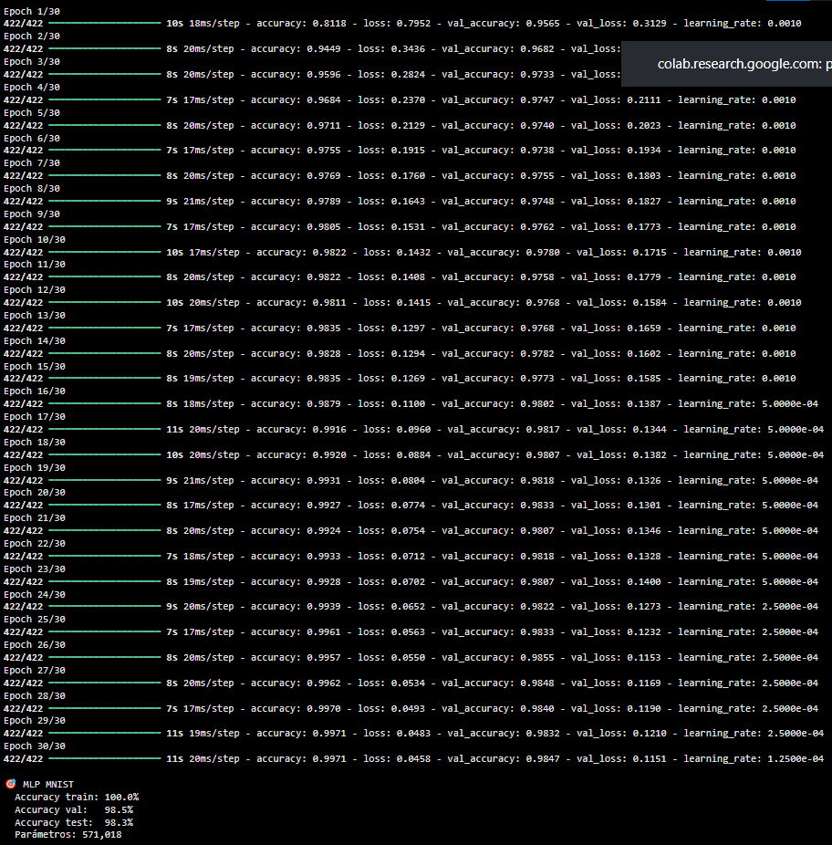

# Práctica 8 - Extra
## ⚡ Backpropagation y Optimizadores (versión dataset MNIST)

## Contexto
En esta práctica continuamos el trabajo previo de exploración y modelado, aplicando ahora la misma metodología al dataset MNIST, un conjunto clásico de imágenes de dígitos escritos a mano. La idea es reproducir el flujo de entrenamiento utilizado anteriormente (como en CIFAR-10), pero adaptandolo a este nuevo.

## Actividades (con tiempos estimados)
- Preparar markdown (40min)
- Implementar pipelines (MLP + CNN) y callbacks (60min)
- Ejecutar experimentos y guardar resultados (80min)
- Documentar hallazgos y generar evidencias (40min)

## Desarrollo
Se entrenó una red MLP sobre el dataset MNIST, a partir de imágenes 28×28 aplanadas y estandarizadas con StandardScaler. Para mejorar la estabilidad y evitar overfitting, se usaron capas densas con activación ReLU, inicialización He normal, BatchNormalization, Dropout y una pequeña regularización L2. Además, se aplicó una augmentación simple agregando ruido a las imágenes. 
El entrenamiento se controló con callbacks como EarlyStopping y ReduceLROnPlateau para lograr un ajuste más fino del modelo.

## Evidencias
- Se adjunta imagen "resultado-t8-extra-1.png" en `docs/assets/`
- Se adjunta imagen "resultado-t8-extra-2.png" en `docs/assets/`

## Reflexión
El modelo MLP demostró un muy buen rendimiento en MNIST, donde alcanzó una precisión alta sin caer en un overfitting grave. Esto muestra que, con una buena normalización y regularización, incluso una arquitectura simple puede aprender de forma efectiva y generalizar bien a nuevos datos.

---

# Backpropagation y Optimizadores

## Preparación del Dataset MNIST

```python
# Carga y setup
import numpy as np
import random, os
import tensorflow as tf
from tensorflow import keras
from tensorflow.keras import layers, regularizers

SEED = 42
random.seed(SEED); np.random.seed(SEED); tf.random.set_seed(SEED)

# 1) Cargo MNIST
(x_train, y_train), (x_test, y_test) = keras.datasets.mnist.load_data()

# 2) Normalizo a [-1, 1]
x_train = x_train.astype("float32")
x_test  = x_test.astype("float32")
x_train_norm = (x_train / 255.0 - 0.5) * 2.0
x_test_norm  = (x_test  / 255.0 - 0.5) * 2.0

# Split de validación al 10% del train
VAL_RATIO = 0.1
n_val = int(len(x_train_norm) * VAL_RATIO)
x_val = x_train_norm[:n_val];    y_val = y_train[:n_val]
x_train = x_train_norm[n_val:];  y_train = y_train[n_val:]

print("Shapes (raw):", x_train.shape, x_val.shape, x_test_norm.shape, "labels:", y_train.shape)
```

#### Resultados


Preparamos todo el entorno y se dejan listos los datos para empezar a entrenar.
Primero se importan las librerías necesarias (NumPy, TensorFlow/Keras, etc.). Después se carga el dataset MNIST, que viene incluido en Keras. Es un conjunto tiene imágenes en escala de grises de dígitos escritos a mano (0–9), de 28×28 píxeles.
Luego se hace la normalización, que consiste en escalar los valores de los píxeles de 0–255 a un rango entre [-1, 1]. Esto ayuda a que el entrenamiento sea más estable y rápido, especialmente cuando usamos funciones de activación como ReLU o tanh.

Por último, se separa un 10 % del conjunto de entrenamiento para validación (x_val, y_val). De esa forma, los datos quedan así:
- x_train: 54 000 imágenes para entrenar el modelo
- x_val: 6 000 imágenes para validar (ver si el modelo generaliza bien)
- x_test: 10 000 imágenes para evaluar al final

Con esto ya queda todo el dataset listo para empezar a experimentar con distintos modelos (MLP, CNN, etc.).

## Experimento MLP (igual que CIFAR: aplanar y MLP)
```python

# Aplanar para MLP
x_train_mlp = x_train.reshape(len(x_train), -1)
x_val_mlp   = x_val.reshape(len(x_val), -1)
x_test_mlp  = x_test_norm.reshape(len(x_test_norm), -1)

from sklearn.preprocessing import StandardScaler
scaler = StandardScaler()
x_train_mlp = scaler.fit_transform(x_train_mlp)
x_val_mlp   = scaler.transform(x_val_mlp)
x_test_mlp  = scaler.transform(x_test_mlp)

# Data augmentation
def agregar_ruido(X, y, ruido=0.02):
    Xn = X + np.random.normal(0, ruido, X.shape)
    return Xn, y

x_train_aug_mlp, y_train_aug_mlp = agregar_ruido(x_train_mlp, y_train, ruido=0.02)

# Modelo MLP
def crear_modelo_mlp(input_dim, clases):
    modelo = keras.Sequential([
        layers.Input(shape=(input_dim,)),
        layers.Dense(512, activation='relu', kernel_initializer='he_normal',
                     kernel_regularizer=regularizers.l2(1e-4)),
        layers.BatchNormalization(),
        layers.Dropout(0.3),

        layers.Dense(256, activation='relu', kernel_initializer='he_normal',
                     kernel_regularizer=regularizers.l2(1e-4)),
        layers.BatchNormalization(),
        layers.Dropout(0.3),

        layers.Dense(128, activation='relu', kernel_initializer='he_normal',
                     kernel_regularizer=regularizers.l2(1e-4)),
        layers.BatchNormalization(),
        layers.Dropout(0.3),

        layers.Dense(clases, activation='softmax')
    ])
    modelo.compile(
        optimizer=keras.optimizers.RMSprop(learning_rate=1e-3),
        loss='sparse_categorical_crossentropy',
        metrics=['accuracy']
    )
    return modelo

modelo_mlp = crear_modelo_mlp(x_train_mlp.shape[1], 10)

callbacks = [
    keras.callbacks.EarlyStopping(patience=6, restore_best_weights=True),
    keras.callbacks.ReduceLROnPlateau(factor=0.5, patience=3),
    keras.callbacks.ModelCheckpoint('mnist_mlp_mejor.keras', save_best_only=True)
]

hist_mlp = modelo_mlp.fit(
    x_train_aug_mlp, y_train_aug_mlp,
    validation_data=(x_val_mlp, y_val),
    epochs=30, batch_size=128, callbacks=callbacks, verbose=1
)

# Evaluación
def mostrar_resultados(modelo, xtr, ytr, xval, yval, xtest, ytest, nombre):
    tr_loss, tr_acc = modelo.evaluate(xtr, ytr, verbose=0)
    val_loss, val_acc = modelo.evaluate(xval, yval, verbose=0)
    test_loss, test_acc = modelo.evaluate(xtest, ytest, verbose=0)
    print(f"\n🎯 {nombre}")
    print(f"  Accuracy train: {tr_acc:.1%}")
    print(f"  Accuracy val:   {val_acc:.1%}")
    print(f"  Accuracy test:  {test_acc:.1%}")
    print(f"  Parámetros: {modelo.count_params():,}")

mostrar_resultados(modelo_mlp, x_train_mlp, y_train, x_val_mlp, y_val, x_test_mlp, y_test, "MLP MNIST")

```

#### Resultados


El modelo alcanzó 100% de accuracy en entrenamiento y alrededor de 98.5% en validación y test, lo que muestra que generaliza muy bien y solo presenta un leve sobreajuste. Se puede observar en los epochs cómo la pérdida disminuye de forma estable y la precisión se mantienen cercanas, loq ue muestra que en fue un entrenamiento correcto y sin divergencias. Para un MLP, este desempeño es excelente y confirma que la normalización, el dropout y la regularización lograron un equilibrio entre ajuste y generalización ideales.