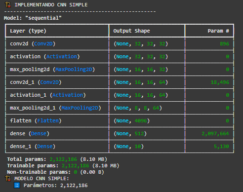
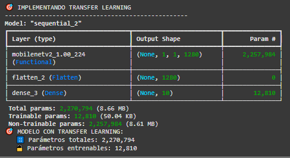
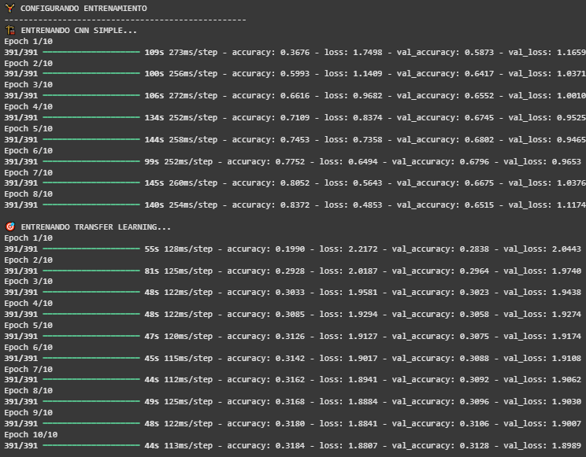
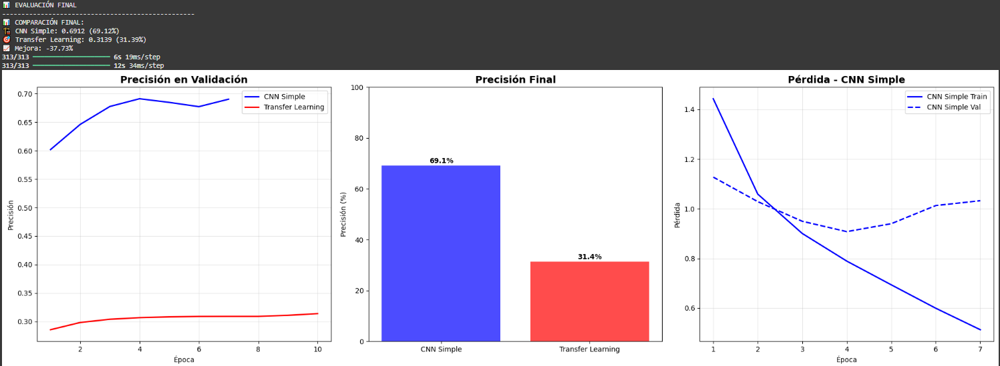
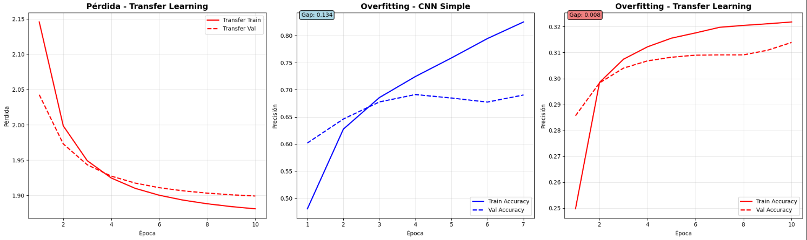
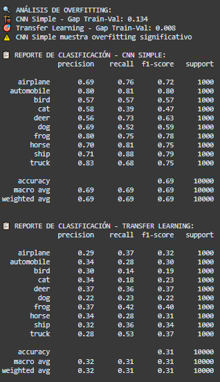

# Práctica 9
## 📚 CNNs y Transfer Learning

## Contexto
En esta práctica trabajamos con redes neuronales convolucionales (CNNs) y Transfer Learning usando TensorFlow/Keras. El objetivo fue comparar una CNN construida desde cero contra un modelo preentrenado (MobileNetV2) aplicado al dataset CIFAR-10. Esto permitió entender cómo funcionan las CNNs y cuándo conviene aprovechar pesos preentrenados para acelerar el desarrollo.

## Objetivos
- Implementar CNNs usando TensorFlow/Keras para clasificación de imágenes  
- Aplicar Transfer Learning con modelos preentrenados de Keras Applications  
- Procesar datasets de imágenes con ImageDataGenerator  
- Evaluar modelos con métricas de clasificación  
- Comparar arquitecturas CNN vs modelos con Transfer Learning  

## Actividades (con tiempos estimados)
- Código completado (30min)
- Análisis de resultados (90min)
- Diseño de la page (40min)

## Desarrollo
Primero se preparó el dataset CIFAR-10 mediante normalización y codificación categórica de las etiquetas. Luego se construyó una CNN simple con dos bloques convolucionales y una capa densa final. En paralelo, se implementó un modelo de Transfer Learning usando MobileNetV2, manteniendo congeladas sus capas base.

Ambos modelos fueron entrenados y comparados.  
La CNN alcanzó aproximadamente un 69% de accuracy, mostrando señales de overfitting pero un aprendizaje sólido. En cambio, el modelo con MobileNetV2 logró alrededor del 31%, funcionando de forma más estable pero sin adaptarse tan bien al tamaño reducido y características particulares de CIFAR-10.

## Evidencias
Todas las imágenes se encuentran en `docs/assets/`.

### 📌 Conjuntos de resultados
Incluye imagenes desde **resultado-t9-1.png** a la **resultado-t9-7.png**

## Reflexión
La práctica permitió comparar directamente cuándo conviene entrenar desde cero y cuándo usar Transfer Learning. En este caso, la CNN superó ampliamente al modelo preentrenado, mostrando que la arquitectura compacta se ajustaba mejor a imágenes pequeñas como CIFAR-10. El Transfer Learning puede ser muy potente, pero solo cuando el dominio del dataset coincide razonablemente con el modelo base. El ejercicio dejó claro que no existe un modelo universalmente superior, sino que depende del tipo de datos y del ajuste realizado.

---

# CNNs y Transfer Learning con TensorFlow/Keras: solución
## Setup inicial

Preparamos todo para empezar a trabajar sobre el dataset CIFAR-10 que vimos en prácticas anteriores.
A diferencia de otros setups inicial, aquí intentamos utilizar algún GPU disponible si existe, en caso contrario simplemente usamos el CPU.

```python
# Importar librerías necesarias
import tensorflow as tf
from tensorflow import keras
from tensorflow.keras import layers, applications, optimizers, callbacks
from tensorflow.keras.preprocessing.image import ImageDataGenerator
import matplotlib.pyplot as plt
import numpy as np
from sklearn.metrics import classification_report
import warnings
warnings.filterwarnings('ignore')

# Configuración de GPU
physical_devices = tf.config.list_physical_devices('GPU')
if physical_devices:
    tf.config.experimental.set_memory_growth(physical_devices[0], True)
    print("🔧 GPU configurada correctamente")
else:
    print("🔧 Usando CPU")

# Seeds para reproducibilidad
tf.random.set_seed(42)
np.random.seed(42)

print("✅ Entorno TensorFlow/Keras configurado correctamente")
```

## Preparamos dataset CIFAR-10

En primer lugar descargamos las imágenes y las separamos en conjuntos de entrenamiento y prueba. Luego normalizamos los valores de los píxeles, de 0-255 a 0-1 para que el modelo entrene más rápido y de forma más estable. Después convertimos las etiquetas numéricas en vectores “one-hot”, que es el formato que entiende una red para clasificar entre varias clases. Y por último definimos los nombres de las categorías como avión, auto, gato, etc.

```python
# === PREPARAR DATASET CIFAR-10 ===

print("📊 PREPARANDO DATASET CIFAR-10")
print("-" * 50)

# 1. Cargar dataset CIFAR-10
(x_train, y_train), (x_test, y_test) = keras.datasets.cifar10.load_data()  # dataset CIFAR-10

# 2. Normalizar imágenes (0-255 -> 0-1)
x_train = x_train.astype('float32') / 255.0
x_test = x_test.astype('float32') / 255.0

# 3. Convertir labels a categorical (one-hot encoding)
num_classes = 10
y_train = keras.utils.to_categorical(y_train, num_classes)
y_test = keras.utils.to_categorical(y_test, num_classes)

# 4. Definir nombres de clases
class_names = ['airplane', 'automobile', 'bird', 'cat', 'deer', 
               'dog', 'frog', 'horse', 'ship', 'truck']

print("📊 INFORMACIÓN DEL DATASET:")
print(f"   📈 Entrenamiento: {x_train.shape[0]} imágenes")
print(f"   🧪 Test: {x_test.shape[0]} imágenes")
print(f"   📐 Dimensiones: {x_train.shape[1:]} (HxWxC)")
print(f"   📋 Clases: {num_classes}")

# 5. Configurar batch size para entrenamiento
batch_size = 128
print(f"   📦 Batch size: {batch_size}")
```

#### Resultados: carácteristicas del dataset


Como se puede apreciar contamos con 60000 imágenes en total, de las cuales 50000 se usarán para el entrenamiento y 10000 para la prueba, y además, cada imágen pertenece a una de las 10 clases que definimos anteriormente.

## CNN

```python
# === CNN SIMPLE DESDE CERO ===

print("🏗️ IMPLEMENTANDO CNN SIMPLE")
print("-" * 50)

def create_simple_cnn(input_shape=(32, 32, 3), num_classes=10):
    model = keras.Sequential([
        # Bloque convolucional 1
        layers.Conv2D(32, (3, 3), padding='same', input_shape=input_shape),
        layers.Activation('relu'),
        layers.MaxPooling2D((2, 2)),

        # Bloque convolucional 2
        layers.Conv2D(64, (3, 3), padding='same'),
        layers.Activation('relu'),
        layers.MaxPooling2D((2, 2)),

        # Clasificador
        layers.Flatten(),
        layers.Dense(512, activation='relu'),
        layers.Dense(num_classes, activation='softmax')
    ])

    return model

# Crear modelo CNN simple
simple_cnn = create_simple_cnn()

# Compilar modelo
simple_cnn.compile(
    optimizer=optimizers.Adam(learning_rate=0.001),  # optimizador popular
    loss='categorical_crossentropy',
    metrics=['accuracy']
)

# Mostrar arquitectura
simple_cnn.summary()

# Contar parámetros
total_params = simple_cnn.count_params()
print(f"🏗️ MODELO CNN SIMPLE:")
print(f"   🔢 Parámetros: {total_params:,}")
```

#### Resultados: CNN


Este modelo CNN tiene dos bloques convolucionales que se encargan de extraer características de las imágenes, reduciendo el tamaño mientras aprenden patrones visuales cada vez más complejos. Después, cuando usamos Flatten se transforman esos mapas de características en un vector plano que pasa por dos capas, una intermedia con 512 neuronas y una final con 10 salidas que usa softmax para predecir la clase de la imágen.

## Transfer Learning

```python
# === TRANSFER LEARNING CON KERAS APPLICATIONS ===

print("🎯 IMPLEMENTANDO TRANSFER LEARNING")
print("-" * 50)

# 1. Crear modelo con transfer learning
def create_transfer_model(input_shape=(32, 32, 3), num_classes=10):
    base_model = applications.MobileNetV2(
        weights='imagenet',
        include_top=False,
        input_shape=input_shape
    )
    # Congelar capas del modelo base
    base_model.trainable = False

    # Crear modelo completo
    model = keras.Sequential([
        base_model,
        layers.Flatten(),
        layers.Dense(num_classes, activation='softmax')
    ])

    return model

# 2. Crear modelo
transfer_model = create_transfer_model()

# Compilar modelo con learning rate más bajo para transfer learning
transfer_model.compile(
    optimizer=optimizers.Adam(learning_rate=0.001),  # LR más bajo para transfer learning
    loss='categorical_crossentropy',
    metrics=['accuracy']
)

# Mostrar arquitectura
transfer_model.summary()

# Contar parámetros
total_params = transfer_model.count_params()
trainable_params = sum([tf.keras.backend.count_params(w) for w in transfer_model.trainable_weights])

print("🎯 MODELO CON TRANSFER LEARNING:")
print(f"   🔢 Parámetros totales: {total_params:,}")
print(f"   🔓 Parámetros entrenables: {trainable_params:,}")
```

```python
# 3. Configurar fine-tuning
def setup_fine_tuning(model, unfreeze_layers=10):
    # Descongelar las últimas capas del modelo base
    base_model = model.layers[0]
    base_model.trainable = True

    # Congelar todas las capas excepto las últimas N
    for layer in base_model.layers[:-unfreeze_layers]:
        layer.trainable = False

    # Recompilar con learning rate más bajo
    model.compile(
        optimizer=optimizers.Adam(learning_rate=0.0001),  # LR más bajo para fine-tuning
        loss='categorical_crossentropy',
        metrics=['accuracy']
    )

    trainable = sum([tf.keras.backend.count_params(w) for w in model.trainable_weights])
    print(f"🔓 Fine-tuning configurado - Parámetros entrenables: {trainable:,}")

    return model

# Configurar fine-tuning (opcional)
# transfer_model = setup_fine_tuning(transfer_model, unfreeze_layers=10)
```

#### Resultados: Transfer Learning


Usamos transfer learning, una técnica que aprovecha una red ya entrenada con millones de imágenes para no empezar desde cero. Básicamente, se toma una red como MobileNetV2, que ya “sabe ver”, y se le cambia la parte final para que aprenda a reconocer las 10 clases del dataset CIFAR-10. Al principio solo se entrena esa parte final, y después, con el fine-tuning, se ajustan también algunas capas del modelo original para que se adapte mejor al nuevo conjunto de imágenes. Así se entrena más rápido, con menos datos y se obtienen mejores resultados que creando una red desde cero.

## Entrenamiento

```python
# === ENTRENAMIENTO DE MODELOS ===

print("🏋️ CONFIGURANDO ENTRENAMIENTO")
print("-" * 50)

# Configurar callbacks
callbacks_list = [
    callbacks.EarlyStopping(
        monitor='val_accuracy',
        patience=3,
        restore_best_weights=True
    )
]

# Entrenar CNN simple
print("🏗️ ENTRENANDO CNN SIMPLE...")
simple_history = simple_cnn.fit(
    x_train, y_train,
    batch_size=batch_size,
    epochs=10,
    validation_data=(x_test, y_test),
    callbacks=callbacks_list,
    verbose=1
)

print("\n🎯 ENTRENANDO TRANSFER LEARNING...")
transfer_history = transfer_model.fit(
    x_train, y_train,
    batch_size=batch_size,
    epochs=10,
    validation_data=(x_test, y_test),
    callbacks=callbacks_list,
    verbose=1
)

# Extraer métricas de entrenamiento
simple_train_acc = simple_history.history['accuracy']
simple_test_acc = simple_history.history['val_accuracy']
transfer_train_acc = transfer_history.history['accuracy']
transfer_test_acc = transfer_history.history['val_accuracy']
```

#### Resultados: Entrenamiento


Si comparamos el entrenamiento de una CNN simple con un modelo de transfer learning, parece que la red desde cero aprende más rápido y alcanza una buena precisión en pocas epochs, mientras que el modelo preentrenado avanza más lento y se estanca en valores bajos.

## Análisis final

```python
# === EVALUACIÓN FINAL ===

print("📊 EVALUACIÓN FINAL")
print("-" * 50)

# Evaluar ambos modelos
simple_loss, simple_acc = simple_cnn.evaluate(x_test, y_test, verbose=0)
transfer_loss, transfer_acc = transfer_model.evaluate(x_test, y_test, verbose=0)

# Comparar resultados
print("📊 COMPARACIÓN FINAL:")
print(f"🏗️ CNN Simple: {simple_acc:.4f} ({simple_acc*100:.2f}%)")
print(f"🎯 Transfer Learning: {transfer_acc:.4f} ({transfer_acc*100:.2f}%)")
print(f"📈 Mejora: {(transfer_acc - simple_acc)*100:+.2f}%")

# Obtener predicciones para análisis detallado
simple_predictions = simple_cnn.predict(x_test)
transfer_predictions = transfer_model.predict(x_test)

# Convertir predicciones a clases
simple_pred_classes = np.argmax(simple_predictions, axis=1)
transfer_pred_classes = np.argmax(transfer_predictions, axis=1)
true_classes = np.argmax(y_test, axis=1)

# Graficar resultados con análisis de overfitting
plt.figure(figsize=(20, 12))

# Crear épocas específicas para cada métrica
simple_acc_epochs = range(1, len(simple_train_acc) + 1)
simple_loss_epochs = range(1, len(simple_history.history['loss']) + 1)
transfer_acc_epochs = range(1, len(transfer_train_acc) + 1)
transfer_loss_epochs = range(1, len(transfer_history.history['loss']) + 1)

# 1. Precisión en Validación
plt.subplot(2, 3, 1)
plt.plot(simple_acc_epochs, simple_test_acc, 'b-', label='CNN Simple', linewidth=2)
plt.plot(transfer_acc_epochs, transfer_test_acc, 'r-', label='Transfer Learning', linewidth=2)
plt.title('Precisión en Validación', fontsize=14, fontweight='bold')
plt.xlabel('Época')
plt.ylabel('Precisión')
plt.legend()
plt.grid(True, alpha=0.3)

# 2. Precisión Final (Bar Chart)
plt.subplot(2, 3, 2)
models = ['CNN Simple', 'Transfer Learning']
accuracies = [simple_acc*100, transfer_acc*100]
bars = plt.bar(models, accuracies, color=['blue', 'red'], alpha=0.7)
plt.title('Precisión Final', fontsize=14, fontweight='bold')
plt.ylabel('Precisión (%)')
plt.ylim(0, 100)

for i, (bar, acc) in enumerate(zip(bars, accuracies)):
    plt.text(bar.get_x() + bar.get_width()/2, acc + 1, f'{acc:.1f}%', 
             ha='center', fontweight='bold')

# 3. Pérdida durante Entrenamiento (CNN Simple)
plt.subplot(2, 3, 3)
plt.plot(simple_loss_epochs, simple_history.history['loss'], 'b-', label='CNN Simple Train', linewidth=2)
plt.plot(simple_loss_epochs, simple_history.history['val_loss'], 'b--', label='CNN Simple Val', linewidth=2)
plt.title('Pérdida - CNN Simple', fontsize=14, fontweight='bold')
plt.xlabel('Época')
plt.ylabel('Pérdida')
plt.legend()
plt.grid(True, alpha=0.3)

# 4. Pérdida durante Entrenamiento (Transfer Learning)
plt.subplot(2, 3, 4)
plt.plot(transfer_loss_epochs, transfer_history.history['loss'], 'r-', label='Transfer Train', linewidth=2)
plt.plot(transfer_loss_epochs, transfer_history.history['val_loss'], 'r--', label='Transfer Val', linewidth=2)
plt.title('Pérdida - Transfer Learning', fontsize=14, fontweight='bold')
plt.xlabel('Época')
plt.ylabel('Pérdida')
plt.legend()
plt.grid(True, alpha=0.3)

# 5. Análisis de Overfitting - CNN Simple
plt.subplot(2, 3, 5)
train_acc = simple_history.history['accuracy']
val_acc = simple_history.history['val_accuracy']
plt.plot(simple_acc_epochs, train_acc, 'b-', label='Train Accuracy', linewidth=2)
plt.plot(simple_acc_epochs, val_acc, 'b--', label='Val Accuracy', linewidth=2)
plt.title('Overfitting - CNN Simple', fontsize=14, fontweight='bold')
plt.xlabel('Época')
plt.ylabel('Precisión')
plt.legend()
plt.grid(True, alpha=0.3)

# Calcular gap de overfitting
overfitting_gap_simple = max(train_acc) - max(val_acc)
plt.text(0.02, 0.98, f'Gap: {overfitting_gap_simple:.3f}', 
         transform=plt.gca().transAxes, fontsize=10, 
         bbox=dict(boxstyle="round,pad=0.3", facecolor="lightblue"))

# 6. Análisis de Overfitting - Transfer Learning
plt.subplot(2, 3, 6)
train_acc_tl = transfer_history.history['accuracy']
val_acc_tl = transfer_history.history['val_accuracy']
plt.plot(transfer_acc_epochs, train_acc_tl, 'r-', label='Train Accuracy', linewidth=2)
plt.plot(transfer_acc_epochs, val_acc_tl, 'r--', label='Val Accuracy', linewidth=2)
plt.title('Overfitting - Transfer Learning', fontsize=14, fontweight='bold')
plt.xlabel('Época')
plt.ylabel('Precisión')
plt.legend()
plt.grid(True, alpha=0.3)

# Calcular gap de overfitting
overfitting_gap_tl = max(train_acc_tl) - max(val_acc_tl)
plt.text(0.02, 0.98, f'Gap: {overfitting_gap_tl:.3f}', 
         transform=plt.gca().transAxes, fontsize=10, 
         bbox=dict(boxstyle="round,pad=0.3", facecolor="lightcoral"))

plt.tight_layout()
plt.show()

# Análisis de overfitting
print("\n🔍 ANÁLISIS DE OVERFITTING:")
print(f"🏗️ CNN Simple - Gap Train-Val: {overfitting_gap_simple:.3f}")
print(f"🎯 Transfer Learning - Gap Train-Val: {overfitting_gap_tl:.3f}")

if overfitting_gap_simple > 0.1:
    print("⚠️ CNN Simple muestra overfitting significativo")
if overfitting_gap_tl > 0.1:
    print("⚠️ Transfer Learning muestra overfitting significativo")

# Reporte de clasificación
print("\n📋 REPORTE DE CLASIFICACIÓN - CNN SIMPLE:")
print(classification_report(true_classes, simple_pred_classes, target_names=class_names))

print("\n📋 REPORTE DE CLASIFICACIÓN - TRANSFER LEARNING:")
print(classification_report(true_classes, transfer_pred_classes, target_names=class_names))
```

#### Resultados: Análisis de los modelos


La red CNN simple rindió mucho mejor que el modelo con transfer learning, llegó a un 69% de precisión, mientras que el transfer apenas alcanzó un 31%. Esto muestra que el modelo preentrenado no logró adaptarse bien a nuestro conjunto de datos. También se nota un poco de overfitting en la CNN, ya que mejora mucho en el entrenamiento pero no tanto en la validación. En definitiva, nuestro modelo desde cero fue más efectivo para este caso, aunque se podría mejorar un poco más con técnicas como regularización o data augmentation.




Aquí se puede apreciar más el comportamiento de cada modelo durante el entrenamiento. En el Transfer Learning, la pérdida bajó de forma estable y sin mucha diferencia entre entrenamiento y validación, lo que indica que no hubo overfitting, pero también que el modelo no aprendió mucho. Por otro lado, la CNN sí logró aprender más, aunque con un gap de 0.13 entre train y val, lo que indica un poco de overfitting. Se adapta muy bien a los datos de entrenamiento, pero no tanto a los nuevos. En resumen, la CNN aprendió más, pero con algo de overfitting, mientras que el modelo transfer fue más estable pero menos efectivo.

