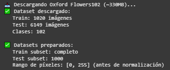
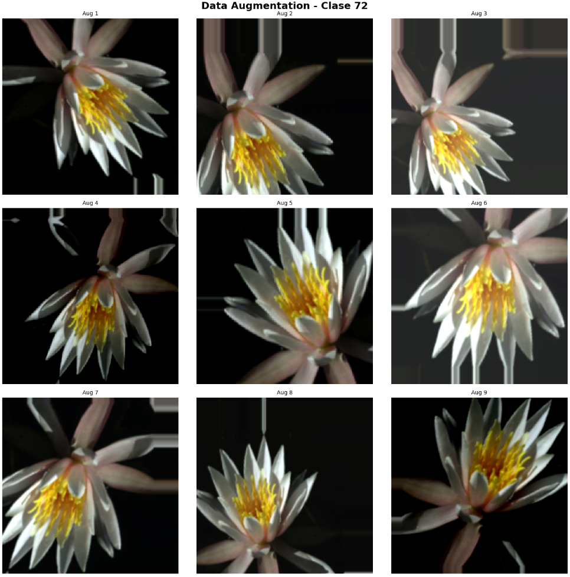
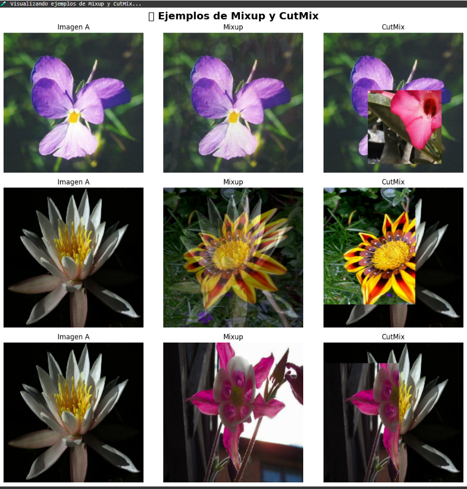
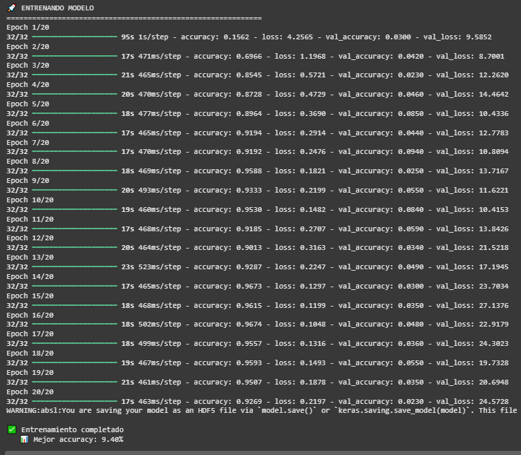
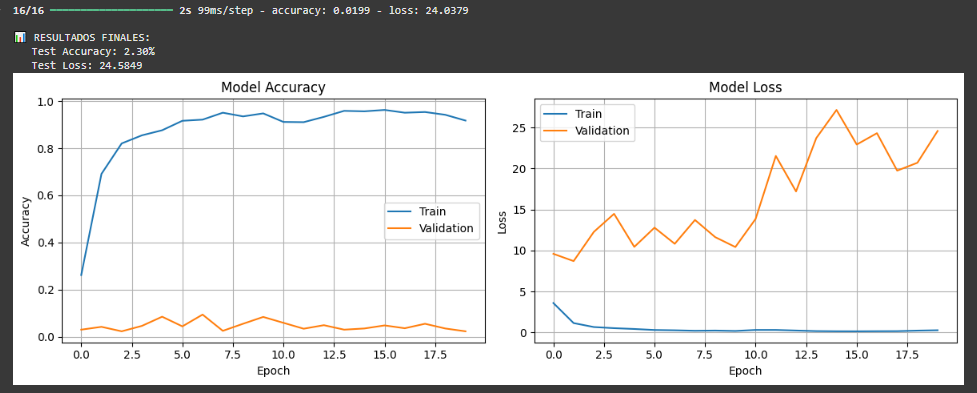
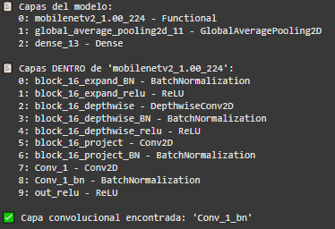
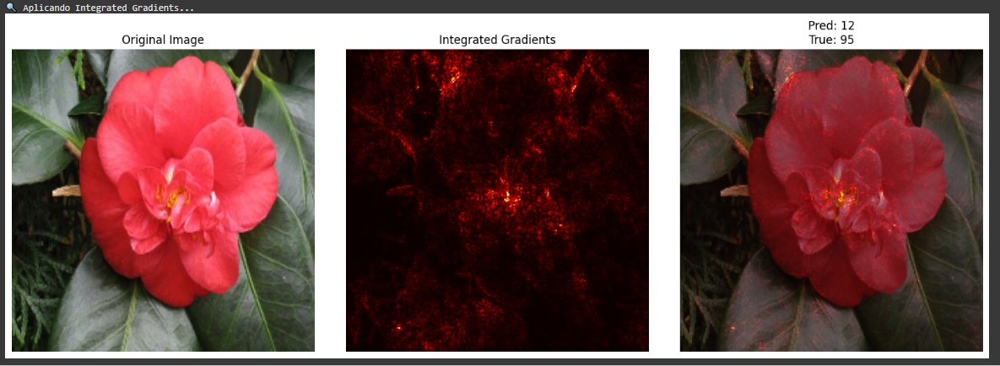

# Práctica 10
## 📚 Data Augmentation Avanzado

## Contexto
En esta práctica trabajamos con el dataset Flowers102, que contiene imágenes de flores de alta resolución y gran variabilidad entre clases. El objetivo fue aplicar diferentes técnicas de data augmentation (básicas y avanzadas como Mixup y CutMix) para mejorar la robustez del modelo, y posteriormente usar GradCAM e Integrated Gradients para analizar los resultados.

## Objetivos
- Trabajar con datasets complejos de imágenes de alta resolución (Flowers102)
- Implementar pipelines de augmentation con TensorFlow/Keras
- Aplicar técnicas avanzadas: Mixup y CutMix
- Evaluar robustez de modelos ante perturbaciones
- Implementar GradCAM para visualizar atención del modelo
- Aplicar Integrated Gradients para explicabilidad
- Comparar modelos augmentados vs baseline

## Actividades (con tiempos estimados)
- Parte 1 (10 min): Creación del pipeline base con EfficientNet y preparación del dataset.
- Parte 2 (30 min): Análisis, completitud y visualización de data augmentation clásico (rotación, zoom, flip, etc.).
- Parte 3 (60 min): Implementación y visualización de técnicas avanzadas (Mixup y CutMix).
- Parte 4 (30 min): Entrenamiento y evaluación del modelo baseline y modelo augmentado.
- Parte 5 (20 min): Analizar aplicación de GradCAM e Integrated Gradients.
- Parte 6 (40 min): Análisis de resultados generales, errores del modelo y reflexión final.

## Desarrollo
Primero se usó un pipeline baseline usando EfficientNetB0 con un preprocesamiento básico y sin augmentation. Luego se incorporaron distintas capas de data augmentation, comparando cómo afectaban las imágenes y el entrenamiento.
Más adelante se probaron las técnicas Mixup y CutMix, que combinan imágenes y etiquetas para aumentar la variedad de los datos. Se generaron visualizaciones para verificar su funcionamiento. Finalmente, se aplicaron GradCAM e Integrated Gradients para observar qué partes de las imágenes activaban el modelo y evaluar si realmente estaba mirando la flor. Los resultados mostraron una baja accuracy general y activaciones difusas, lo que indica que el modelo aún no logra captar bien los patrones visuales correctos.

## Evidencias
- Se adjunta imagen "resultado-t10-1.png" en `docs/assets/`
- Se adjunta imagen "resultado-t10-2.png" en `docs/assets/`
- Se adjunta imagen "resultado-t10-3.png" en `docs/assets/`
- Se adjunta imagen "resultado-t10-4.png" en `docs/assets/`
- Se adjunta imagen "resultado-t10-5.png" en `docs/assets/`
- Se adjunta imagen "resultado-t10-6.png" en `docs/assets/`
- Se adjunta imagen "resultado-t10-7.png" en `docs/assets/`
- Se adjunta imagen "resultado-t10-8.png" en `docs/assets/`
- Se adjunta imagen "resultado-t10-9.png" en `docs/assets/`

## Reflexión
La práctica mostró que el data augmentation y las técnicas avanzadas como Mixup y CutMix no lograron mejorar la accuracy, aunque ayudaron a generar mayor variabilidad visual. GradCAM e Integrated Gradients sirvieron para entender que el modelo todavía no presta atención a las regiones correctas, lo que explica sus errores. En general, la práctica ayudó a entender la importancia del aumento de datos y la explicabilidad en modelos de visión, y cómo un modelo potente necesita un entrenamiento más profundo y una mejor preparación del dataset para rendir bien.

---

# Data Augmentation Avanzado & Explicabilidad

## 💻 Parte 1: Setup inicial

En esta parte se instalan e importan las librerías necesarias para trabajar con redes neuronales y aumentación de datos, usando TensorFlow, TensorFlow Datasets y Albumentations. También se configura el entorno y se fijan semillas para que los resultados sean reproducibles.

```python
# === INSTALACIÓN DE DEPENDENCIAS ===
!pip install -q tensorflow tensorflow-datasets albumentations

# === IMPORTS ===
import tensorflow as tf
import tensorflow_datasets as tfds
from tensorflow import keras
from tensorflow.keras import layers, models
from tensorflow.keras.applications.efficientnet import preprocess_input
import numpy as np
import matplotlib.pyplot as plt
from PIL import Image
import warnings
warnings.filterwarnings('ignore')

# Albumentations (opcional para Parte 3)
import albumentations as A

print(f"✅ TensorFlow version: {tf.__version__}")
print(f"✅ Albumentations version: {A.__version__}")
print(f"🖥️ GPU disponible: {tf.config.list_physical_devices('GPU')}")

# Reproducibilidad
tf.random.set_seed(42)
np.random.seed(42)
```

## Paso 2: Preparamos dataset Oxford Flowers102

```python
print("📥 Descargando Oxford Flowers102 (~330MB)...")

# Cargar dataset con TFDS
(ds_train, ds_test), ds_info = tfds.load(
    'oxford_flowers102',
    split=['train', 'test'],
    shuffle_files=True,
    as_supervised=True,
    with_info=True,
)

print(f"✅ Dataset descargado:")
print(f"   Train: {ds_info.splits['train'].num_examples} imágenes")
print(f"   Test: {ds_info.splits['test'].num_examples} imágenes")
print(f"   Clases: {ds_info.features['label'].num_classes}")

NUM_CLASSES = ds_info.features['label'].num_classes
IMG_SIZE = 224

# === PREPARAR DATASET PARA ENTRENAMIENTO ===

def prepare_dataset(dataset, subset_size=None):
    """
    Prepara dataset con resize (sin normalización todavía)

    Args:
        dataset: Dataset de TFDS
        subset_size: Número de muestras (None para usar todo)

    Returns:
        Dataset preparado
    """
    # Tomar subset si se especifica
    if subset_size:
        dataset = dataset.take(subset_size)

    # Función de preprocesamiento básico
    def preprocess(image, label):
        # Resize y convertir a float32 [0, 255]
        image = tf.image.resize(image, [IMG_SIZE, IMG_SIZE])
        image = tf.cast(image, tf.float32)
        return image, label

    dataset = dataset.map(preprocess, num_parallel_calls=tf.data.AUTOTUNE)

    return dataset

# Crear datasets (usar subset para práctica rápida)
SUBSET_TRAIN = 5000  # Cambiar a None para dataset completo
SUBSET_TEST = 1000

ds_train_prepared = prepare_dataset(ds_train, subset_size=SUBSET_TRAIN)
ds_test_prepared = prepare_dataset(ds_test, subset_size=SUBSET_TEST)

print(f"\n✅ Datasets preparados:")
print(f"   Train subset: {SUBSET_TRAIN if SUBSET_TRAIN else 'completo'}")
print(f"   Test subset: {SUBSET_TEST}")
print(f"   Rango de píxeles: [0, 255] (antes de normalización)")
```

#### Resultados


El dataset de flores se descargó correctamente y quedó listo para usar. Tiene 102 clases distintas y un total de más de 7000 imágenes, que dividimos en entrenamiento y prueba. En la práctica usamos todo el dataset y 1000 para testear.

## 💻 Parte 2: Pipelines de Data Augmentation
## Paso 3: Pipeline Baseline

```python
# === PIPELINE 1: BASELINE ===

def create_baseline_pipeline(dataset, batch_size=32, training=True):
    """
    Pipeline básico sin augmentation avanzada
    """
    if training:
        dataset = dataset.shuffle(1000)

    dataset = dataset.batch(batch_size)

    # Aplicar normalización DESPUÉS de batching
    def normalize_batch(images, labels):
        # Normalizar con EfficientNet preprocessing
        images = preprocess_input(images)
        return images, labels

    dataset = dataset.map(normalize_batch, num_parallel_calls=tf.data.AUTOTUNE)
    dataset = dataset.prefetch(tf.data.AUTOTUNE)

    return dataset

# Crear dataloaders baseline
BATCH_SIZE = 32

train_baseline = create_baseline_pipeline(ds_train_prepared, batch_size=BATCH_SIZE, training=True)
test_baseline = create_baseline_pipeline(ds_test_prepared, batch_size=64, training=False)

print("✅ Pipeline Baseline creado (con normalización EfficientNet)")
```

En esta parte se crea el pipeline baseline, que básicamente es el flujo de datos que se va a usar para entrenar el modelo sin aplicar todavía ninguna aumentación de imágenes.

## Paso 4: Pipeline con Augmentation avanzada

```python
# === PIPELINE 2: AUGMENTATION AVANZADO ===

def augment_layer():
    """
    Crea capa de augmentation con Keras
    """
    return keras.Sequential([
        # Geométrico
        layers.RandomFlip("horizontal_and_vertical"),  # horizontal o vertical
        layers.RandomRotation(0.125),  # factor de rotación (0.125 = 45°)
        layers.RandomZoom(height_factor=(-0.2, 0.2), width_factor=None),
        layers.RandomTranslation(height_factor=0.2, width_factor=0.2, fill_mode='nearest', seed=42),

        # Fotométrico
        layers.RandomBrightness(factor=0.2),
        layers.RandomContrast(factor=0.2),

        # Agrega mas como desees
    ], name="augmentation")

# Crear augmentation layer
data_augmentation = augment_layer()

def create_augmented_pipeline(dataset, batch_size=32, training=True):
    """
    Pipeline con data augmentation
    """
    if training:
        dataset = dataset.shuffle(1000)

    dataset = dataset.batch(batch_size)

    # Aplicar augmentation y luego normalización
    if training:
        def augment_and_normalize(images, labels):
            # Primero augmentation (sobre imágenes [0, 255])
            images = data_augmentation(images, training=True)
            # Luego normalización para EfficientNet
            images = preprocess_input(images)
            return images, labels

        dataset = dataset.map(augment_and_normalize, num_parallel_calls=tf.data.AUTOTUNE)
    else:
        dataset = dataset.map(
            lambda x, y: (preprocess_input(x), y),
            num_parallel_calls=tf.data.AUTOTUNE
        )

    dataset = dataset.prefetch(tf.data.AUTOTUNE)

    return dataset

train_augmented = create_augmented_pipeline(ds_train_prepared, batch_size=BATCH_SIZE, training=True)

print("✅ Pipeline Avanzado creado con Keras layers + normalización")
```

En esta parte se crea un pipeline más completo, que además de preparar los datos, aplica aumentación (data augmentation) para generar más variedad de imágenes a partir del mismo dataset. La idea es que el modelo vea distintas versiones de las mismas flores, como por ejemplo, rotadas, volteadas, con cambios de brillo o zoom, etc, y aprenda a generalizar mejor en lugar de memorizar y caer en el overfitting.

## Paso 5: Visualizar Augmentations

```python
# === VISUALIZAR EFECTO DE AUGMENTATIONS ===

def visualize_augmentations(dataset, n_examples=9):
    """
    Visualiza múltiples augmentations de una misma imagen
    """
    # Tomar una imagen del dataset SIN normalizar (antes del pipeline)
    for images, labels in ds_train_prepared.batch(1).take(1):
        image = images[0:1]  # Tomar primera imagen [1, 224, 224, 3]
        label = labels[0].numpy()
        break

    fig, axes = plt.subplots(3, 3, figsize=(15, 15))
    fig.suptitle(f"Data Augmentation - Clase {label}", fontsize=18, fontweight='bold')

    for i, ax in enumerate(axes.flat):
        # Aplicar augmentation (sobre imagen [0, 255])
        augmented = data_augmentation(image, training=True)[0]

        # Convertir a [0, 1] para visualización
        img_display = augmented.numpy() / 255.0
        img_display = np.clip(img_display, 0, 1)

        ax.imshow(img_display)
        ax.axis('off')
        ax.set_title(f'Aug {i+1}', fontsize=10)

    plt.tight_layout()
    plt.show()

# Visualizar augmentations
print("🎨 VISUALIZACIÓN: Data Augmentation")
print("   Nota: Visualización usa imágenes [0, 255] ANTES de normalización")
visualize_augmentations(ds_train_prepared)
```

#### Resultados: visualización


Vemos cómo una misma imagen original fue transformada de distintas formas gracias al pipeline de augmentación avanzada.
Cada versión represnta variaciones en rotación, brillo, contraste, zoom y traslación, simulando diferentes condiciones de la misma imágen.
De esta forma, el modelo durante el entrenamiento aprende a reconocer la clase más allá de los cambios visuales, mejorando su capacidad de generalización y reduciendo el overfitting.

## 💻 Parte 3 (OPCIONAL): Explorar Mixup/CutMix

Tomamos imágenes del dataset, se elige dos al azar y genera dos combinaciones. La primera para Mixup, que mezcla suavemente ambas imágenes, y una segunda para CutMix, que inserta un recorte de una imagen sobre la otra. Luego mostramos en una fila la imagen original, la versión Mixup y la versión CutMix, para poder visualizar de forma clara cómo se combinan las imágenes antes del entrenamiento.

```python
# 🎨 MIXUP Y CUTMIX
import tensorflow as tf
import numpy as np
import matplotlib.pyplot as plt

def mixup(img1, img2, alpha=0.4):
    lam = np.random.beta(alpha, alpha)
    img_mix = lam * img1 + (1 - lam) * img2
    return img_mix

def cutmix(img1, img2, alpha=0.4):
    lam = np.random.beta(alpha, alpha)
    h, w, _ = img1.shape
    cut_h = int(h * np.sqrt(1 - lam))
    cut_w = int(w * np.sqrt(1 - lam))
    cy = np.random.randint(h)
    cx = np.random.randint(w)
    y1 = np.clip(cy - cut_h // 2, 0, h)
    y2 = np.clip(cy + cut_h // 2, 0, h)
    x1 = np.clip(cx - cut_w // 2, 0, w)
    x2 = np.clip(cx + cut_w // 2, 0, w)

    img = img1.copy()
    img[y1:y2, x1:x2, :] = img2[y1:y2, x1:x2, :]
    return img

def visualize_mixup_cutmix(dataset, n_examples=3):
    """
    Muestra ejemplos visuales de Mixup y CutMix usando imágenes del dataset.
    """
    # Tomamos un batch pequeño
    images, labels = next(iter(dataset.batch(8)))
    images = images.numpy().astype(np.float32)
    
    fig, axes = plt.subplots(n_examples, 3, figsize=(12, 4 * n_examples))
    fig.suptitle("🧪 Ejemplos de Mixup y CutMix", fontsize=18, fontweight='bold')

    for i in range(n_examples):
        # Selecciono dos imágenes distintas
        idx1, idx2 = np.random.choice(len(images), 2, replace=False)
        img1, img2 = images[idx1], images[idx2]

        # Aplicamos Mixup y CutMix
        img_mix = mixup(img1, img2)
        img_cut = cutmix(img1, img2)

        # Mostramos las imágenes nuevas
        axes[i, 0].imshow(img1.astype("uint8"))
        axes[i, 0].set_title("Imagen A")
        axes[i, 0].axis("off")

        axes[i, 1].imshow(img_mix.astype("uint8"))
        axes[i, 1].set_title("Mixup")
        axes[i, 1].axis("off")

        axes[i, 2].imshow(img_cut.astype("uint8"))
        axes[i, 2].set_title("CutMix")
        axes[i, 2].axis("off")

    plt.tight_layout()
    plt.show()

print("🧪 Visualizando ejemplos de Mixup y CutMix...")
visualize_mixup_cutmix(ds_train_prepared)

```

#### Resultados: visualización de MixUp y CutMix


## 💻 Parte 4: Entrenar tu Modelo

```python
# === OPCIÓN 1: Usa tu código de Assignment 09 ===
# Copia y pega la función create_model() que creaste en Assignment 09
# Ajusta solo el input_shape y num_classes
def create_transfer_model(input_shape=(32, 32, 3), num_classes=10):
    base_model = applications.MobileNetV2(
        weights='imagenet',
        include_top=False,
        input_shape=input_shape
    )
    # Congelar capas del modelo base
    base_model.trainable = False

    # Crear modelo completo
    model = keras.Sequential([
        base_model,
        layers.Flatten(),
        layers.Dense(num_classes, activation='softmax')
    ])

    return model

# === OPCIÓN 2: Crea un modelo simple ===
def create_model():
    """
    COMPLETA ESTE MODELO según lo que aprendiste en Assignment 09

    Tips:
    - Usa transfer learning (más rápido y mejor)
    - Modelos sugeridos: MobileNetV2, EfficientNetB0, ResNet50
    - No olvides: include_top=False, weights='imagenet'
    """
    base_model = keras.applications.MobileNetV2(  # Elige: MobileNetV2, EfficientNetB0, etc.
        include_top=False,
        weights='imagenet',
        input_shape=(IMG_SIZE, IMG_SIZE, 3)
    )
    base_model.trainable = False  # False para congelar, True para fine-tune

    model = keras.Sequential([
        base_model,
        layers.GlobalAveragePooling2D(),
        layers.Dense(NUM_CLASSES, activation='softmax')
    ])

    return model

# Crear modelo
model = create_model()

# Compilar
model.compile(
    optimizer='adam',
    loss='sparse_categorical_crossentropy',  # Usamos sparse porque labels son enteros
    metrics=['accuracy']
)

print("✅ Modelo creado")
print(f"   Parámetros: {model.count_params():,}")
```

#### Resultados: creación del modelo


Creamos el modelo utilizando MobileNetV2 como base, generando 2.3m de parámetros para el entrenamiento.


```python
# === ENTRENAR MODELO ===

print("🚀 ENTRENANDO MODELO")
print("="*60)

# Entrenar (Keras hace todo automáticamente)
history = model.fit(
    train_augmented,  # Con data augmentation
    validation_data=test_baseline,
    epochs=10,  # 5-10 epochs es suficiente
    verbose=1
)

# Ver resultados
final_acc = max(history.history['val_accuracy'])
print(f"\n✅ Entrenamiento completado")
print(f"   📊 Mejor accuracy: {final_acc*100:.2f}%")

# Guardar modelo (opcional)
model.save('mi_modelo_flores.h5')
```

#### Resultados: Entrenamiento


Estos resultados muestran que el modelo aprendió bien en el training set (llegando a más del 95% de accuracy), pero no generaliza nada al validation set, donde la precisión se quedó alrededor del 9%. Eso indica que hay un overfitting fuerte, es decir, la red memorizó el entrenamiento pero no aprendió patrones útiles. Puede deberse a poca regularización, pocas imágenes, o que el learning rate y las augmentaciones no se ajustaron bien. El modelo se sobreajustó y no logra predecir bien datos nuevos.

## Evaluación
```python
# === EVALUAR MODELO ===

# Predicciones en test
test_loss, test_acc = model.evaluate(test_baseline)
print(f"\n📊 RESULTADOS FINALES:")
print(f"   Test Accuracy: {test_acc*100:.2f}%")
print(f"   Test Loss: {test_loss:.4f}")

# Graficar training
plt.figure(figsize=(12, 4))

# Accuracy
plt.subplot(1, 2, 1)
plt.plot(history.history['accuracy'], label='Train')
plt.plot(history.history['val_accuracy'], label='Validation')
plt.title('Model Accuracy')
plt.xlabel('Epoch')
plt.ylabel('Accuracy')
plt.legend()
plt.grid(True)

# Loss
plt.subplot(1, 2, 2)
plt.plot(history.history['loss'], label='Train')
plt.plot(history.history['val_loss'], label='Validation')
plt.title('Model Loss')
plt.xlabel('Epoch')
plt.ylabel('Loss')
plt.legend()
plt.grid(True)

plt.tight_layout()
plt.show()
```

#### Resultados: Evaluación


Se ve claro en las gráficas que el modelo se sobreajustó exageradamente.
En el gráfico de accuracy, la curva azul de train sube rapidísimo y llega casi al 100%, mientras que la naranja de validation se mantiene bajísima y muy inestable, lo que significa que el modelo no aprendió a generalizar.
En el gráfico de loss pasa lo mismo, la pérdida de entrenamiento baja, pero la de validación sube cada vez más.
En resumen, el modelo memorizó el conjunto de entrenamiento y falló al predecir datos nuevos, mostrando un overfitting fuerte y una capacidad de generalización prácticamente nula.


## 💻 Parte 5: Explicabilidad con GradCAM
##  Paso 11: GradCAM

```python
# === GRADCAM ===

def make_gradcam_heatmap(img_array, model, last_conv_layer_name, pred_index=None):
    """
    GradCAM simple usando TensorFlow directo
    Compatible con modelos anidados (Sequential con transfer learning)
    """
    # Detectar si el modelo tiene un modelo base adentro
    if hasattr(model.layers[0], 'layers'):
        # Modelo Sequential con base model adentro
        base_model = model.layers[0]
        conv_layer = base_model.get_layer(last_conv_layer_name)

        # Crear modelo para GradCAM conectando base + classifier
        # Input -> Base Model -> Conv Layer output + Final output
        grad_model = keras.Model(
            inputs=base_model.input,
            outputs=[conv_layer.output, base_model.output]
        )

        # Calcular con el modelo completo
        with tf.GradientTape() as tape:
            # Forward pass por el modelo base
            conv_outputs, base_output = grad_model(img_array)

            # Aplicar las capas del classifier (después del base model)
            classifier_input = base_output
            for layer in model.layers[1:]:  # Capas después del base model
                classifier_input = layer(classifier_input)
            predictions = classifier_input

            if pred_index is None:
                pred_index = tf.argmax(predictions[0])
            class_channel = predictions[:, pred_index]

        # Gradientes respecto a conv_outputs
        grads = tape.gradient(class_channel, conv_outputs)
    else:
        # Modelo simple (no anidado)
        conv_layer = model.get_layer(last_conv_layer_name)
        grad_model = keras.Model(
            inputs=model.inputs,
            outputs=[conv_layer.output, model.output]
        )

        with tf.GradientTape() as tape:
            conv_outputs, predictions = grad_model(img_array)
            if pred_index is None:
                pred_index = tf.argmax(predictions[0])
            class_channel = predictions[:, pred_index]

        grads = tape.gradient(class_channel, conv_outputs)

    # Pooling de gradientes
    pooled_grads = tf.reduce_mean(grads, axis=(0, 1, 2))

    # Importancia de cada filtro
    conv_outputs = conv_outputs[0]
    heatmap = conv_outputs @ pooled_grads[..., tf.newaxis]
    heatmap = tf.squeeze(heatmap)

    # Normalizar entre 0 y 1
    heatmap = tf.maximum(heatmap, 0) / tf.math.reduce_max(heatmap)
    return heatmap.numpy()

def visualize_gradcam(image, heatmap, predicted_class, true_class):
    """
    Visualiza imagen + GradCAM overlay
    """
    fig, axes = plt.subplots(1, 3, figsize=(15, 5))

    # Desnormalizar imagen
    img_display = image[0].numpy().copy()
    img_display = (img_display - img_display.min()) / (img_display.max() - img_display.min())
    img_display = np.clip(img_display, 0, 1)

    # Resize heatmap al tamaño de la imagen
    img_size = image.shape[1]  # 224
    heatmap_resized = np.array(Image.fromarray(heatmap).resize((img_size, img_size)))

    # 1. Original
    axes[0].imshow(img_display)
    axes[0].set_title("Imagen Original", fontsize=12)
    axes[0].axis('off')

    # 2. Heatmap
    axes[1].imshow(heatmap_resized, cmap='jet')
    axes[1].set_title("GradCAM Heatmap", fontsize=12)
    axes[1].axis('off')

    # 3. Overlay (combinado)
    axes[2].imshow(img_display)
    axes[2].imshow(heatmap_resized, cmap='jet', alpha=0.4)
    axes[2].set_title(f"Predicción: {predicted_class}\nReal: {true_class}", fontsize=12)
    axes[2].axis('off')

    plt.tight_layout()
    plt.show()

# === APLICAR GRADCAM ===

# 1. Encontrar la última capa convolucional
# Si usas Sequential con transfer learning, el modelo base está en layers[0]
print("📋 Capas del modelo:")
for i, layer in enumerate(model.layers):
    print(f"   {i}: {layer.name} - {type(layer).__name__}")

# Si la primera capa es un modelo (Functional), buscar capas dentro
if hasattr(model.layers[0], 'layers'):
    print(f"\n📋 Capas DENTRO de '{model.layers[0].name}':")
    base_model = model.layers[0]
    for i, layer in enumerate(base_model.layers[-10:]):  # Últimas 10 capas
        print(f"   {i}: {layer.name} - {type(layer).__name__}")
else:
    base_model = model

# 2. AYUDA AUTOMÁTICA: Encontrar última capa convolucional
def find_last_conv_layer(model):
    """Encuentra automáticamente la última capa convolucional"""
    # Si es Sequential con modelo base adentro
    if hasattr(model.layers[0], 'layers'):
        search_model = model.layers[0]
    else:
        search_model = model

    # Buscar última capa con 'conv' en el nombre
    for layer in reversed(search_model.layers):
        if 'conv' in layer.name.lower():
            return layer.name
    return None

last_conv_layer_name = find_last_conv_layer(model)
print(f"\n✅ Capa convolucional encontrada: '{last_conv_layer_name}'")

# 3. Obtener imagen de test
for test_images, test_labels in test_baseline.take(1):
    test_image = test_images[0:1]
    test_label = test_labels[0].numpy()
    break

# 4. Predecir
predictions = model.predict(test_image, verbose=0)
predicted_class = np.argmax(predictions[0])

print(f"\n🔍 Aplicando GradCAM...")
print(f"   Predicción: Clase {predicted_class}")
print(f"   Real: Clase {test_label}")

# 5. Aplicar GradCAM (ahora funciona automáticamente!)
heatmap = make_gradcam_heatmap(test_image, model, last_conv_layer_name, predicted_class)

# 6. Visualizar
visualize_gradcam(test_image, heatmap, predicted_class, test_label)

print("\n💡 ¿Qué vemos?")
print("   - Si el modelo acierta Y mira las partes correctas = ✅ Buen modelo")
print("   - Si el modelo acierta pero mira partes incorrectas = ⚠️ Problema")  
print("   - GradCAM ayuda a confiar en las predicciones del modelo")
```

#### Resultados: GradCAM



Al aplicar GradCAM sobre una imagen del conjunto de test, se puede ver que el modelo centra su atención en zonas que no corresponden claramente al objeto principal, en este caso la flor. Esto tiene sentido considerando que la accuracy fue bajísima, aprox. 2%, lo que indica que el modelo no logró aprender patrones útiles. En este caso, el mapa de calor muestra activaciones dispersas o mal enfocadas, lo que confirma que el modelo no está interpretando correctamente las características visuales. En resumen, GradCAM nos ayuda a ver que el modelo “no sabe qué mirar”, reforzando la conclusión de que el entrenamiento no fue exitoso y que habría que mejorar la generalización o el preprocesado.

## 💻 Parte 6: Integrated Gradients

```python
# === IMPLEMENTACIÓN DE INTEGRATED GRADIENTS ===

def apply_integrated_gradients(model, image, class_idx, baseline=None, steps=50):
    """
    Aplica Integrated Gradients para explicar predicción

    Args:
        model: Modelo entrenado
        image: Imagen [1, H, W, 3]
        class_idx: Clase objetivo
        baseline: Imagen baseline (default: imagen negra)
        steps: Número de pasos de integración

    Returns:
        attribution: Mapa de attribution
    """
    # Baseline (imagen negra por defecto)
    if baseline is None:
        baseline = tf.zeros_like(image)

    # Generar alphas para interpolación
    alphas = tf.linspace(0.0, 1.0, steps)

    # Función para calcular gradientes
    @tf.function
    def compute_gradients(images, target_class):
        with tf.GradientTape() as tape:
            tape.watch(images)
            predictions = model(images)
            loss = predictions[:, target_class]

        return tape.gradient(loss, images)

    # Interpolar entre baseline e imagen
    interpolated_images = baseline + alphas[:, tf.newaxis, tf.newaxis, tf.newaxis] * (image - baseline)

    # Calcular gradientes para cada interpolación
    gradients = compute_gradients(interpolated_images, class_idx)

    # Aproximación integral (promedio de gradientes)
    avg_gradients = tf.reduce_mean(gradients, axis=0)

    # Integrated gradients
    integrated_grads = (image - baseline) * avg_gradients

    return integrated_grads[0]

def visualize_integrated_gradients(image, attribution, predicted_class, true_class):
    """
    Visualiza Integrated Gradients attribution
    """
    fig, axes = plt.subplots(1, 3, figsize=(15, 5))

    # Desnormalizar (mismo que GradCAM)
    img_display = image[0].numpy().copy()
    img_display = (img_display - img_display.min()) / (img_display.max() - img_display.min())
    img_display = np.clip(img_display, 0, 1)

    # Original
    axes[0].imshow(img_display)
    axes[0].set_title("Original Image")
    axes[0].axis('off')

    # Attribution
    attr_display = np.sum(np.abs(attribution.numpy()), axis=-1)
    attr_display = (attr_display - attr_display.min()) / (attr_display.max() - attr_display.min() + 1e-8)

    axes[1].imshow(attr_display, cmap='hot')
    axes[1].set_title("Integrated Gradients")
    axes[1].axis('off')

    # Overlay
    axes[2].imshow(img_display)
    axes[2].imshow(attr_display, cmap='hot', alpha=0.5)
    axes[2].set_title(f"Pred: {predicted_class}\nTrue: {true_class}")
    axes[2].axis('off')

    plt.tight_layout()
    plt.show()

# === APLICAR INTEGRATED GRADIENTS ===

print("🔍 Aplicando Integrated Gradients...")

attribution = apply_integrated_gradients(
    model,
    test_image,
    class_idx=predicted_class,
    baseline=None,
    steps=50
)

visualize_integrated_gradients(test_image, attribution, predicted_class, test_label)
```

#### Resultados: Integrated Gradients


El método de Integrated Gradients muestra que el modelo intenta enfocar su atención en algunas zonas del centro de la flor, pero la activación es muy dispersa y débil, lo que indica que no está captando bien los patrones relevantes de la imagen. Además, como la predicción fue totalmente incorrecta, se predijo 12 vs el real que es 95, se confirma que el modelo no aprendió a diferenciar correctamente las clases.

## 🎯 Reflexión Final
## 💭 Preguntas para responder en tu notebook
### 1. Data Augmentation
#### ¿Cómo afectó el data augmentation a tu modelo? ¿Mejoró la accuracy? ¿Por qué crees que funciona (o no)?
##### El data augmentation no mejoró la accuracy, el modelo siguió teniendo un rendimiento muy bajo. Probablemente esto se deba a que el dataset es complejo y el modelo no logró generalizar bien las variaciones. Aunque el aumento de datos suele ayudar a evitar el sobreajuste, en este caso no alcanzó porque el modelo todavía no aprende los patrones visuales correctos.

### 2. GradCAM
#### Mira 3-5 ejemplos de GradCAM. ¿El modelo está mirando las partes correctas de las imágenes? ¿Te sorprendió algo?
##### En los ejemplos de GradCAM, el modelo no está mirando las partes correctas. Las activaciones aparecen muy dispersas o en zonas del fondo, en lugar de centrarse en los pétalos o en la flor misma. Esto muestra que el modelo todavía no entiende bien qué características son importantes para clasificar correctamente. No me sorprendió mucho porque el entrenamiento ya mostraba una accuracy muy baja.

### 3. Errores del Modelo
#### Encuentra un ejemplo donde el modelo se equivocó. Usando GradCAM, ¿puedes explicar por qué se equivocó?
##### En el ejemplo analizado, el modelo predijo una clase completamente distinta. GradCAM muestra que prestó atención a zonas irrelevantes, como las hojas o el borde de la imagen, lo que explica su error. Básicamente, el modelo “mira mal” y toma decisiones basadas en regiones que no tienen que ver con la flor principal.

### 4. Aplicación Práctica
#### En el caso de la app de identificación de flores, ¿por qué es importante poder explicar las predicciones del modelo? ¿Qué riesgos hay si el modelo da predicciones sin explicación?
##### En una app de identificación de flores, es clave explicar las predicciones para ganar confianza del usuario. Si el modelo da resultados sin explicación, puede generar errores graves, especialmente si se usa en contextos educativos o científicos. Con GradCAM se puede ver si realmente el modelo está mirando la flor o si está clasificando por el fondo.

### 5. Mejoras
#### Si tuvieras más tiempo, ¿qué harías para mejorar este modelo? (ejemplos: más datos, más epochs, diferentes arquitecturas, etc.)
##### Probaría entrenar más epochs, usar una arquitectura más robusta (como EfficientNet o ResNet), y aplicar un mejor balanceo o limpieza del dataset. También podría probar técnicas como fine-tuning completo del modelo base o usar más imágenes por clase para que aprenda patrones más consistentes.
