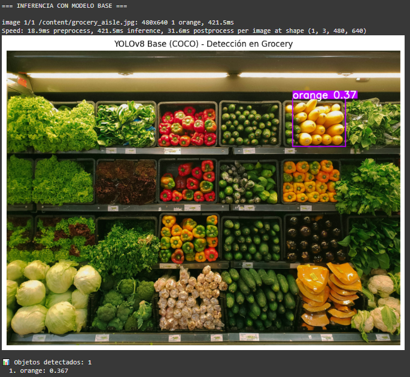

# Práctica 11
## YOLOv8 Fine-tuning & Tracking

## Contexto


## Objetivos
- Implementar inferencia con YOLOv8 pre-entrenado.
- Fine-tune YOLOv8 en dataset de productos de grocery.
- Evaluar mejoras con métricas (mAP, Precision, Recall).
- Analizar errores (FP, FN) antes y después del fine-tuning.
- Implementar tracking con modelo fine-tuned en video.

## Actividades (con tiempos estimados)
- 

## Desarrollo


## Evidencias
- Se adjunta imagen "resultado-t11-1.png" en `docs/assets/`

## Reflexión


---

## Parte 1: Instalación y SetUp inicial

```python
# TODO: Instalar dependencias
!pip install -q ultralytics opencv-python matplotlib numpy pandas seaborn

# Imports
from ultralytics import YOLO
import cv2
import matplotlib.pyplot as plt
import numpy as np
import pandas as pd
import seaborn as sns
from pathlib import Path
import os
import random
from google.colab import files
from IPython.display import Image, display

# Verificar instalación
import ultralytics
print(f"Ultralytics version: {ultralytics.__version__}")

# GPU check (recomendado para training)
import torch
print(f"CUDA disponible: {torch.cuda.is_available()}")
if torch.cuda.is_available():
    print(f"GPU: {torch.cuda.get_device_name(0)}")
else:
    print("⚠️ Usando CPU (fine-tuning será más lento)")
```

```python
# TODO: Cargar YOLOv8 nano pre-entrenado (COCO)
# Fill in the blank: ¿Qué modelo de YOLOv8 vamos a cargar?
model_base = YOLO('yolov8n.pt')  # Completa: 'yolov8n.pt', 'yolov8s.pt', 'yolov8m.pt'

print("\n=== MODELO BASE (COCO) ===")
print(f"Clases en COCO: {len(model_base.names)}")
print(f"Ejemplos de clases: {list(model_base.names.values())[:20]}")

# Verificar clases relevantes para grocery
grocery_relevant = ['apple', 'orange', 'banana', 'carrot', 'bottle', 'cup', 'bowl']
print(f"\nClases 'grocery' en COCO: {grocery_relevant}")
print("⚠️ Nota: COCO tiene clases genéricas, no productos específicos")
```

## 🤔 Preguntas sobre el Modelo Base:

#### ¿Por qué elegimos YOLOv8n (nano) en lugar de modelos más grandes?
##### Elegimos YOLOv8n (nano) porque es superligero y rápido, perfecto para probar cosas sin esperar horas entrenando. Los modelos más grandes son más precisos, pero te utilizan mucho GPU y tiempo, así que para empezar, nano está bien.

#### ¿Cuántas clases tiene COCO? ¿Son suficientes para nuestro caso de uso?
##### COCO tiene 80 clases, como personas, autos, frutas y cosas genéricas. Para un supermercado eso no alcanza, porque no distingue marcas ni tipos de frutas o productos específicos. Básicamente, COCO te da un base para empezar, no la info exacta que necesitamos.

#### ¿Qué significa que COCO tenga "clases genéricas"?
##### Cuando decimos que COCO tiene “clases genéricas” es que reconoce cosas por categorías amplias, por ejemplo, una manzana, una botella, un vaso, etc, pero no sabe si es una manzana específica o una botella de agua con etiqueta azul. Eso está bien para cosas básicas, pero no para inventario preciso.

#### Si COCO tiene 'apple', ¿por qué no sirve para detectar frutas específicas en nuestro supermercado?
##### Aunque COCO tenga apple, no sirve para detectar frutas específicas de tu súper. El modelo solo ve forma y color general, así que necesitamos fotos de nuestros productos y entrenar encima del modelo para que aprenda a diferenciarlos bien.


## Test en Imágenes de Grocery

```python
# Descargar la imagen
!wget https://images.unsplash.com/photo-1542838132-92c53300491e -O grocery_aisle.jpg

# Inferencia con modelo base
print("\n=== INFERENCIA CON MODELO BASE ===")

img_path = 'grocery_aisle.jpg'  # Ajustar según tu imagen

# Verificar que la imagen existe
if os.path.exists(img_path):
    # Fill in the blank: ¿Qué threshold de confianza usamos?
    results = model_base(img_path, conf=0.3) # Completa con un valor entre 0.1 y 0.5

    # Visualizar
    annotated = results[0].plot()
    plt.figure(figsize=(12, 8))
    plt.imshow(cv2.cvtColor(annotated, cv2.COLOR_BGR2RGB))
    plt.axis('off')
    plt.title('YOLOv8 Base (COCO) - Detección en Grocery')
    plt.show()

    # Analizar resultados
    boxes = results[0].boxes
    print(f"\n📊 Objetos detectados: {len(boxes)}")

    if len(boxes) > 0:
        for i, box in enumerate(boxes):
            cls_id = int(box.cls[0].cpu().numpy())
            conf = box.conf[0].cpu().numpy()
            class_name = model_base.names[cls_id]
            print(f"  {i+1}. {class_name}: {conf:.3f}")
    else:
        print("  ❌ No se detectaron objetos")
else:
    print(f"⚠️ Imagen no encontrada: {img_path}")
    print("   Por favor, descarga una imagen de productos de grocery")
```

#### Resultados: Test de imágen


Con el modelo COCO detecta cosas solo por forma y color, por eso en este caso, etiquetó la naranja como orange con confianza baja, 0.367, pero no reconoce otras frutas ni productos específicos del supermercado. Esto ocurre porque COCO tiene clases genéricas, así que cualquier objeto que se parezca a una clase conocida puede ser detectado de manera aproximada.

## Parte 2: Fine-tuning YOLOv8 en Fruit Detection Dataset

### Descarga del dataset de frutas
```python
# TODO: Descargar "Fruit Detection Dataset" desde Kaggle

if not os.path.exists('kaggle.json'):
  print("Paso 1: Sube tu archivo kaggle.json")
  print("  (Ve a https://www.kaggle.com/settings → Create New API Token)")
  # Subir kaggle.json
  uploaded = files.upload()

  # Configurar Kaggle
  !mkdir -p ~/.kaggle
  !cp kaggle.json ~/.kaggle/
  !chmod 600 ~/.kaggle/kaggle.json

# Instalar Kaggle CLI
!pip install -q kaggle

print("\n=== DESCARGANDO DATASET ===")
print("⏱️ Esto puede tomar 2-3 minutos...")

# Descargar dataset de frutas en formato YOLO
!kaggle datasets download -d lakshaytyagi01/fruit-detection
!unzip -q fruit-detection.zip -d fruit_detection

print("\n✅ Dataset descargado en: fruit_detection/")

# Explorar estructura
print("\n📁 Estructura del dataset:")
!ls -lh fruit_detection/

print("\n📂 Verificando carpetas:")
!ls fruit_detection/

# Contar imágenes por split
print("\n📊 Estadísticas:")
!find fruit_detection -name "*.jpg" -o -name "*.png" | wc -l | xargs echo "Total de imágenes:"
```

#### Resultados: Dataset de frutas


El dataset se bajó y descomprimió sin problemas, tenemos unas 8479 imágenes en Fruits-detection listas para entrenar, así que ya podemos usarlo para hacer fine-tuning de YOLOv8n, de manera que el modelo pueda reconocer exitosamente las frutas.

### Verificacón de Estructura y data.yaml
```python
# TODO: Verificar que el dataset está en formato YOLO correcto

import yaml
from pathlib import Path
import glob

dataset_path = Path('fruit_detection')

print("\n=== VERIFICANDO ESTRUCTURA DEL DATASET ===")

# Explorar estructura
print("\n📁 Estructura completa:")
for root, dirs, files in os.walk(dataset_path):
    level = root.replace(str(dataset_path), '').count(os.sep)
    if level > 2:
        break
    indent = ' ' * 2 * level
    print(f'{indent}{os.path.basename(root)}/')
    if level < 2:
        subindent = ' ' * 2 * (level + 1)
        for file in files[:3]:
            print(f'{subindent}{file}')
        if len(files) > 3:
            print(f'{subindent}... ({len(files)} archivos más)')

# Buscar data.yaml
yaml_files = list(dataset_path.glob('**/data.yaml'))

if yaml_files:
    yaml_path = yaml_files[0]
    print(f"\n✅ Encontrado data.yaml en: {yaml_path}")

    # Leer y verificar
    with open(yaml_path, 'r') as f:
        data_config = yaml.safe_load(f)

    print(f"\n=== CONFIGURACIÓN DEL DATASET ===")
    print(f"Número de clases: {data_config.get('nc', 'N/A')}")
    print(f"Clases: {data_config.get('names', 'N/A')}")
    print(f"Train path: {data_config.get('train', 'N/A')}")
    print(f"Val path: {data_config.get('val', 'N/A')}")

    # Guardar path para uso posterior
    yaml_path_str = str(yaml_path)

else:
    print("\n⚠️ No se encontró data.yaml, creando uno...")

    # Detectar estructura
    # Opciones comunes: train/images, valid/images o images/train, images/val
    train_dirs = list(dataset_path.glob('**/train/images')) + \
                 list(dataset_path.glob('**/images/train'))
    val_dirs = list(dataset_path.glob('**/valid/images')) + \
               list(dataset_path.glob('**/val/images')) + \
               list(dataset_path.glob('**/images/val'))

    if train_dirs and val_dirs:
        train_path = str(train_dirs[0].relative_to(dataset_path))
        val_path = str(val_dirs[0].relative_to(dataset_path))
    else:
        # Estructura por defecto
        train_path = 'train/images'
        val_path = 'valid/images'

    # Clases del Fruit Detection Dataset
    fruit_classes = ['apple', 'banana', 'grapes', 'orange', 'pineapple', 'watermelon']

    # Crear data.yaml
    data_config = {
        'path': str(dataset_path.absolute()),
        'train': train_path,
        'val': val_path,
        'nc': len(fruit_classes),
        'names': fruit_classes
    }

    yaml_path = dataset_path / 'data.yaml'
    with open(yaml_path, 'w') as f:
        yaml.dump(data_config, f, default_flow_style=False)

    print(f"✅ data.yaml creado en: {yaml_path}")
    yaml_path_str = str(yaml_path)

# Contar imágenes reales
train_images = list(dataset_path.glob(f"{data_config['train']}/*.jpg")) + \
               list(dataset_path.glob(f"{data_config['train']}/*.png"))
val_images = list(dataset_path.glob(f"{data_config['val']}/*.jpg")) + \
             list(dataset_path.glob(f"{data_config['val']}/*.png"))

print(f"\n📊 ESTADÍSTICAS FINALES:")
print(f"  Train images: {len(train_images)}")
print(f"  Val images: {len(val_images)}")
print(f"  Total: {len(train_images) + len(val_images)}")
print(f"  Clases: {data_config['nc']}")

print(f"\n✅ Dataset listo para fine-tuning!")
print(f"   Path del data.yaml: {yaml_path_str}")
```

#### Resultados: verificación


Se encontró el data.yaml y todo parece listo con 6 clases de frutas.