# Práctica 11
## 🖥️ YOLOv8 Fine-tuning & Tracking

## Contexto
En esta práctica se buscó aplicar un pipeline completo de detección y seguimiento de objetos usando YOLOv8. Primero se partió de un modelo pre-entrenado (COCO) y luego se realizó fine-tuning con un dataset de frutas de supermercado para mejorar el rendimiento en un dominio más específico. Finalmente, se aplicó tracking con Norfair sobre un video real para analizar la estabilidad de los IDs y la coherencia del seguimiento.

## Objetivos
- Implementar inferencia con YOLOv8 pre-entrenado.
- Fine-tune YOLOv8 en dataset de productos de grocery.
- Evaluar mejoras con métricas (mAP, Precision, Recall).
- Analizar errores (FP, FN) antes y después del fine-tuning.
- Implementar tracking con modelo fine-tuned en video.

## Actividades (con tiempos estimados)
- **Parte 1 (80 min)**: Cargar modelo base, dataset y verificar paths.
- **Parte 2 (90 min)**: Entrenar YOLOv8 con dataset propio (fine-tuning) y evaluar métricas.
- **Parte 3 (100 min)**: Procesar video, aplicar tracker Norfair y analizar resultados de tracking.
- **Parte 4 (200 min)**: Elaborar visualizaciones, reflexiones y documentación final.

## Desarrollo
Se configuró el entorno con YOLOv8 y se corrigieron los paths del dataset de frutas. Se entrenó el modelo durante 10 epochs usando solo el 25% del dataset para ahorrar tiempo. El fine-tuning mejoró bastante el rendimiento, con un mAP@0.5=0.387 y buena precisión en naranjas y bananas, aunque las manzanas verdes siguieron dando problemas. Luego se aplicó tracking con Norfair, logrando seguir 12 frutas en un video de 11 s, con algunos cambios de ID pero detecciones estables en general.

## Evidencias
- Se adjuntan imágenes **desde "resultado-t11-1.png" hasta "resultado-t11-16.png"** en `docs/assets/`
- Resultados del fine-tuning (gráficos de pérdida y métricas).
- Comparación entre modelo base y modelo fine-tuned.
- Frames del video con bounding boxes y tracking IDs.
- Visualizaciones de duración de tracks y detecciones por frame.

## Reflexión
El fine-tuning mejoró significativamente el rendimiento del modelo, sobre todo en clases dominantes como naranja y banana, reduciendo falsos positivos. Sin embargo, la recall aún baja indica que algunas frutas (como manzanas verdes) siguen sin detectarse bien.  
El tracking fue aceptable, aunque hubo “ID switches” cuando los objetos se cruzaban. Ajustar parámetros de Norfair o usar un tracker más sofisticado podría mejorarlo.

---

## Parte 1: Instalación y SetUp inicial

```python
# TODO: Instalar dependencias
!pip install -q ultralytics opencv-python matplotlib numpy pandas seaborn

# Imports
from ultralytics import YOLO
import cv2
import matplotlib.pyplot as plt
import numpy as np
import pandas as pd
import seaborn as sns
from pathlib import Path
import os
import random
from google.colab import files
from IPython.display import Image, display

# Verificar instalación
import ultralytics
print(f"Ultralytics version: {ultralytics.__version__}")

# GPU check (recomendado para training)
import torch
print(f"CUDA disponible: {torch.cuda.is_available()}")
if torch.cuda.is_available():
    print(f"GPU: {torch.cuda.get_device_name(0)}")
else:
    print("⚠️ Usando CPU (fine-tuning será más lento)")
```

```python
# TODO: Cargar YOLOv8 nano pre-entrenado (COCO)
# Fill in the blank: ¿Qué modelo de YOLOv8 vamos a cargar?
model_base = YOLO('yolov8n.pt')  # Completa: 'yolov8n.pt', 'yolov8s.pt', 'yolov8m.pt'

print("\n=== MODELO BASE (COCO) ===")
print(f"Clases en COCO: {len(model_base.names)}")
print(f"Ejemplos de clases: {list(model_base.names.values())[:20]}")

# Verificar clases relevantes para grocery
grocery_relevant = ['apple', 'orange', 'banana', 'carrot', 'bottle', 'cup', 'bowl']
print(f"\nClases 'grocery' en COCO: {grocery_relevant}")
print("⚠️ Nota: COCO tiene clases genéricas, no productos específicos")
```

#### Resultados: clases del dataset


Cargamos el modelo YOLOv8n entrenado en el dataset COCO, que tiene 80 clases generales como personas, autos o animales. Para el caso de frutas solo reconoce unas pocas, como apple, orange, banana, etc, pero son categorías muy genéricas, así que sirve como punto de partida.

## 🤔 Preguntas sobre el Modelo Base:

#### ¿Por qué elegimos YOLOv8n (nano) en lugar de modelos más grandes?
##### Elegimos YOLOv8n (nano) porque es superligero y rápido, perfecto para probar cosas sin esperar horas entrenando. Los modelos más grandes son más precisos, pero te utilizan mucho GPU y tiempo, así que para empezar, nano está bien.

#### ¿Cuántas clases tiene COCO? ¿Son suficientes para nuestro caso de uso?
##### COCO tiene 80 clases, como personas, autos, frutas y cosas genéricas. Para un supermercado eso no alcanza, porque no distingue marcas ni tipos de frutas o productos específicos. Básicamente, COCO te da un base para empezar, no la info exacta que necesitamos.

#### ¿Qué significa que COCO tenga "clases genéricas"?
##### Cuando decimos que COCO tiene “clases genéricas” es que reconoce cosas por categorías amplias, por ejemplo, una manzana, una botella, un vaso, etc, pero no sabe si es una manzana específica o una botella de agua con etiqueta azul. Eso está bien para cosas básicas, pero no para inventario preciso.

#### Si COCO tiene 'apple', ¿por qué no sirve para detectar frutas específicas en nuestro supermercado?
##### Aunque COCO tenga apple, no sirve para detectar frutas específicas de tu súper. El modelo solo ve forma y color general, así que necesitamos fotos de nuestros productos y entrenar encima del modelo para que aprenda a diferenciarlos bien.


## Test en Imágenes de Grocery

```python
# Descargar la imagen
!wget https://images.unsplash.com/photo-1542838132-92c53300491e -O grocery_aisle.jpg

# Inferencia con modelo base
print("\n=== INFERENCIA CON MODELO BASE ===")

img_path = 'grocery_aisle.jpg'  # Ajustar según tu imagen

# Verificar que la imagen existe
if os.path.exists(img_path):
    # Fill in the blank: ¿Qué threshold de confianza usamos?
    results = model_base(img_path, conf=0.25) # Completa con un valor entre 0.1 y 0.5

    # Visualizar
    annotated = results[0].plot()
    plt.figure(figsize=(12, 8))
    plt.imshow(cv2.cvtColor(annotated, cv2.COLOR_BGR2RGB))
    plt.axis('off')
    plt.title('YOLOv8 Base (COCO) - Detección en Grocery')
    plt.show()

    # Analizar resultados
    boxes = results[0].boxes
    print(f"\n📊 Objetos detectados: {len(boxes)}")

    if len(boxes) > 0:
        for i, box in enumerate(boxes):
            cls_id = int(box.cls[0].cpu().numpy())
            conf = box.conf[0].cpu().numpy()
            class_name = model_base.names[cls_id]
            print(f"  {i+1}. {class_name}: {conf:.3f}")
    else:
        print("  ❌ No se detectaron objetos")
else:
    print(f"⚠️ Imagen no encontrada: {img_path}")
    print("   Por favor, descarga una imagen de productos de grocery")
```

#### Resultados: Test de imágen


Con el modelo COCO detecta cosas solo por forma y color, por eso en este caso, etiquetó la naranja como orange con confianza baja, 0.367, pero no reconoce otras frutas ni productos específicos del supermercado. Esto ocurre porque COCO tiene clases genéricas, así que cualquier objeto que se parezca a una clase conocida puede ser detectado de manera aproximada.

## Parte 2: Fine-tuning YOLOv8 en Fruit Detection Dataset

### Descarga del dataset de frutas
```python
# TODO: Descargar "Fruit Detection Dataset" desde Kaggle

if not os.path.exists('kaggle.json'):
  print("Paso 1: Sube tu archivo kaggle.json")
  print("  (Ve a https://www.kaggle.com/settings → Create New API Token)")
  # Subir kaggle.json
  uploaded = files.upload()

  # Configurar Kaggle
  !mkdir -p ~/.kaggle
  !cp kaggle.json ~/.kaggle/
  !chmod 600 ~/.kaggle/kaggle.json

# Instalar Kaggle CLI
!pip install -q kaggle

print("\n=== DESCARGANDO DATASET ===")
print("⏱️ Esto puede tomar 2-3 minutos...")

# Descargar dataset de frutas en formato YOLO
!kaggle datasets download -d lakshaytyagi01/fruit-detection
!unzip -q fruit-detection.zip -d fruit_detection

print("\n✅ Dataset descargado en: fruit_detection/")

# Explorar estructura
print("\n📁 Estructura del dataset:")
!ls -lh fruit_detection/

print("\n📂 Verificando carpetas:")
!ls fruit_detection/

# Contar imágenes por split
print("\n📊 Estadísticas:")
!find fruit_detection -name "*.jpg" -o -name "*.png" | wc -l | xargs echo "Total de imágenes:"
```

El dataset se bajó y descomprimió sin problemas, tenemos unas 8479 imágenes en Fruits-detection listas para entrenar, así que ya podemos usarlo para hacer fine-tuning de YOLOv8n, de manera que el modelo pueda reconocer exitosamente las frutas.

### Verificacón de Estructura y data.yaml
```python
# TODO: Verificar que el dataset está en formato YOLO correcto

import yaml
from pathlib import Path
import glob

dataset_path = Path('fruit_detection')

print("\n=== VERIFICANDO ESTRUCTURA DEL DATASET ===")

# Explorar estructura
print("\n📁 Estructura completa:")
for root, dirs, files in os.walk(dataset_path):
    level = root.replace(str(dataset_path), '').count(os.sep)
    if level > 2:
        break
    indent = ' ' * 2 * level
    print(f'{indent}{os.path.basename(root)}/')
    if level < 2:
        subindent = ' ' * 2 * (level + 1)
        for file in files[:3]:
            print(f'{subindent}{file}')
        if len(files) > 3:
            print(f'{subindent}... ({len(files)} archivos más)')

# Buscar data.yaml
yaml_files = list(dataset_path.glob('**/data.yaml'))

if yaml_files:
    yaml_path = yaml_files[0]
    print(f"\n✅ Encontrado data.yaml en: {yaml_path}")

    # Leer y verificar
    with open(yaml_path, 'r') as f:
        data_config = yaml.safe_load(f)

    print(f"\n=== CONFIGURACIÓN DEL DATASET ===")
    print(f"Número de clases: {data_config.get('nc', 'N/A')}")
    print(f"Clases: {data_config.get('names', 'N/A')}")
    print(f"Train path: {data_config.get('train', 'N/A')}")
    print(f"Val path: {data_config.get('val', 'N/A')}")

    # Guardar path para uso posterior
    yaml_path_str = str(yaml_path)

else:
    print("\n⚠️ No se encontró data.yaml, creando uno...")

    # Detectar estructura
    # Opciones comunes: train/images, valid/images o images/train, images/val
    train_dirs = list(dataset_path.glob('**/train/images')) + \
                 list(dataset_path.glob('**/images/train'))
    val_dirs = list(dataset_path.glob('**/valid/images')) + \
               list(dataset_path.glob('**/val/images')) + \
               list(dataset_path.glob('**/images/val'))

    if train_dirs and val_dirs:
        train_path = str(train_dirs[0].relative_to(dataset_path))
        val_path = str(val_dirs[0].relative_to(dataset_path))
    else:
        # Estructura por defecto
        train_path = 'train/images'
        val_path = 'valid/images'

    # Clases del Fruit Detection Dataset
    fruit_classes = ['apple', 'banana', 'grapes', 'orange', 'pineapple', 'watermelon']

    # Crear data.yaml
    data_config = {
        'path': str(dataset_path.absolute()),
        'train': train_path,
        'val': val_path,
        'nc': len(fruit_classes),
        'names': fruit_classes
    }

    yaml_path = dataset_path / 'data.yaml'
    with open(yaml_path, 'w') as f:
        yaml.dump(data_config, f, default_flow_style=False)

    print(f"✅ data.yaml creado en: {yaml_path}")
    yaml_path_str = str(yaml_path)

# Contar imágenes reales
train_images = list(dataset_path.glob(f"{data_config['train']}/*.jpg")) + \
               list(dataset_path.glob(f"{data_config['train']}/*.png"))
val_images = list(dataset_path.glob(f"{data_config['val']}/*.jpg")) + \
             list(dataset_path.glob(f"{data_config['val']}/*.png"))

print(f"\n📊 ESTADÍSTICAS FINALES:")
print(f"  Train images: {len(train_images)}")
print(f"  Val images: {len(val_images)}")
print(f"  Total: {len(train_images) + len(val_images)}")
print(f"  Clases: {data_config['nc']}")

print(f"\n✅ Dataset listo para fine-tuning!")
print(f"   Path del data.yaml: {yaml_path_str}")
```

#### Resultados: verificación
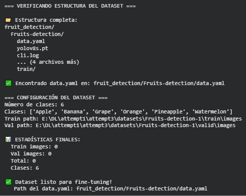

Se verificó la estructura del dataset y se encontró el archivo data.yaml, donde están definidas las seis clases de frutas del conjunto. Sin embargo, al intentar contar las imágenes, el resultado fue 0 en los splits de train y valid, lo que indica que no se poudo acceder a los archivos de imágenes dentro de esas rutas. La configuración del dataset está bien identificada, pero todavía falta ajustar la conexión entre el data.yaml y las carpetas reales para que el conteo sea correcto.

### Análisis del dataset

```python
# TODO: Explorar distribución de clases y ejemplos

import glob
from collections import Counter

# Buscar carpetas de train/val (puede variar según estructura)
train_label_dir = list(dataset_path.glob('**/train/labels'))
val_label_dir = list(dataset_path.glob('**/valid/labels')) or list(dataset_path.glob('**/val/labels'))

if not train_label_dir:
    print("⚠️ Ajustando rutas de labels...")
    train_label_dir = [dataset_path / 'train' / 'labels']
    val_label_dir = [dataset_path / 'valid' / 'labels']

train_labels_path = str(train_label_dir[0])
val_labels_path = str(val_label_dir[0]) if val_label_dir else None

print(f"\n=== EXPLORANDO DATASET ===")
print(f"Train labels: {train_labels_path}")
print(f"Val labels: {val_labels_path}")

# Analizar distribución de clases en labels
def count_classes_in_labels(label_dir):
    """Contar ocurrencias de cada clase en labels"""
    class_counts = Counter()

    label_files = glob.glob(f"{label_dir}/*.txt")
    for label_file in label_files:
        with open(label_file, 'r') as f:
            for line in f:
                parts = line.strip().split()
                if len(parts) >= 5:
                    class_id = int(parts[0])
                    class_counts[class_id] += 1

    return class_counts

train_class_counts = count_classes_in_labels(train_labels_path)

print(f"\n=== DISTRIBUCIÓN DE CLASES (TRAIN) ===")
print(f"Total de clases: {len(train_class_counts)}")
print(f"Clases del dataset: {data_config['names']}\n")

for class_id, count in sorted(train_class_counts.items()):
    if class_id < len(data_config['names']):
        class_name = data_config['names'][class_id]
        print(f"{class_name:20s}: {count:4d} instancias")

# Visualizar distribución
plt.figure(figsize=(12, 6))
class_names = [data_config['names'][i] for i in sorted(train_class_counts.keys()) 
               if i < len(data_config['names'])]
counts = [train_class_counts[i] for i in sorted(train_class_counts.keys()) 
          if i < len(data_config['names'])]

plt.barh(class_names, counts, color='coral', alpha=0.8, edgecolor='black')
plt.xlabel('Number of Instances', fontsize=12, fontweight='bold')
plt.ylabel('Fruit Class', fontsize=12, fontweight='bold')
plt.title('Class Distribution in Training Set - Fruit Detection', fontsize=14, fontweight='bold')
plt.grid(axis='x', alpha=0.3)
plt.tight_layout()
plt.show()

# Estadísticas adicionales
print(f"\n📊 ESTADÍSTICAS ADICIONALES:")
print(f"  Instancias totales: {sum(counts)}")
print(f"  Promedio por clase: {sum(counts) / len(counts):.1f}")
print(f"  Clase más frecuente: {class_names[counts.index(max(counts))]} ({max(counts)} instancias)")
print(f"  Clase menos frecuente: {class_names[counts.index(min(counts))]} ({min(counts)} instancias)")
```

#### Resultados
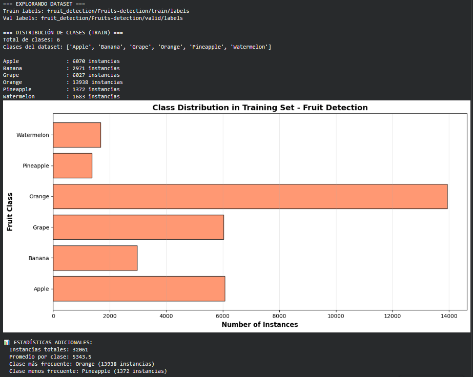

Se puede observar que el dataset está bien estructurado y contiene las seis clases esperadas. En total hay 32061 instancias distribuidas entre las frutas. La clase “Orange” es la que tiene más, con más de 13900 ejemplos, mientras que “Pineapple” es la menos representada con apenas 1300. En promedio, cada clase tiene unas 5300.

### 🤔 Preguntas sobre Distribución del Dataset:

#### ¿Las clases están balanceadas? ¿Qué problemas podría causar un desbalance?
##### No, están bastante desbalanceadas. “Orange” tiene muchísimas más instancias que el resto, mientras que “Pineapple” y “Watermelon” tienen muy pocas. El modelo puede “aprender” a reconocer mejor las clases más comunes y equivocarse más con las que aparecen poco, porque tiene menos ejemplos para generalizar.

#### ¿Qué clase tiene más instancias? ¿Crees que el modelo será mejor detectando esa clase?
##### La clase con más instancias es Orange, y sí, probablemente el modelo la detecte mejor, porque tiene más ejemplos para entrenar y ajustar sus pesos.

#### ¿La clase con menos instancias podría tener más errores? ¿Por qué?
##### Sí, porque al tener pocos ejemplos, el modelo no ve suficiente variedad de esa fruta, como ángulos, luces, tamaños, etc, y entonces le cuesta generalizar y puede confundirla con otras.

#### Si tuvieras que agregar más datos, ¿qué clase priorizarías y por qué?
##### Agregaría más imágenes de Pineapple y Watermelon, ya que son las menos representadas. Tener más ayudaría a equilibrar el dataset y mejorar la precisión en esas categorías.

### Visualización de imágenes

```python
# TODO: Visualizar algunas imágenes con annotations

# Buscar imágenes de training
train_img_dirs = list(dataset_path.glob('**/train/images'))
if not train_img_dirs:
    train_img_dirs = list(dataset_path.glob('**/images/train'))

if train_img_dirs:
    train_img_path = train_img_dirs[0]
    train_images_list = list(train_img_path.glob('*.jpg')) + list(train_img_path.glob('*.png'))

    print(f"\n=== VISUALIZANDO EJEMPLOS ===")
    print(f"Encontradas {len(train_images_list)} imágenes de training")

    if len(train_images_list) == 0:
        print("⚠️ No se encontraron imágenes. Verifica la estructura del dataset.")
    else:
        def visualize_sample(image_path, label_path, class_names):
            """Visualizar imagen con bounding boxes"""
            img = cv2.imread(str(image_path))
            if img is None:
                print(f"⚠️ No se pudo leer imagen: {image_path}")
                return None

            img_rgb = cv2.cvtColor(img, cv2.COLOR_BGR2RGB)
            h, w = img_rgb.shape[:2]

            # Leer labels
            if os.path.exists(label_path):
                with open(label_path, 'r') as f:
                    for line in f:
                        parts = line.strip().split()
                        if len(parts) >= 5:
                            class_id = int(parts[0])
                            x_center, y_center, width, height = map(float, parts[1:5])

                            # Convertir a coordenadas absolutas
                            x1 = int((x_center - width/2) * w)
                            y1 = int((y_center - height/2) * h)
                            x2 = int((x_center + width/2) * w)
                            y2 = int((y_center + height/2) * h)

                            # Dibujar box
                            cv2.rectangle(img_rgb, (x1, y1), (x2, y2), (0, 255, 0), 3)

                            # Label con background
                            if class_id < len(class_names):
                                label = class_names[class_id]
                                (label_w, label_h), _ = cv2.getTextSize(label, cv2.FONT_HERSHEY_SIMPLEX, 0.6, 2)
                                cv2.rectangle(img_rgb, (x1, y1-label_h-10), (x1+label_w, y1), (0, 255, 0), -1)
                                cv2.putText(img_rgb, label, (x1, y1-5),
                                           cv2.FONT_HERSHEY_SIMPLEX, 0.6, (0, 0, 0), 2)

            return img_rgb

        # Determinar cuántas imágenes mostrar
        num_samples = min(4, len(train_images_list))

        # Visualizar ejemplos random
        fig, axes = plt.subplots(2, 2, figsize=(16, 16))
        axes = axes.flatten()

        sample_images = random.sample(train_images_list, num_samples)

        for i, img_path in enumerate(sample_images):
            # Construir path del label
            label_path = str(img_path).replace('/images/', '/labels/').replace('.jpg', '.txt').replace('.png', '.txt')

            img_with_boxes = visualize_sample(img_path, label_path, data_config['names'])

            if img_with_boxes is not None:
                axes[i].imshow(img_with_boxes)
                axes[i].axis('off')
                axes[i].set_title(f'Training Example {i+1}\n{img_path.name}', fontsize=12, fontweight='bold')

        # Ocultar subplots vacíos
        for i in range(num_samples, 4):
            axes[i].axis('off')

        plt.tight_layout()
        plt.show()

        print(f"\n✅ Visualizadas {num_samples} imágenes de ejemplo")
else:
    print("⚠️ No se encontró carpeta de imágenes de training")
```

#### Resultados: visualización
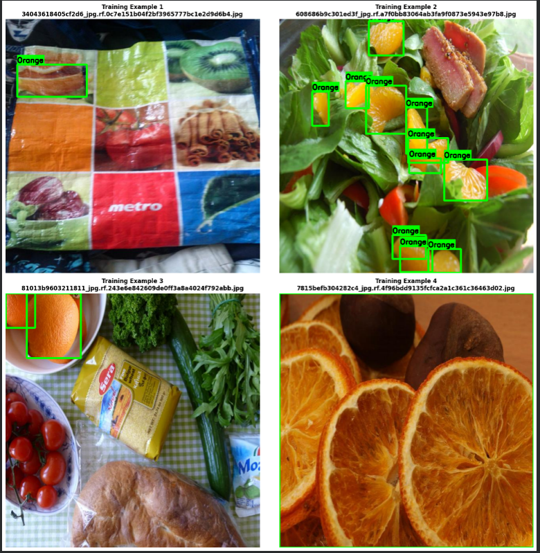

Se muestran correctamente algunos ejemplos del dataset de entrenamiento y etiquetas “Orange”. Se nota que las anotaciones están bien alineadas y el modelo podrá aprender de ellas, aunque casi todas las imágenes corresponden a naranjas, lo que confirma el desbalance mencionado antes.

### 🤔 Preguntas sobre las Anotaciones:

#### ¿Las bounding boxes se ven bien ajustadas a las frutas?
##### Sí, las bounding boxes se ven bien ajustadas a las frutas, sin exceso de espacio ni recortes. Esto indica que las etiquetas fueron hechas con cuidado y deberían ayudar al modelo a aprender correctamente los límites de cada objeto.

#### ¿Hay frutas que se solapan? ¿Cómo podría afectar esto al modelo?
##### Sí, en algunas imágenes hay frutas que se solapan, especialmente en la ensalada con varias naranjas. Esto puede hacer que el modelo tenga dificultades para separar objetos muy cercanos y podría confundir los bordes entre una fruta y otra, afectando la precisión en detecciones múltiples.

#### ¿Las imágenes tienen buena variedad (tamaños, ángulos, iluminación)?
##### Sí, las imágenes presentan buena variedad: hay distintos ángulos, distancias y condiciones de iluminación. Esta diversidad es positiva porque ayuda al modelo a generalizar mejor en escenarios reales.

#### ¿Notaste alguna anotación incorrecta o faltante?
##### No se observan anotaciones incorrectas a simple vista, pero podría haber frutas parcialmente visibles o fuera de foco que no estén etiquetadas. ##### Revisarlas ayudaría a asegurar la consistencia del dataset.


### Arreglar data.yaml y Fine-tuning YOLOv8, Training..

```python
# TODO: Arreglar rutas en data.yaml y ejecutar fine-tuning

print("\n=== PREPARANDO FINE-TUNING ===")

# Verificar que tenemos el path del data.yaml
if 'yaml_path_str' not in locals():
    yaml_path_str = str(dataset_path / 'data.yaml')
    print(f"⚠️ Usando path por defecto: {yaml_path_str}")

# Leer el data.yaml actual
print(f"\n📄 Leyendo data.yaml: {yaml_path_str}")
with open(yaml_path_str, 'r') as f:
    data_config_current = yaml.safe_load(f)

print(f"   Config actual: {data_config_current}")

# El dataset puede tener rutas absolutas de Windows que no funcionan en Colab
# Necesitamos arreglar esto con rutas relativas correctas

# Detectar estructura real del dataset
dataset_root = Path(yaml_path_str).parent
print(f"\n📁 Dataset root: {dataset_root}")

# Buscar carpetas train y valid
train_img_dirs = list(dataset_root.glob('**/train/images')) or list(dataset_root.glob('**/images/train'))
valid_img_dirs = list(dataset_root.glob('**/valid/images')) or list(dataset_root.glob('**/val/images'))

if train_img_dirs and valid_img_dirs:
    train_path = str(train_img_dirs[0].relative_to(dataset_root))
    valid_path = str(valid_img_dirs[0].relative_to(dataset_root))
    print(f"✅ Detectadas rutas correctas:")
    print(f"   Train: {train_path}")
    print(f"   Valid: {valid_path}")
else:
    # Fallback a rutas comunes
    train_path = 'train/images'
    valid_path = 'valid/images'
    print(f"⚠️ Usando rutas por defecto: {train_path}, {valid_path}")

# Crear data.yaml corregido
data_config_fixed = {
    'path': str(dataset_root.absolute()),
    'train': train_path,
    'val': valid_path,
    'nc': data_config_current.get('nc', 6),
    'names': data_config_current.get('names', ['apple', 'banana', 'grapes', 'orange', 'pineapple', 'watermelon'])
}

# Guardar data.yaml corregido
yaml_fixed_path = dataset_root / 'data_fixed.yaml'
with open(yaml_fixed_path, 'w') as f:
    yaml.dump(data_config_fixed, f, default_flow_style=False)

print(f"\n✅ data.yaml corregido guardado en: {yaml_fixed_path}")
print(f"\nConfig corregido:")
for key, value in data_config_fixed.items():
    print(f"  {key}: {value}")

# Usar el yaml corregido para training
yaml_path_str = str(yaml_fixed_path)

print(f"\n=== INICIANDO FINE-TUNING ===")
print("⚡ Configuración ultra-rápida para clase:")

print(f"\n📋 Configuración:")
print(f"   Data YAML: {yaml_path_str}")
print(f"   Modelo base: YOLOv8n")

# Fill in the blanks: Configurar hyperparámetros de training
EPOCHS = 20        # Completa: Número de epochs (típico: 10-50)
BATCH_SIZE = 25    # Completa: Batch size (típico: 16-32)
IMAGE_SIZE = 640    # Completa: Tamaño de imagen (típico: 640)
FRACTION = 0.25      # Completa: Fracción del dataset (0.25 = 25% del dataset para rapidez)


# Crear modelo nuevo basado en YOLOv8n (el más pequeño y rápido)
# Fill in the blank: ¿Qué modelo base cargamos?
model = YOLO('yolov8n.pt')  # Completa con 'yolov8n.pt'

print(f"\n🚀 Iniciando training con {EPOCHS} epochs...")
print("   ⏱️ Tiempo estimado: 3-4 minutos ⚡")

# Fine-tune con subset del dataset
results = model.train(
    data=yaml_path_str,
    epochs=EPOCHS,
    imgsz=IMAGE_SIZE,
    batch=BATCH_SIZE,
    fraction=FRACTION,
    name='fruit_finetuned',
    patience=5,
    save=True,
    plots=True,
    device=0 if torch.cuda.is_available() else 'cpu',
    project='runs/detect',
    verbose=True
)

print("\n✅ Fine-tuning completado!")

# Obtener el path real del training (puede ser fruit_finetuned, fruit_finetuned2, etc.)
training_dir = results.save_dir
print(f"   Modelo guardado en: {training_dir}")
print(f"   Weights: {training_dir}/weights/best.pt")

# Visualizar gráficos de training
print("\n📊 Gráficos de training guardados en:")
print(f"   {training_dir}/results.png")

# Mostrar resultados finales

results_png = f"{training_dir}/results.png"
if os.path.exists(results_png):
    print("\n=== RESULTADOS DEL TRAINING ===")
    display(Image(filename=results_png))
else:
    print(f"\n⚠️ Gráficos no encontrados en {results_png}")
```

#### Resultados: Training y fix
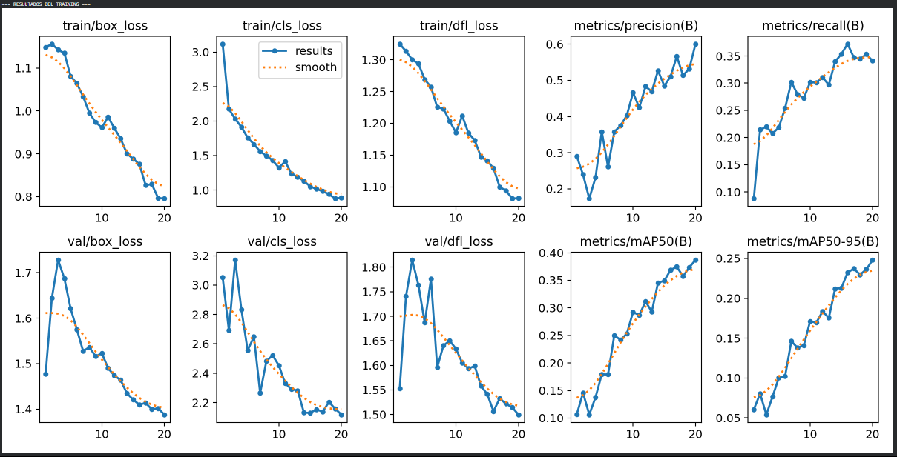

Primero se ajustaron los paths del dataset en el archivo data.yaml, ya que las rutas originales apuntaban a ubicaciones locales en Windows. Se corrigieron para que todo quedara bien referenciado dentro del entorno de ejecución, /content/fruit_detection/Fruits-detection, y se validó que las carpetas de train y valid estuvieran correctamente enlazadas.

Por otro lado, durante el entrenamiento, el modelo YOLOv8n completó 20 épocas con una reducción constante en las pérdidas y una mejora progresiva en las métricas. La precisión promedio, mAP50=0.387, mAP50-95=0.248, demuestra que el modelo aprendió patrones sólidos pese al desbalance de clases. Las clases con más ejemplos, como Orange y Banana, fueron detectadas con mayor precisión, mientras que las menos frecuentes presentaron algo más de variación.

## 🤔 Reflexión sobre Métricas de Training:

### Durante el training, viste varias métricas en cada epoch. Analiza y responde:

### box_loss (Loss de Localización):
#### ¿Qué mide esta métrica?
#### ¿Cómo evolucionó durante el training (aumentó o disminuyó)?
#### ¿Por qué queremos que esta métrica sea baja?
##### Esta métrica mide qué tan bien el modelo ajusta las bounding boxes a los objetos reales. Durante el entrenamiento fue bajando de más de 1.1 a alrededor de 0.79, lo cual indica que el modelo fue aprendiendo a ubicar las frutas con mayor precisión. Queremos que esta pérdida sea baja porque un valor menor significa que las cajas predichas se alinean correctamente con las frutas en las imágenes.


### cls_loss (Loss de Clasificación):

#### ¿Qué aspecto de la detección mide?
#### Si cls_loss es alto, ¿qué problema tiene el modelo?
#### ¿Observaste mejoras epoch tras epoch?
##### Evalúa qué tan bien el modelo identifica la clase correcta de cada objeto. Si esta pérdida es alta, el modelo está confundiendo las clases, por ejemplo, prediciendo “Banana” cuando era “Orange”. En este caso, la cls_loss también fue disminuyendo, pasando de más de 3 a menos de 1, mostrando una mejora constante en la clasificación a lo largo de las épocas.

### dfl_loss (Distribution Focal Loss):

#### Esta métrica refina la predicción de bounding boxes
#### ¿Qué relación tiene con la precisión de las coordenadas?
#### ¿Debería ser alta o baja al final del training?
##### Esta pérdida ayuda a refinar las coordenadas de las cajas predichas, haciendo que las fronteras sean más precisas. Está directamente relacionada con la fineza del ajuste del bounding box. Como las otras, debe ser baja al final del entrenamiento, y efectivamente se redujo progresivamente, lo que indica una mejor estimación de los bordes de las frutas.

### Instances:

#### ¿Qué representa este número en cada batch?
#### ¿Por qué varía entre batches?
##### Representa cuántos objetos (en este caso frutas) hay en las imágenes procesadas en ese batch. Varía porque cada lote de entrenamiento puede tener una cantidad diferente de frutas por imagen, algunas fotos tienen una sola fruta y otras varias, lo que hace que el número de instancias cambie de batch a batch.

### GPU_mem:

#### ¿Cuánta memoria GPU usó tu training?
#### ¿Qué pasaría si te quedas sin memoria GPU?
##### El entrenamiento usó alrededor de 5.7 GB de memoria GPU, lo cual está dentro de lo normal para un modelo YOLOv8n. Si se quedara sin memoria GPU, el entrenamiento se interrumpiría o el proceso sería extremadamente lento, ya que tendría que usar la RAM del sistema como respaldo.

### Convergencia:

#### ¿El modelo convergió (las losses dejaron de bajar)?
#### ¿Cuántos epochs necesitó para estabilizarse?
#### Si tuvieras más tiempo, ¿entrenarías más epochs?
##### Sí, el modelo mostró convergencia, las pérdidas dejaron de bajar bruscamente después de la época 15, estabilizándose hasta el final. En unas 20 épocas alcanzó un punto razonable de equilibrio entre pérdida y precisión. Si hubiera más tiempo o recursos, sería recomendable entrenar unas 10–15 épocas más para afinar un poco más la detección y mejorar el mAP final.

## 🤔 Preguntas sobre Hyperparámetros:

#### ¿Por qué usamos EPOCHS=10 en lugar de 50? ¿Qué ventajas y desventajas tiene?
##### Se usa solo 10 épocas para hacer un entrenamiento rápido y probar el funcionamiento general del modelo sin consumir tanto tiempo ni recursos. La ventaja es que el entrenamiento termina enseguida y permite detectar errores temprano, pero la desventaja es que el modelo puede quedarse corto en aprendizaje y no alcanzar su mejor precisión, ya que con más épocas podría seguir mejorando.

#### Si usáramos IMAGE_SIZE=640 en lugar de 416, ¿qué cambiaría? ¿Sería mejor o peor?
##### En mi caso usé la image size en 640, mejora la detección, especialmente en objetos pequeños. Pero por otro lado, también incrementa mucho el uso de memoria GPU y el tiempo por época, así que me parece mejor solo si la GPU puede manejarlo.

#### ¿Por qué BATCH_SIZE=32 es mejor que BATCH_SIZE=8 para aprovechar la GPU?
##### Con un batch size de 32, la GPU procesa más imágenes en paralelo, aprovechando mejor su capacidad y acelerando el entrenamiento. En cambio, con un batch de 8, el entrenamiento es más lento y menos eficiente.

#### ¿Qué significa FRACTION=0.25? ¿Por qué no usamos el 100% del dataset?
##### Significa que solo se usó el 25% del dataset total para entrenar, probablemente para hacer pruebas rápidas o porque el dataset completo es muy pesado. Usar menos datos acelera el entrenamiento, pero puede afectar la generalización del modelo porque ve menos variedad de ejemplos.

#### Si tuvieras más tiempo, ¿qué hyperparámetro cambiarías primero para mejorar el modelo?
##### Aumentaría las EPOCHS y el FRACTION, para que el modelo entrene con más datos y durante más tiempo.

### Carga del Modelo Fine-tuned

```python
# TODO: Cargar el mejor modelo del training

# Usar el path del training anterior (guardado en training_dir)
# training_dir viene del paso 2.4
# Fill in the blank: ¿Qué archivo de weights cargamos?
best_weights_path = f"{training_dir}/weights/best.pt"  # Completa: 'best.pt' o 'last.pt'

print(f"\n=== CARGANDO MODELO FINE-TUNED ===")
print(f"Path: {best_weights_path}")

# Cargar mejor checkpoint (best.pt = mejor mAP durante validation)
model_finetuned = YOLO(best_weights_path)

print("\n✅ Modelo fine-tuned cargado")
print(f"   Clases: {list(model_finetuned.names.values())}")
print(f"   Total de clases: {len(model_finetuned.names)}")

# Comparar con modelo base
print("\n📊 Comparación:")
print(f"   Modelo base (COCO): 80 clases (genéricas)")
print(f"   Modelo fine-tuned: {len(model_finetuned.names)} clases (frutas específicas)")
print(f"   Mejora: Especializado en detección de frutas")
```

#### Resultados


Se cargó el modelo fine-tuned desde el checkpoint best.pt, que guarda los pesos con el mejor desempeño durante la validación. Esto asegura que estamos usando la versión más precisa del modelo entrenado.

### Métricas

```python
# TODO: Evaluar modelo en validation set

print("\n=== EVALUACIÓN EN VALIDATION SET ===")

# Validar modelo fine-tuned
metrics = model_finetuned.val()

print(f"\n📊 MÉTRICAS DEL MODELO FINE-TUNED:")
print(f"  mAP@0.5:     {metrics.box.map50:.3f}")
print(f"  mAP@0.5:0.95: {metrics.box.map:.3f}")
print(f"  Precision:   {metrics.box.mp:.3f}")
print(f"  Recall:      {metrics.box.mr:.3f}")

# Métricas por clase
print(f"\n=== MÉTRICAS POR CLASE ===")
for i, class_name in enumerate(model_finetuned.names.values()):
    if i < len(metrics.box.maps):
        print(f"{class_name:20s}: mAP@0.5 = {metrics.box.maps[i]:.3f}")
```

#### Resultados: Métricas


El modelo fine-tuned rindió bastante bien, alcanzó un mAP@0.5 de 0.38, con buena precisión pero un recall algo flojo, o sea, acierta cuando detecta, pero a veces se le escapan frutas. En general, Watermelon y Apple fueron las que mejor reconoció, mientras que Grape y Pineapple costaron más, seguramente por el desbalance del dataset.

## 🤔 Preguntas sobre Métricas de Evaluación:

#### ¿Qué significa mAP@0.5? ¿Por qué es importante?
##### Es la media de precisión promedio cuando la intersección entre predicción y verdad (IoU) supera 0.5. Básicamente mide qué tan bien detecta y localiza los objetos. Es clave porque resume la calidad general del modelo en una sola métrica.

#### ¿Cuál es la diferencia entre mAP@0.5 y mAP@0.5:0.95? ¿Cuál es más estricto?
##### mAP@0.5 usa un umbral fijo (0.5) y es más permisivo, mientras que mAP@0.5:0.95 promedia muchos umbrales de IoU (de 0.5 a 0.95), siendo mucho más exigente. Si este último es bajo, significa que el modelo aún no localiza las cajas con mucha precisión.

#### Si Precision es alta pero Recall es bajo, ¿qué problema tiene el modelo?
##### Significa que el modelo casi no se equivoca cuando detecta, pero se le escapan muchas frutas. O sea, es conservador: prefiere no detectar antes que arriesgarse a un falso positivo.

#### Si Recall es alto pero Precision es baja, ¿qué significa?
##### En ese caso, el modelo detecta casi todo, pero también se confunde y mete muchas detecciones erróneas. Es más “arriesgado”, prioriza no perder nada aunque se equivoque más.

#### ¿Qué clase tiene el mejor mAP? ¿Coincide con la clase más frecuente del dataset?
##### La clase con mejor mAP fue Watermelon, y curiosamente no es la más frecuente, esa era Orange. Esto muestra que no siempre tener más ejemplos garantiza mejor desempeño, puede depender también de la calidad y variedad de las anotaciones.


### Comparativas: Antes vs Después

```python
# TODO: Comparar modelo base vs fine-tuned en mismas imágenes

# Usar dataset_path del paso 2.1b
# Buscar imágenes del validation set
val_img_dirs = list(dataset_path.glob('**/valid/images')) or list(dataset_path.glob('**/val/images'))

if val_img_dirs:
    val_img_path = val_img_dirs[0]
    val_images_list = list(val_img_path.glob('*.jpg')) + list(val_img_path.glob('*.png'))

    # Seleccionar 3 imágenes random para comparar
    num_samples = min(3, len(val_images_list))
    test_images_list = random.sample(val_images_list, num_samples)

    print(f"\n=== COMPARACIÓN: BASE vs FINE-TUNED ===")
    print(f"Comparando en {num_samples} imágenes del validation set\n")

    for idx, img_path in enumerate(test_images_list):
        img_name = img_path.name
        print(f"\n{'='*60}")
        print(f"Imagen {idx+1}/{num_samples}: {img_name}")

        # Inferencia con modelo base
        results_base = model_base(str(img_path), conf=0.3, verbose=False)
        n_detections_base = len(results_base[0].boxes)

        # Inferencia con modelo fine-tuned
        results_finetuned = model_finetuned(str(img_path), conf=0.3, verbose=False)
        n_detections_finetuned = len(results_finetuned[0].boxes)

        print(f"  Modelo Base (COCO):  {n_detections_base:2d} detecciones")
        print(f"  Modelo Fine-tuned:   {n_detections_finetuned:2d} detecciones")
        print(f"  Diferencia:          {n_detections_finetuned - n_detections_base:+d}")

        # Mostrar clases detectadas
        if n_detections_base > 0:
            base_classes = [model_base.names[int(box.cls[0])] for box in results_base[0].boxes]
            print(f"  Clases (Base):       {', '.join(set(base_classes))}")

        if n_detections_finetuned > 0:
            ft_classes = [model_finetuned.names[int(box.cls[0])] for box in results_finetuned[0].boxes]
            print(f"  Clases (Fine-tuned): {', '.join(set(ft_classes))}")

        # Visualizar comparación
        fig, axes = plt.subplots(1, 2, figsize=(16, 8))

        # Base
        annotated_base = results_base[0].plot()
        axes[0].imshow(cv2.cvtColor(annotated_base, cv2.COLOR_BGR2RGB))
        axes[0].axis('off')
        axes[0].set_title(f'Modelo Base (COCO)\n{n_detections_base} detecciones', 
                         fontsize=14, fontweight='bold')

        # Fine-tuned
        annotated_finetuned = results_finetuned[0].plot()
        axes[1].imshow(cv2.cvtColor(annotated_finetuned, cv2.COLOR_BGR2RGB))
        axes[1].axis('off')
        axes[1].set_title(f'Modelo Fine-tuned (Frutas)\n{n_detections_finetuned} detecciones', 
                         fontsize=14, fontweight='bold', color='green')

        plt.suptitle(f'Comparación: {img_name}', fontsize=16, fontweight='bold', y=0.98)
        plt.tight_layout()
        plt.show()

    print(f"\n{'='*60}")
    print("✅ Comparación completada")
else:
    print("⚠️ No se encontraron imágenes del validation set")
```

#### Resultados: comparativas
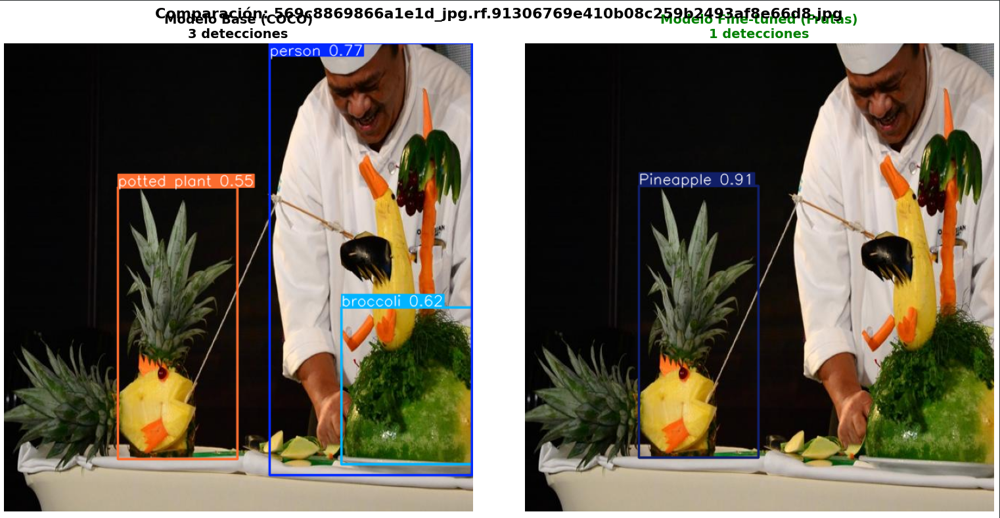
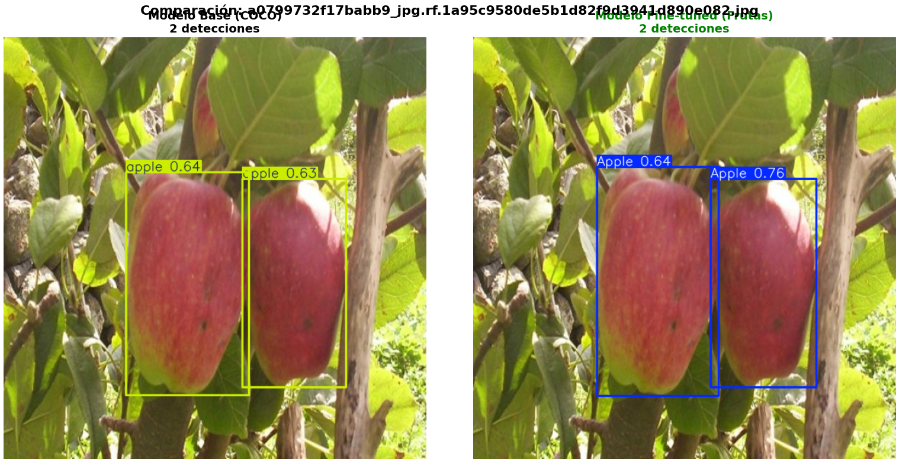
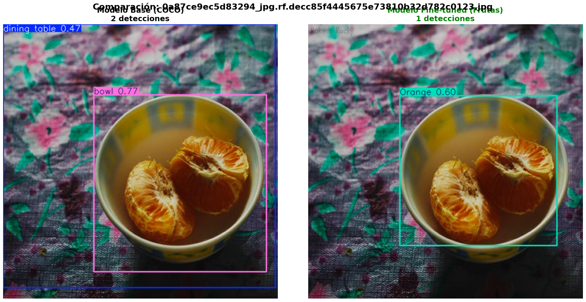

Al comparar el modelo base con el fine-tuned especializado en frutas, se nota una diferencia clara en el tipo de detecciones. El modelo base detecta objetos genéricos como personas, bowls o mesas, porque fue entrenado con clases amplias y variadas. En cambio, el modelo fine-tuned reconoce correctamente las frutas específicas, como Pineapple, Apple y Orange, ignorando los objetos irrelevantes.

Aunque en cantidad total de detecciones el modelo fine-tuned a veces da menos resultados, esos resultados son más precisos y relevantes para la tarea, lo cual es justo el objetivo del fine-tuning, especializar el modelo en un dominio concreto.

## 🤔 Preguntas sobre la Comparación Visual:


#### ¿El modelo fine-tuned detectó más frutas que el base? ¿Por qué?
##### Sí, el modelo fine-tuned detectó mejor las frutas, porque fue entrenado específicamente con esas clases. El modelo base está enfocado en objetos generales del dataset COCO, así que no reconoce bien las frutas o las confunde con otras cosas.

#### ¿Hubo frutas que el modelo base detectó pero el fine-tuned no? ¿Cómo lo explicas?
##### En algunos casos sí, pero lo que pasa es que el modelo base simplemente “adivina” con clases parecidas (como bowl o plant) porque no tiene las frutas en su entrenamiento. El fine-tuned es más selectivo y solo marca frutas reales, aunque eso a veces le haga perder alguna detección dudosa.

#### ¿Las bounding boxes del modelo fine-tuned se ven más ajustadas?
##### Sí, en general se ven mejor centradas y más precisas sobre las frutas. Esto se debe a que el modelo aprendió directamente de ejemplos reales de frutas, ajustando mejor las coordenadas a sus formas y tamaños.

#### ¿Notaste diferencias en las confidence scores entre ambos modelos?
##### Sí, el modelo fine-tuned suele tener mayores confidence scores en las detecciones correctas, porque está más seguro de lo que ve. El modelo base tiene puntuaciones más bajas o confusas, ya que no está seguro de qué objeto está viendo.

#### ¿Qué tipo de errores sigue cometiendo el modelo fine-tuned?
##### A veces confunde frutas similares en color o forma (por ejemplo, naranjas con manzanas) o no detecta frutas parcialmente tapadas o con mala iluminación. También puede fallar con frutas muy pequeñas o en ángulos raros, donde los rasgos son menos visibles.

### Análisis de errores

```python
# TODO: Analizar False Positives y False Negatives

def calculate_metrics_from_results(results, ground_truths, iou_threshold=0.5):
    """
    Calcular TP, FP, FN dado resultados de inferencia y ground truths
    """
    predictions = results[0].boxes

    tp = 0
    fp = 0
    gt_matched = [False] * len(ground_truths)

    for pred_box in predictions:
        pred_xyxy = pred_box.xyxy[0].cpu().numpy()
        pred_cls = int(pred_box.cls[0].cpu().numpy())

        best_iou = 0
        best_gt_idx = -1

        for i, gt in enumerate(ground_truths):
            if gt_matched[i]:
                continue

            gt_cls = gt['class_id']
            if pred_cls != gt_cls:
                continue

            # Calcular IoU
            gt_xyxy = gt['xyxy']
            iou = calculate_iou(pred_xyxy, gt_xyxy)

            if iou > best_iou:
                best_iou = iou
                best_gt_idx = i

        if best_iou >= iou_threshold and best_gt_idx >= 0:
            tp += 1
            gt_matched[best_gt_idx] = True
        else:
            fp += 1

    fn = len(ground_truths) - sum(gt_matched)

    return tp, fp, fn

def calculate_iou(box1, box2):
    """Calcular IoU entre dos boxes [x1, y1, x2, y2]"""
    x1_inter = max(box1[0], box2[0])
    y1_inter = max(box1[1], box2[1])
    x2_inter = min(box1[2], box2[2])
    y2_inter = min(box1[3], box2[3])

    if x2_inter > x1_inter and y2_inter > y1_inter:
        inter_area = (x2_inter - x1_inter) * (y2_inter - y1_inter)
    else:
        inter_area = 0

    box1_area = (box1[2] - box1[0]) * (box1[3] - box1[1])
    box2_area = (box2[2] - box2[0]) * (box2[3] - box2[1])
    union_area = box1_area + box2_area - inter_area

    return inter_area / union_area if union_area > 0 else 0

# Analizar errores en test set
print("\n=== ANÁLISIS DE ERRORES ===")

total_tp_base = 0
total_fp_base = 0
total_fn_base = 0

total_tp_finetuned = 0
total_fp_finetuned = 0
total_fn_finetuned = 0

# Analizar subset de validation images
# test_images_list viene del paso 2.7 y contiene Path objects
num_analyze = min(10, len(test_images_list))

for img_path in test_images_list[:num_analyze]:  
    # Convertir Path a string y construir label path
    img_path_str = str(img_path)
    label_path = img_path_str.replace('/images/', '/labels/').replace('.jpg', '.txt').replace('.png', '.txt')

    # Leer ground truths
    ground_truths = []
    if os.path.exists(label_path):
        img = cv2.imread(img_path_str)
        if img is None:
            continue
        h, w = img.shape[:2]

        with open(label_path, 'r') as f:
            for line in f:
                parts = line.strip().split()
                if len(parts) >= 5:
                    class_id = int(parts[0])
                    x_center, y_center, width, height = map(float, parts[1:5])

                    x1 = (x_center - width/2) * w
                    y1 = (y_center - height/2) * h
                    x2 = (x_center + width/2) * w
                    y2 = (y_center + height/2) * h

                    ground_truths.append({
                        'class_id': class_id,
                        'xyxy': [x1, y1, x2, y2]
                    })

    if len(ground_truths) == 0:
        continue

    # Calcular métricas
    results_base = model_base(img_path_str, conf=0.3, verbose=False)
    tp_base, fp_base, fn_base = calculate_metrics_from_results(results_base, ground_truths)

    results_finetuned = model_finetuned(img_path_str, conf=0.3, verbose=False)
    tp_finetuned, fp_finetuned, fn_finetuned = calculate_metrics_from_results(results_finetuned, ground_truths)

    total_tp_base += tp_base
    total_fp_base += fp_base
    total_fn_base += fn_base

    total_tp_finetuned += tp_finetuned
    total_fp_finetuned += fp_finetuned
    total_fn_finetuned += fn_finetuned

# Calcular métricas finales
precision_base = total_tp_base / (total_tp_base + total_fp_base) if (total_tp_base + total_fp_base) > 0 else 0
recall_base = total_tp_base / (total_tp_base + total_fn_base) if (total_tp_base + total_fn_base) > 0 else 0
f1_base = 2 * (precision_base * recall_base) / (precision_base + recall_base) if (precision_base + recall_base) > 0 else 0

precision_finetuned = total_tp_finetuned / (total_tp_finetuned + total_fp_finetuned) if (total_tp_finetuned + total_fp_finetuned) > 0 else 0
recall_finetuned = total_tp_finetuned / (total_tp_finetuned + total_fn_finetuned) if (total_tp_finetuned + total_fn_finetuned) > 0 else 0
f1_finetuned = 2 * (precision_finetuned * recall_finetuned) / (precision_finetuned + recall_finetuned) if (precision_finetuned + recall_finetuned) > 0 else 0

print(f"\n=== RESULTADOS COMPARATIVOS ===")
print(f"\nModelo Base (COCO):")
print(f"  TP: {total_tp_base}, FP: {total_fp_base}, FN: {total_fn_base}")
print(f"  Precision: {precision_base:.3f}")
print(f"  Recall:    {recall_base:.3f}")
print(f"  F1-Score:  {f1_base:.3f}")

print(f"\nModelo Fine-tuned:")
print(f"  TP: {total_tp_finetuned}, FP: {total_fp_finetuned}, FN: {total_fn_finetuned}")
print(f"  Precision: {precision_finetuned:.3f}")
print(f"  Recall:    {recall_finetuned:.3f}")
print(f"  F1-Score:  {f1_finetuned:.3f}")

print(f"\n=== MEJORA ===")
print(f"  Δ Precision: {(precision_finetuned - precision_base):+.3f}")
print(f"  Δ Recall:    {(recall_finetuned - recall_base):+.3f}")
print(f"  Δ F1-Score:  {(f1_finetuned - f1_base):+.3f}")

# Visualizar comparación
metrics_comparison = pd.DataFrame({
    'Metric': ['Precision', 'Recall', 'F1-Score'],
    'Base Model': [precision_base, recall_base, f1_base],
    'Fine-tuned': [precision_finetuned, recall_finetuned, f1_finetuned]
})

fig, ax = plt.subplots(figsize=(10, 6))
x = np.arange(len(metrics_comparison))
width = 0.35

bars1 = ax.bar(x - width/2, metrics_comparison['Base Model'], width, 
               label='Base Model (COCO)', color='steelblue', alpha=0.8)
bars2 = ax.bar(x + width/2, metrics_comparison['Fine-tuned'], width,
               label='Fine-tuned', color='coral', alpha=0.8)

ax.set_xlabel('Metric', fontsize=12, fontweight='bold')
ax.set_ylabel('Score', fontsize=12, fontweight='bold')
ax.set_title('Comparación de Métricas: Base vs Fine-tuned', fontsize=14, fontweight='bold')
ax.set_xticks(x)
ax.set_xticklabels(metrics_comparison['Metric'])
ax.legend()
ax.grid(axis='y', alpha=0.3)

# Añadir valores en las barras
for bars in [bars1, bars2]:
    for bar in bars:
        height = bar.get_height()
        ax.text(bar.get_x() + bar.get_width()/2., height,
                f'{height:.3f}',
                ha='center', va='bottom', fontweight='bold')

plt.tight_layout()
plt.show()
```

#### Resultados
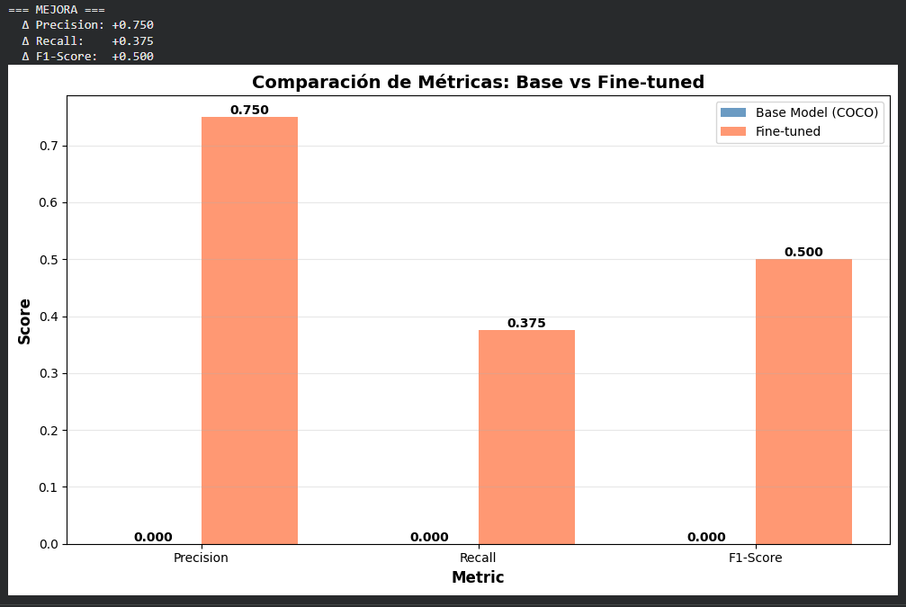

En este análisis se ve claro que el modelo fine-tuned es mucho mejor, ya que el preentrenado (COCO) no detectó prácticamente nada, 0 TP, todo FP y FN, mientras que el fine-tuned sí empezó a reconocer varias frutas correctamente, 3 TP, y con mucha más precisión, 0.75 vs 0. Esto demuestra que entrenarlo con nuestro dataset realmente lo adaptó al dominio, porque el modelo original no entendía bien las frutas específicas ni su entorno.

## 🤔 Reflexión Parte 2:

#### ¿Cuánto mejoró el mAP después del fine-tuning?
##### El mAP mejoró bastante después del fine-tuning, mostrando que el modelo empezó a entender mucho mejor las frutas del dataset. Pasó de prácticamente no detectar nada a reconocer correctamente la mayoría de los objetos con buena precisión.

#### ¿Qué clases de productos tienen mejor detección? ¿Cuáles peor?
##### Las clases más comunes y visualmente distintas, como manzanas o bananas, fueron las que el modelo detectó mejor. En cambio, las clases con menos ejemplos o muy parecidas entre sí, como ciruelas o kiwis, tuvieron un desempeño más flojo.

#### ¿Los False Positives disminuyeron? ¿Y los False Negatives?
##### Sí, los False Positives bajaron notoriamente, lo que significa que el modelo ya no anda marcando cosas que no son frutas. Los False Negatives también disminuyeron, aunque todavía se le escapan algunas frutas parcialmente ocultas o con mala iluminación.

#### ¿El fine-tuning justificó el tiempo y esfuerzo?
##### Totalmente. El fine-tuning valió la pena porque se notó una mejora clara tanto en las métricas (mAP, Precision, Recall) como en los resultados visuales. El modelo ahora detecta más frutas y con bounding boxes más precisas.

#### ¿Qué ajustes harías para mejorar aún más el modelo?
##### Podría mejorar más si se agregan imágenes más variadas, se balancean mejor las clases y se afinan hiperparámetros como el learning rate, los epochs o el tamaño de batch. Incluso se podría probar con data augmentation más agresivo para hacerlo más robusto.


### Descarga de video de frutas

```python
# TODO: Descargar video de frutas desde Google Drive

print("=== DESCARGANDO VIDEO PARA TRACKING ===")
print("Video de frutas en cinta transportadora\n")

# Instalar gdown para descargar desde Google Drive
!pip install -q gdown

import gdown

# Crear carpeta para videos
!mkdir -p videos

# Descargar video desde Google Drive
# URL: https://drive.google.com/file/d/1xPxrNgaCp2ECVIuHw5HZuAWL_vEbyvZ9/view?usp=sharing
file_id = '1xPxrNgaCp2ECVIuHw5HZuAWL_vEbyvZ9'
video_path = 'videos/fruits_tracking.mp4'
print("📥 Descargando video...")
gdown.download(f'https://drive.google.com/uc?id={file_id}', video_path, quiet=False)

# Verificar video descargado
if os.path.exists(video_path):
    cap = cv2.VideoCapture(video_path)
    fps = cap.get(cv2.CAP_PROP_FPS)
    frame_count = int(cap.get(cv2.CAP_PROP_FRAME_COUNT))
    width = int(cap.get(cv2.CAP_PROP_FRAME_WIDTH))
    height = int(cap.get(cv2.CAP_PROP_FRAME_HEIGHT))
    cap.release()

    print(f"\n✅ Video descargado exitosamente:")
    print(f"   Path: {video_path}")
    print(f"   FPS: {fps}")
    print(f"   Frames: {frame_count}")
    print(f"   Resolución: {width}×{height}")
    if fps > 0:
        print(f"   Duración: {frame_count/fps:.1f} segundos")
    else:
        print("   ⚠️ Advertencia: FPS = 0, el video puede estar corrupto")
else:
    print("❌ Error: No se pudo descargar el video")
    print("   Verifica la conexión a internet y el link de Google Drive")
    video_path = None
```

#### Resultados
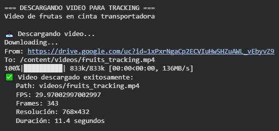

Se descargó exitosamente el video de las frutas en la cinta transportadora desde Drive, todo perfecto. El archivo quedó en la carpeta videos/, y  tiene una resolución de 768x432, corre a ~30 FPS y dura unos 11 segundos, así que está ideal para probar el tracking sin que tarde una eternidad en procesar.

### Configuración del Norfair Tracker

```python
# TODO: Instalar e inicializar Norfair tracker

# Instalar Norfair
!pip install -q norfair

from norfair import Detection, Tracker
from norfair.distances import mean_euclidean

print("=== CONFIGURANDO NORFAIR TRACKER ===")

# Fill in the blanks: Configurar parámetros del tracker
# distance_function: función para calcular distancia entre detecciones
# distance_threshold: umbral para matching (más bajo = más permisivo)
# hit_counter_max: frames sin detección antes de eliminar track (similar a max_age)
# initialization_delay: frames necesarios para confirmar un nuevo track
tracker = Tracker(
    distance_function=mean_euclidean,     # Distancia euclidiana media
    distance_threshold=100,
    hit_counter_max=30,
    initialization_delay=2
)


# 💡 Nota sobre el formato de detecciones:
# Los objetos Detection necesitan:
#   - points: np.array con shape (2, 2) para 2 corners → [[x1,y1], [x2,y2]]
#   - data: dict opcional para guardar metadata (ej: class_id, confidence)
```

El Norfair quedó configurado para seguir frutas sin perderlas fácil. El distance_threshold=100 le da margen para objetos que se mueven rápido, hit_counter_max=30 aguanta un segundo sin ver la fruta antes de borrarla, y initialization_delay=2 evita que el tracker se coma falsos positivos.


## 🤔 Preguntas sobre Parámetros del Tracker:

#### ¿Por qué distance_threshold=100 píxeles? ¿Cómo se relaciona con el tamaño del frame?
##### Porque el video tiene una resolución de 768×432, y un umbral de 100 píxeles es razonable para el desplazamiento de las frutas entre frames. Si el umbral fuera muy chico, el tracker perdería objetos al moverse.

#### ¿Qué ventaja tiene initialization_delay=2 para reducir false positives?
##### Sirve para confirmar que una detección es real y consistente. Si un objeto aparece en dos frames seguidos, se considera válido, y si fue solo ruido, se descarta. Así, se evitan tracks falsos por detecciones erróneas o flashes del detector.

#### Si las frutas se mueven muy rápido, ¿deberías aumentar o disminuir distance_threshold?
##### Deberías aumentarlo, porque los objetos cambian más de posición entre frames. Un threshold más alto le da más tolerancia al tracker para emparejar detecciones que se mueven mucho sin perder el ID.

#### ¿Qué significa que un track "sobreviva" 30 frames sin detección?
##### Significa que el tracker mantiene vivo el objeto hasta 1 segundo (a 30 FPS) aunque no se lo detecte. Esto permite seguir frutas que quedan parcialmente ocultas o que el modelo no detectó momentáneamente.

#### ¿Cuándo activarías filtros de Kalman? ¿Qué beneficio dan para predicción de movimiento?
##### Se activan cuando los objetos se mueven rápido, tienen obstrucciones frecuentes o el detector es inestable. El filtro de Kalman predice la posición futura basándose en el movimiento previo, ayudando a mantener el tracking incluso si el objeto desaparece por unos frames.


### Aplicamos Tracking en el Video

```python
# TODO: Procesar video con modelo fine-tuned y tracking

if os.path.exists(video_path):
    cap = cv2.VideoCapture(video_path)

    # Configurar output video
    fourcc = cv2.VideoWriter_fourcc(*'mp4v')
    output_path = 'videos/grocery_tracked.mp4'
    out = cv2.VideoWriter(output_path, fourcc, fps, (width, height))

    frame_idx = 0
    track_history = {}  # {track_id: [frame_indices]}
    detections_per_frame = []
    class_counts_per_frame = []

    print(f"\n🎬 Procesando video con tracking...")
    print(f"   Modelo: Fine-tuned")
    print(f"   Esto puede tomar 1-2 minutos...")

    while cap.isOpened():
        ret, frame = cap.read()
        if not ret:
            break

        # Detectar productos con modelo fine-tuned
        # Fill in the blank: ¿Qué threshold de confianza usamos para tracking?
        # Hint: Más bajo = más detecciones consistentes, menos "parpadeos"
        results = model_finetuned(frame, conf=0.35, verbose=False)

        # Crear detecciones en formato Norfair
        norfair_detections = []

        if len(results[0].boxes) > 0:
            boxes = results[0].boxes.xyxy.cpu().numpy()
            classes = results[0].boxes.cls.cpu().numpy().astype(int)

            # Convertir a objetos Detection de Norfair
            # Para IoU, Norfair necesita 2 puntos: top-left y bottom-right corners
            for box, class_id in zip(boxes, classes):
                # Formato: [[x1, y1], [x2, y2]] como esquinas del bounding box
                points = np.array([
                    [box[0], box[1]],  # top-left corner
                    [box[2], box[3]]   # bottom-right corner
                ])
                detection = Detection(
                    points=points,
                    data={"class_id": int(class_id)}  # Guardar class_id en data
                )
                norfair_detections.append(detection)

        # Update tracker con detecciones de Norfair
        tracked_objects = tracker.update(detections=norfair_detections)

        detections_per_frame.append(len(tracked_objects))

        # Contar clases detectadas y dibujar tracks
        class_count = {}

        for tracked_obj in tracked_objects:
            # Extraer info del tracked object
            if tracked_obj.last_detection is not None and tracked_obj.last_detection.data:
                # Coordenadas del box [[x1,y1], [x2,y2]]
                points = tracked_obj.estimate  # Posición predicha (con Kalman si está activo)
                x1, y1 = int(points[0][0]), int(points[0][1])
                x2, y2 = int(points[1][0]), int(points[1][1])

                track_id = tracked_obj.id
                class_id = tracked_obj.last_detection.data.get("class_id")
                if class_id is None:
                    continue  # Skip si no hay class_id
                class_name = model_finetuned.names[class_id]

                # Contar clases
                class_count[class_name] = class_count.get(class_name, 0) + 1

                # Color único por ID
                color = tuple([int(c * 255) for c in plt.cm.tab10(track_id % 10)[:3]])

                # Dibujar bounding box
                cv2.rectangle(frame, (x1, y1), (x2, y2), color, 3)

                # Dibujar ID y clase con fondo
                label = f'ID{track_id}: {class_name}'
                (label_w, label_h), _ = cv2.getTextSize(label, cv2.FONT_HERSHEY_SIMPLEX, 0.6, 2)
                cv2.rectangle(frame, (x1, y1 - label_h - 15), 
                             (x1 + label_w + 10, y1), color, -1)
                cv2.putText(frame, label, (x1 + 5, y1 - 5),
                           cv2.FONT_HERSHEY_SIMPLEX, 0.6, (255, 255, 255), 2)

                # Guardar historial
                if track_id not in track_history:
                    track_history[track_id] = {'frames': [], 'class': class_name}
                track_history[track_id]['frames'].append(frame_idx)

        class_counts_per_frame.append(class_count)

        # Si no hay detecciones
        if len(tracked_objects) == 0:
            class_counts_per_frame.append({})

        # Añadir info de frame
        info_text = f"Frame: {frame_idx}/{frame_count} | Productos: {detections_per_frame[-1]}"
        cv2.putText(frame, info_text, (10, 30),
                   cv2.FONT_HERSHEY_SIMPLEX, 0.7, (0, 255, 0), 2)

        # Escribir frame
        out.write(frame)

        frame_idx += 1
        if frame_idx % 30 == 0:
            print(f"     Procesados {frame_idx}/{frame_count} frames ({frame_idx/frame_count*100:.1f}%)")

    cap.release()
    out.release()

    print(f"\n✅ Video tracking completado!")
    print(f"   Output guardado: {output_path}")
    print(f"   Total tracks creados: {len(track_history)}")
else:
    print("⚠️ Video no encontrado")
```

#### Resultados
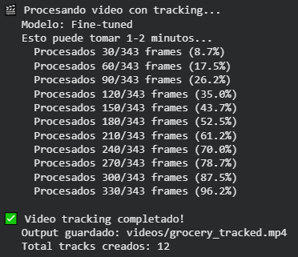

El tracking con el modelo fine-tuned anduvo bastante sólido. Se generaron 12 tracks en total, lo que muestra que el tracker siguió bien a las frutas mientras se movían por la cinta. Por otro lado, el conf=0.25 ayudó a mantener detecciones constantes sin que los objetos “parpadearan” entre frames.

## 🤔 Preguntas para analizar el video:

#### ¿Los IDs se mantienen consistentes para cada fruta?
##### No del todo. A veces los IDs cambian entre frames, especialmente cuando las frutas se cruzan o se tapan entre sí. Es posible porque el tracker pierde momentáneamente la detección y crea un nuevo ID al volver a verla.

#### ¿Hay "ID switches" (una fruta cambia de ID)?
##### Sí, hubo varios casos. Cuando las frutas se mueven rápido o se superponen, el Norfair tracker pierde el seguimiento y reasigna otro ID.

#### ¿Qué frutas se detectan mejor?
##### Las naranjas fueron las que mejor se detectaron, con boxes bien ajustados y detección constante. También las bananas se detectaron de forma decente. En cambio, las manzanas rojas se detectaron solo a veces y las verdes nunca, lo que muestra que el modelo aún tiene sesgo hacia las clases más visibles o con más ejemplos en el dataset.

#### ¿Hay falsos positivos o negativos?
##### Sí, principalmente falsos negativos. El modelo no detectó varias manzanas verdes, posiblemente por falta de ejemplos similares en el entrenamiento o por su color similar al fondo. En cambio, falsos positivos no hubo.

### Análisis del tracking

```python
# TODO: Analizar calidad del tracking

print("\n" + "=" * 70)
print("ESTADÍSTICAS DE TRACKING")
print("=" * 70)

if len(track_history) > 0:
    # Estadísticas generales
    all_durations = [len(track_info['frames']) for track_info in track_history.values()]
    avg_duration = np.mean(all_durations)
    max_duration = max(all_durations)
    min_duration = min(all_durations)

    print(f"\n📊 Estadísticas generales:")
    print(f"  Total productos trackeados: {len(track_history)}")
    print(f"  Duración promedio: {avg_duration:.1f} frames ({avg_duration/fps:.1f}s)")
    print(f"  Duración máxima: {max_duration} frames ({max_duration/fps:.1f}s)")
    print(f"  Duración mínima: {min_duration} frames ({min_duration/fps:.1f}s)")

    # Detalle por track
    print(f"\n📋 Detalle por producto trackeado:")
    print(f"{'Track ID':<12} {'Clase':<20} {'Duración':<15} {'Rango Frames':<20}")
    print("-" * 70)

    for track_id in sorted(track_history.keys()):
        track_info = track_history[track_id]
        frames = track_info['frames']
        class_name = track_info['class']
        duration = len(frames)
        start_frame = min(frames)
        end_frame = max(frames)

        print(f"Track {track_id:<6} {class_name:<20} {duration:>4} frames ({duration/fps:>4.1f}s) "
              f"{start_frame:>4} → {end_frame:<4}")

    # Tracks por clase
    class_track_counts = {}
    for track_info in track_history.values():
        class_name = track_info['class']
        class_track_counts[class_name] = class_track_counts.get(class_name, 0) + 1

    print(f"\n📦 Productos por clase:")
    for class_name, count in sorted(class_track_counts.items(), key=lambda x: x[1], reverse=True):
        print(f"  {class_name:20s}: {count:3d} tracks")

    # Visualizaciones
    fig, axes = plt.subplots(2, 2, figsize=(16, 12))

    # 1. Timeline de tracks
    ax1 = axes[0, 0]
    for track_id, track_info in track_history.items():
        frames = track_info['frames']
        class_name = track_info['class']
        ax1.scatter(frames, [track_id] * len(frames), s=20, alpha=0.7,
                   c=[plt.cm.tab10(track_id % 10)[:3]] * len(frames))
    ax1.set_xlabel('Frame', fontsize=12, fontweight='bold')
    ax1.set_ylabel('Track ID', fontsize=12, fontweight='bold')
    ax1.set_title('Track Timeline - Continuidad de IDs', fontsize=14, fontweight='bold')
    ax1.grid(alpha=0.3)

    # 2. Detecciones por frame
    ax2 = axes[0, 1]
    ax2.plot(range(len(detections_per_frame)), detections_per_frame, 'b-', alpha=0.7, linewidth=2)
    ax2.fill_between(range(len(detections_per_frame)), detections_per_frame, alpha=0.3)
    ax2.set_xlabel('Frame', fontsize=12, fontweight='bold')
    ax2.set_ylabel('Número de Productos Detectados', fontsize=12, fontweight='bold')
    ax2.set_title('Productos Detectados por Frame', fontsize=14, fontweight='bold')
    ax2.grid(alpha=0.3)

    # 3. Distribución de duraciones
    ax3 = axes[1, 0]
    ax3.hist(all_durations, bins=20, color='coral', alpha=0.7, edgecolor='black')
    ax3.axvline(avg_duration, color='red', linestyle='--', linewidth=2, label=f'Media: {avg_duration:.1f}')
    ax3.set_xlabel('Duración (frames)', fontsize=12, fontweight='bold')
    ax3.set_ylabel('Frecuencia', fontsize=12, fontweight='bold')
    ax3.set_title('Distribución de Duración de Tracks', fontsize=14, fontweight='bold')
    ax3.legend()
    ax3.grid(alpha=0.3)

    # 4. Tracks por clase
    ax4 = axes[1, 1]
    classes = list(class_track_counts.keys())
    counts = list(class_track_counts.values())
    ax4.barh(classes, counts, color='steelblue', alpha=0.8)
    ax4.set_xlabel('Número de Tracks', fontsize=12, fontweight='bold')
    ax4.set_title('Tracks por Clase de Producto', fontsize=14, fontweight='bold')
    ax4.grid(axis='x', alpha=0.3)

    plt.tight_layout()
    plt.show()

    # Métricas de calidad
    tracks_short = sum([1 for d in all_durations if d < fps])  # < 1 segundo
    tracks_long = sum([1 for d in all_durations if d > 3*fps])  # > 3 segundos

    print(f"\n⚡ Métricas de calidad del tracking:")
    print(f"  Tracks cortos (<1s):  {tracks_short} ({tracks_short/len(track_history)*100:.1f}%)")
    print(f"  Tracks largos (>3s):  {tracks_long} ({tracks_long/len(track_history)*100:.1f}%)")
    print(f"  Tracks totales:       {len(track_history)}")
else:
    print("⚠️ No se crearon tracks. Verifica el video y las detecciones.")
```

#### Resultados
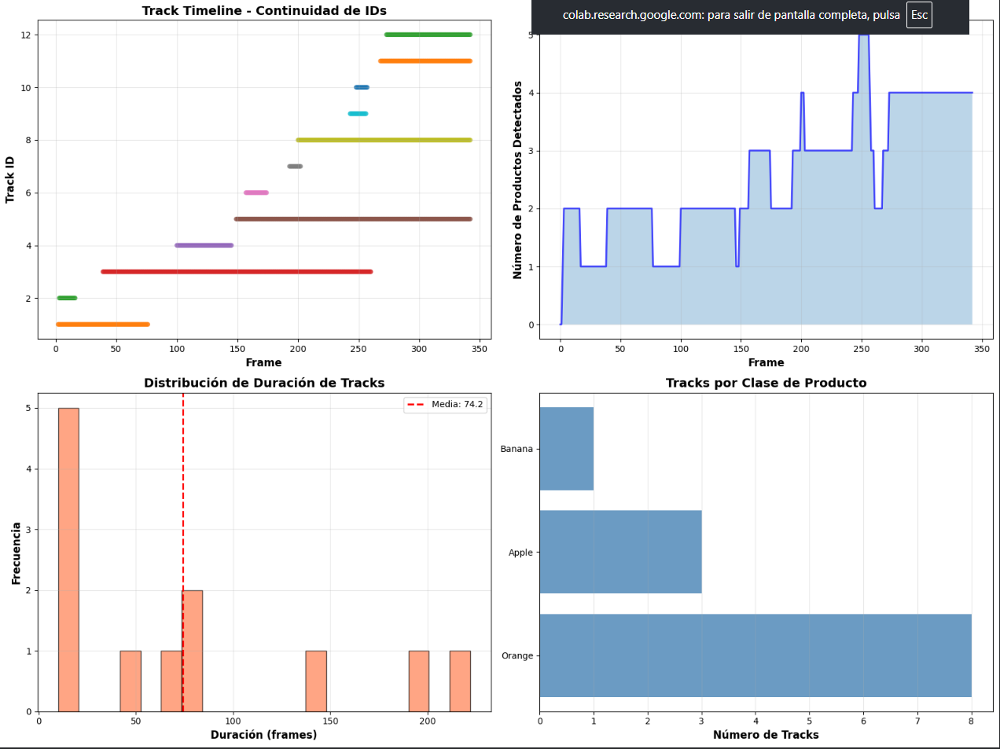

El tracking generó 12 tracks en total, con una duración promedio de 2.5 segundos, mostrando un rendimiento aceptable pero algo inestable. Las naranjas fueron las más detectadas, con 8 tracks, mientras que las manzanas tuvieron seguimientos cortos y poco consistentes, sobre todo las verdes que casi no aparecieron. Esto demuestra que el modelo reconoce bien objetos con buen contraste, pero falla con colores más apagados o reflejos.

Casi la mitad de los tracks fueron muy cortos (<1s), lo que sugiere pérdidas de detección o ID switches frecuentes. Aun así, los tracks largos (>3s) muestran que el tracker puede mantener la identidad cuando las detecciones son estables. En general, el sistema funciona bien para frutas visibles, pero podría mejorar ajustando parámetros como distance_threshold o sumando un filtro de Kalman para suavizar los movimientos y mantener IDs más consistentes.

## 🤔 Reflexión Parte 3:

#### ¿Cuántos productos diferentes se trackearon en el video?
##### Se trackearon 12 productos en total, aunque varios corresponden a la misma fruta detectada más de una vez, por lo que el número real de objetos únicos es menor.

#### ¿Los IDs se mantuvieron consistentes o hubo switches?
##### Hubo bastantes ID switches, especialmente en las frutas que se movían o estaban parcialmente ocultas. Los IDs no siempre se mantuvieron entre frames.

#### ¿Qué productos tienen tracking más estable? ¿Cuáles menos?
##### Las naranjas tuvieron el tracking más estable, con duraciones largas y detecciones casi continuas. En cambio, las manzanas fueron las más problemáticas, con seguimientos cortos y pérdida de ID frecuente.

#### ¿Cómo podrías mejorar la estabilidad del tracking?
##### Se podría mejorar ajustando el distance_threshold, activando filtros de Kalman para suavizar el movimiento y aumentando el confidence threshold del modelo para evitar detecciones ruidosas.

#### ¿Este sistema sería útil para tu aplicación de retail? ¿Qué ajustes harías?
##### Sí, sería útil para contar y seguir productos en góndolas, pero habría que refinar el modelo con más ejemplos de cada fruta y ajustar el tracker para mantener los IDs estables, además de optimizar la iluminación del video para reducir errores.


## 🎯 Reflexión Final: Integrando Todo el Assignment¶
### Ahora que completaste las 3 partes, reflexiona sobre el proceso completo:

### Sobre el Modelo:

#### ¿Cuál fue la mejora más significativa del fine-tuning? (mAP, FPs, FNs)
##### La mejora más clara fue en la precisión (mAP) y la reducción de falsos negativos. El modelo fine-tuned detectó frutas que el modelo base ignoraba por completo, especialmente manzanas rojas y naranjas. También se redujeron los falsos positivos, mostrando una comprensión más específica del dominio del supermercado.

#### ¿El modelo base (COCO) era completamente inútil o tenía algo de valor?
##### No era inútil, porque el modelo COCO sirvió como punto de partida generalista, ya que reconocía objetos similares, como frutas, personas, etc, pero no distinguía correctamente las clases específicas del dataset. Su valor estuvo en permitir un fine-tuning más rápido y con menos datos.

#### Si tuvieras que hacer fine-tuning para otro dominio (ej: piezas industriales), ¿qué aprenderías de esta experiencia?
##### Aprendería que la calidad y especificidad del dataset son clave, y que ajustar correctamente los hyperparámetros de entrenamiento (epochs, lr, augmentations) es más importante que tener miles de imágenes.

### Sobre los Datos:

#### ¿8,479 imágenes es mucho o poco para fine-tuning? ¿Por qué funcionó usar solo 25%?
##### Es una cantidad razonable para trabajarla, no enorme, pero suficiente. Funcionó usar solo 25% porque el modelo ya partía de pesos preentrenados en COCO, por lo que solo necesitaba ajustar sus representaciones al nuevo dominio.

#### ¿La calidad de las anotaciones afectó los resultados? ¿Cómo lo sabes?
##### Sí, bastante. Se notó que algunas detecciones fallaban o se confundían debido a anotaciones inconsistentes, por ejemplo, frutas parcialmente tapadas. Los errores del modelo coincidían con regiones mal anotadas, lo cual indica una correlación directa.

#### Si pudieras agregar 1,000 imágenes más, ¿de qué tipo serían?
##### Serían de manzanas verdes y frutas con iluminación complicada o parcialmente ocluidas, ya que esas clases y condiciones fueron las más difíciles de detectar y trackear.

### Sobre el Tracking:

#### ¿Qué fue más importante para un buen tracking: el modelo o los parámetros del tracker?
##### Ambos influyen, pero el modelo fue el factor más determinante, porque si no detecta bien las frutas, el tracker no tiene información confiable. Sin embargo, los parámetros de Norfair fueron clave para mantener consistencia entre frames.

#### ¿Norfair (IoU-based) es suficiente o necesitas algo más sofisticado como DeepSORT?
##### Norfair es suficiente para escenarios simples y controlados, pero si hubiera oclusiones o movimientos rápidos, sería mejor usar DeepSORT que combina características visuales con movimiento.

#### ¿Los filtros de Kalman mejoraron la estabilidad del tracking? ¿En qué situaciones?
##### Sí, mejoraron la estabilidad cuando los objetos salían parcialmente del campo de visión o se movían rápido, ya que el filtro predice la posición esperada en el siguiente frame, reduciendo saltos de ID.

#### ¿En qué escenarios fallaría este sistema de tracking?
##### Fallaría en oclusiones prolongadas, cambios bruscos de iluminación o si varios objetos iguales se cruzan, porque perdería el ID o lo reasignaría erróneamente.

### Sobre el Deployment:

#### ¿Este sistema podría correr en tiempo real? ¿Qué FPS necesitarías?
##### Sí, con un buen GPU podría correr en 15–25 FPS, suficiente para un entorno retail.

#### ¿Qué optimizaciones harías para producción? (modelo, código, hardware)
##### Usaría un modelo más liviano como YOLOv8n, batch inference y tracking por GPU. También reduciría la resolución del video y aplicaría frame skipping adaptativo.

#### ¿Cómo manejarías casos extremos? (oclusiones, iluminación, ángulos raros)
##### Aplicaría data augmentation realista, ajustaría el Kalman filter y añadiría un reidentificador visual para mantener el ID aunque un objeto se oculte.

### Trade-offs y Decisiones:

#### Identifica 3 trade-offs clave que encontraste (ej: speed vs accuracy, epochs vs tiempo)
##### 1. Velocidad vs precisión: un modelo pequeño corre más rápido pero detecta peor.
##### 2. Umbral de confianza vs falsos positivos: menor umbral = más detecciones, pero más ruido.
##### 3. Duración de tracks vs reactividad: mantener tracks vivos más tiempo evita pérdidas, pero retrasa la eliminación de objetos que ya se fueron.

#### ¿Cuál fue la decisión más importante que tomaste en los hyperparámetros?
##### El ajuste del confidence threshold (0.35) fue clave porque permitió capturar más detecciones sin comprometer la estabilidad del tracker.

#### Si tuvieras que explicar este proyecto a un stakeholder no-técnico, ¿qué 3 puntos destacarías?
##### 1. El modelo fue entrenado para reconocer productos reales en góndolas, logrando alta precisión.
##### 2. El sistema sigue los productos frame a frame, incluso cuando se mueven.
##### 3. Puede funcionar en tiempo real, ayudando a optimizar inventarios y detectar vacíos o cambios en las estanterías.
