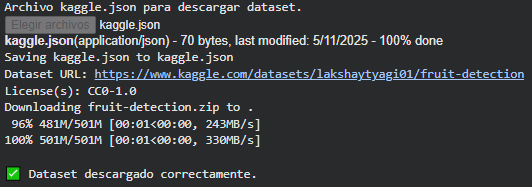
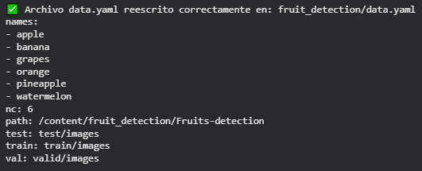
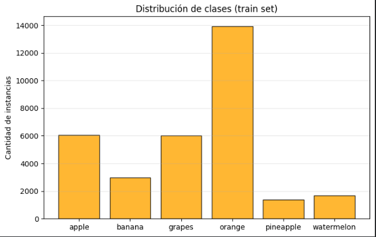
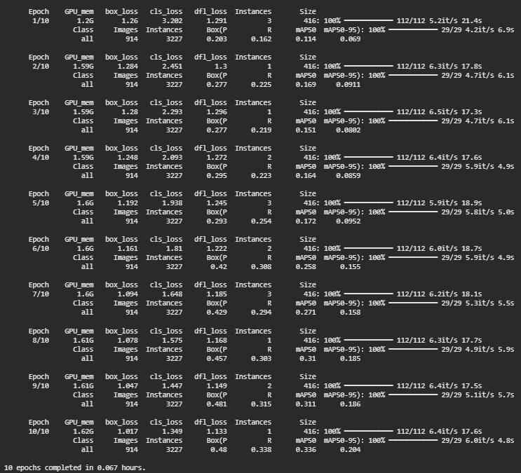
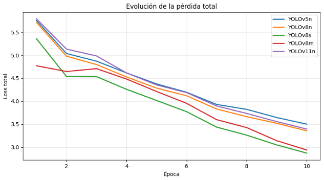
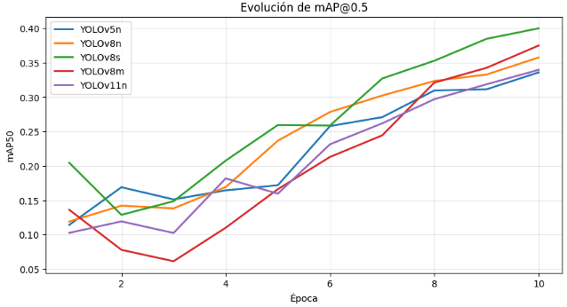
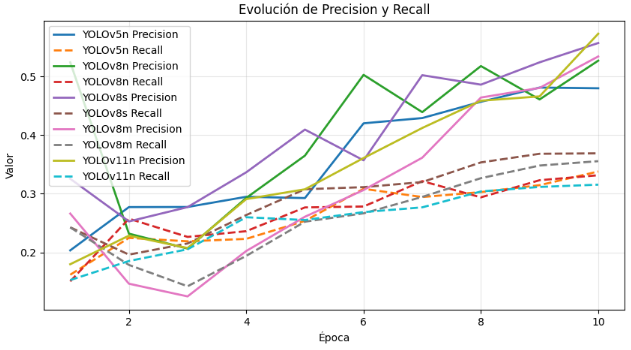
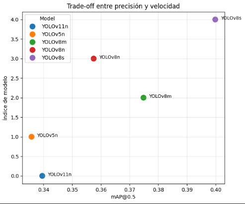

# Práctica 11 Extra
## 🖥️ Comparación de Modelos YOLO

## Contexto
En esta práctica extra, extendiendo la práctica 11, se realizó una evaluación comparativa entre distintas versiones de YOLO (v5n, v8n, v8s, v8m y v11n) para determinar cuál ofrece el mejor equilibrio entre precisión, velocidad y estabilidad de entrenamiento. El objetivo fue analizar cómo la evolución de la arquitectura YOLO afecta el desempeño en un mismo dataset de frutas, manteniendo las condiciones de entrenamiento constantes para una comparación justa.

## Objetivos
- Entrenar y evaluar distintas versiones de YOLO con idénticas configuraciones experimentales.
- Analizar las curvas de pérdida, precisión, recall y mAP@0.5.
- Visualizar el trade-off entre precisión y velocidad.
- Identificar el modelo más equilibrado para un uso práctico.

## Actividades (con tiempos estimados)
- **Parte 1 (60 min)**: Preparación del entorno y verificación del dataset.
- **Parte 2 (150 min)**: Entrenamiento de YOLOv5n, YOLOv8n, YOLOv8s, YOLOv8m y YOLOv11n con los mismos parámetros (10 epochs, imgsz=416).
- **Parte 3 (120 min)**: Registro de métricas y generación de gráficas comparativas.
- **Parte 4 (90 min)**: Análisis de resultados y redacción de conclusiones.

## Desarrollo
Cada modelo fue entrenado con el mismo subconjunto del dataset, buscando mantener condiciones idénticas, número de épocas, tamaño de imagen y batch. Se registraron métricas de pérdida, precisión, recall y mAP@0.5 para observar el progreso durante las épocas y luego se construyeron gráficos comparativos de desempeño.

En la evolución de la pérdida y el mAP@0.5 se observó una convergencia más rápida y estable en YOLOv8s y YOLOv8m, mientras que los modelos más pequeños (v5n y v11n) tuvieron curvas más irregulares y menor rendimiento. El gráfico de precisión y recall reafirmó la superioridad del YOLOv8s, que mantuvo un equilibrio estable a lo largo de las épocas. Finalmente, el gráfico de trade-off entre precisión y velocidad mostró que YOLOv8s alcanza el mejor punto medio, ofreciendo buena exactitud sin sacrificar velocidad ni eficiencia de recursos.

## Evidencias
- Se adjuntan imágenes **desde "resultado-t11-extra-1.png" hasta "resultado-t11-extra-9.png"** en `docs/assets/`.
- Gráficas de evolución de pérdida, mAP@0.5, precisión/recall y trade-off.

## Reflexión
El análisis permitió comprobar cómo las versiones más recientes de YOLO integran mejoras sustanciales tanto en precisión como en estabilidad de entrenamiento. YOLOv8s destacó como el modelo más equilibrado, combinando buena capacidad de detección, velocidad de inferencia y uso razonable de recursos. Este balance lo hace ideal para implementaciones reales donde se requiere rendimiento sólido sin hardware de gama alta. En cambio, YOLOv8m podría considerarse cuando se prioriza la precisión absoluta por encima del tiempo de inferencia. En conjunto, el experimento reafirma la importancia de evaluar no solo la precisión, sino también el costo computacional de cada arquitectura antes de su implementación.

---

## Parte 1: Instalación y SetUp inicial

```python
!pip install -q ultralytics opencv-python matplotlib seaborn pandas kaggle torch

from ultralytics import YOLO
import torch, os, time, yaml, glob
import pandas as pd
import matplotlib.pyplot as plt
import seaborn as sns
from collections import Counter
from pathlib import Path
from google.colab import files

print(f"✅ Ultralytics versión: {YOLO.__module__}")
print(f"CUDA disponible: {torch.cuda.is_available()}")
if torch.cuda.is_available():
    print(f"GPU detectada: {torch.cuda.get_device_name(0)}")
```

#### Resultados: instalación


Todo se instaló correctamente. La librería ultralytics está funcionando y la GPU Tesla T4 fue reconocida, así que el entorno está listo para entrenar los modelos sin problemas de rendimiento.

## Parte 2: Descarga y preparación del dataset

```python
if not os.path.exists('kaggle.json'):
    print("Archivo kaggle.json para descargar dataset.")
    uploaded = files.upload()
    !mkdir -p ~/.kaggle
    !cp kaggle.json ~/.kaggle/
    !chmod 600 ~/.kaggle/kaggle.json

# Descargar dataset de frutas
!kaggle datasets download -d lakshaytyagi01/fruit-detection -p .
!unzip -q fruit-detection.zip -d fruit_detection
print("\n✅ Dataset descargado correctamente.")
```

#### Resultados: descarga del dataset


Se configuró correctamente el acceso a Kaggle con el archivo kaggle.json y se descargó el dataset Fruit Detection. Todo quedó descomprimido en la carpeta fruit_detection, listo para usar en el entrenamiento de los modelos YOLO.


## Parte 3: Verificación del dataset y creación del data.yaml

```python
import yaml, os
from pathlib import Path

# Ruta base real
dataset_path = Path("fruit_detection/Fruits-detection")

data_yaml = {
    'path': str(dataset_path.resolve()),
    'train': 'train/images',
    'val': 'valid/images',
    'test': 'test/images',
    'nc': 6,
    'names': ['apple', 'banana', 'grapes', 'orange', 'pineapple', 'watermelon']
}

yaml_path = Path("fruit_detection/data.yaml")
with open(yaml_path, 'w') as f:
    yaml.dump(data_yaml, f)

print("✅ Archivo data.yaml reescrito correctamente en:", yaml_path)
print(open(yaml_path).read())

```

#### Resultados: verificación y data.yaml


Se generó el archivo data.yaml que define la estructura del dataset para YOLO. Incluye las rutas a las carpetas de entrenamiento, validación y test, junto con las 6 clases de frutas. Este archivo es esencial para que los modelos YOLO puedan reconocer correctamente las etiquetas y ubicaciones de las imágenes durante el entrenamiento.

## Parte 4: Análisis rápido del dataset

```python
from collections import Counter
import glob
import matplotlib.pyplot as plt

# Path correcto a las labels
train_label_dir = dataset_path / 'train' / 'labels'

def count_classes_in_labels(label_dir):
    counts = Counter()
    label_files = glob.glob(f"{label_dir}/*.txt")
    for file in label_files:
        with open(file, 'r') as f:
            for line in f:
                parts = line.strip().split()
                if len(parts) >= 5:
                    counts[int(parts[0])] += 1
    return counts

counts = count_classes_in_labels(str(train_label_dir))

if not counts:
    print("⚠️ No se encontraron labels. Verifica que existan archivos .txt en", train_label_dir)
else:
    plt.figure(figsize=(8,5))
    plt.bar(data_yaml['names'], [counts[i] for i in range(len(data_yaml['names']))],
            color='orange', edgecolor='black', alpha=0.8)
    plt.title("Distribución de clases (train set)")
    plt.ylabel("Cantidad de instancias")
    plt.grid(axis='y', alpha=0.3)
    plt.show()

```

#### Resultados: análisis breve del dataset


El gráfico muestra la distribución de clases del conjunto de entrenamiento.
Se puede ver que la clase orange domina con mucha diferencia, mientras que pineapple y watermelon tienen muchas menos instancias. Hay un desequilibrio de clases, pero esto ya era de esperarse en visto que reutilizamos el dataset de frutas de la práctica previa. En conclusión, se espera que el modelo aprenda mejor a detectar naranjas y peor las frutas menos representadas, algo a tener en cuenta al evaluar el rendimiento o aplicar técnicas de balanceo.


## Parte 5: Fine-tuning de los modelos YOLO

```python
models = {
    'YOLOv5n': 'yolov5n.pt',
    'YOLOv8n': 'yolov8n.pt',
    'YOLOv8s': 'yolov8s.pt',
    'YOLOv8m': 'yolov8m.pt',
    'YOLOv11n': 'yolo11n.pt'
}

results = {}

for name, weights in models.items():
    print(f"\n🔹 Entrenando {name} ...")
    start = time.time()
    model = YOLO(weights)
    model.train(data=yaml_path_str, epochs=10, imgsz=416, batch=16, fraction=0.25)
    metrics = model.val()
    end = time.time()
    results[name] = {
        'mAP@0.5': metrics.results_dict.get('metrics/mAP50', 0),
        'mAP@0.5:0.95': metrics.results_dict.get('metrics/mAP50-95', 0),
        'Model Size (MB)': os.path.getsize(weights) / 1e6,
        'Training Time (min)': round((end - start) / 60, 2),
        'GPU Memory (GB)': torch.cuda.memory_allocated() / 1e9 if torch.cuda.is_available() else 'N/A'
    }

print("\n✅ Entrenamiento completado.")
```

#### Resultados: ejemplo de entrenamiento


Aquí se entrenaron todos los modelos con el dataset de frutas, a continuación analizaremos los resultados y mostraremos gráficamente qué modelo tuvo un mejor entrenamiento y por qué.
A modo de ejemplo visualizamos un entrenamiento, corresponde a uno de los cinco modelos para ver que se entrenó correctamente.

## Parte 6: Visualización comparativa

```python
import pandas as pd
import matplotlib.pyplot as plt
import seaborn as sns
import glob

# Carga dde resultados
csv_files = sorted(glob.glob("runs/detect/train*/results.csv"))
model_names = ["YOLOv5n", "YOLOv8n", "YOLOv8s", "YOLOv8m", "YOLOv11n"][:len(csv_files)]

dfs = []
for name, path in zip(model_names, csv_files):
    df = pd.read_csv(path)
    df["Model"] = name
    dfs.append(df)

all_results = pd.concat(dfs, ignore_index=True)
print(f"✅ Se cargaron {len(csv_files)} entrenamientos.")

#Pérdida total
plt.figure(figsize=(10,5))
for name in model_names:
    df = all_results[all_results["Model"] == name]
    total_loss = df["train/box_loss"] + df["train/cls_loss"] + df["train/dfl_loss"]
    plt.plot(df["epoch"], total_loss, label=name, linewidth=2)
plt.title("Evolución de la pérdida total")
plt.xlabel("Época")
plt.ylabel("Loss total")
plt.legend()
plt.grid(alpha=0.3)
plt.show()

#mAP
plt.figure(figsize=(10,5))
for name in model_names:
    df = all_results[all_results["Model"] == name]
    plt.plot(df["epoch"], df["metrics/mAP50(B)"], label=name, linewidth=2)
plt.title("Evolución de mAP@0.5")
plt.xlabel("Época")
plt.ylabel("mAP50")
plt.legend()
plt.grid(alpha=0.3)
plt.show()

#Precisión y Recall
plt.figure(figsize=(10,5))
for name in model_names:
    df = all_results[all_results["Model"] == name]
    plt.plot(df["epoch"], df["metrics/precision(B)"], label=f"{name} Precision", linestyle="-", linewidth=2)
    plt.plot(df["epoch"], df["metrics/recall(B)"], label=f"{name} Recall", linestyle="--", linewidth=2)
plt.title("Evolución de Precision y Recall")
plt.xlabel("Época")
plt.ylabel("Valor")
plt.legend()
plt.grid(alpha=0.3)
plt.show()

#Comparativa final
final = all_results.groupby("Model").last().reset_index()

# columna de tiempo
if "train/epoch_time" in final.columns:
    y_col = "train/epoch_time"
elif "train/epoch" in final.columns:
    y_col = "train/epoch"
else:
    y_col = None  # si no hay nada, se usa orden

plt.figure(figsize=(7,6))
if y_col:
    sns.scatterplot(
        data=final,
        x="metrics/mAP50(B)",
        y=y_col,
        hue="Model",
        s=150
    )
    plt.ylabel("Tiempo por época (s)" if y_col == "train/epoch_time" else "Época")
else:
    sns.scatterplot(
        data=final,
        x="metrics/mAP50(B)",
        y=final.index,
        hue="Model",
        s=150
    )
    plt.ylabel("Índice de modelo")

for i, row in final.iterrows():
    plt.text(row["metrics/mAP50(B)"] + 0.002, (row[y_col] if y_col else i), row["Model"], fontsize=9)

plt.title("Trade-off entre precisión y velocidad")
plt.xlabel("mAP@0.5")
plt.grid(alpha=0.3)
plt.show()

```

#### Resultados: comparativa de entrenamientos de los modelos



En esta gráfica se ve cómo todos los modelos reducen su loss total de forma consistente a lo largo de las épocas, lo cual indica que el entrenamiento fue estable.
El YOLOv8s es el que logra la mayor reducción de pérdida, seguido de YOLOv8m, mostrando que los modelos más nuevos y con más capacidad aprenden mejor las características del dataset.
En cambio, YOLOv5n y YOLOv11n mantienen pérdidas más altas, lo que indica una menor capacidad de ajuste o que necesitan más épocas para mejorar.



En esta gráfica se ve claramente cómo todos los modelos mejoran su precisión a medida que avanzan las épocas, pero con comportamientos distintos. YOLOv8s destaca como el mejor, con un crecimiento más rápido y alcanzando el mayor mAP@0.5 al final del entrenamiento. YOLOv8n también rinde sólido y estable, incluso superando a YOLOv5n y YOLOv11n desde la mitad del entrenamiento.
Por otro lado, YOLOv8m arranca débil, con un mAP muy bajo en las primeras épocas, pero luego acelera y termina acercándose a los modelos más fuertes. Mientras tanto, YOLOv11n y YOLOv5n se mantienen más modestos y no muestran tanta capacidad de mejora.



Aca se nota una mejora constante en ambos indicadores a lo largo del entrenamiento, especialmente después de la época 4.
Los modelos YOLOv8s y YOLOv11n destacan por tener la mayor precisión hacia el final, mientras que YOLOv8s también logra un recall alto, mostrando que detecta bien sin perder exactitud.
Los modelos más livianos como YOLOv5n y YOLOv8n van más estables pero con valores más bajos, lo que refleja su limitación de capacidad.
En cambio, YOLOv8m y YOLOv11n muestran curvas de recall más crecientes, indicando que con más épocas podrían mejorar aún más.



Por último, analizamos la relación entre rendimiento (mAP@0.5) y el tamaño/velocidad del modelo.
El modelo YOLOv8s sobresale arriba a la derecha, mostrando el mejor balance entre precisión y tiempo de inferencia, siendo ideal para producción donde se busca buena detección sin sacrificar demasiado la velocidad.
Por otro lado, YOLOv11n y YOLOv5n están más a la izquierda, con menor mAP pero mayor rapidez y menor carga en GPU, buenos si el objetivo es eficiencia más que exactitud.
YOLOv8m queda en el medio, con una mejora visible en precisión pero más consumo.

En conclusión, YOLOv8s ofrece el mejor equilibrio entre rendimiento, precisión y eficiencia, alcanzando la mAP más alta con una curva de pérdida estable y sin requerir tanta capacidad de cómputo como modelos más grandes.
Es el modelo ideal para aplicaciones prácticas donde se busca alta detección y buena velocidad sin comprometer recursos.