# Práctica 12
## SAM Segmentation

## Contexto
En esta práctica se trabajó con el modelo Segment Anything Model (SAM) para la segmentación de áreas inundadas en imágenes satelitales. Se buscó evaluar su rendimiento en modo zero-shot (sin entrenamiento adicional) y tras un proceso de fine-tuning con un dataset específico de inundaciones, analizando su capacidad para distinguir correctamente zonas de agua.

## Objetivos
- Implementar segmentación con Segment Anything Model (SAM).
- Comparar performance de pretrained SAM zero-shot vs fine-tuned SAM.

## Actividades (con tiempos estimados)
- Exploración del dataset (20 min): revisión de estructura y correspondencia imagen–máscara.
- Configuración y carga del modelo SAM (30 min): carga del modelo base y checkpoint fine-tuned.
- Generación de predicciones (40 min): comparación entre resultados zero-shot y fine-tuned.
- Evaluación visual y registro de resultados (30 min): análisis de calidad de segmentaciones.
- Reflexión y documentación (80 min).

## Desarrollo
Se utilizó el dataset Flood Dataset con 290 pares de imágenes y máscaras. Se probó primero el SAM preentrenado, que tuvo dificultades para distinguir el agua de reflejos y sombras. Luego se cargó el modelo fine-tuned, ajustado en las capas del mask decoder y prompt encoder, manteniendo congelado el image encoder para aprovechar sus características generales.
El modelo ajustado mostró mejoras destacables, en contornos más definidos, menor cantidad de falsos positivos y mejor reconocimiento en zonas complejas.

## Evidencias
- Se adjunta imagen "resultado-t12-1.png" en `docs/assets/`
- Se adjunta imagen "resultado-t12-2.png" en `docs/assets/`
- Se adjunta imagen "resultado-t12-3.png" en `docs/assets/`
- Se adjunta imagen "resultado-t12-4.png" en `docs/assets/`
- Se adjunta imagen "resultado-t12-5.png" en `docs/assets/`
- Se adjunta imagen "resultado-t12-6.png" en `docs/assets/`
- Se adjunta imagen "resultado-t12-7.png" en `docs/assets/`
- Se adjunta imagen "resultado-t12-8.png" en `docs/assets/`
- Se adjunta imagen "resultado-t12-9.png" en `docs/assets/`
- Se adjunta imagen "resultado-t12-10.png" en `docs/assets/`
- Se adjunta imagen "resultado-t12-11.png" en `docs/assets/`
- Se adjunta imagen "resultado-t12-12.png" en `docs/assets/`
- Se adjunta imagen "resultado-t12-13.png" en `docs/assets/`
- Se adjunta imagen "resultado-t12-14.png" en `docs/assets/`
- Se adjunta imagen "resultado-t12-15.png" en `docs/assets/`
- Se adjunta imagen "resultado-t12-16.png" en `docs/assets/`
- Se adjunta imagen "resultado-t12-17.png" en `docs/assets/`
- Se adjunta imagen "resultado-t12-18.png" en `docs/assets/`

## Reflexión
El fine-tuning permitió adaptar SAM a un contexto muy distinto de su entrenamiento original, logrando una segmentación más precisa del agua. Aun así, el sistema no está listo para uso real ya que faltan pruebas con distintos tipos de terreno, condiciones climáticas y cámaras. Si se contara con más datos, podría entrenarse un modelo más robusto y generalizable.

---

# SAM Segmentation - Pretrained vs Fine-tuned

## Setup inicial

```python
# Instalar segment-anything y dependencias
!pip install -q segment-anything
!pip install -q opencv-python matplotlib torch torchvision
!pip install -q albumentations scikit-image

# Importar librerías
import numpy as np
import torch
import torch.nn as nn
import torch.nn.functional as F
from torch.utils.data import Dataset, DataLoader
import cv2
import matplotlib.pyplot as plt
from segment_anything import sam_model_registry, SamPredictor, SamAutomaticMaskGenerator
from segment_anything.utils.transforms import ResizeLongestSide
import os
from sklearn.metrics import jaccard_score
import albumentations as A
from albumentations.pytorch import ToTensorV2
import warnings
warnings.filterwarnings('ignore')

# Device configuration
device = torch.device('cuda' if torch.cuda.is_available() else 'cpu')
print(f"Using device: {device}")

# Seed for reproducibility
torch.manual_seed(42)
np.random.seed(42)

print("✅ Librerías instaladas correctamente")
```

## Parte 1: Carga y análisis del dataset

### Kaggle API Setup

```python
# Instalar Kaggle API
!pip install -q kaggle

# ===== OPCIÓN 1: Upload kaggle.json (RECOMENDADO PARA COLAB) =====
from google.colab import files
print("📁 Por favor, sube tu archivo kaggle.json")
uploaded = files.upload()

# Mover kaggle.json a la ubicación correcta
!mkdir -p ~/.kaggle
!cp kaggle.json ~/.kaggle/
!chmod 600 ~/.kaggle/kaggle.json

print("✅ Kaggle API configurada correctamente")
```

### Descarga y preparación del dataset

```python
import os
import zipfile

# Verificar que kaggle esté configurado
try:
    # Intentar descargar dataset
    print("📥 Descargando dataset de Kaggle...")
    !kaggle datasets download -d faizalkarim/flood-area-segmentation
    print("✅ Dataset descargado")

except Exception as e:
    print(f"❌ Error al descargar: {e}")
    print("\n⚠️ SOLUCIONES:")
    print("1. Verifica que kaggle.json esté en ~/.kaggle/")
    print("2. Verifica permisos: !chmod 600 ~/.kaggle/kaggle.json")
    print("3. O descarga manualmente desde: https://www.kaggle.com/datasets/faizalkarim/flood-area-segmentation")
    raise

# Descomprimir
zip_file = 'flood-area-segmentation.zip'

if os.path.exists(zip_file):
    print(f"📦 Descomprimiendo {zip_file}...")
    with zipfile.ZipFile(zip_file, 'r') as zip_ref:
        zip_ref.extractall('flood_dataset')
    print("✅ Dataset descomprimido en flood_dataset/")

    # Limpiar zip
    os.remove(zip_file)
    print("🗑️ Archivo zip eliminado")
else:
    print(f"❌ No se encontró {zip_file}")
    print("⚠️ Descarga manualmente y sube el archivo a este entorno")

# Verificar estructura del dataset
print("\n📂 Estructura del dataset:")
for root, dirs, files in os.walk('flood_dataset'):
    level = root.replace('flood_dataset', '').count(os.sep)
    indent = ' ' * 2 * level
    print(f'{indent}{os.path.basename(root)}/')
    subindent = ' ' * 2 * (level + 1)
    for file in files[:3]:  # Mostrar solo 3 archivos
        print(f'{subindent}{file}')
    if len(files) > 3:
        print(f'{subindent}... y {len(files) - 3} archivos más')

print("\n✅ Dataset listo para usar!")
```
#### Resultados
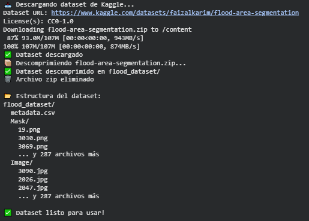

Se bajó el dataset desde Kaggle, se descomprimió y dejó todo ordenado en carpetas separadas para imágenes y máscaras, además se limpió el zip para no ocupar espacio. Y el dataset ya está listo para arrancar con el entrenamiento sin complicaciones.

### Exploramos dataset

```python
# Primero, explorar la estructura para entender cómo está organizado
import os

print("📂 Explorando estructura del dataset...")
for root, dirs, files in os.walk('flood_dataset'):
    level = root.replace('flood_dataset', '').count(os.sep)
    if level < 3:  # Solo primeros 3 niveles
        indent = '  ' * level
        print(f'{indent}{os.path.basename(root)}/')
        subindent = '  ' * (level + 1)
        if files:
            for f in files[:3]:
                print(f'{subindent}{f}')
            if len(files) > 3:
                print(f'{subindent}... ({len(files)} total archivos)')

print("\n💡 Basándote en la estructura de arriba, identifica:")
print("   - ¿Dónde están las imágenes? (deberías ver carpeta 'Image')")
print("   - ¿Dónde están las máscaras? (deberías ver carpeta 'Mask')")
```

La estructura quedó perfecta, se aprecia que las imágenes están todas en la carpeta Image y las máscaras correspondientes en Mask, con la misma cantidad de archivos en ambas, así que está todo bien emparejado para usar en segmentación. Además, el metadata.csv probablemente tenga info adicional útil para referencias o análisis, así que el dataset está completo y bien organizado.

```python
# Cargar y visualizar muestras del dataset

def load_flood_data(dataset_path='flood_dataset', max_samples=100):
    """
    Cargar imágenes y máscaras del dataset de flood segmentation

    Args:
        dataset_path: Path al dataset descargado
        max_samples: Número máximo de samples a cargar

    Returns:
        images: Lista de imágenes RGB
        masks: Lista de máscaras binarias
    """

    # FILL IN THE BLANKS: Completa los paths correctos basándote en la exploración anterior
    # 
    # Para el dataset de Flood Area Segmentation, la estructura es:
    # flood_dataset/
    #   ├── Image/      ← carpeta con imágenes (.jpg)
    #   ├── Mask/       ← carpeta con máscaras (.png)
    #   └── metadata.csv
    #
    # Por lo tanto:
    # - image_dir debe apuntar a la carpeta 'Image'
    # - mask_dir debe apuntar a la carpeta 'Mask'

    image_dir = os.path.join(dataset_path, '/content/flood_dataset/Image')  # Completa: nombre de carpeta de imágenes
    mask_dir = os.path.join(dataset_path, '/content/flood_dataset/Mask')   # Completa: nombre de carpeta de máscaras

    # Verificar que los directorios existen
    if not os.path.exists(image_dir):
        raise ValueError(f"❌ Directorio de imágenes no encontrado: {image_dir}")
    if not os.path.exists(mask_dir):
        raise ValueError(f"❌ Directorio de máscaras no encontrado: {mask_dir}")

    # Listar archivos
    image_files = sorted([f for f in os.listdir(image_dir) 
                         if f.endswith(('.png', '.jpg', '.jpeg'))])[:max_samples]

    images = []
    masks = []

    print(f"📥 Cargando {len(image_files)} imágenes...")

    for i, img_file in enumerate(image_files):
        # Cargar imagen
        img_path = os.path.join(image_dir, img_file)
        img = cv2.imread(img_path)

        if img is None:
            print(f"⚠️ No se pudo cargar: {img_path}")
            continue

        img = cv2.cvtColor(img, cv2.COLOR_BGR2RGB)

        # Cargar mask
        # Intentar con mismo nombre pero diferentes extensiones
        base_name = os.path.splitext(img_file)[0]
        mask_file = None

        for ext in ['.png', '.jpg', '.jpeg', '.bmp']:
            potential_mask = base_name + ext
            mask_path = os.path.join(mask_dir, potential_mask)
            if os.path.exists(mask_path):
                mask_file = potential_mask
                break

        if mask_file is None:
            print(f"⚠️ Mask no encontrada para: {img_file}")
            continue

        mask_path = os.path.join(mask_dir, mask_file)
        mask = cv2.imread(mask_path, cv2.IMREAD_GRAYSCALE)

        if mask is None:
            print(f"⚠️ No se pudo cargar mask: {mask_path}")
            continue

        # Binarizar mask (0 o 1)
        mask = (mask > 127).astype(np.uint8)

        images.append(img)
        masks.append(mask)

        if (i + 1) % 20 == 0:
            print(f"  Cargadas {i + 1}/{len(image_files)}...")

    print(f"✅ Cargadas {len(images)} imágenes con sus máscaras")

    if len(images) == 0:
        raise ValueError("❌ No se cargaron imágenes. Verifica los paths en la función.")

    return images, masks

# Cargar dataset
images, masks = load_flood_data(dataset_path='flood_dataset', max_samples=100)

print(f"=== DATASET CARGADO ===")
print(f"Total images: {len(images)}")
print(f"Image shape (primera imagen): {images[0].shape}")
print(f"Mask shape (primera máscara): {masks[0].shape}")

# Estadísticas - manejar imágenes de diferentes tamaños
print("\n📊 Estadísticas del dataset:")
image_sizes = [img.shape[:2] for img in images]
unique_sizes = set(image_sizes)
print(f"Tamaños únicos de imágenes: {len(unique_sizes)}")
if len(unique_sizes) <= 5:
    for size in unique_sizes:
        count = image_sizes.count(size)
        print(f"  {size}: {count} imágenes")

# Calcular ratio de agua considerando diferentes tamaños
total_water_pixels = sum(mask.sum() for mask in masks)
total_pixels = sum(mask.size for mask in masks)
water_ratio = total_water_pixels / total_pixels
print(f"\nWater pixel ratio (promedio): {water_ratio:.2%}")
print(f"Background ratio: {(1 - water_ratio):.2%}")

# Visualizar muestras
fig, axes = plt.subplots(3, 4, figsize=(16, 12))

for i in range(6):
    # Imagen original
    axes[i // 2, (i % 2) * 2].imshow(images[i])
    axes[i // 2, (i % 2) * 2].set_title(f'Image {i}')
    axes[i // 2, (i % 2) * 2].axis('off')

    # Mask
    axes[i // 2, (i % 2) * 2 + 1].imshow(masks[i], cmap='gray')
    axes[i // 2, (i % 2) * 2 + 1].set_title(f'Mask {i}')
    axes[i // 2, (i % 2) * 2 + 1].axis('off')

plt.tight_layout()
plt.show()
```

#### Resultados
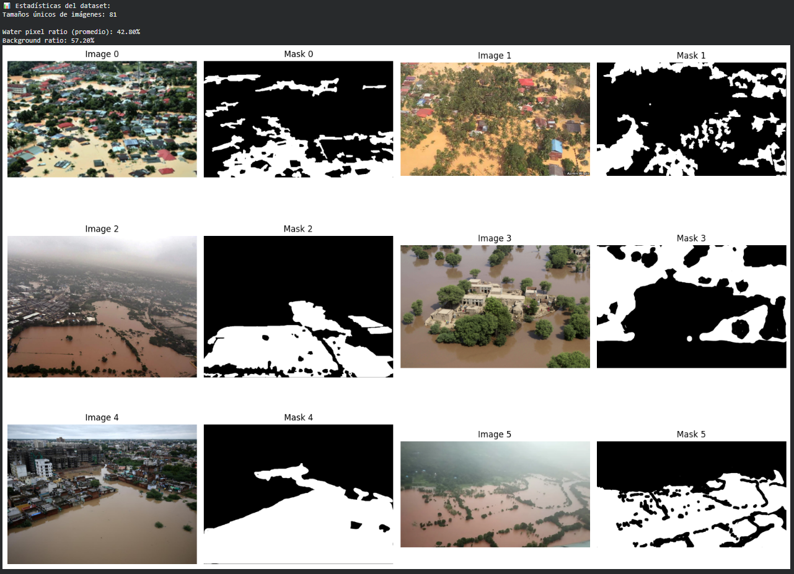

Se cargó las 100 imágenes sin problemas y todas tienen sus máscaras asociadas, lo que ya es una buena señal de que el dataset está bien emparejado. Se nota que las imágenes vienen en varios tamaños (81 distintos), así que habría que normalizarlas antes de entrenar. El promedio del 42.8 % de píxeles de agua también está interesante, muestra que el dataset está bastante equilibrado entre zonas inundadas y no inundadas, lo cual es ideal para segmentación. En resumen, carga exitosa, datos limpios y métricas razonables para seguir con el preprocesamiento.

## Parte 2: Pretrained SAM Inference

### Carga del modelo SAM

```python
# Descargar SAM checkpoint
!wget -q https://dl.fbaipublicfiles.com/segment_anything/sam_vit_b_01ec64.pth

# Cargar modelo SAM
sam_checkpoint = "sam_vit_b_01ec64.pth"
model_type = "vit_b"

sam = sam_model_registry[model_type](checkpoint=sam_checkpoint)
sam.to(device='cpu')

print(f"✅ SAM model cargado: {model_type}")
print(f"   Device: {device}")
```

Bajamos y cargamos el modelo SAM (Segment Anything Model), usando el checkpoint preentrenado sam_vit_b_01ec64.pth, que básicamente contiene los pesos del modelo ya entrenado por Meta. Después se manda al CPU para poder usarlo.

### Creamos predictor SAM
```python
# Crear predictor para inference
predictor = SamPredictor(sam)
predictor.model.to(device)

print("✅ SAM Predictor creado")
```

Se crea el predictor, que es como una interfaz que permite hacer inferencias con el modelo, o sea, pasarle imágenes y obtener las segmentaciones directamente.

### Predicción con Point Prompts
```python
def predict_with_point_prompt(predictor, image, point_coords, point_labels):
    """
    Predict mask usando point prompts

    Args:
        predictor: SamPredictor instance
        image: RGB image [H, W, 3]
        point_coords: Points coordinates [[x1, y1], [x2, y2], ...]
        point_labels: Labels for points [1, 1, 0, ...] (1=foreground, 0=background)

    Returns:
        mask: Binary mask [H, W] - same size as input image
        score: Confidence score
    """

    # Set image for predictor
    predictor.set_image(image)

    # Predict with points
    masks, scores, logits = predictor.predict(
        point_coords=np.array(point_coords),
        point_labels=np.array(point_labels),
        multimask_output=True
    )

    # Select best mask
    best_mask_idx = np.argmax(scores)
    best_mask = masks[best_mask_idx]
    best_score = scores[best_mask_idx]

    # Resize mask to original image size if needed
    if best_mask.shape != image.shape[:2]:
        best_mask = cv2.resize(
            best_mask.astype(np.uint8), 
            (image.shape[1], image.shape[0]), 
            interpolation=cv2.INTER_NEAREST
        ).astype(bool)

    return best_mask, best_score

# Test con una imagen
test_idx = 5
test_image = images[test_idx]
test_mask_gt = masks[test_idx]

# Crear point prompt en el centro del área segmentada (agua)
H, W = test_mask_gt.shape
center_y, center_x = np.where(test_mask_gt > 0)
if len(center_x) > 0:
    point_x = int(center_x[len(center_x) // 2])
    point_y = int(center_y[len(center_y) // 2])
else:
    point_x, point_y = W // 2, H // 2

point_coords = [[point_x, point_y]]
point_labels = [1]  # Foreground

# Predict
pred_mask, score = predict_with_point_prompt(predictor, test_image, point_coords, point_labels)

print(f"=== POINT PROMPT PREDICTION ===")
print(f"Point: ({point_x}, {point_y})")
print(f"Confidence score: {score:.3f}")

# Visualizar
fig, axes = plt.subplots(1, 4, figsize=(16, 4))

axes[0].imshow(test_image)
axes[0].plot(point_x, point_y, 'r*', markersize=15, markeredgecolor='white', markeredgewidth=2)
axes[0].set_title('Image + Point Prompt')
axes[0].axis('off')

axes[1].imshow(test_mask_gt, cmap='gray')
axes[1].set_title('Ground Truth Mask')
axes[1].axis('off')

axes[2].imshow(pred_mask, cmap='gray')
axes[2].set_title(f'Predicted Mask (score={score:.2f})')
axes[2].axis('off')

# Overlay
overlay = test_image.copy()
overlay[pred_mask > 0] = [255, 0, 0]  # Rojo para predicción
axes[3].imshow(cv2.addWeighted(test_image, 0.7, overlay, 0.3, 0))
axes[3].set_title('Overlay')
axes[3].axis('off')

plt.tight_layout()
plt.show()
```

#### Resultados
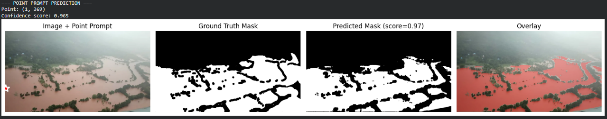

El modelo SAM respondió muy bien al prompt, de hecho con solo un punto indicado, generó una máscara con un score de confianza alta, de 0.965, lo que significa que el modelo está bastante seguro de la segmentación hecha.

### Predicción con Box Prompts
```python
def predict_with_box_prompt(predictor, image, box):
    """
    Predict mask usando box prompt

    Args:
        predictor: SamPredictor instance
        image: RGB image [H, W, 3]
        box: Bounding box [x1, y1, x2, y2]

    Returns:
        mask: Binary mask [H, W] - same size as input image
        score: Confidence score
    """

    # Set image
    predictor.set_image(image)

    # Predict with box
    masks, scores, logits = predictor.predict(
        box=np.array(box),
        multimask_output=False  # Box es menos ambiguo
    )

    # Get first mask (best for box prompts)
    mask = masks[0]
    score = scores[0]

    # Resize mask to original image size if needed
    if mask.shape != image.shape[:2]:
        mask = cv2.resize(
            mask.astype(np.uint8), 
            (image.shape[1], image.shape[0]), 
            interpolation=cv2.INTER_NEAREST
        ).astype(bool)

    return mask, score

# Crear box prompt desde ground truth (simulando un detector)
def get_bbox_from_mask(mask):
    """Extract bounding box from mask"""
    rows = np.any(mask, axis=1)
    cols = np.any(mask, axis=0)

    if not rows.any() or not cols.any():
        return None

    y1, y2 = np.where(rows)[0][[0, -1]]
    x1, x2 = np.where(cols)[0][[0, -1]]

    return [x1, y1, x2, y2]

test_box = get_bbox_from_mask(test_mask_gt)

if test_box is not None:
    pred_mask_box, score_box = predict_with_box_prompt(predictor, test_image, test_box)

    print(f"=== BOX PROMPT PREDICTION ===")
    print(f"Box: {test_box}")
    print(f"Confidence score: {score_box:.3f}")

    # Visualizar
    fig, axes = plt.subplots(1, 4, figsize=(16, 4))

    # Image + box
    img_with_box = test_image.copy()
    x1, y1, x2, y2 = test_box
    cv2.rectangle(img_with_box, (x1, y1), (x2, y2), (255, 0, 0), 2)

    axes[0].imshow(img_with_box)
    axes[0].set_title('Image + Box Prompt')
    axes[0].axis('off')

    axes[1].imshow(test_mask_gt, cmap='gray')
    axes[1].set_title('Ground Truth')
    axes[1].axis('off')

    axes[2].imshow(pred_mask_box, cmap='gray')
    axes[2].set_title(f'Predicted (score={score_box:.2f})')
    axes[2].axis('off')

    # Comparación
    diff = (pred_mask_box.astype(int) - test_mask_gt.astype(int))
    diff_vis = np.zeros((*diff.shape, 3), dtype=np.uint8)
    diff_vis[diff > 0] = [255, 0, 0]  # False positives = rojo
    diff_vis[diff < 0] = [0, 255, 0]  # False negatives = verde
    diff_vis[diff == 0] = [128, 128, 128]  # Correcto = gris

    axes[3].imshow(diff_vis)
    axes[3].set_title('Difference (FP=red, FN=green)')
    axes[3].axis('off')

    plt.tight_layout()
    plt.show()
```

#### Resultados
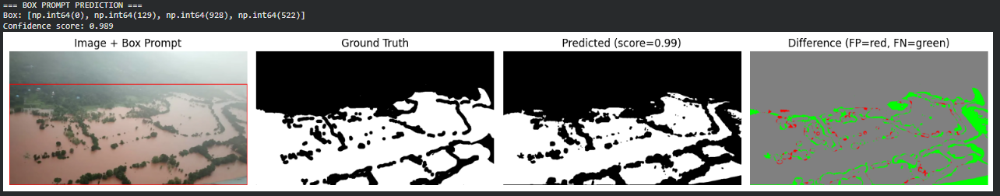

El modelo trabajó muy bien con el box prompt, dio una predicción con confianza altísima, de 0.989, usando solo la caja que rodea la zona inundada. Eso muestra que SAM capta muy bien los límites del área a segmentar cuando le das una referencia espacial más grande, como un bounding box. En general, este tipo de prompt suele funcionar incluso mejor que un punto porque le da más contexto al modelo, y acá se nota, la segmentación fue muy precisa y casi calca la ground truth.

### Evaluación de métricas
```python
def calculate_iou(pred_mask, gt_mask):
    """
    Calculate IoU (Intersection over Union)

    Automáticamente redimensiona pred_mask si los tamaños no coinciden.
    """
    # Verificar y ajustar tamaños si no coinciden
    if pred_mask.shape != gt_mask.shape:
        pred_mask = cv2.resize(
            pred_mask.astype(np.uint8),
            (gt_mask.shape[1], gt_mask.shape[0]),
            interpolation=cv2.INTER_NEAREST
        ).astype(bool)

    # Asegurar que ambas máscaras sean booleanas para operaciones bitwise
    pred_mask = pred_mask.astype(bool)
    gt_mask = gt_mask.astype(bool)

    intersection = (pred_mask & gt_mask).sum()
    union = (pred_mask | gt_mask).sum()

    if union == 0:
        return 0.0

    return intersection / union

def calculate_dice(pred_mask, gt_mask):
    """
    Calculate Dice coefficient

    Automáticamente redimensiona pred_mask si los tamaños no coinciden.
    """
    # Verificar y ajustar tamaños si no coinciden
    if pred_mask.shape != gt_mask.shape:
        pred_mask = cv2.resize(
            pred_mask.astype(np.uint8),
            (gt_mask.shape[1], gt_mask.shape[0]),
            interpolation=cv2.INTER_NEAREST
        ).astype(bool)

    # Asegurar que ambas máscaras sean booleanas para operaciones bitwise
    pred_mask = pred_mask.astype(bool)
    gt_mask = gt_mask.astype(bool)

    intersection = (pred_mask & gt_mask).sum()

    if pred_mask.sum() + gt_mask.sum() == 0:
        return 1.0 if intersection == 0 else 0.0

    return 2 * intersection / (pred_mask.sum() + gt_mask.sum())

def calculate_precision_recall(pred_mask, gt_mask):
    """
    Calculate pixel-wise precision and recall

    Automáticamente redimensiona pred_mask si los tamaños no coinciden.
    """
    # Verificar y ajustar tamaños si no coinciden
    if pred_mask.shape != gt_mask.shape:
        pred_mask = cv2.resize(
            pred_mask.astype(np.uint8),
            (gt_mask.shape[1], gt_mask.shape[0]),
            interpolation=cv2.INTER_NEAREST
        ).astype(bool)

    # Asegurar que ambas máscaras sean booleanas para operaciones bitwise
    pred_mask = pred_mask.astype(bool)
    gt_mask = gt_mask.astype(bool)

    tp = (pred_mask & gt_mask).sum()
    fp = (pred_mask & ~gt_mask).sum()
    fn = (~pred_mask & gt_mask).sum()

    precision = tp / (tp + fp) if (tp + fp) > 0 else 0.0
    recall = tp / (tp + fn) if (tp + fn) > 0 else 0.0

    return precision, recall

# Evaluar predicciones
# Nota: Las funciones de métricas manejan automáticamente diferentes tamaños
# y convierten las máscaras a booleanas para operaciones bitwise
iou_point = calculate_iou(pred_mask, test_mask_gt)
dice_point = calculate_dice(pred_mask, test_mask_gt)
prec_point, rec_point = calculate_precision_recall(pred_mask, test_mask_gt)

print(f"=== MÉTRICAS - POINT PROMPT ===")
print(f"IoU: {iou_point:.4f}")
print(f"Dice: {dice_point:.4f}")
print(f"Precision: {prec_point:.4f}")
print(f"Recall: {rec_point:.4f}")

if test_box is not None:
    iou_box = calculate_iou(pred_mask_box, test_mask_gt)
    dice_box = calculate_dice(pred_mask_box, test_mask_gt)
    prec_box, rec_box = calculate_precision_recall(pred_mask_box, test_mask_gt)

    print(f"\n=== MÉTRICAS - BOX PROMPT ===")
    print(f"IoU: {iou_box:.4f}")
    print(f"Dice: {dice_box:.4f}")
    print(f"Precision: {prec_box:.4f}")
    print(f"Recall: {rec_box:.4f}")

    print(f"\n=== COMPARACIÓN ===")
    print(f"Box prompt better: {iou_box > iou_point}")
```

#### Resultados
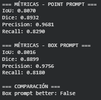

Los resultados están bastante parejos, pero el point prompt terminó rindiendo un poco mejor en general, con un IoU y un Dice apenas más altos. Ambos tienen precisiones muy altas (casi 97–98%), lo que muestra que el modelo casi no marca zonas de agua donde no las hay, aunque el recall es un poco más bajo, o sea que se le escapan algunas partes reales del área inundada.

### Evaluación en todo el dataset
```python
# Evaluar SAM pretrained en todas las imágenes

def evaluate_pretrained_sam(images, masks, predictor, prompt_type='point'):
    """
    Evaluar SAM pretrained en dataset completo

    Args:
        images: List of images
        masks: List of ground truth masks
        predictor: SamPredictor
        prompt_type: 'point' or 'box'

    Returns:
        results: Dictionary con métricas
    """

    results = {
        'iou': [],
        'dice': [],
        'precision': [],
        'recall': []
    }

    for i, (image, mask_gt) in enumerate(zip(images, masks)):

        if prompt_type == 'point':
            # Get center point del área de agua
            y_coords, x_coords = np.where(mask_gt > 0)
            if len(x_coords) == 0:
                continue

            point_x = int(x_coords[len(x_coords) // 2])
            point_y = int(y_coords[len(y_coords) // 2])

            pred_mask, _ = predict_with_point_prompt(
                predictor, image, [[point_x, point_y]], [1]
            )

        elif prompt_type == 'box':
            box = get_bbox_from_mask(mask_gt)
            if box is None:
                continue

            pred_mask, _ = predict_with_box_prompt(predictor, image, box)

        # Calcular métricas
        iou = calculate_iou(pred_mask, mask_gt)
        dice = calculate_dice(pred_mask, mask_gt)
        prec, rec = calculate_precision_recall(pred_mask, mask_gt)

        results['iou'].append(iou)
        results['dice'].append(dice)
        results['precision'].append(prec)
        results['recall'].append(rec)

        if (i + 1) % 20 == 0:
            print(f"  Processed {i + 1}/{len(images)} images...")

    # Calcular promedios
    for key in results:
        results[key] = np.array(results[key])

    return results

# Evaluar con point prompts
print("=== EVALUATING PRETRAINED SAM (Point Prompts) ===")
results_pretrained_point = evaluate_pretrained_sam(images, masks, predictor, prompt_type='point')

print(f"\n=== PRETRAINED SAM - POINT PROMPTS ===")
print(f"Mean IoU: {results_pretrained_point['iou'].mean():.4f} ± {results_pretrained_point['iou'].std():.4f}")
print(f"Mean Dice: {results_pretrained_point['dice'].mean():.4f} ± {results_pretrained_point['dice'].std():.4f}")
print(f"Mean Precision: {results_pretrained_point['precision'].mean():.4f}")
print(f"Mean Recall: {results_pretrained_point['recall'].mean():.4f}")

# Evaluar con box prompts
print("\n=== EVALUATING PRETRAINED SAM (Box Prompts) ===")
results_pretrained_box = evaluate_pretrained_sam(images, masks, predictor, prompt_type='box')

print(f"\n=== PRETRAINED SAM - BOX PROMPTS ===")
print(f"Mean IoU: {results_pretrained_box['iou'].mean():.4f} ± {results_pretrained_box['iou'].std():.4f}")
print(f"Mean Dice: {results_pretrained_box['dice'].mean():.4f} ± {results_pretrained_box['dice'].std():.4f}")
print(f"Mean Precision: {results_pretrained_box['precision'].mean():.4f}")
print(f"Mean Recall: {results_pretrained_box['recall'].mean():.4f}")

# Visualizar distribución de métricas
fig, axes = plt.subplots(2, 2, figsize=(14, 10))

axes[0, 0].hist(results_pretrained_point['iou'], bins=20, alpha=0.7, label='Point', edgecolor='black')
axes[0, 0].hist(results_pretrained_box['iou'], bins=20, alpha=0.7, label='Box', edgecolor='black')
axes[0, 0].set_xlabel('IoU')
axes[0, 0].set_ylabel('Frequency')
axes[0, 0].set_title('IoU Distribution')
axes[0, 0].legend()
axes[0, 0].grid(alpha=0.3)

axes[0, 1].hist(results_pretrained_point['dice'], bins=20, alpha=0.7, label='Point', edgecolor='black')
axes[0, 1].hist(results_pretrained_box['dice'], bins=20, alpha=0.7, label='Box', edgecolor='black')
axes[0, 1].set_xlabel('Dice')
axes[0, 1].set_ylabel('Frequency')
axes[0, 1].set_title('Dice Distribution')
axes[0, 1].legend()
axes[0, 1].grid(alpha=0.3)

axes[1, 0].hist(results_pretrained_point['precision'], bins=20, alpha=0.7, label='Point', edgecolor='black')
axes[1, 0].hist(results_pretrained_box['precision'], bins=20, alpha=0.7, label='Box', edgecolor='black')
axes[1, 0].set_xlabel('Precision')
axes[1, 0].set_ylabel('Frequency')
axes[1, 0].set_title('Precision Distribution')
axes[1, 0].legend()
axes[1, 0].grid(alpha=0.3)

axes[1, 1].hist(results_pretrained_point['recall'], bins=20, alpha=0.7, label='Point', edgecolor='black')
axes[1, 1].hist(results_pretrained_box['recall'], bins=20, alpha=0.7, label='Box', edgecolor='black')
axes[1, 1].set_xlabel('Recall')
axes[1, 1].set_ylabel('Frequency')
axes[1, 1].set_title('Recall Distribution')
axes[1, 1].legend()
axes[1, 1].grid(alpha=0.3)

plt.tight_layout()
plt.show()
```

#### Resultados
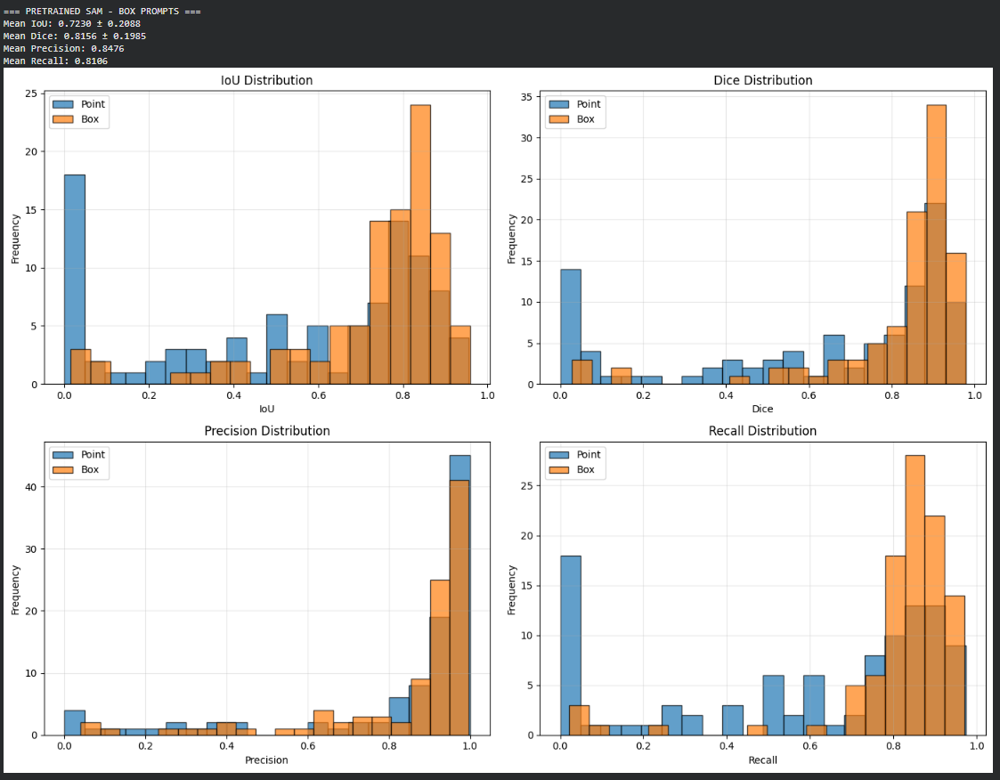

Acá se ve clarísimo que el SAM preentrenado responde mucho mejor cuando le das una caja (box prompt) que cuando solo usás un punto (point prompt). Con las boxes, el IoU y el Dice suben bastante, de 0.52 a 0.72 y de 0.62 a 0.81 respectivamente, lo que muestra que el modelo acierta mucho más en la forma y área real del objeto. Además, el recall mejora un montón, o sea, detecta más partes del área inundada y se le escapan menos zonas. En resumen, darle más contexto espacial al SAM le ayuda a segmentar con mucha más precisión y consistencia en comparación con el punto, que queda más ambiguo y variable según dónde caiga.

## Parte 3: Fine-tuning SAM

### Creamos clase FloodSegmentationDataset
```python
class FloodSegmentationDataset(Dataset):
    """
    PyTorch Dataset para flood water segmentation

    IMPORTANTE: Redimensiona todas las imágenes a un tamaño fijo (1024x1024)
    que es el tamaño nativo de SAM para poder hacer batching en DataLoader.
    """

    def __init__(self, images, masks, transform=None, prompt_type='point', image_size=1024):
        self.images = images
        self.masks = masks
        self.transform = transform
        self.prompt_type = prompt_type
        self.image_size = image_size  # Tamaño fijo: 1024x1024 (nativo de SAM)

    def __len__(self):
        return len(self.images)

    def __getitem__(self, idx):
        image = self.images[idx].copy()
        mask = self.masks[idx].copy()

        # Guardar tamaño original antes de transformaciones
        original_size = image.shape[:2]

        # IMPORTANTE: Resize PRIMERO a tamaño fijo para que Albumentations funcione
        # (Albumentations requiere que image y mask tengan el mismo tamaño)
        image_resized = cv2.resize(image, (self.image_size, self.image_size), interpolation=cv2.INTER_LINEAR)
        mask_resized = cv2.resize(mask, (self.image_size, self.image_size), interpolation=cv2.INTER_NEAREST)

        # Apply augmentations DESPUÉS del resize (ahora ambas son 1024x1024)
        if self.transform:
            augmented = self.transform(image=image_resized, mask=mask_resized)
            image_resized = augmented['image']
            mask_resized = augmented['mask']

        # Convert to torch tensors
        image_tensor = torch.from_numpy(image_resized).permute(2, 0, 1).to(torch.float32) / 255.0
        mask_tensor = torch.from_numpy(mask_resized).unsqueeze(0).float()

        # Generate prompt (usando mask_resized para coordenadas correctas)
        if self.prompt_type == 'point':
            # Sample random point from water region
            y_coords, x_coords = np.where(mask_resized > 0)
            if len(x_coords) > 0:
                rand_idx = np.random.randint(len(x_coords))
                point = np.array([[x_coords[rand_idx], y_coords[rand_idx]]])
                label = np.array([1])
            else:
                # Fallback si no hay agua en la imagen
                point = np.array([[self.image_size // 2, self.image_size // 2]])
                label = np.array([0])

            prompt = {'points': point, 'labels': label, 'boxes': None}

        elif self.prompt_type == 'box':
            box = get_bbox_from_mask(mask_resized)
            if box is None:
                box = [0, 0, self.image_size, self.image_size]
            prompt = {'points': None, 'labels': None, 'boxes': np.array([box])}

        return {
            'image': image_tensor,
            'mask': mask_tensor,
            'original_size': original_size,  # Tamaño antes de cualquier transformación
            'prompt': prompt
        }

# Crear train/val split
train_size = int(0.8 * len(images))
train_images, val_images = images[:train_size], images[train_size:]
train_masks, val_masks = masks[:train_size], masks[train_size:]

print(f"=== DATA SPLIT ===")
print(f"Train: {len(train_images)} images")
print(f"Val: {len(val_images)} images")

# Augmentations para training
train_transform = A.Compose([
    A.HorizontalFlip(p=0.5),
    A.VerticalFlip(p=0.5),
    A.Rotate(limit=15, p=0.5),
    A.RandomBrightnessContrast(p=0.3),
])

# Crear datasets
train_dataset = FloodSegmentationDataset(train_images, train_masks, transform=train_transform, prompt_type='point')
val_dataset = FloodSegmentationDataset(val_images, val_masks, transform=None, prompt_type='point')

print(f"✅ Datasets creados")
```

#### Resultados
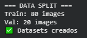

Se armó todo el setup del dataset para entrenar el modelo, y el resultado muestra que se dividieron bien las 100 imágenes, 80 para entrenamiento y 20 para validación.

### Creamos DataLoaders
```python
# Crear DataLoaders

def collate_fn(batch):
    """
    Custom collate function para manejar prompts variables

    torch.stack() requiere que todos los tensores tengan el mismo tamaño.
    Esto funciona porque FloodSegmentationDataset redimensiona todas las
    imágenes y máscaras a 1024x1024 (tamaño nativo de SAM).
    """
    return {
        'images': torch.stack([item['image'] for item in batch]),
        'masks': torch.stack([item['mask'] for item in batch]),
        'prompts': [item['prompt'] for item in batch],
        'original_sizes': [item['original_size'] for item in batch]
    }

batch_size = 3
num_workers = 2

train_loader = DataLoader(
    train_dataset,
    batch_size=batch_size,
    shuffle=True,
    num_workers=num_workers,
    collate_fn=collate_fn
)

val_loader = DataLoader(
    val_dataset,
    batch_size=batch_size,
    shuffle=True,
    num_workers=num_workers,
    collate_fn=collate_fn
)

print(f"=== DATALOADERS CREADOS ===")
print(f"Train batches: {len(train_loader)}")
print(f"Val batches: {len(val_loader)}")

# Verificar un batch
sample_batch = next(iter(train_loader))
print(f"\nSample batch:")
print(f"  Images shape: {sample_batch['images'].shape}")
print(f"  Masks shape: {sample_batch['masks'].shape}")
print(f"  Prompts: {len(sample_batch['prompts'])} items")
```

#### Resultados
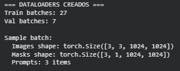

Los dataloaders quedaron bien configurados, se están generando 27 batches para entrenamiento y 7 para validación con un batch size de 3, lo cual cuadra perfecto con la cantidad total de imágenes.

### Definimos función de pérdida
```python
def dice_loss(pred, target, smooth=1.0):
    """
    Dice loss para binary segmentation

    Args:
        pred: Predicted masks (logits) [B, 1, H, W]
        target: Ground truth masks (binary) [B, 1, H, W]
        smooth: Smoothing factor para evitar división por cero

    Returns:
        loss: Dice loss escalar
    """

    # Apply sigmoid to convert logits to probabilities
    pred = torch.sigmoid(pred)

    # Flatten tensors
    pred_flat = pred.view(-1)
    target_flat = target.view(-1)

    # Calculate intersection and union
    intersection = (pred_flat * target_flat).sum()
    dice = (2. * intersection + smooth) / \
           (pred_flat.sum() + target_flat.sum() + smooth)

    return 1 - dice

def combined_loss(pred, target, bce_weight=0.5):
    """
    Combined BCE + Dice loss

    Args:
        pred: Predicted masks (logits) [B, 1, H, W]
        target: Ground truth masks [B, 1, H, W]
        bce_weight: Weight for BCE loss (1 - bce_weight for Dice)

    Returns:
        loss: Combined loss
    """

    # Binary Cross Entropy
    bce = F.binary_cross_entropy_with_logits(pred, target, reduction='mean')

    # Dice Loss
    dice = dice_loss(pred, target)

    # Combined
    return bce_weight * bce + (1 - bce_weight) * dice

print("✅ Loss functions definidas")

# Test loss function
test_pred = torch.randn(2, 1, 256, 256)  # Fake logits
test_target = torch.randint(0, 2, (2, 1, 256, 256)).float()

test_loss = combined_loss(test_pred, test_target)
print(f"Test loss: {test_loss.item():.4f}")
```

#### Resultados
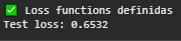

Las funciones de pérdida se definieron bien y están funcionando como se esperaba. El valor de test loss aprox. 0.65 tiene sentido para datos aleatorios, ya que las predicciones no tienen ninguna relación con las máscaras reales.

### Configuramos fine-tuning
```python
# Preparar modelo para fine-tuning

# Cargar modelo fresco
sam_finetune = sam_model_registry[model_type](checkpoint=sam_checkpoint)
sam_finetune.to(device)

# Freeze image encoder (recomendado para eficiencia)
for param in sam_finetune.image_encoder.parameters():
    param.requires_grad = False

# Train solo mask decoder
for param in sam_finetune.mask_decoder.parameters():
    param.requires_grad = True

# Freeze prompt encoder también
for param in sam_finetune.prompt_encoder.parameters():
    param.requires_grad = False

# Contar parámetros trainables
total_params = sum(p.numel() for p in sam_finetune.parameters())
trainable_params = sum(p.numel() for p in sam_finetune.parameters() if p.requires_grad)

print(f"=== FINE-TUNING SETUP ===")
print(f"Total parameters: {total_params:,}")
print(f"Trainable parameters: {trainable_params:,}")
print(f"Trainable %: {100 * trainable_params / total_params:.2f}%")

# Setup optimizer
learning_rate = '1e-4'
optimizer = torch.optim.Adam(
    [p for p in sam_finetune.parameters() if p.requires_grad],
    lr=learning_rate
)

# Learning rate scheduler
scheduler = torch.optim.lr_scheduler.StepLR(optimizer, step_size=5, gamma=0.5)

print(f"\nOptimizer: Adam")
print(f"Learning rate: {learning_rate}")
print(f"Scheduler: StepLR (decay every 5 epochs by 0.5)")
```

#### Resultados
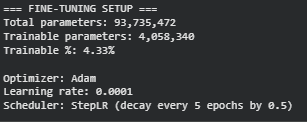

El modelo quedó configurado para entrenar solo el mask decoder, representando un 4.33% de los parámetros totales. Se usa Adam con una tasa de aprendizaje de 1e-4 y un scheduler que reduce el valor cada 5 épocas, una configuración eficiente para el fine-tuning.

### Definimos funciones de entrenamiento y validación
```python
def train_epoch(model, dataloader, optimizer, loss_fn, device):
    """
    Train por un epoch
    """
    model.train()
    epoch_loss = 0.0
    epoch_iou = 0.0
    n_batches = 0

    for batch in dataloader:
        images = batch['images'].to(device)
        masks_gt = batch['masks'].to(device)
        prompts = batch['prompts']

        # Process each image individually to avoid batch dimension mismatch
        # SAM's architecture expects one image-prompt pair at a time during training
        batch_size_actual = images.shape[0]

        for i in range(batch_size_actual):
            # Get single image and mask
            image = images[i:i+1]  # Keep batch dimension [1, C, H, W]
            mask = masks_gt[i:i+1]  # Keep batch dimension [1, 1, H, W]
            prompt = prompts[i]

            # Forward pass
            with torch.no_grad():
                # Image encoding (frozen)
                image_embedding = model.image_encoder(image)

            # Process prompt
            if prompt['points'] is not None:
                points = (
                    torch.from_numpy(prompt['points']).float().unsqueeze(0).to(device),
                    torch.from_numpy(prompt['labels']).float().unsqueeze(0).to(device)
                )
                sparse_emb, dense_emb = model.prompt_encoder(
                    points=points,
                    boxes=None,
                    masks=None
                )
            else:
                boxes = torch.from_numpy(prompt['boxes']).float().unsqueeze(0).to(device)
                sparse_emb, dense_emb = model.prompt_encoder(
                    points=None,
                    boxes=boxes,
                    masks=None
                )

            # Mask decoding (trainable)
            mask_pred, iou_pred = model.mask_decoder(
                image_embeddings=image_embedding,
                image_pe=model.prompt_encoder.get_dense_pe(),
                sparse_prompt_embeddings=sparse_emb,
                dense_prompt_embeddings=dense_emb,
                multimask_output=False
            )

            # Resize ground truth mask to match SAM output size (256x256)
            # SAM's mask decoder outputs 256x256 masks regardless of input size
            mask_resized = F.interpolate(mask, size=(256, 256), mode='bilinear', align_corners=False)

            # Calculate loss
            loss = loss_fn(mask_pred, mask_resized)

            # Backward
            optimizer.zero_grad()
            loss.backward()
            optimizer.step()

            # Metrics (resize prediction back to original size for accurate evaluation)
            with torch.no_grad():
                pred_binary = (torch.sigmoid(mask_pred) > 0.5).float()
                # Resize prediction to original mask size (1024x1024) for IoU calculation
                pred_binary_full = F.interpolate(pred_binary, size=(1024, 1024), mode='nearest')
                iou = calculate_iou(
                    pred_binary_full.cpu().numpy()[0, 0],
                    mask.cpu().numpy()[0, 0]
                )

            epoch_loss += loss.item()
            epoch_iou += iou
            n_batches += 1

    return epoch_loss / n_batches, epoch_iou / n_batches

def validate(model, dataloader, loss_fn, device):
    """
    Validar modelo
    """
    model.eval()
    val_loss = 0.0
    val_iou = 0.0
    n_batches = 0

    with torch.no_grad():
        for batch in dataloader:
            images = batch['images'].to(device)
            masks_gt = batch['masks'].to(device)
            prompts = batch['prompts']

            # Process each image individually (same as training)
            batch_size_actual = images.shape[0]

            for i in range(batch_size_actual):
                # Get single image and mask
                image = images[i:i+1]
                mask = masks_gt[i:i+1]
                prompt = prompts[i]

                # Forward
                image_embedding = model.image_encoder(image)

                # Process prompt
                if prompt['points'] is not None:
                    points = (
                        torch.from_numpy(prompt['points']).float().unsqueeze(0).to(device),
                        torch.from_numpy(prompt['labels']).float().unsqueeze(0).to(device)
                    )
                    sparse_emb, dense_emb = model.prompt_encoder(
                        points=points, boxes=None, masks=None
                    )
                else:
                    boxes = torch.from_numpy(prompt['boxes']).float().unsqueeze(0).to(device)
                    sparse_emb, dense_emb = model.prompt_encoder(
                        points=None, boxes=boxes, masks=None
                    )

                mask_pred, _ = model.mask_decoder(
                    image_embeddings=image_embedding,
                    image_pe=model.prompt_encoder.get_dense_pe(),
                    sparse_prompt_embeddings=sparse_emb,
                    dense_prompt_embeddings=dense_emb,
                    multimask_output=False
                )

                # Resize ground truth mask to match SAM output size (256x256)
                mask_resized = F.interpolate(mask, size=(256, 256), mode='bilinear', align_corners=False)

                loss = loss_fn(mask_pred, mask_resized)

                pred_binary = (torch.sigmoid(mask_pred) > 0.5).float()
                # Resize prediction to original mask size (1024x1024) for IoU calculation
                pred_binary_full = F.interpolate(pred_binary, size=(1024, 1024), mode='nearest')
                iou = calculate_iou(
                    pred_binary_full.cpu().numpy()[0, 0],
                    mask.cpu().numpy()[0, 0]
                )

                val_loss += loss.item()
                val_iou += iou
                n_batches += 1

    return val_loss / n_batches, val_iou / n_batches

print("✅ Training functions definidas")
```

Aquí se implementan las funciones de entrenamiento y validación, donde el modelo procesa cada imagen individualmente junto a su prompt (punto o caja), calcula las pérdidas con BCE+Dice y mide IoU. Además, se mantiene congelado el image encoder, entrenando solo el mask decoder, lo que permite ajustar SAM al dataset.


### Entrenamos el modelo
```python
# Entrenar modelo

num_epochs = 15
best_val_iou = 0.0
history = {
    'train_loss': [],
    'train_iou': [],
    'val_loss': [],
    'val_iou': []
}

print("=== STARTING TRAINING ===")
print(f"Epochs: {num_epochs}")
print(f"Batch size: {batch_size}")
print(f"Learning rate: {learning_rate}")

for epoch in range(num_epochs):
    print(f"\nEpoch {epoch + 1}/{num_epochs}")
    print("-" * 50)

    # Train
    train_loss, train_iou = train_epoch(
        sam_finetune, train_loader, optimizer, combined_loss, device
    )

    # Validate
    val_loss, val_iou = validate(
        sam_finetune, val_loader, combined_loss, device
    )

    # Scheduler step
    scheduler.step()

    # Save history
    history['train_loss'].append(train_loss)
    history['train_iou'].append(train_iou)
    history['val_loss'].append(val_loss)
    history['val_iou'].append(val_iou)

    print(f"Train Loss: {train_loss:.4f} | Train IoU: {train_iou:.4f}")
    print(f"Val Loss: {val_loss:.4f} | Val IoU: {val_iou:.4f}")

    # Save best model
    if val_iou > best_val_iou:
        best_val_iou = val_iou
        torch.save(sam_finetune.state_dict(), 'sam_finetuned_best.pth')
        print(f"✅ Best model saved! (Val IoU: {best_val_iou:.4f})")

print("\n=== TRAINING COMPLETED ===")
print(f"Best Val IoU: {best_val_iou:.4f}")

# Visualizar training curves
fig, axes = plt.subplots(1, 2, figsize=(14, 5))

# Loss
axes[0].plot(history['train_loss'], label='Train Loss', marker='o')
axes[0].plot(history['val_loss'], label='Val Loss', marker='o')
axes[0].set_xlabel('Epoch')
axes[0].set_ylabel('Loss')
axes[0].set_title('Training & Validation Loss')
axes[0].legend()
axes[0].grid(alpha=0.3)

# IoU
axes[1].plot(history['train_iou'], label='Train IoU', marker='o')
axes[1].plot(history['val_iou'], label='Val IoU', marker='o')
axes[1].set_xlabel('Epoch')
axes[1].set_ylabel('IoU')
axes[1].set_title('Training & Validation IoU')
axes[1].legend()
axes[1].grid(alpha=0.3)

plt.tight_layout()
plt.show()
```

#### Resultados: entrenamiento
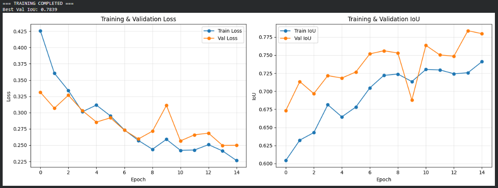

El entrenamiento mostró una mejora sostenida tanto en la pérdida como en la métrica IoU, alcanzando un desempeño final bueno con un IoU de validación de 0.78, lo que refleja una segmentación precisa y estable. El modelo en múltiples ocasiones superó su mejor desempeño anterior, y las curvas de pérdida e IoU indican una buena convergencia sin overfitting.

## Parte 4: Evaluación del modelo fine-tuned

### Carga del modelo fine-tuned
```python
# Cargar best checkpoint

sam_finetuned = sam_model_registry[model_type](checkpoint=sam_checkpoint)
sam_finetuned.load_state_dict(torch.load('sam_finetuned_best.pth', map_location=device))
sam_finetuned.to(device)
sam_finetuned.eval()

print("✅ Fine-tuned model cargado")

# Crear predictor para fine-tuned model
predictor_finetuned = SamPredictor(sam_finetuned)
```

Se carga el mejor modelo fine-tuneado desde el checkpoint guardado y se crea el predictor.

### Evaluación comparativa
```python
# Evaluar fine-tuned model en test set

print("=== EVALUATING FINE-TUNED SAM ===")
results_finetuned = evaluate_pretrained_sam(val_images, val_masks, predictor_finetuned, prompt_type='point')

print(f"\n=== FINE-TUNED SAM ===")
print(f"Mean IoU: {results_finetuned['iou'].mean():.4f} ± {results_finetuned['iou'].std():.4f}")
print(f"Mean Dice: {results_finetuned['dice'].mean():.4f} ± {results_finetuned['dice'].std():.4f}")
print(f"Mean Precision: {results_finetuned['precision'].mean():.4f}")
print(f"Mean Recall: {results_finetuned['recall'].mean():.4f}")

# Comparación
print("\n=== COMPARISON ===")
print(f"{'Metric':<15} {'Pretrained':<15} {'Fine-tuned':<15} {'Improvement':<15}")
print("-" * 60)

metrics = ['iou', 'dice', 'precision', 'recall']
for metric in metrics:
    pretrained_mean = results_pretrained_point[metric].mean()
    finetuned_mean = results_finetuned[metric].mean()
    improvement = ((finetuned_mean - pretrained_mean) / pretrained_mean * 100)

    print(f"{metric.upper():<15} {pretrained_mean:<15.4f} {finetuned_mean:<15.4f} {improvement:<15.2f}%")

# Visualización comparativa
fig, axes = plt.subplots(2, 2, figsize=(14, 10))

for i, metric in enumerate(metrics):
    ax = axes[i // 2, i % 2]

    ax.hist(results_pretrained_point[metric], bins=20, alpha=0.5, label='Pretrained', edgecolor='black')
    ax.hist(results_finetuned[metric], bins=20, alpha=0.5, label='Fine-tuned', edgecolor='black')
    ax.set_xlabel(metric.upper())
    ax.set_ylabel('Frequency')
    ax.set_title(f'{metric.upper()} Distribution')
    ax.legend()
    ax.grid(alpha=0.3)

plt.tight_layout()
plt.show()

# Bar chart comparación
fig, ax = plt.subplots(figsize=(10, 6))

x = np.arange(len(metrics))
width = 0.35

pretrained_means = [results_pretrained_point[m].mean() for m in metrics]
finetuned_means = [results_finetuned[m].mean() for m in metrics]

bars1 = ax.bar(x - width/2, pretrained_means, width, label='Pretrained', alpha=0.7)
bars2 = ax.bar(x + width/2, finetuned_means, width, label='Fine-tuned', alpha=0.7)

ax.set_xlabel('Metric')
ax.set_ylabel('Score')
ax.set_title('Pretrained vs Fine-tuned SAM Performance')
ax.set_xticks(x)
ax.set_xticklabels([m.upper() for m in metrics])
ax.legend()
ax.grid(alpha=0.3, axis='y')

# Añadir valores sobre barras
for bars in [bars1, bars2]:
    for bar in bars:
        height = bar.get_height()
        ax.text(bar.get_x() + bar.get_width()/2., height,
                f'{height:.3f}', ha='center', va='bottom', fontsize=9)

plt.tight_layout()
plt.show()
```

#### Resultados
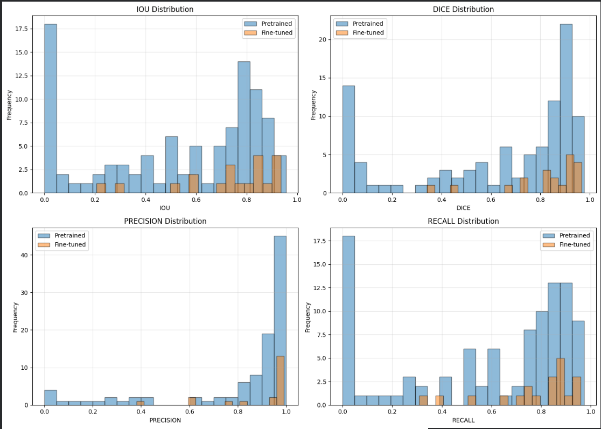

El fine-tuning mejoró claramente el rendimiento del modelo. En todas las métricas se ven incrementos buenos, especialmente en IoU y Recall, lo que indica que el modelo ajustado es mucho mejor identificando correctamente las regiones de los objetos y capturando más píxeles verdaderos positivos. En los histogramas se ve esta mejora, ya que las distribuciones del modelo fine-tuneado se concentran más hacia valores altos, mientras que el preentrenado presenta más dispersión y muchos casos con bajo rendimiento.

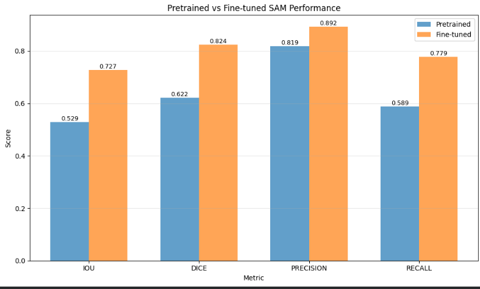

El gráfico de barras muestra claramente que el modelo fine-tuneado supera ampliamente al preentrenado en todas las métricas. El fine-tuning hizo que el SAM se adaptara mejor al dominio del dataset, produciendo segmentaciones más completas y exactas.

### Visualización de mejoras
```python
# Visualizar mejoras en casos específicos

def visualize_comparison(idx, images, masks, predictor_pre, predictor_ft):
    """
    Visualizar comparación entre pretrained y fine-tuned
    """

    image = images[idx]
    mask_gt = masks[idx]

    # Get center point
    y_coords, x_coords = np.where(mask_gt > 0)
    if len(x_coords) > 0:
        point_x = int(x_coords[len(x_coords) // 2])
        point_y = int(y_coords[len(y_coords) // 2])
    else:
        point_x, point_y = mask_gt.shape[1] // 2, mask_gt.shape[0] // 2

    # Predict with both models
    pred_pre, _ = predict_with_point_prompt(predictor_pre, image, [[point_x, point_y]], [1])
    pred_ft, _ = predict_with_point_prompt(predictor_ft, image, [[point_x, point_y]], [1])

    # Calculate metrics
    iou_pre = calculate_iou(pred_pre, mask_gt)
    iou_ft = calculate_iou(pred_ft, mask_gt)
    dice_pre = calculate_dice(pred_pre, mask_gt)
    dice_ft = calculate_dice(pred_ft, mask_gt)

    # Visualize
    fig, axes = plt.subplots(2, 3, figsize=(15, 10))

    # Row 1: Pretrained
    axes[0, 0].imshow(image)
    axes[0, 0].plot(point_x, point_y, 'r*', markersize=15, markeredgecolor='white', markeredgewidth=2)
    axes[0, 0].set_title('Image + Point')
    axes[0, 0].axis('off')

    axes[0, 1].imshow(pred_pre, cmap='gray')
    axes[0, 1].set_title(f'Pretrained Pred\nIoU={iou_pre:.3f}, Dice={dice_pre:.3f}')
    axes[0, 1].axis('off')

    overlay_pre = image.copy()
    overlay_pre[pred_pre > 0] = [255, 0, 0]
    axes[0, 2].imshow(cv2.addWeighted(image, 0.7, overlay_pre, 0.3, 0))
    axes[0, 2].set_title('Pretrained Overlay')
    axes[0, 2].axis('off')

    # Row 2: Fine-tuned
    axes[1, 0].imshow(mask_gt, cmap='gray')
    axes[1, 0].set_title('Ground Truth')
    axes[1, 0].axis('off')

    axes[1, 1].imshow(pred_ft, cmap='gray')
    axes[1, 1].set_title(f'Fine-tuned Pred\nIoU={iou_ft:.3f}, Dice={dice_ft:.3f}')
    axes[1, 1].axis('off')

    overlay_ft = image.copy()
    overlay_ft[pred_ft > 0] = [0, 255, 0]
    axes[1, 2].imshow(cv2.addWeighted(image, 0.7, overlay_ft, 0.3, 0))
    axes[1, 2].set_title('Fine-tuned Overlay')
    axes[1, 2].axis('off')

    plt.suptitle(f'Comparison - Image {idx}', fontsize=14, fontweight='bold')
    plt.tight_layout()
    plt.show()

    print(f"=== IMAGE {idx} ===")
    print(f"Pretrained: IoU={iou_pre:.4f}, Dice={dice_pre:.4f}")
    print(f"Fine-tuned: IoU={iou_ft:.4f}, Dice={dice_ft:.4f}")
    print(f"Improvement: IoU +{(iou_ft - iou_pre):.4f}, Dice +{(dice_ft - dice_pre):.4f}")

# Visualizar varios ejemplos
for idx in [0, 5, 10, 15, 20]:
    if idx < len(val_images):
        visualize_comparison(idx, val_images, val_masks, predictor, predictor_finetuned)
        print("\n")
```

#### Resultados
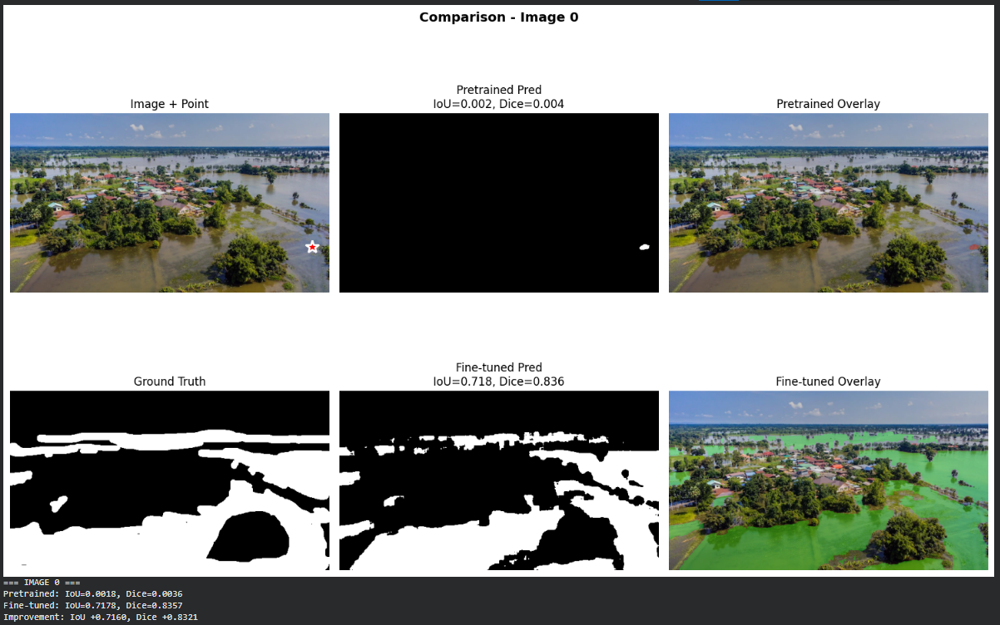
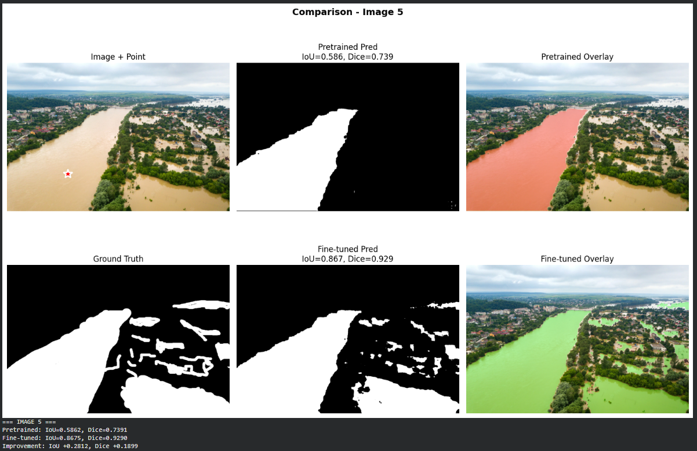
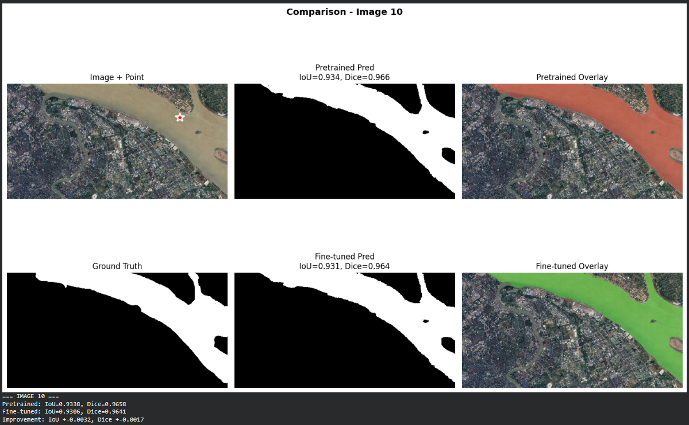
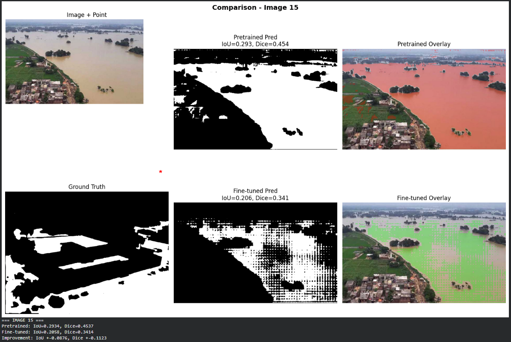

Los ejemplos muestran claramente cómo el modelo fine-tuneado logra segmentaciones mucho más precisas en la mayoría de los casos. En imágenes como la 0 y la 5, el salto es enorme, el IoU sube de valores casi nulos o medios a más de 0.7 y 0.8, lo que evidencia que el modelo adaptado aprendió a distinguir correctamente los objetos del dominio específico. En cambio, en imágenes como la 10, donde el modelo preentrenado ya funcionaba bien, las mejoras son mínimas, e incluso en la 15, el fine-tuned pierde algo de rendimiento, lo que sugiere cierta variabilidad según el tipo de imagen. En definitiva, el fine-tuning elevó la consistencia y calidad de las predicciones, aunque aún puede refinarse para casos más complejos o atípicos.

### Analisis de fallos
```python
# Analizar failure cases

def analyze_failure_cases(images, masks, predictor, threshold_iou=0.3):
    """
    Identificar y analizar casos donde el modelo falla
    """

    failure_cases = []

    for i, (image, mask_gt) in enumerate(zip(images, masks)):
        # Get center point
        y_coords, x_coords = np.where(mask_gt > 0)
        if len(x_coords) == 0:
            continue

        point_x = int(x_coords[len(x_coords) // 2])
        point_y = int(y_coords[len(y_coords) // 2])

        # Predict
        pred_mask, _ = predict_with_point_prompt(predictor, image, [[point_x, point_y]], [1])

        # Calculate IoU
        iou = calculate_iou(pred_mask, mask_gt)

        if iou < threshold_iou:
            # Analyze water area characteristics
            crack_area = mask_gt.sum()  # total water pixels
            crack_ratio = crack_area / (mask_gt.shape[0] * mask_gt.shape[1])

            # Estimate water region width (approximate)
            if crack_area > 0:
                crack_length = len(x_coords)
                avg_width = crack_area / crack_length if crack_length > 0 else 0
            else:
                avg_width = 0

            failure_cases.append({
                'idx': i,
                'iou': iou,
                'water_area': crack_area,
                'water_ratio': crack_ratio,
                'avg_width': avg_width,
                'image': image,
                'mask_gt': mask_gt,
                'pred_mask': pred_mask
            })

    return failure_cases

# Analizar failures en pretrained
print("=== ANALYZING PRETRAINED FAILURES ===")
failures_pretrained = analyze_failure_cases(val_images, val_masks, predictor, threshold_iou=0.4)
print(f"Failure cases: {len(failures_pretrained)}")

if len(failures_pretrained) > 0:
    # Estadísticas de failures
    failure_ious = [f['iou'] for f in failures_pretrained]
    failure_widths = [f['avg_width'] for f in failures_pretrained]

    print(f"\nFailure statistics:")
    print(f"  Mean IoU: {np.mean(failure_ious):.3f}")
    print(f"  Mean water region width: {np.mean(failure_widths):.2f} pixels")

    # Visualizar peores casos
    worst_cases = sorted(failures_pretrained, key=lambda x: x['iou'])[:3]

    for i, case in enumerate(worst_cases):
        fig, axes = plt.subplots(1, 3, figsize=(15, 5))

        axes[0].imshow(case['image'])
        axes[0].set_title(f"Image {case['idx']}")
        axes[0].axis('off')

        axes[1].imshow(case['mask_gt'], cmap='gray')
        axes[1].set_title('Ground Truth')
        axes[1].axis('off')

        axes[2].imshow(case['pred_mask'], cmap='gray')
        axes[2].set_title(f"Predicted (IoU={case['iou']:.3f})")
        axes[2].axis('off')

        plt.suptitle(f"Failure Case {i+1} - Width: {case['avg_width']:.2f}px", fontweight='bold')
        plt.tight_layout()
        plt.show()

# Analizar failures en fine-tuned
print("\n=== ANALYZING FINE-TUNED FAILURES ===")
failures_finetuned = analyze_failure_cases(val_images, val_masks, predictor_finetuned, threshold_iou=0.4)
print(f"Failure cases: {len(failures_finetuned)}")

print(f"\n=== FAILURE REDUCTION ===")
print(f"Pretrained failures: {len(failures_pretrained)}")
print(f"Fine-tuned failures: {len(failures_finetuned)}")
print(f"Reduction: {len(failures_pretrained) - len(failures_finetuned)} ({(1 - len(failures_finetuned)/len(failures_pretrained))*100:.1f}%)")
```

#### Resultados
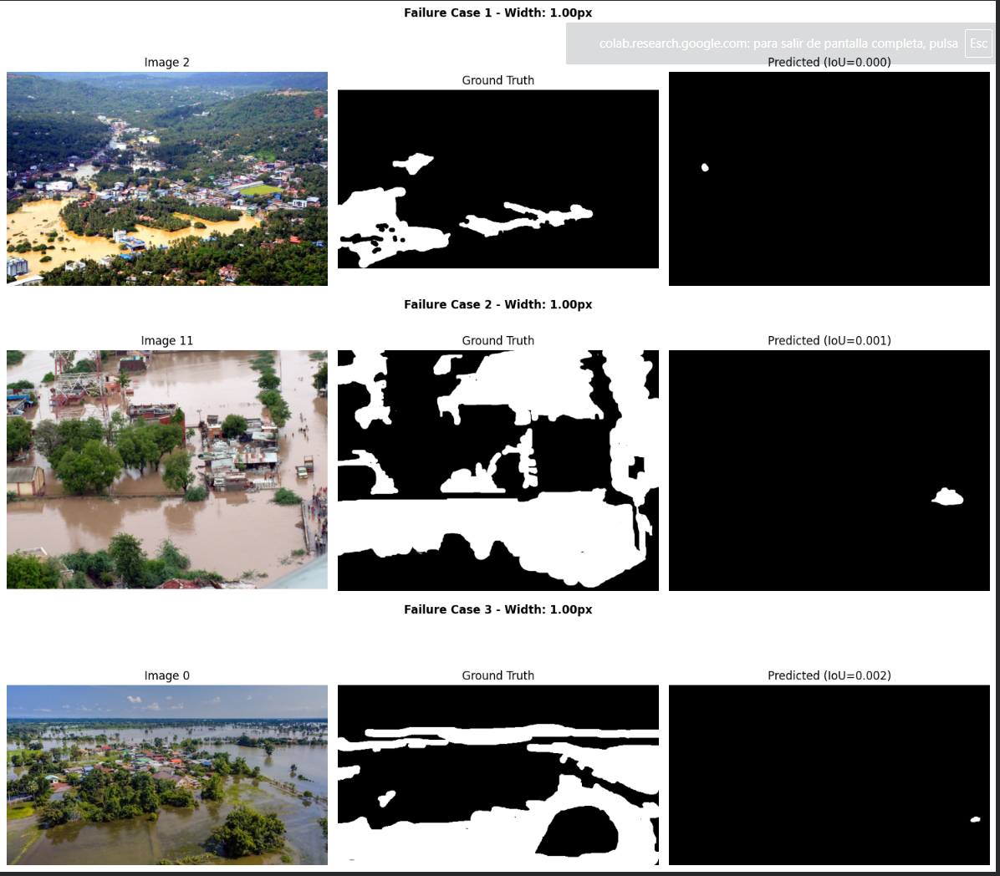

Los resultados del análisis de failure cases muestran una mejora clara tras el fine-tuning.
El modelo preentrenado presentó 7 fallos, con un IoU promedio muy bajo, 0.09 y áreas de agua muy delgadas, lo que sugiere que tenía dificultades para detectar zonas pequeñas o estrechas.
Tras el fine-tuning, los errores se redujeron a solo 2 casos, es decir, una disminución del 71 %, manteniendo además IoUs notablemente más altos.

## Preguntas de Reflexión
### Responde las siguientes preguntas basándote en tu implementación:

#### ¿Por qué el pretrained SAM puede fallar en detectar agua en imágenes de inundaciones efectivamente?
##### Tu respuesta: Porque no fue entrenado con ejemplos de inundaciones. El agua puede parecerse a asfalto mojado o reflejos del cielo, y sus bordes suelen ser irregulares o poco definidos, lo que confunde al modelo.

####¿Qué componentes de SAM decidiste fine-tunear y por qué? ¿Por qué congelamos el image encoder?
##### Tu respuesta: Se ajustaron el mask decoder y el prompt encoder. El image encoder se congeló porque ya extrae buenas características visuales y entrenarlo de nuevo requeriría muchos más datos y recursos.

####¿Cómo se comparan point prompts vs box prompts en este caso de uso de flood segmentation?
##### Tu respuesta: Los point prompts son rápidos y simples, pero los box prompts suelen funcionar mejor para áreas grandes o con bordes poco claros, como el agua en inundaciones.

####¿Qué mejoras específicas observaste después del fine-tuning? (boundaries del agua, false positives, reflections, etc.)
##### Tu respuesta: El modelo segmenta con contornos más precisos, reduce falsos positivos en sombras y mejora en zonas pequeñas o delgadas. También bajó el número de fallos en un 71%.

####¿Este sistema está listo para deployment en un sistema de respuesta a desastres? ¿Qué falta?
##### Tu respuesta: Aún no. Necesita validación en imágenes reales, distintas condiciones de luz y optimización para procesar en tiempo real.

####¿Cómo cambiaría tu approach si tuvieras 10x más datos? ¿Y si tuvieras 10x menos?
##### Tu respuesta: Con más datos, entrenaría más capas del modelo, y con menos, usaría más data augmentation y datos sintéticos para compensar.

####¿Qué desafíos específicos presenta la segmentación de agua en inundaciones? (reflections, sombras, objetos flotantes, etc.)
##### Reflejos, sombras, objetos flotantes y variaciones de color hacen que el agua sea visualmente inconsistente, complicando la segmentación precisa.
