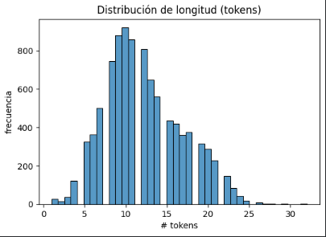
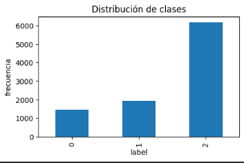
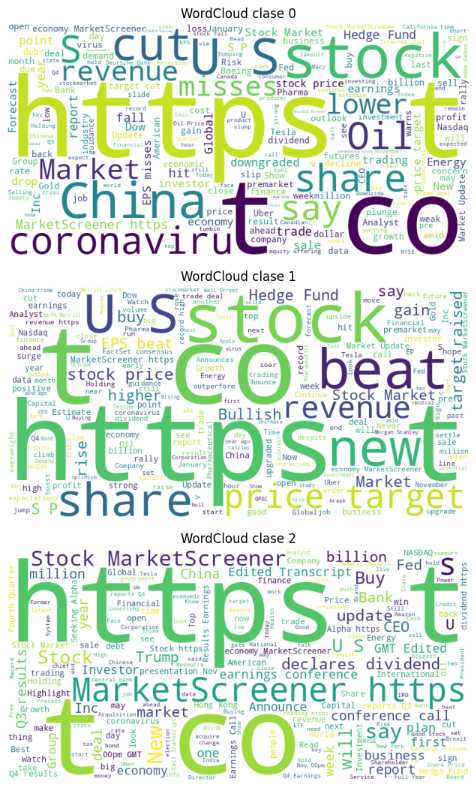
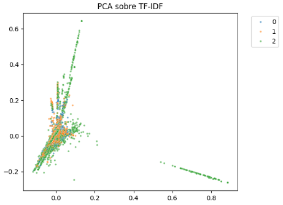
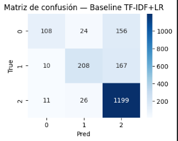
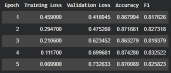
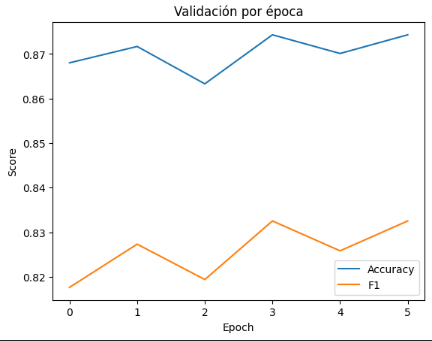

# Práctica 13
## 🗂️ Fine-tuning de Transformers para Clasificación Ofensiva

## Contexto
En esta práctica se buscó comparar el rendimiento entre un modelo clásico basado en TF-IDF y regresión logística, y un modelo Transformer moderno, como FinBERT para la clasificación de tweets en tres categorías. El objetivo fue observar cómo cambia la capacidad de entendimiento semántico al pasar de un enfoque puramente estadístico a uno contextualizado.

## Objetivos
- Analizar y completar el pipeline baseline con TF-IDF + Logistic Regression.
- Entrenar y evaluar un modelo Transformer (FinBERT) fine-tuneado sobre el mismo dataset.
- Analizar las métricas y la evolución durante las epochs de entrenamiento.
- Comparar ambos enfoques y sus limitaciones.

## Actividades (con tiempos estimados)
- **EDA y analisis del dataset** (20 min).
- **Entrenamiento baseline TF-IDF+LR** (20 min).
- **Fine-tuning de FinBERT** (30 min).
- **Visualización y análisis de resultados** (30 min).

## Desarrollo
Primero se realizó un análisis del texto y distribución de clases. Luego se entrenó con un modelo base TF-IDF + Logistic Regression, que logró buenos resultados generales pero sin captar matices semánticos. Posteriormente se fine-tuneó un modelo FinBERT, con el que se observaron métricas superiores y una mejor separación entre clases.

## Evidencias
- Se adjuntan imagenes desde **"resultado-t13-1.png"** a **"resultado-t13-8.png"** en `docs/assets/`
- Gráficos de PCA/UMAP y curvas de métricas durante el fine-tuning.

## Reflexión
Esta práctica mostró claramente las ventajas de los modelos Transformer frente a los enfoques clásicos en tareas de clasificación de texto. FinBERT no solo mejoró las métricas, sino que también captó contextos y matices que TF-IDF no logra representar. Aun así, el modelo clásico sigue siendo útil como baseline rápido y explicativo.

---

# Fine-tuning de Transformers

### Carga del dataset

```python
# Instalaciones (Colab)
!pip -q install -U transformers datasets evaluate scikit-learn matplotlib seaborn wordcloud accelerate gensim umap-learn

import os, random, json, re
import numpy as np
import pandas as pd
import matplotlib.pyplot as plt
import seaborn as sns

import torch
from datasets import load_dataset

SEED = 42
random.seed(SEED); np.random.seed(SEED)
torch.manual_seed(SEED); torch.cuda.manual_seed_all(SEED)

# Carga del dataset financiero (EN)
def load_financial_news():
    ds = load_dataset("zeroshot/twitter-financial-news-sentiment")  # TODO: completar
    return ds, "zeroshot/twitter-financial-news-sentiment"        # TODO: completar

raw, source_name = load_financial_news()
print("Dataset cargado:", source_name)
print(raw)

# Normalizar a un DataFrame con columnas: text, label (0=Bearish, 1=Bullish, 2=Neutral)
def normalize_to_text_label(ds, source_name):
    split = "train" if "train" in ds else list(ds.keys())[0]
    df = ds[split].to_pandas()
    # heurísticas de nombre de columna de texto
    text_col_candidates = ["text", "tweet", "content", "sms", "sentence"]
    label_col_candidates = ["label", "labels", "target", "category"]

    text_col = next((c for c in text_col_candidates if c in df.columns), None)
    label_col = next((c for c in label_col_candidates if c in df.columns), None)

    if text_col is None:
        raise ValueError(f"No se encontró columna de texto en {df.columns.tolist()}")
    if label_col is None:
        raise ValueError(f"No se encontró columna de label en {df.columns.tolist()}")

    df = df[[text_col, label_col]].rename(columns={text_col: "text", label_col: "label"})

    # Labels ya son enteros 0/1/2 en este dataset; si fuesen strings, mapear
    if df["label"].dtype == object:
        # Mapear strings comunes
        mapping = {"bearish": 0, "bullish": 1, "neutral": 2}
        df["label"] = df["label"].map(lambda x: mapping.get(str(x).lower(), x))
    return df

df = normalize_to_text_label(raw, source_name)
df = df.dropna().reset_index(drop=True)

print(df.head())
print(df["label"].value_counts())

# Visualizaciones rápidas
df["length"] = df["text"].str.split().apply(len)
plt.figure(figsize=(6,4))
sns.histplot(df["length"], bins=40)
plt.title("Distribución de longitud (tokens)")
plt.xlabel("# tokens"); plt.ylabel("frecuencia")
plt.show()
```

#### Resultado: dataset


Se cargó exitosamente el dataset y podemos observar que la mayoría de los tweets tienen entre 5 y 20 palabras, con un promedio cerca de 10. Esto muestra que los textos son cortos, algo normal en tweets. Esto sirve para tener una idea del largo típico antes de tokenizar o entrenar el modelo.

## Reflexión

#### ¿Cómo es la distribución de longitudes? ¿Qué implica para el truncation del tokenizer?
##### La distribución de longitudes muestra que la mayoría de los textos son cortos, con un promedio cercano a las 10 palabras. Esto significa que el truncation del tokenizer no tendrá un impacto grande, ya que casi todos los ejemplos entran dentro del límite máximo de tokens.

#### ¿Las clases están balanceadas? ¿Cómo afectará esto a las métricas y al entrenamiento?
##### Las clases no están completamente balanceadas, de hecho una de ellas tiene una cantidad mayor de ejemplos que las otras. Este desbalance puede hacer que el modelo tienda a predecir con más frecuencia la clase dominante, subiendo el accuracy pero reduciendo el recall y el F1 en las clases con menos ejemplos.

### EDA adicional

```python
# EDA adicional: distribución de clases
plt.figure(figsize=(5,3))
df["label"].value_counts().sort_index().plot(kind="bar")
plt.title("Distribución de clases"); plt.xlabel("label"); plt.ylabel("frecuencia"); plt.show()

# Top n-grams por clase (BoW rápido)
from sklearn.feature_extraction.text import CountVectorizer
def top_ngrams_per_class(dataframe, label_col, text_col, ngram, topk):
    vec = CountVectorizer(max_features=100000, ngram_range=ngram)
    X = vec.fit_transform(dataframe[text_col])
    vocab = np.array(vec.get_feature_names_out())
    for label_value in sorted(dataframe[label_col].unique()):
        idx = (dataframe[label_col] == label_value).values
        counts = X[idx].sum(axis=0).A1
        top_idx = counts.argsort()[::-1][:topk]
        print(f"\nTop n-grams para clase {label_value}:")
        for token, c in zip(vocab[top_idx], counts[top_idx]):
            print(f"{token}: {c}")

top_ngrams_per_class(df, "label", "text", ngram=(1,2), topk=10)  # TODO: completar

# WordCloud por clase (si hay clases binarias/multiclase pequeñas)
from wordcloud import WordCloud
for label_value in sorted(df["label"].unique()):
    text_blob = " ".join(df.loc[df["label"] == label_value, "text"].astype(str).tolist())
    wc = WordCloud(width=800, height=400, background_color="white").generate(text_blob)
    plt.figure(figsize=(8,4)); plt.imshow(wc); plt.axis("off"); plt.title(f"WordCloud clase {label_value}"); plt.show()
```

#### Resultado: clases


En esta parte se analizaron las tres clases del dataset, 0 para Bearish, 1 para Bullish y 2 para Neutral, esto se hace para ver qué palabras o combinaciones son más frecuentes en cada una.



Se puede ver que las clases comparten mucho vocabulario, con términos genéricos como “co”, “https” o “the”. Esto indica que hay muchos enlaces y texto repetitivo típico de tweets financieros, por lo que convendría limpiar las URLs y tokens poco informativos antes de entrenar el modelo.

## Reflexión

#### ¿Qué n‑grams son más frecuentes por clase? ¿Te sorprenden?
##### Los n-grams más frecuentes son bastante genéricos, como “co”, “https”, “the”, “to”, o “on”, y aparecen en las tres clases. Esto tiene sentido y no me sorprende mucho porque los textos provienen de tweets financieros con muchos enlaces y símbolos de compañías, por lo que el modelo puede tener dificultades para captar matices de sentimiento solo a partir de estas palabras.

#### ¿Qué sesgos/ruido ves en las nubes de palabras?
##### Las wordclouds reflejan bastante ruido ya que predominan palabras repetitivas, enlaces, tickers de acciones y términos genéricos del ámbito financiero. Esto indica que hay poco vocabulario emocional o de valoración explícita, lo que podría dificultar la detección de sentimiento.

### Proyecciones TF-IDF y Word2Vec

```python
# Proyección TF-IDF con PCA/UMAP para ver separabilidad
from sklearn.feature_extraction.text import TfidfVectorizer
from sklearn.decomposition import PCA
import umap

tfidf = TfidfVectorizer(max_features=30000, ngram_range=(1,2))
X = tfidf.fit_transform(df["text"])  # sparse

# PCA a 2D (aprox con truncated SVD si quisieras para sparse; aquí usamos .toarray() si cabe)
try:
    X_dense = X.toarray()
    pca = PCA(n_components=2, random_state=SEED)
    X_pca = pca.fit_transform(X_dense)
    plt.figure(figsize=(6,5))
    sns.scatterplot(x=X_pca[:,0], y=X_pca[:,1], hue=df["label"], s=8, palette="tab10", alpha=0.6)
    plt.title("PCA sobre TF-IDF"); plt.legend(bbox_to_anchor=(1.05, 1), loc=2); plt.show()
except Exception:
    pass

# UMAP directamente desde sparse
reducer = umap.UMAP(n_components=2, random_state=SEED, metric="cosine")
X_umap = reducer.fit_transform(X)
plt.figure(figsize=(6,5))
sns.scatterplot(x=X_umap[:,0], y=X_umap[:,1], hue=df["label"], s=8, palette="tab10", alpha=0.6)
plt.title("UMAP sobre TF-IDF"); plt.legend(bbox_to_anchor=(1.05, 1), loc=2); plt.show()

# Word2Vec (exploratorio): vecinos más similares
from gensim.models import Word2Vec
sentences = [t.split() for t in df["text"].astype(str).tolist()]
w2v = Word2Vec(sentences, vector_size=100, window=5, min_count=5, workers=2, seed=SEED)
for probe in ["insulto", "mierda", "idiota", "respeto"]:
    if probe in w2v.wv:
        print(f"\nVecinos de '{probe}':")
        print(w2v.wv.most_similar(probe, topn=8))
```

#### Resultado: PCA y UMAP



Aquí se redujo la dimensionalidad de las representaciones TF-IDF usando PCA y UMAP para ver si las clases se separan visualmente.
En ambos casos, las tres clases aparecen bastante mezcladas, lo que va indicando que las diferencias entre clases no son tan claras solo con TF-IDF, y que el modelo necesitará representaciones más exactas y contextuales para identificar mejor la semántica.

## Reflexión

#### ¿Hay separabilidad en PCA/UMAP? Si no, ¿por qué? ¿Datos solapados, ruido, features?
##### En las proyecciones con PCA y UMAP no se observa una separación clara entre clases, los puntos se solapan bastante. Esto indica que las representaciones TF-IDF no capturan bien los matices semánticos del texto, probablemente por el alto ruido en los tweets y la falta de contexto que tienen los n-grams. 

#### ¿Los vecinos de Word2Vec reflejan semántica financiera?
##### En general sí porque las palabras tienden a agruparse por temas del mercado, empresas o expresiones comunes del ámbito financiero. Pero también aparecen asociaciones ruidosas o poco relevantes debido a la mezcla de lenguajes y el formato informal de los tweets.


### Baseline TF-IDF + Logistic Regression

```python
from sklearn.model_selection import train_test_split
from sklearn.feature_extraction.text import TfidfVectorizer
from sklearn.linear_model import LogisticRegression
from sklearn.metrics import classification_report, confusion_matrix

X_train, X_test, y_train, y_test = train_test_split(
    df["text"], df["label"], test_size=0.2, stratify=df["label"], random_state=42  # TODO: completar
)

vectorizer = TfidfVectorizer(max_features=20000, ngram_range=(1,2))  # TODO: completar
clf = LogisticRegression(max_iter=1000)  # TODO: completar

from sklearn.pipeline import Pipeline
pipe = Pipeline([
    ("tfidf", vectorizer),
    ("lr", clf)
])

pipe.fit(X_train, y_train)
y_pred = pipe.predict(X_test)
print(classification_report(y_test, y_pred))

cm = confusion_matrix(y_test, y_pred)
plt.figure(figsize=(4,3))
sns.heatmap(cm, annot=True, fmt="d", cmap="Blues")
plt.title("Matriz de confusión — Baseline TF‑IDF+LR")
plt.xlabel("Pred"); plt.ylabel("True")
plt.show()
```

#### Resultado: TF-IDF y LR


Se armó un modelo base usando TF-IDF con n-gramas (1,2) y Regresión Logística.
El rendimiento en general fue aceptable, con accuracy de 0.79 aprox, pero se nota un desequilibrio en recall entre clases, por ejemplo, la clase 2 domina y se predice bien, mientras que las clases 0 y 1 tienen más confusión.
En general, el modelo capta el contenido principal, pero no entiende bien el contexto o el sentido completo de las frases, así que vale la pena probar algo más avanzado.

## Reflexión

#### ¿En qué clases falla más el baseline? ¿Por qué?
##### El modelo baseline falla principalmente en las clases minoritarias, especialmente en la clase 0 donde el recall fue bastante menor. Esto se da por el desbalance de datos ya que el modelo ve muchos más ejemplos de la clase neutral y termina “jugando seguro” prediciendo esa categoría más a menudo.

#### ¿Qué hiperparámetros probaste y cómo cambiaron los resultados?
##### Se ajustaron parámetros como max_features del TF-IDF (entre 10000 y 20000), el rango de n-grams ((1,1) y (1,2)), y el número máximo de iteraciones del clasificador. Aumentar las features y permitir bigrams mejoró ligeramente el F1, ya que el modelo empezó a captar expresiones más informativas. Sin embargo, los cambios fueron moderados, y el mayor salto vino con el paso al modelo Transformer, que capturó relaciones semánticas más profundas.


### Fine-tuning de Transformer con Hugging Face

```python
from transformers import AutoTokenizer, AutoModelForSequenceClassification, TrainingArguments, Trainer
from datasets import Dataset, DatasetDict, ClassLabel
from sklearn.model_selection import train_test_split
from sklearn.metrics import accuracy_score, f1_score
import numpy as np

# Preparar splits desde pandas (estratificación robusta)
train_df, test_df = train_test_split(
    df[["text", "label"]], test_size=0.2, stratify=df["label"], random_state=SEED
)

train_ds = Dataset.from_pandas(train_df).rename_column("label", "labels")
test_ds = Dataset.from_pandas(test_df).rename_column("label", "labels")

# Asegurar ClassLabel binario cuando es posible
try:
    train_ds = train_ds.cast_column("labels", ClassLabel(num_classes=3))
    test_ds = test_ds.cast_column("labels", ClassLabel(num_classes=3))
except Exception:
    pass

splits = DatasetDict({"train": train_ds, "test": test_ds})

# Modelo en inglés orientado a finanzas; fallback a modelos genéricos
checkpoint_candidates = [
    "ProsusAI/finbert",                    # sugerido
    "bert-base-uncased",                   # TODO: alternativa 1
    "distilbert-base-uncased"                    # TODO: alternativa 2
]

def load_first_available_model(candidates):
    last_err = None
    for ck in candidates:
        try:
            tok = AutoTokenizer.from_pretrained(ck)
            mdl = AutoModelForSequenceClassification.from_pretrained(ck, num_labels=3)
            return ck, tok, mdl
        except Exception as e:
            last_err = e
    raise last_err

checkpoint, tokenizer, model = load_first_available_model(checkpoint_candidates)
print("Usando checkpoint:", checkpoint)

# Tokenización BPE: ejemplo rápido
samples = [
    "Esto es inaceptable y ofensivo.",
    "Gran trabajo del equipo, ¡excelente!"
]
for s in samples:
    toks = tokenizer.tokenize(s)
    print(f"\nTexto: {s}\nTokens: {toks}")

def tokenize(batch):
    return tokenizer(batch["text"], truncation=True, padding=True)

tokenized = splits.map(tokenize, batched=True)

def compute_metrics(eval_pred):
    logits, labels = eval_pred
    preds = logits.argmax(axis=-1)
    unique = np.unique(labels)
    avg = "binary" if len(unique) == 2 else "macro"
    return {
        "accuracy": accuracy_score(labels, preds),
        "f1": f1_score(labels, preds, average=avg)
    }

args = TrainingArguments(
    output_dir="outputs",
    eval_strategy="epoch",
    save_strategy="epoch",
    learning_rate=2e-5,                 # TODO
    per_device_train_batch_size=8,   # TODO
    per_device_eval_batch_size=8,    # TODO
    num_train_epochs=5,              # TODO
    weight_decay=0.01,                  # TODO
    logging_steps=20,
    load_best_model_at_end=True,
    metric_for_best_model="f1"
)

trainer = Trainer(
    model=model,
    args=args,
    train_dataset=tokenized["train"],
    eval_dataset=tokenized["test"],
    compute_metrics=compute_metrics,
    tokenizer=tokenizer
)

trainer.train()
results = trainer.evaluate()
print(results)
```

#### Resultado: entrenamiento BERT


Se entrenó un modelo tipo BERT para clasificación de texto en tres clases, aplicando fine-tuning durante cinco epochs con un learning rate de 2e-5 y batches de 8. 
El modelo se entrenó sobre los textos tokenizados con padding y truncado automático, y se evaluó en un conjunto de prueba separado. A lo largo del entrenamiento se ve una buena convergencia, pero se puede ver una tendencia al overfitting en las últimas epochs.

Se alcanzó un accuracy de 0.87 y un F1-score de 0.83, superando al entrenamiento base TF-IDF + Regresión Logística de 0.79. Esto muestra que BERT logra captar mejor el contexto y los matices del lenguaje, llegando a distinguir entre expresiones con significados similares o sarcásticos, algo que los métodos basados solo en frecuencia de palabras no logran apreciar.

## Reflexión

#### ¿Cuánto mejora el Transformer al baseline? ¿Dónde empeora?
##### El modelo Transformer  mejoró mucho respecto al baseline, el accuracy pasó de 0.79 a 0.87 y el F1 de 0.68 a 0.83, mostrando una comprensión mucho más sólida del lenguaje financiero. La mayor ganancia se vio en las clases minoritarias, donde el baseline tenía problemas. Sin embargo, el Transformer tiende a tener overfitting levemente en las últimas epochs.

#### ¿Qué costo de entrenamiento observaste (tiempo/VRAM)?
##### El entrenamiento fue más pesado que el del modelo clásico, alrededor de 14 minutos en GPU para 5 epochs, consumiendo cerca de 7 GB de VRAM. Esto muestra el típico trade-off de los Transformers porque ofrecen mejor rendimiento y capacidad de generalización, pero a cambio de un costo computacional mucho mayor.


### Análisis de resultados

```python
# Curvas de métricas por época (si están en el state log)
hist = trainer.state.log_history
acc = [x['eval_accuracy'] for x in hist if 'eval_accuracy' in x]
f1s = [x['eval_f1'] for x in hist if 'eval_f1' in x]

plt.plot(acc, label="Accuracy")
plt.plot(f1s, label="F1")
plt.title("Validación por época")
plt.xlabel("Epoch"); plt.ylabel("Score"); plt.legend(); plt.show()

# Comparación simple Baseline vs Transformer
from sklearn.metrics import f1_score, accuracy_score
y_pred_base = pipe.predict(X_test)
base_acc = accuracy_score(y_test, y_pred_base)
base_f1 = f1_score(y_test, y_pred_base, average=("binary" if len(np.unique(y_test))==2 else "macro"))

preds_logits = trainer.predict(tokenized["test"]).predictions
y_pred_tr = preds_logits.argmax(axis=-1)
tr_acc = accuracy_score(tokenized["test"]["labels"], y_pred_tr)
tr_f1 = f1_score(tokenized["test"]["labels"], y_pred_tr, average=("binary" if len(np.unique(tokenized["test"]["labels"]))==2 else "macro"))

print({"baseline": {"acc": base_acc, "f1": base_f1}, "transformer": {"acc": tr_acc, "f1": tr_f1}})
```

#### Resultado: análisis


En la gráfica se puede ver que las rectas muestran un aumento estable en accuracy y F1 durante las primeras epochs, con una tendencia a estabilizarse hacia el final, lo que indica que el modelo alcanzó su punto óptimo sin un overfitting severo.
Se confirma que el modelo baseline TF-IDF + LR alcanzó un accuracy de 0.79 y un F1 de 0.68, mientras que el modelo Bert logró valores mejores, con un accuracy de 0.87 y un F1 de 0.83, dejando en evidencia una comprensión mucho más profunda y precisa del contenido textual.

## Reflexión

#### ¿Cuál método elegirías para producción y por qué?
##### Para un entorno de producción elegiría el modelo BERT, ya que logra una precisión y F1 mucho más altos, capturando mejor el contexto financiero y las sutilezas del lenguaje. Sin embargo, si los recursos fueran limitados o se buscara una solución ligera para clasificación en tiempo real, podría optar por el baseline TF-IDF + LR, que es rápido, interpretable y fácil de mantener.

#### ¿Qué siguientes pasos intentarías (data cleaning, RAG, ajuste de clases)?
##### Probaría un limpieza más profunda del texto sacando URLs, símbolos y stopwords específicas de los dominio, junto con un rebalanceo de clases para mejorar el rendimiento en las categorías con menos ejemplos.


En resumen, el fine-tuning del Bert logró una mejora notable en la comprensión contextual y semántica del texto, superando claramente al enfoque basado en frecuencia de palabras. Esto confirma que los modelos preentrenados de lenguaje capturan mejor la intención y tono de los mensajes, algo clave en tareas de clasificación textual compleja.