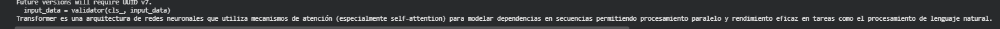
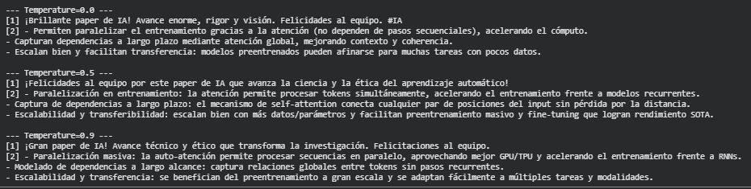
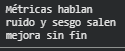
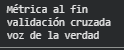
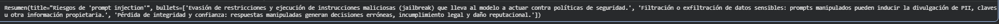
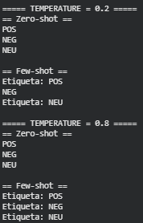

# Práctica 11
## LLMs con LangChain (OpenAI)

## Contexto
En esta práctica se buscó familiarizarse con el uso de modelos de chat de OpenAI dentro del ecosistema LangChain, entendiendo cómo configurar el modelo, controlar su comportamiento mediante parámetros de decodificación y diseñar prompts robustos orientados a flujos reutilizables. Además, se introdujo el concepto de salidas estructuradas y observabilidad mediante medición de tokens y latencia, pilares fundamentales para construir aplicaciones conversacionales confiables y escalables.

## Objetivos
- Instanciar un modelo de chat de OpenAI desde LangChain (ChatOpenAI) y realizar invocaciones básicas.
- Controlar parámetros de decodificación comunes (temperature, max_tokens, top_p) y razonar sobre su efecto.
- Diseñar prompts reutilizables con ChatPromptTemplate y el LCEL para encadenar componentes.
- Obtener salidas estructuradas (JSON/Pydantic) de forma fiable con with_structured_output.
- Medir tokens/latencia con tracing en LangSmith (o callbacks) como base de observabilidad.

## Actividades (con tiempos estimados)
- Parte 0: SetUp (10 min)
Configuración del entorno, instalación de dependencias y prueba inicial de importaciones de LangChain y OpenAI.

- Parte 1: Parámetros (20 min)
Instanciación del modelo ChatOpenAI y experimentación con temperature, top_p y max_tokens para observar su efecto en la generación.

- Parte 2: De texto suelto a plantillas (20 min)
Conversión de prompts escritos manualmente en estructuras formales mediante ChatPromptTemplate, separando sistema, usuario y variables.

- Parte 3: Salida estructurada (30 min)
Uso de with_structured_output y modelos Pydantic para obtener respuestas controladas y libres de errores de formato.

- Parte 4: Métricas mínimas: tokens y latencia (20 min)
Registro de tokens usados, costo aproximado y tiempo de respuesta utilizando LangSmith o callbacks locales.

- Parte 5: Mini-tareas guiadas (25 min)
Implementación de pequeñas funciones (resumir, corregir tono, clasificar) encadenadas con LCEL para practicar modularidad.

- Parte 6: Zero-shot vs Few-shot (20 min)
Comparación directa de resultados con y sin ejemplos, analizando mejoras en precisión y reducción de alucinaciones.

- Parte 7: Resúmenes: single-doc y multi-doc (25 min)
Creación de pipelines de resumen simple y estilo map-reduce, probando cambios en chunking, prompts y temperatura.

- Parte 8: Extracción de información (20 min)
Definición de entidades y esquemas para extraer fechas, organizaciones, personas y eventos mediante output estructurado.

- Parte 9: RAG básico con textos locales (30 min)
Construcción de un pipeline RAG minimalista con prompt de combinación y prueba con distintos k.

## Desarrollo
Se configuró un modelo de chat de OpenAI utilizando ChatOpenAI, verificando primero su funcionamiento básico. Luego se experimentó con distintos parámetros de decodificación para observar su impacto en creatividad, coherencia y longitud de la respuesta. Posteriormente, se diseñaron prompts modulares con ChatPromptTemplate, permitiendo separar instrucciones del contenido variable. Como siguiente paso, se aplicó with_structured_output para obtener respuestas estrictamente formateadas mediante Pydantic, reduciendo errores y mejorando la confiabilidad. Finalmente, se conectó todo en un flujo LCEL y se habilitó trazado para analizar tokens, tiempo de inferencia y variantes de configuración.

## Evidencias
- Se adjuntan imagenes desde "resultado-t14-1.png" a "resultado-t14-11.png" en `docs/assets/`

## Reflexión
La práctica permitió ver cómo LangChain facilita no solo la invocación de modelos, sino también la construcción de pipelines limpios, trazables y robustos. También los parámetros de decodificación demostraron ser clave para obtener control fino sobre el estilo de generación, mientras que las salidas estructuradas evidenciaron la importancia de la validación y consistencia en aplicaciones reales.

---

### Parte 0: SetUp

```python
# Instalación (Colab/Local)
!pip install -U "langchain>=0.2.11" "langchain-core>=0.2.33" "langchain-community>=0.2.11" "langchain-openai>=0.2.1" "langsmith>=0.1.97"
# Opcionales para el assignment:
!pip install -U faiss-cpu chromadb tavily-python duckduckgo-search langchain-text-splitters

import os
os.environ["LANGSMITH_TRACING"] = "true"
os.environ["LANGSMITH_API_KEY"] = ""  # configurar tu key
os.environ["OPENAI_API_KEY"] = "sk-proj--"  # configurar tu key
```

Configuramos las keys e instalamos todo lo necesario. Cabe marcar que no pondré las keys autenticas en github por seguridad.

#### Hello LLM
```python
from langchain_openai import ChatOpenAI

llm = ChatOpenAI(model="gpt-5-mini", temperature=0)  # modelo sugerido

# Hola LLM
resp = llm.invoke("Definí 'Transformer' en una sola oración.")
print(resp.content)
```
#### Resultado: LLM


La respuesta del modelo es clara y correcta porque en una sola oración explica que un Transformer usa atención para procesar secuencias de manera eficiente, cumpliendo exactamente con lo que pedía el prompt LLM.

```python
from langchain_openai import ChatOpenAI

# Completar parámetros básicos (ver [1] y [12])
MODEL = "gpt-5-mini"         # p.ej., "gpt-5-mini"
TEMP = 0.5           # 0.0–1.0 (determinismo vs creatividad)

llm = ChatOpenAI(model=MODEL, temperature=TEMP)
print(llm.invoke("Hola! Decime tu versión en una línea.").content)
```

#### Resultados
##### Temp 0.5

##### Temp 0

##### Temp 0.9


El modelo siempre devolvió un mensaje presentándose como "ChatGPT, modelo GPT-4o", pero lo que cambia en cada temp distinta es que con mayor temp su creatividad en la respuesta es mayor y cambia un poco, aunque la idea central de la respuesta sea la misma.

## Reflexión

#### ¿Qué cambia si pedís 1 vs 3 oraciones?
##### Cuando le pido 1 oración, la respuesta es más directa porque el modelo intenta meter toda la idea en una sola frase. En cambio, cuando pido 3 oraciones, el modelo suele dividir la explicación en partes más claras y detalladas, como si estuviera haciendo una mini explicación paso a paso.

#### ¿Observás variancia entre ejecuciones con la misma consigna?
##### Sí, especialmente cuando la temperatura no es 0. Si ejecuto el mismo prompt varias veces, el modelo cambia el estilo, el vocabulario, aunque el contenido general sea parecido. Con temperature 0 casi no cambia, pero con valores más altos la variación se nota bastante.

### Parte 1: Parámetros

```python
prompts = [
    "Escribí un tuit (<=20 palabras) celebrando un paper de IA.",
    "Dame 3 bullets concisos sobre ventajas de los Transformers."
]

for t in [0.0, 0.5, 0.9]:
    llm_t = ChatOpenAI(model="gpt-5-mini", temperature=t)
    outs = [llm_t.invoke(p).content for p in prompts]
    print(f"\n--- Temperature={t} ---")
    for i, o in enumerate(outs, 1):
        print(f"[{i}] {o}")
```

#### Resultados


Cuando probé las tres temperaturas, se notó que las respuestas cambian bastante, con 0.0 el modelo siempre responde casi igual, súper literal y sin creatividad, con 0.5 ya aparece un poco más de variedad y suena más natural, y con 0.9 las respuestas son más libres, más creativas y hasta un poco impredecibles. También vi que si le pido 1 oración, la respuesta suele ser más estable entre ejecuciones, pero cuando pido 3 oraciones aumenta la variación porque el modelo tiene más espacio para cambiar el estilo o agregar detalles. En general, sí hay variancia incluso con la misma consigna, y cuanto mayor es la temperatura o la cantidad de texto pedido, más se nota.

```python
from langchain_openai import ChatOpenAI

MODEL = "gpt-5-mini"
TEMP = 0      # 0.0, 0.5, 0.9

llm = ChatOpenAI(model=MODEL, temperature=TEMP)
print(llm.invoke("Escribí un haiku sobre evaluación de modelos.").content)
```

#### Resultados
##### Temp 0.0

##### Temp 0.5

##### Temp 0.9


Aquí vemos un poco más de lo mismo, el resultado muestra cómo cambia la creatividad del modelo según la temperatura. Con temp 0, el haiku es más rígido y directo, casi como si siguiera una fórmula fija. Con temp 0.5, aparece más variedad en las palabras y la idea se siente un poco más poética. Y con temp 0.9, el haiku suena más libre y expresivo, como si el modelo experimentara más con el lenguaje.

## Reflexión

#### ¿Qué combinación te da claridad vs creatividad?
##### Las temperaturas bajas, como 0 a 0.3 dan respuestas más claras, directas y consistentes. Las temperaturas medias o altas, 0.6 a 1.0 producen más creatividad, variación y estilos menos predecibles.

#### ¿Cómo impactan estos parámetros en tareas “cerradas” (respuestas únicas)?
##### En tareas cerradas, una temperatura baja funciona mejor porque disminuye la variabilidad y evita desvíos o inventos. Con temperaturas altas, el modelo puede agregar detalles innecesarios o responder de forma menos precisa, lo que afecta la exactitud en problemas donde solo hay una respuesta correcta.


### Parte 2: De texto suelto a plantillas

```python
from langchain_core.prompts import ChatPromptTemplate

prompt = ChatPromptTemplate.from_messages([
    ("system", "Sos un asistente conciso, exacto y profesional."),
    ("human",  "Explicá {tema} en <= 3 oraciones, con un ejemplo real.")
])

chain = prompt | llm  # LCEL: prompt → LLM
print(chain.invoke({"tema": "atención multi-cabeza"}).content)
```

#### Resultados
> "La atención multi‑cabeza proyecta consultas, claves y valores en varias subrepresentaciones (cabezas), calcula atención por producto punto escalado en cada una y concatena sus resultados para capturar distintos tipos de relaciones en paralelo. Técnicamente cada cabeza aprende a destacar patrones diferentes (p. ej. sintaxis, semántica, posiciones) y la proyección final combina esa información. Ejemplo real: en traducción, una cabeza puede alinear léxicamente "bank"→"banco", otra resolver concordancia gramatical y otra identificar que "it" se refiere a "the cat", mejorando precisión y coherencia."

El modelo siguió perfecto el template, dio una explicación corta con tres oraciones y usó un ejemplo concreto. El tono quedó técnico y profesional porque el mensaje system se lo marcó. La explicación repasa qué hace la atención multi-cabeza, por qué sirve y el ejemplo de traducción muestra cómo cada cabeza puede enfocarse en algo diferente.

## Reflexión

#### ¿Cuándo conviene few-shot vs instrucciones claras?
##### Conviene usar few-shot cuando querés que el modelo copie un estilo, una forma de razonar o un formato específico que sería difícil explicar solo con instrucciones. En cambio, usar instrucciones claras sirve mejor cuando la tarea es simple, bien definida o tiene una respuesta esperada muy directa.

#### ¿Cómo cambia el formato cuando el template fija estructura?
##### Cuando el template fija una estructura, el modelo responde mucho más ordenado y predecible, se ve que sigue el formato exacto, evita divagar y es más fácil validar la salida porque ya está “encajada” en el molde que le marcaste.


### Parte 3: Salida estructurada 

```python
from typing import List
from pydantic import BaseModel

class Resumen(BaseModel):
    title: str
    bullets: List[str]

llm_json = llm.with_structured_output(Resumen)  # garantiza JSON válido que cumple el esquema

pedido = "Resumí en 3 bullets los riesgos de la 'prompt injection' en LLM apps."
res = llm_json.invoke(pedido)
res
```

#### Resultados


Se devolvió un objeto con el formato exacto que le pedimos, un título y tres bullets. Cada bullet explica un riesgo típico de prompt injection, pero usando un lenguaje más técnico: filtrar datos, hacer que el modelo se comporte mal y saltarse controles de seguridad.

## Reflexión

#### ¿Qué mejora frente a “parsear a mano” cadenas JSON?
##### Usar with_structured_output mejora mucho frente a parsear JSON a mano porque el modelo ya devuelve directamente un objeto válido que sigue el esquema. Esto evita errores comunes como JSON mal formado, claves faltantes y problemas de casteo, y te ahorra escribir lógica extra para validar y corregir la respuesta.

#### ¿Qué contratos de salida necesitás en producción?
##### En producción necesitás contratos de salida bien definidos, campos fijos, tipos claros, longitudes acotadas y estructuras que no cambien entre ejecuciones.

### Parte 4: Métricas mínimas: tokens y latencia

```python
_ = (prompt | llm).invoke({"tema": "transformers vs RNNs"})
print("Traza enviada (ver LangSmith).")
```

#### Resultados


Vemos el Proyecto default dentro de LangSmith. Ahí muestra un pequeño resumen de la actividad, cuántas ejecuciones tuviste esta semana, la tasa de errores y la latencia promedio. Se hicieron 27 runs registrados, con un 11% de errores, y una latencia normal bastante razonable P50 ≈ 6.5s.

## Reflexión


#### ¿Qué prompt te costó más tokens?
##### Seguramente el que pedía explicaciones técnicas largas, como “Transformers vs RNNs”, porque el modelo responde con más detalle y eso consume más tokens.

#### ¿Cómo balancear latencia vs calidad?
##### Si se queire menos latencia, se usa prompts más cortos, también max_tokens más bajo o un modelo más chico. Si querés más calidad, dejás que el modelo genere más texto o elegís uno más grande. Es básicamente ajustar velocidad vs detalle según lo que se necesite.


### Parte 5: Mini-tareas guiadas

```python
# Esqueleto sugerido para 1) y 2)
from pydantic import BaseModel

class Traduccion(BaseModel):
    text: str
    lang: str

traductor = llm.with_structured_output(Traduccion)
salida = traductor.invoke("Traducí al portugués: 'Excelente trabajo del equipo'.")
print(salida)

# Q&A con contexto (sin RAG)
from langchain_core.prompts import ChatPromptTemplate
QA_prompt = ChatPromptTemplate.from_messages([
    ("system", "Respondé SOLO usando el contexto. Si no alcanza, decí 'No suficiente contexto'."),
    ("human",  "Contexto:\n{contexto}\n\nPregunta: {pregunta}\nRespuesta breve:")
])
salida = (QA_prompt | llm).invoke({
    "contexto": "OpenAI y LangChain permiten structured output con JSON...",
    "pregunta": "¿Qué ventaja tiene structured output?"
})
print(salida)
```

#### Resultados
> "text='Excelente trabalho da equipe.' lang='portugués'
content='No suficiente contexto' additional_kwargs={'refusal': None} response_metadata={'token_usage': {'completion_tokens': 268, 'prompt_tokens': 54, 'total_tokens': 322, 'completion_tokens_details': {'accepted_prediction_tokens': 0, 'audio_tokens': 0, 'reasoning_tokens': 256, 'rejected_prediction_tokens': 0}, 'prompt_tokens_details': {'audio_tokens': 0, 'cached_tokens': 0}}, 'model_provider': 'openai', 'model_name': 'gpt-5-mini-2025-08-07', 'system_fingerprint': None, 'id': 'chatcmpl-Cd2dZ0Dw0Otvf0wDo2HJViLksA4LD', 'service_tier': 'default', 'finish_reason': 'stop', 'logprobs': None} id='lc_run--1220adb5-8e3c-4711-b61e-f6ad1aed78c2-0' usage_metadata={'input_tokens': 54, 'output_tokens': 268, 'total_tokens': 322, 'input_token_details': {'audio': 0, 'cache_read': 0}, 'output_token_details': {'audio': 0, 'reasoning': 256}}"

La parte de traducción anduvo bien, devolvió text='Excelente trabalho da equipe.' y lang='portugués', así que el JSON estructurado funcionó. En la parte de Q&A, el LLM respondió "No suficiente contexto", o sea que no había info en el bloque para contestar la pregunta.

## Reflexión

#### ¿Cuándo “alucina” el modelo al no tener suficiente contexto?
##### Cuando la pregunta pide algo que no está en el contexto y el prompt no es claro en que debe decir “No suficiente contexto”. Si no ponés esa regla, el modelo intenta completar la info inventando.

#### ¿Cómo exigir formato y concisión de manera consistente?
##### Definiendo el formato en el prompt, usando with_structured_output y poniendo límites claros, como temperature=0, máximo de tokens y secciones fijas. Esto obliga al modelo a seguir siempre la misma estructura.


### Parte 6: Zero-shot vs Few-shot

```python
from langchain_core.prompts import ChatPromptTemplate
from langchain_openai import ChatOpenAI

# Zero-shot
zs_prompt = ChatPromptTemplate.from_messages([
    ("system", "Sos un asistente conciso y exacto."),
    ("human",  "Clasificá el sentimiento de este texto como POS, NEG o NEU:\n\n{texto}")
])

# Few-shot (1–2 ejemplos)
fs_prompt = ChatPromptTemplate.from_messages([
    ("system", "Sos un asistente conciso y exacto."),
    ("human",  "Ejemplo:\nTexto: 'El producto superó mis expectativas'\nEtiqueta: POS"),
    ("human",  "Ejemplo:\nTexto: 'La entrega fue tarde y vino roto'\nEtiqueta: NEG"),
    ("human",  "Ejemplo:\nTexto: 'Me encanta este servicio'\nEtiqueta: POS"),
    ("human",  "Ejemplo:\nTexto: 'El soporte fue terrible'\nEtiqueta: NEG"),
    ("human",  "Ejemplo:\nTexto: 'Es aceptable, nada especial'\nEtiqueta: NEU"),
    ("human",  "Texto: {texto}\nEtiqueta:")
])

textos = [
    "Me encantó la experiencia, repetiría.",
    "No cumple lo prometido; decepcionante.",
    "Está bien, nada extraordinario."
]

for temp in [0.2, 0.8]:
    print(f"\n===== TEMPERATURE = {temp} =====")

    llm = ChatOpenAI(model="gpt-5-mini", temperature=temp)

    print("== Zero-shot ==")
    for t in textos:
        print((zs_prompt | llm).invoke({"texto": t}).content)

    print("\n== Few-shot ==")
    for t in textos:
        print((fs_prompt | llm).invoke({"texto": t}).content)
```

Se modificó un poco el código base para completar con las consignas. Agregué más ejemplos para las etiquetas e hice un for para comprar las temp, y a su vez, comparar zero-shot vs few-shot.

#### Resultados


Con temperature 0.2, zero-shot fue completamente estable y devolvió POS / NEG / NEU, mientras que few-shot acertó las etiquetas pero mostró inconsistencia en el formato (a veces con “Etiqueta:”, a veces sin). Con temperature 0.8, zero-shot se mantuvo igual de estable, y few-shot pasó a ser más consistente en el formato, devolviendo siempre “Etiqueta: X”.

### Parte 7: Resúmenes: single-doc y multi-doc

```python
from langchain_text_splitters import RecursiveCharacterTextSplitter
from langchain_core.prompts import ChatPromptTemplate
from langchain_openai import ChatOpenAI


long_text = """Pegá acá un texto largo para experimentar. Repetilo para simular longitud."""

# Split en chunks
splitter = RecursiveCharacterTextSplitter(chunk_size=700, chunk_overlap=100)
chunks = splitter.split_text(long_text)

# Cadena para resumir un chunk
chunk_summary_prompt = ChatPromptTemplate.from_messages([
    ("system", "Resumí el siguiente fragmento en 2–3 bullets, claros y factuales."),
    ("human", "{input}")
])

llm = ChatOpenAI(model="gpt-5-mini", temperature=0)
chunk_summary = chunk_summary_prompt | llm

bullets = [chunk_summary.invoke({"input": c}).content for c in chunks]

# Reduce (combinar resultados)
reduce_prompt = ChatPromptTemplate.from_messages([
    ("system", "Consolidá bullets redundantes y producí un resumen único y breve."),
    ("human", "Bullets:\n{bullets}\n\nResumen final (<=120 tokens):")
])

final = (reduce_prompt | llm).invoke({"bullets": "\n".join(bullets)}).content
print(final)
```

#### Resultados
##### Texto base
> "Pide al usuario que pegue un texto largo para un experimento y que lo repita si quiere simular una mayor longitud."
##### Texto más largo
> "Solicita pegar y repetir un texto largo para simular mayor longitud como práctica experimental destinada a evaluar cómo el modelo maneja contenido extenso y, en particular, cómo realiza resúmenes cuando se supera su límite cómodo de contexto."
##### Texto muy largo y duplicado
> "Pide pegar y repetir un mismo texto para simular entradas muy largas; objetivo: evaluar cómo el modelo resume cuando el contenido supera su límite cómodo de contexto; método: duplicar o triplicar el bloque para generar distintas longitudes y comparar los resúmenes obtenidos."

Los resultados muestran que, a medida que el texto se vuelve más largo y repetido, el resumen va agregando más detalles sobre el propósito del experimento. El texto base produce una idea simple como “pegar un texto largo”, el segundo testeo usa un texto más largo que incluye ya el objetivo “evaluar manejo de contenido extenso”. En el texto muy largo y duplicado, el modelo capta incluso el método “duplicar o triplicar el bloque” y arma un resumen más completo, demostrando que mayor longitud aporta más señales para una síntesis más rica.


## Exploración

#### Compará “resumen directo” (sin split) vs map-reduce.
##### El resumen directo tiende a ser más coherente porque el modelo ve todo el texto junto, pero puede perder detalles si el input es muy largo o al menos puede costar más tokens. En cambio, map-reduce mantiene mejor la cobertura del contenido largo, aunque a veces genera bullets repetidos.

#### ¿Cómo afectan chunk_size y chunk_overlap la calidad?
##### El chunk_size afecta el nivel de contexto, es decir, chunks chicos pierden información global, chunks grandes mejoran coherencia pero suben el costo. Por otro lado, el chunk_overlap ayuda a no cortar ideas a la mitad porque demasiado poco genera resúmenes fragmentados, y demasiado, solapa contenido y produce redundancia.


### Parte 8: Extracción de información

```python
from typing import List, Optional
from pydantic import BaseModel
from langchain_openai import ChatOpenAI

llm = ChatOpenAI(model="gpt-5-mini", temperature=0)

class Entidad(BaseModel):
    tipo: str   # p.ej., 'ORG', 'PER', 'LOC'
    valor: str

class ExtractInfo(BaseModel):
    titulo: Optional[str]
    fecha: Optional[str]
    entidades: List[Entidad]

extractor = llm.with_structured_output(ExtractInfo)
pruebas = [
    "Ayer OpenAI presentó un informe conjunto con UCU.",
    "Se firmó un acuerdo el jueves pasado en Montevideo.",
    "La empresa XCorp colabora con JP y AC, en un proyecto sin fecha definida.",
    "Colaboración entre OpenAI y la Universidad Católica del Uruguay el 5-11."
]

for t in pruebas:
    print("\nTEXTO:", t)
    print(extractor.invoke(f"Extraé titulo, fecha y entidades:\n{t}"))

```

#### Resultados
##### Texto
> "titulo=None fecha='2025-11-17' entidades=[Entidad(tipo='organización', valor='OpenAI'), Entidad(tipo='organización', valor='UCU')]"
##### Texto2
> "titulo=None fecha='jueves pasado' entidades=[Entidad(tipo='Fecha', valor='jueves pasado'), Entidad(tipo='Lugar', valor='Montevideo'), Entidad(tipo='Evento', valor='acuerdo')]"
##### Texto3
> "titulo=None fecha=None entidades=[Entidad(tipo='empresa', valor='XCorp'), Entidad(tipo='persona', valor='JP'), Entidad(tipo='persona', valor='AC')]"
##### Texto4
> "titulo='Colaboración entre OpenAI y la Universidad Católica del Uruguay' fecha='5-11' entidades=[Entidad(tipo='organización', valor='OpenAI'), Entidad(tipo='organización', valor='Universidad Católica del Uruguay')]"

Los resultados muestran que el modelo reconoce bien entidades conocidas, pero es inconstante con los tipos, mezcla ORG/Fecha/Lugar/Evento y a veces alucina datos, como la fecha inventada “2025-11-17”. Las fechas ambiguas como “jueves pasado” no las normaliza y las iniciales “JP”, “AC” las interpreta como personas sin mucha seguridad. Cuando el texto está más estructurado, extrae mejor título y fecha, pero aun así no estandariza formatos, lo que muestra límites en robustez y consistencia.

### Parte 9: RAG básico con textos locales

```python
from langchain_text_splitters import RecursiveCharacterTextSplitter
from langchain_openai import OpenAIEmbeddings, ChatOpenAI
from langchain_community.vectorstores import FAISS  # Si usás Chroma, importá su VectorStore
from langchain_core.prompts import ChatPromptTemplate
from langchain_classic.chains.combine_documents.stuff import create_stuff_documents_chain
from langchain_classic.chains import create_retrieval_chain
from langchain_core.documents import Document

docs_raw = [
    "LangChain soporta structured output con Pydantic.",
    "RAG combina recuperación + generación para mejor grounding.",
    "OpenAIEmbeddings facilita embeddings para indexar textos."
]
docs = [Document(page_content=t) for t in docs_raw]

# Split y vector store
splitter = RecursiveCharacterTextSplitter(chunk_size=300, chunk_overlap=50)
chunks = splitter.split_documents(docs)

emb = OpenAIEmbeddings()
vs = FAISS.from_documents(chunks, embedding=emb)

llm = ChatOpenAI(model="gpt-5-mini", temperature=0)
prompt = ChatPromptTemplate.from_messages([
    ("system", "Respondé SOLO con el contexto. Si no alcanza, decí 'No suficiente contexto'."),
    ("human",  "Contexto:\n{context}\n\nPregunta: {input}")
])

combine_docs_chain = create_stuff_documents_chain(llm, prompt)

for k in [1, 2, 4]:
    print(f"\n  k = {k} ")
    
    retriever = vs.as_retriever(search_kwargs={"k": k})
    rag_chain = create_retrieval_chain(retriever, combine_docs_chain)

    out = rag_chain.invoke({"input": "¿Qué ventaja clave aporta RAG?"})
    print(out)
```

Se cambió un poco el código base para probar con distintos K´s.

#### Resultados
##### K=1
>"{'input': '¿Qué ventaja clave aporta RAG?', 'context': [Document(id='17da820f-4db3-4d5f-901d-2d3cd222283f', metadata={}, page_content='RAG combina recuperación + generación para mejor grounding.')], 'answer': 'RAG combina recuperación + generación para mejor grounding.'}"
##### K=2
>"{'input': '¿Qué ventaja clave aporta RAG?', 'context': [Document(id='17da820f-4db3-4d5f-901d-2d3cd222283f', metadata={}, page_content='RAG combina recuperación + generación para mejor grounding.'), Document(id='202b3eba-b80a-48e6-9fc3-f4cbb37daade', metadata={}, page_content='OpenAIEmbeddings facilita embeddings para indexar textos.')], 'answer': 'RAG combina recuperación + generación para mejor grounding.'}"
##### K=4
>"{'input': '¿Qué ventaja clave aporta RAG?', 'context': [Document(id='17da820f-4db3-4d5f-901d-2d3cd222283f', metadata={}, page_content='RAG combina recuperación + generación para mejor grounding.'), Document(id='202b3eba-b80a-48e6-9fc3-f4cbb37daade', metadata={}, page_content='OpenAIEmbeddings facilita embeddings para indexar textos.'), Document(id='b59f8207-1e78-4967-a68a-6c227b348b0f', metadata={}, page_content='LangChain soporta structured output con Pydantic.')], 'answer': 'RAG combina recuperación + generación para mejor grounding.'}"

En estos resultados, aumentar K no cambia la respuesta porque toda la información relevante está concentrada en un único chunk, por lo que K=1 recupera exactamente lo necesario. Al subir a K=2 y K=4, el sistema agrega chunks un poco irrelevantes, y es lo entendemos como ruido pero no afecta la salida porque el prompt obliga a usar solo el contexto relevante.
