# Práctica 16
## Google Cloud + Vertex AI

## Contexto
En estas prácticas se trabajó sobre dos ejes principales: el uso de Google Cloud dentro de un entorno de laboratorio y la construcción de pipelines de machine learning con Vertex AI.
Primero se exploró la consola, los proyectos, la gestión de roles y la habilitación de APIs. Luego, en la segunda práctica, se desarrollaron pipelines tanto simples como end-to-end, integrando AutoML, evaluación del modelo y despliegue automático.

## Objetivos
### Google Cloud
- Acceder a la consola de Google Cloud usando las credenciales del lab y reconocer las partes principales del entorno del laboratorio.
- Ver distintos proyectos de Google Cloud y entender cuáles son los malentendidos más comunes sobre ellos.
- Usar el menú de navegación de la consola para identificar los distintos tipos de servicios que ofrece Google Cloud.
- Gestionar roles básicos y usar Cloud IAM para ver qué permisos y acciones tiene cada usuario.
- Explorar la biblioteca de APIs y revisar sus funciones principales.
### Vertex AI
- Construir pipelines escalables usando el SDK de Kubeflow Pipelines.
- Crear y ejecutar un pipeline simple de 3 pasos que recibe texto como entrada.
- Crear y ejecutar un pipeline que entrena, evalúa y despliega un modelo de AutoML.
- Usar componentes preconstruidos que interactúan directamente con Vertex AI.
- Programar la ejecución automática de un pipeline usando Cloud Scheduler.

## Actividades (con tiempos estimados)
- Exploración del entorno Google Cloud (50min): ingreso con credenciales del lab, revisión de proyectos, IAM y APIs.
- Pipeline simple (25min): creación de componentes, definición del pipeline y ejecución.
- Pipeline AutoML end-to-end (40min): dataset -> entrenamiento -> evaluación -> despliegue condicional.

## Desarrollo
Durante la primera parte se accedió a la consola con el usuario del laboratorio generado. Se revisó el proyecto temporal, el menú de servicios y la sección de IAM para ver los permisos del estudiante. Además, se habilitó manualmente la API de Dialogflow, para lo cual fue necesario asignar al estudiante el rol Editor, ya que sin ese permiso no podía activar APIs.

En la segunda parte, desde Vertex AI Workbench, se creó un notebook y se instalaron las librerías necesarias. Después se configuró el proyecto, bucket y pipeline root.

Posteriormente se desarrolló un pipeline de ejemplo con tres componentes simples, texto a emoji a frase final, para entender el flujo y la estructura.
Finalmente se construyó el pipeline completo de AutoML, se creó del dataset desde BigQuery, entrenamiento del modelo, evaluación personalizada y despliegue automático si las métricas superaban el umbral.

## Evidencias
- Se adjuntan imagenes desde "resultado-t16-1.png" a "resultado-t16-24.png" en `docs/assets/`.

## Reflexión
Estas prácticas permiten ver cómo Google Cloud estructura su entorno y cómo Vertex AI unifica todo el flujo de machine learning. Lo más útil es entender cómo cada paso se vuelve reproducible gracias a los pipelines ya que cada componente es independiente y reutilizable.
En conclusión, las prácticas dan una visión práctica de cómo escalar modelos, automatizar procesos y manejar entornos controlados.

---

## Google Cloud

Antes de comenzar con las tareas prácticas, este laboratorio introduce el entorno de Google Cloud y cómo se usa dentro de la plataforma de labs. La idea es familiarizarse con la consola, entender cómo funcionan los proyectos, explorar los servicios disponibles, permisos básicos y ver cómo se habilitan APIs. Esto sirve para manejar con soltura las herramientas esenciales de Google Cloud antes de avanzar a labs más complejos.

### Tarea 1: Acceder al Cloud

En esta primera tarea se inciia el laboratorio haciendo clic en Start Lab, lo que genera credenciales temporales y habilita tu entorno de Google Cloud. Cuando el botón cambia a End Lab y el temporizador empieza a correr, ya podés entrar a la consola. Es importante no finalizar el lab hasta terminar todas las tareas, porque las credenciales dejan de funcionar y no podrías volver a entrar.

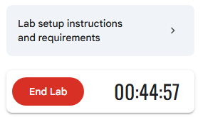

En el panel izquierdo esta todo lo necesario: el botón Open Google Cloud console, el username y password temporales, y el Project ID asignado. El usuario y contraseña representan una identidad con permisos limitados para este laboratorio, y el Project ID identifica de forma única el proyecto donde se trabajará.

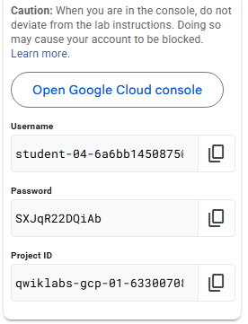

Para ingresar a la consola, se abre Google Cloud Console desde el botón del panel, seleccionás “Use another account”, se usa el correo tipo student-xx@qwiklabs.net y la contraseña que te da al iniciar el lab, se aceptan los términos y listo, ya se esta dentro de la consola con las credenciales de estudiante.


### Tarea 2: Proyectos en la consola del Cloud

En esta parte revisé cómo funcionan los proyectos dentro de Google Cloud. Primero miré la tarjeta Project info en la consola, donde pude ver el nombre, número e ID de mi proyecto, ayuda a identificar el proyecto en el que estoy trabajando durante el lab.

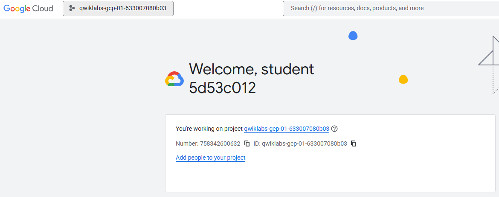

Después abrí el selector de proyectos desde la barra superior. Ahí pude ver todos los proyectos a los que tengo acceso, incluyendo el proyecto Qwiklabs Resources, que aparece en muchos labs. Me aclararon que ese proyecto es solo de lectura y que no debo cambiarme a él para trabajar, porque todo lo del lab siempre va en el proyecto temporal asignado, que se elimina al finalizar el ejercicio.


FInalmente investigué el Navigation menu para ver todas las categorías de servicios de Google Cloud.


### Tarea 3: Roles y permisos

En esta tarea exploré cómo funcionan los permisos dentro de Google Cloud usando IAM. Primero entré a IAM & Admin > IAM desde el menú de navegación, donde aparece la lista de cuentas que tienen acceso al proyecto y los roles asignados a cada una. Ahí busqué mi usuario del lab y pude ver que tengo el rol Editor, que es uno de los roles básicos que ofrece Google Cloud.

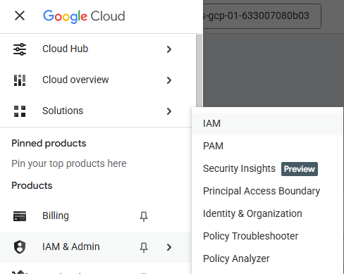

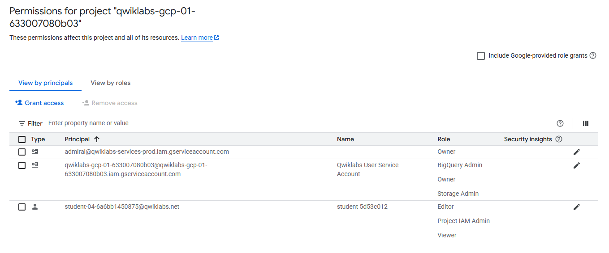

Revisé la diferencia entre los roles básicos: Viewer (solo lectura), Editor (puede modificar recursos) y Owner (tiene todos los permisos, incluyendo gestión de roles y billing).

Después hice una prueba práctica: otorgarle el rol Viewer a otra cuenta de estudiante. Para eso volví a la página de IAM, hice clic en Grant access, agregué el correo indicado y seleccioné el rol Viewer. Guardé los cambios y confirmé que apareciera en la lista con el rol asignado.

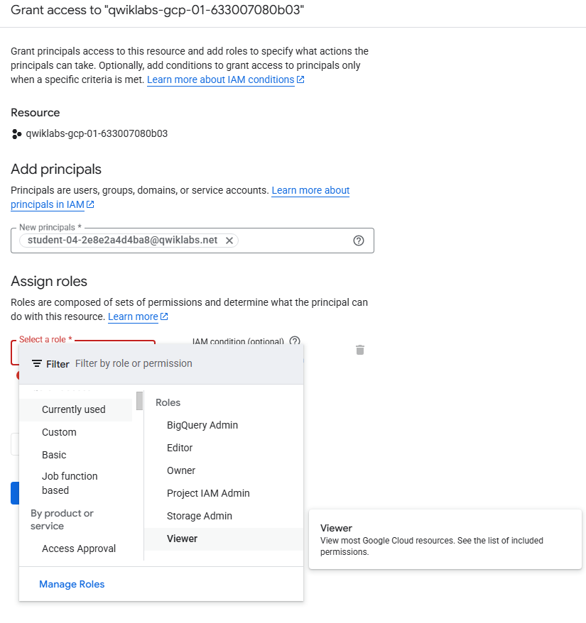

Al final usé Check my progress para verificar que la tarea estuviera correctamente completada, y el sistema marcó la evaluación como aprobada.

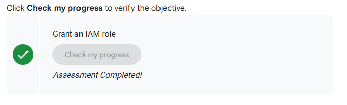


### Tarea 4: Activar APIs y servicios

Trabajé con las APIs de Google Cloud, que son fundamentales para usar distintos servicios dentro de los proyectos. Entré a APIs & Services > Library desde el menú de navegación para ver todas las categorías disponibles.

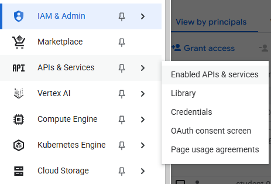

Busqué la Dialogflow API, que sirve para crear aplicaciones sin tener que manejar directamente modelos de machine learning. Cuando abrí la página de la API, hice clic en Enable para activarla dentro de mi proyecto.

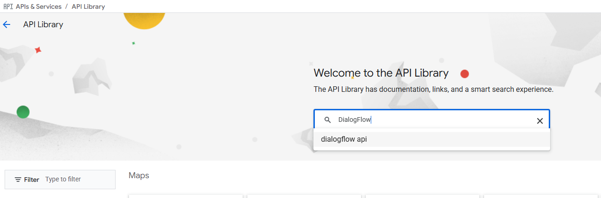

Algo importante: para poder habilitar esta API tuve que asignarle el rol Editor a mi usuario estudiante previamente. Sin ese rol, no tendría permisos suficientes para activar servicios en el proyecto. Una vez con los permisos, pude activar la API sin problemas.

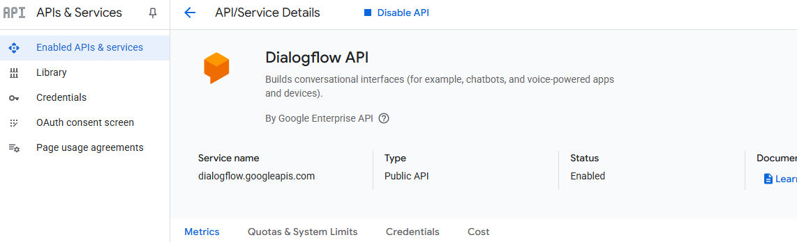

Después de verificar que la API quedara activada, volví a la consola y usé Check my progress para confirmar que la tarea estaba completa.

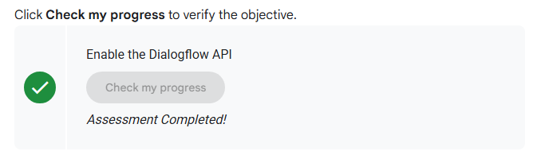

Con esto me familiaricé en cómo se habilitan APIs en un proyecto, algo clave tanto en labs como en proyectos reales fuera del entorno de la práctica.

---

## Vertex AI

Esta práctica introduce el uso de Vertex AI Pipelines para automatizar y reproducir un flujo de trabajo de machine learning. Se explica cómo Vertex AI unifica herramientas de entrenamiento, despliegue y MLOps, y cómo los pipelines permiten organizar cada paso del proceso en contenedores separados, facilitando la colaboración, la escalabilidad y la repetibilidad.

### SetUP inicial

Antes de empeza, se indica que el laboratorio es temporizado y no se puede pausar. Al hacer clic en Start Lab, se generan credenciales temporales para trabajar en un entorno real de Google Cloud. Y al final se recomienda usar una ventana de incógnito para evitar conflictos con cuentas personales y posibles cargos no deseados.

Al iniciar el lab, aparece un panel con los datos de acceso, el tiempo restante y los botones necesarios. Se debe abrir la consola de Google Cloud usando el botón provisto, ingresar con el Username y Password temporales, aceptar términos y avanzar sin agregar opciones de recuperación ni activar pruebas gratuitas. Luego de unos segundos, la consola queda lista para trabajar.

### Tarea 1: Nueva notebook en Vertex AI Workbench

Primero, se debe entrar al menú de navegación de la consola de Google Cloud. Desde ahí, seleccionar Vertex AI → Workbench. Dentro aparece la lista de instancias disponibles y ahí buscar la instancia llamada instance y hacer clic en Open JupyterLab. Esto abre JupyterLab en una nueva pestaña, dejando todo listo para empezar a trabajar con el notebook del laboratorio.

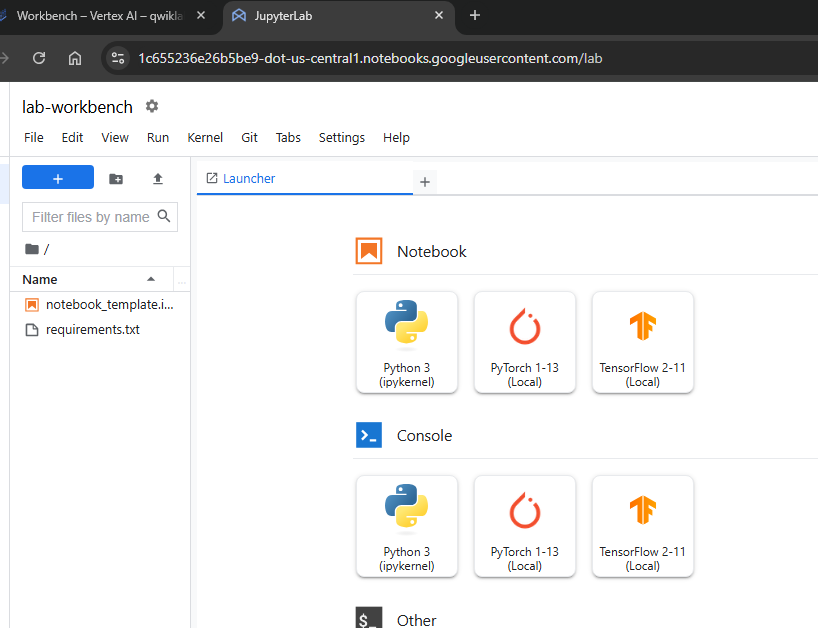

### Tarea 2: Vertex AI Pipelines SetUp

Aquí primero preparamos el entorno para poder crear y ejecutar pipelines. Para eso se necesitan dos bibliotecas claves, como Kubeflow Pipelines, que permite construir pipelines, y Google Cloud Pipeline Components, que aporta componentes ya hechos para interactuar con Vertex AI desde cada paso del pipeline.

#### Paso 1: Nueva notebook e instalación de librerías

```python
USER_FLAG = "--user"

%pip install $USER_FLAG google-cloud-aiplatform==1.59.0
%pip install $USER_FLAG kfp google-cloud-pipeline-components==0.1.1 --upgrade
%pip uninstall -y shapely pygeos geopandas
%pip install shapely==1.8.5.post1 pygeos==0.12.0 geopandas>=0.12.2
%pip install google-cloud-pipeline-components
```
Se instalaron todas las dependencias correctamente.

```python
import os

if not os.getenv("IS_TESTING"):
    # Automatically restart kernel after installs
    import IPython

    app = IPython.Application.instance()
    app.kernel.do_shutdown(True)
    
```

```python
!python3 -c "import kfp; print('KFP SDK version: {}'.format(kfp.__version__))"
!python3 -c "import google_cloud_pipeline_components; print('google_cloud_pipeline_components version: {}'.format(google_cloud_pipeline_components.__version__))"
```

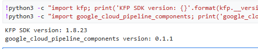

#### Paso 2: Project ID + Bucket SetUp

```python
import os
PROJECT_ID = ""

# Get your Google Cloud project ID from gcloud
if not os.getenv("IS_TESTING"):
    shell_output=!gcloud config list --format 'value(core.project)' 2>/dev/null
    PROJECT_ID = shell_output[0]
    print("Project ID: ", PROJECT_ID)

BUCKET_NAME="gs://" + PROJECT_ID + "-labconfig-bucket"
```

Por aquí se inicializa la configuración básica del entorno. Primero obtiene automáticamente el ID del proyecto, se imprime para verificar que sea correcto y luego se arma el nombre del bucket de Cloud Storage que se usará más adelante, siguiendo el formato "<project-id>-labconfig-bucket".

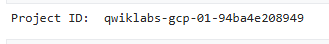

#### Paso 3: Import de librerías

```python
from typing import NamedTuple

import kfp
from kfp import dsl
from kfp.v2 import compiler
from kfp.v2.dsl import (Artifact, Dataset, Input, InputPath, Model, Output,
                        OutputPath, ClassificationMetrics, Metrics, component)
from kfp.v2.google.client import AIPlatformClient

from google.cloud import aiplatform
from google_cloud_pipeline_components import aiplatform as gcc_aip
```

Importamos las librerías necesarias para crear Pipelines y poder importar Pipelines por defecto de Google Cloud que mencionamos anteriormente.

#### Paso 4: Definición de constantes

```python
PATH=%env PATH
%env PATH={PATH}:/home/jupyter/.local/bin
REGION="Placeholder value."


PIPELINE_ROOT = f"{BUCKET_NAME}/pipeline_root/"
PIPELINE_ROOT
```

En este paso se ajusta el PATH para que Jupyter encuentre las herramientas instaladas, se define la región de Vertex AI y se crea PIPELINE_ROOT, que sería la carpeta del bucket donde se guardarán los datos del pipeline.

### Tarea 3: Primer Pipeline

#### Paso 1: Función component

```python
@component(base_image="python:3.12", output_component_file="first-component.yaml")
def product_name(text: str) -> str:
    return text

product_name_component = kfp.components.load_component_from_file('./first-component.yaml')
```

Aquí se crea el primer componente del pipeline donde tenemos la función product_name que simplemente recibe un texto y lo devuelve, pero lo importante es que está decorada con @component, lo que la convierte en un componente de Kubeflow. Eso genera automáticamente un archivo YAML con la definición del componente. Luego ese YAML se vuelve a cargar para poder usar el componente dentro del pipeline.

#### Paso 2: Nuevos dos components adicionales

```python
@component(base_image="python:3.12", output_component_file="second-component.yaml", packages_to_install=["emoji"])
def emoji(
    text: str,
) -> NamedTuple(
    "Outputs",
    [
        ("emoji_text", str),  # Return parameters
        ("emoji", str),
    ],
):
    import emoji

    emoji_text = text
    emoji_str = emoji.emojize(':' + emoji_text + ':', language='alias')
    print("output one: {}; output_two: {}".format(emoji_text, emoji_str))
    return (emoji_text, emoji_str)
```

```python
@component(base_image="python:3.12", output_component_file="third-component.yaml")
def build_sentence(
    product: str,
    emoji: str,
    emojitext: str
) -> str:
    print("We completed the pipeline, hooray!")
    end_str = product + " is "
    if len(emoji) > 0:
        end_str += emoji
    else:
        end_str += emojitext
    return(end_str)
```

En este paso se crean dos componentes más para armar un pipeline de tres components. El primero recibe un texto y genera dos salidas, el mismo texto y su versión convertida a emoji usando la librería emoji. Por otro lado, el segundo toma las salidas anteriores y arma una frase final combinando el producto y el emoji correspondiente.

#### Paso 3: components en Pipeline

```python
@dsl.pipeline(
    name="hello-world",
    description="An intro pipeline",
    pipeline_root=PIPELINE_ROOT,
)

# You can change the `text` and `emoji_str` parameters here to update the pipeline output
def intro_pipeline(text: str = "Vertex AI Pipelines", emoji_str: str = "sparkles"):
    product_task = product_name(text)
    emoji_task = emoji(emoji_str)
    consumer_task = build_sentence(
        product_task.output,
        emoji_task.outputs["emoji"],
        emoji_task.outputs["emoji_text"],
    )
```

Acá se arma el pipeline completo uniendo los tres components. Se define un pipeline llamado hello-world, que recibe dos parámetros, un texto y un nombre de emoji. El pipeline ejecuta primero product_name, luego emoji y finalmente build_sentence, encadenando sus salidas.

#### Paso 4: Compilación y ejecución del Pipeline

```python
compiler.Compiler().compile(
    pipeline_func=intro_pipeline, package_path="intro_pipeline_job.json"
)
```

```python
api_client = AIPlatformClient(
    project_id=PROJECT_ID,
    region=REGION,
)
```

```python
response = api_client.create_run_from_job_spec(
    job_spec_path="intro_pipeline_job.json",
    # pipeline_root=PIPELINE_ROOT  # this argument is necessary if you did not specify PIPELINE_ROOT as part of the pipeline definition.
)
```

Se compila y ejecuta el pipeline. Primero se convierte la función intro_pipeline en un archivo ejecutable que Vertex AI entiende. Después se crea un AIPlatformClient configurado con el proyecto y la región, que será el encargado de lanzar jobs. Finalmente, usando create_run_from_job_spec, se envía el pipeline compilado a Vertex AI Pipelines para que se ejecute en la nube.

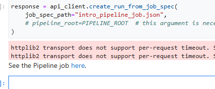

Abrimos el Job del Pipeline.


Ambos components quedaron creados y conectados en el Pipeline "helo-world" para su uso. En el momento que termine la ejecución del Pipeline podremos buildearlo.

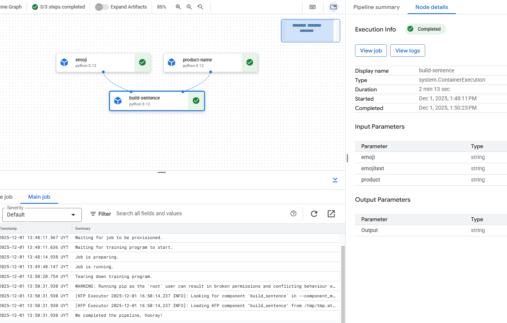

Ejecutamos el Pipeline despues de 14min de compilación y funcionó correctamente.
Finalmente marcamos el progreso de la práctica y si esta todo bien, debería marcarse correctamente.

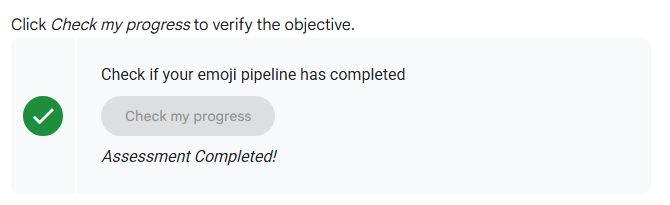


### Tarea 4: End-to-End Machine Learning Pipeline

#### Paso 1: component para Visualización del Modelo

```python
@component(
    base_image="gcr.io/deeplearning-platform-release/tf2-cpu.2-3:latest",
    output_component_file="tables_eval_component.yaml", # Optional: you can use this to load the component later
    packages_to_install=["google-cloud-aiplatform"],
)
def classif_model_eval_metrics(
    project: str,
    location: str,  # "region",
    api_endpoint: str,  # "region-aiplatform.googleapis.com",
    thresholds_dict_str: str,
    model: Input[Model],
    metrics: Output[Metrics],
    metricsc: Output[ClassificationMetrics],
) -> NamedTuple("Outputs", [("dep_decision", str)]):  # Return parameter.

    """This function renders evaluation metrics for an AutoML Tabular classification model.
    It retrieves the classification model evaluation generated by the AutoML Tabular training
    process, does some parsing, and uses that info to render the ROC curve and confusion matrix
    for the model. It also uses given metrics threshold information and compares that to the
    evaluation results to determine whether the model is sufficiently accurate to deploy.
    """
    import json
    import logging

    from google.cloud import aiplatform

    # Fetch model eval info
    def get_eval_info(client, model_name):
        from google.protobuf.json_format import MessageToDict

        response = client.list_model_evaluations(parent=model_name)
        metrics_list = []
        metrics_string_list = []
        for evaluation in response:
            print("model_evaluation")
            print(" name:", evaluation.name)
            print(" metrics_schema_uri:", evaluation.metrics_schema_uri)
            metrics = MessageToDict(evaluation._pb.metrics)
            for metric in metrics.keys():
                logging.info("metric: %s, value: %s", metric, metrics[metric])
            metrics_str = json.dumps(metrics)
            metrics_list.append(metrics)
            metrics_string_list.append(metrics_str)

        return (
            evaluation.name,
            metrics_list,
            metrics_string_list,
        )

    # Use the given metrics threshold(s) to determine whether the model is
    # accurate enough to deploy.
    def classification_thresholds_check(metrics_dict, thresholds_dict):
        for k, v in thresholds_dict.items():
            logging.info("k {}, v {}".format(k, v))
            if k in ["auRoc", "auPrc"]:  # higher is better
                if metrics_dict[k] < v:  # if under threshold, don't deploy
                    logging.info(
                        "{} < {}; returning False".format(metrics_dict[k], v)
                    )
                    return False
        logging.info("threshold checks passed.")
        return True

    def log_metrics(metrics_list, metricsc):
        test_confusion_matrix = metrics_list[0]["confusionMatrix"]
        logging.info("rows: %s", test_confusion_matrix["rows"])

        # log the ROC curve
        fpr = []
        tpr = []
        thresholds = []
        for item in metrics_list[0]["confidenceMetrics"]:
            fpr.append(item.get("falsePositiveRate", 0.0))
            tpr.append(item.get("recall", 0.0))
            thresholds.append(item.get("confidenceThreshold", 0.0))
        print(f"fpr: {fpr}")
        print(f"tpr: {tpr}")
        print(f"thresholds: {thresholds}")
        metricsc.log_roc_curve(fpr, tpr, thresholds)

        # log the confusion matrix
        annotations = []
        for item in test_confusion_matrix["annotationSpecs"]:
            annotations.append(item["displayName"])
        logging.info("confusion matrix annotations: %s", annotations)
        metricsc.log_confusion_matrix(
            annotations,
            test_confusion_matrix["rows"],
        )

        # log textual metrics info as well
        for metric in metrics_list[0].keys():
            if metric != "confidenceMetrics":
                val_string = json.dumps(metrics_list[0][metric])
                metrics.log_metric(metric, val_string)
        # metrics.metadata["model_type"] = "AutoML Tabular classification"

    logging.getLogger().setLevel(logging.INFO)
    aiplatform.init(project=project)
    # extract the model resource name from the input Model Artifact
    model_resource_path = model.uri.replace("aiplatform://v1/", "")
    logging.info("model path: %s", model_resource_path)

    client_options = {"api_endpoint": api_endpoint}
    # Initialize client that will be used to create and send requests.
    client = aiplatform.gapic.ModelServiceClient(client_options=client_options)
    eval_name, metrics_list, metrics_str_list = get_eval_info(
        client, model_resource_path
    )
    logging.info("got evaluation name: %s", eval_name)
    logging.info("got metrics list: %s", metrics_list)
    log_metrics(metrics_list, metricsc)

    thresholds_dict = json.loads(thresholds_dict_str)
    deploy = classification_thresholds_check(metrics_list[0], thresholds_dict)
    if deploy:
        dep_decision = "true"
    else:
        dep_decision = "false"
    logging.info("deployment decision is %s", dep_decision)

    return (dep_decision,)
```

Este paso crea un componente de evaluación que toma el modelo entrenado, obtiene sus métricas desde Vertex AI y las registra. Luego compara esas métricas con umbrales mínimos y devuelve una decisión final sobre si el modelo está listo para desplegarse.


#### Paso 2: Agregamos components por defecto de Google Cloud

```python
import time
DISPLAY_NAME = 'automl-beans{}'.format(str(int(time.time())))
print(DISPLAY_NAME)
```

```python
@kfp.dsl.pipeline(name="automl-tab-beans-training-v2",
                  pipeline_root=PIPELINE_ROOT)
def pipeline(
    bq_source: str = "bq://aju-dev-demos.beans.beans1",
    display_name: str = DISPLAY_NAME,
    project: str = PROJECT_ID,
    gcp_region: str = "Placeholder value.",
    api_endpoint: str = "Placeholder value.-aiplatform.googleapis.com",
    thresholds_dict_str: str = '{"auRoc": 0.95}',
):
    dataset_create_op = gcc_aip.TabularDatasetCreateOp(
        project=project, display_name=display_name, bq_source=bq_source
    )

    training_op = gcc_aip.AutoMLTabularTrainingJobRunOp(
        project=project,
        display_name=display_name,
        optimization_prediction_type="classification",
        budget_milli_node_hours=1000,
        column_transformations=[
            {"numeric": {"column_name": "Area"}},
            {"numeric": {"column_name": "Perimeter"}},
            {"numeric": {"column_name": "MajorAxisLength"}},
            {"numeric": {"column_name": "MinorAxisLength"}},
            {"numeric": {"column_name": "AspectRation"}},
            {"numeric": {"column_name": "Eccentricity"}},
            {"numeric": {"column_name": "ConvexArea"}},
            {"numeric": {"column_name": "EquivDiameter"}},
            {"numeric": {"column_name": "Extent"}},
            {"numeric": {"column_name": "Solidity"}},
            {"numeric": {"column_name": "roundness"}},
            {"numeric": {"column_name": "Compactness"}},
            {"numeric": {"column_name": "ShapeFactor1"}},
            {"numeric": {"column_name": "ShapeFactor2"}},
            {"numeric": {"column_name": "ShapeFactor3"}},
            {"numeric": {"column_name": "ShapeFactor4"}},
            {"categorical": {"column_name": "Class"}},
        ],
        dataset=dataset_create_op.outputs["dataset"],
        target_column="Class",
    )
    model_eval_task = classif_model_eval_metrics(
        project,
        gcp_region,
        api_endpoint,
        thresholds_dict_str,
        training_op.outputs["model"],
    )

    with dsl.Condition(
        model_eval_task.outputs["dep_decision"] == "true",
        name="deploy_decision",
    ):

        deploy_op = gcc_aip.ModelDeployOp(  # noqa: F841
            model=training_op.outputs["model"],
            project=project,
            machine_type="e2-standard-4",
        )
```

Se arma el pipeline completo de AutoML usando los componentes preconstruidos de Vertex AI, donde primero se crea el dataset desde BigQuery, y después se entrena un modelo AutoML Tabular con las columnas numéricas configuradas. Después se pasa ese modelo al componente de evaluación anterior. Al final, si las métricas superan el umbral definido, el pipeline automáticamente despliega el modelo.


#### Paso 3: Compilación y ejecución del End-to-End Pipeline

```python
compiler.Compiler().compile(
    pipeline_func=pipeline, package_path="tab_classif_pipeline.json"
)
```

```python
response = api_client.create_run_from_job_spec(
    "tab_classif_pipeline.json", pipeline_root=PIPELINE_ROOT,
    parameter_values={"project": PROJECT_ID,"display_name": DISPLAY_NAME}
)
```

Aca simplemente compilamos el pipeline completo en un archivo JSON y después lo lanza en Vertex AI. Al ejecutarlo, Vertex AI corre todas las etapas, empezando por la creación del dataset, entrenamiento, evaluación y posible despliegue del modelo si cumple los umbrales.

Además, nuevamente se crea el job del Pipeline que abrimos como el Pipeline anterior.

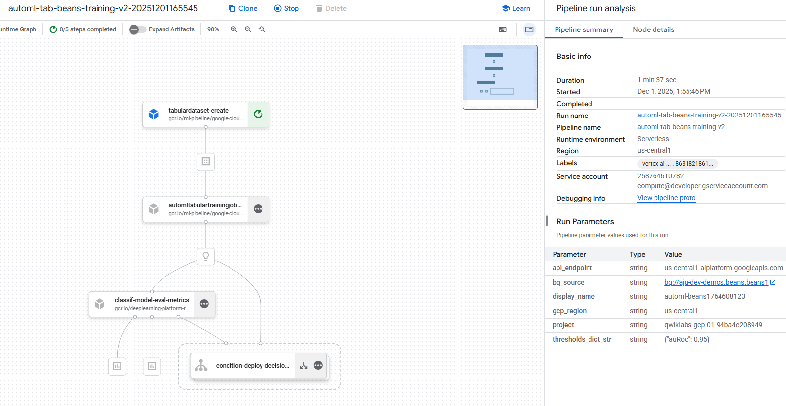

Esperamos que termine de compilar e intentamos ejecutar el modelo.

<!--  -->

Compiló correctamente tardando min y al ejecutarlo obtenemos los siguientes resultados.

<!--  -->

Aca se puede apreciar que el modelo cumplió con los umbrales previamente establecidos y desplegó 

Finalmente si esta todo correcto marcamos el progreso.

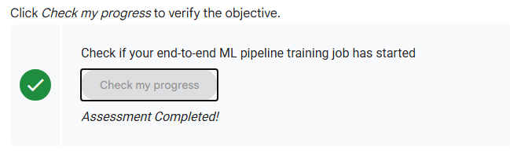